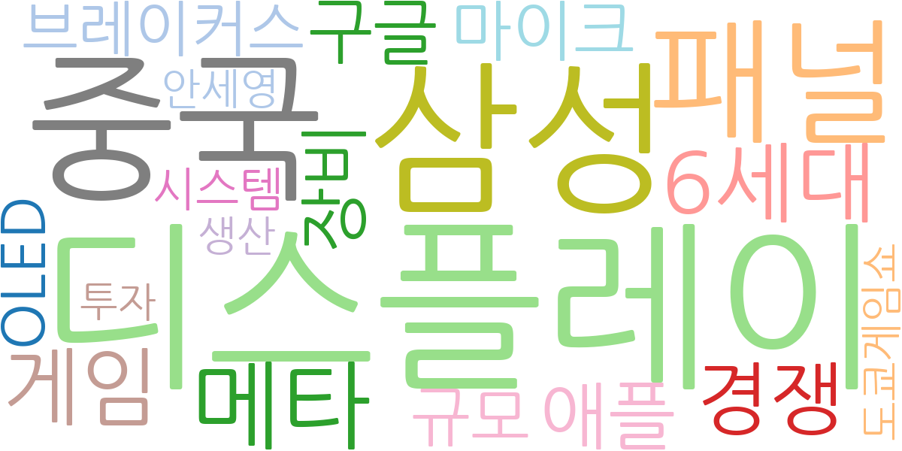
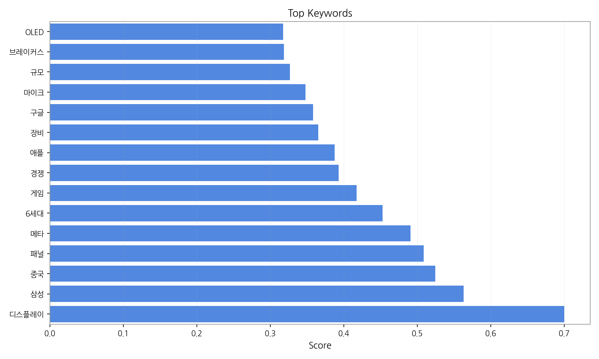
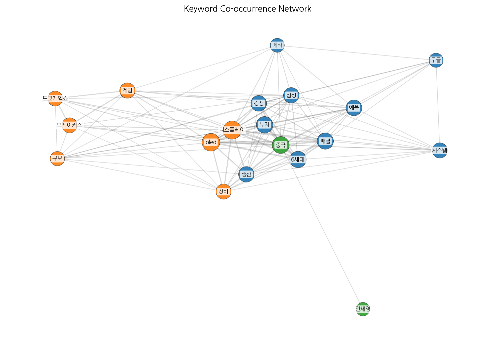
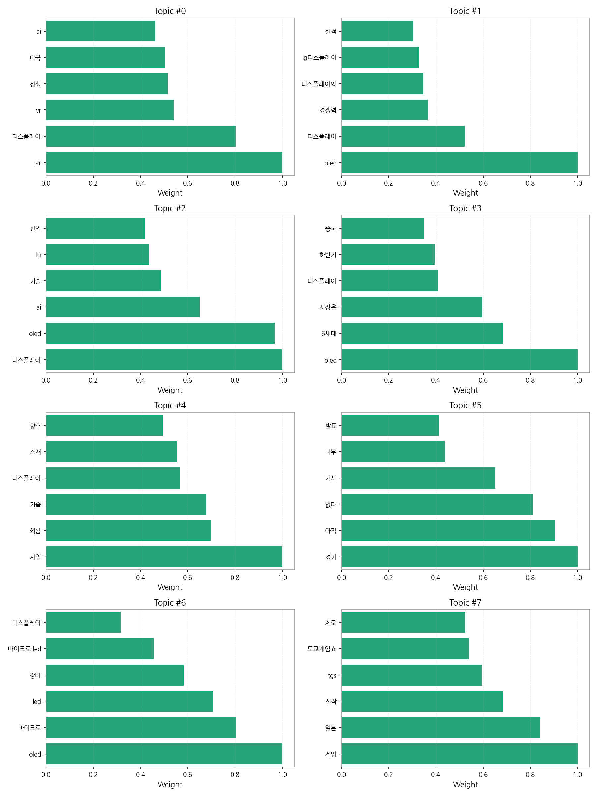
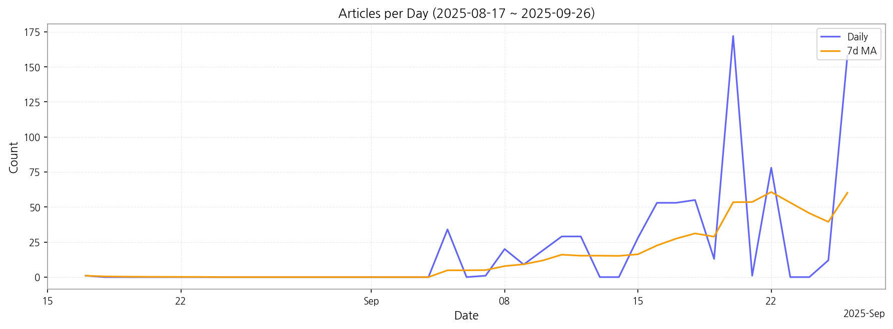

# Weekly/New Biz Report (2025-09-27)

## Executive Summary

- 이번 기간 핵심 토픽과 키워드, 주요 시사점을 요약합니다.

## 데일리 인텔리전스 브리핑 (디스플레이 산업)

**1. 핵심 맥락:**

*   **OLED 기술 경쟁 심화 및 시장 확대:** OLED는 여전히 디스플레이 산업의 핵심 키워드이며, 특히 6세대 OLED 패널, 마이크로 LED, LTPO 등 차세대 기술 경쟁이 심화되고 있습니다. LG디스플레이의 실적과 경쟁력 관련 기사가 많은 점은 OLED 시장에서의 주도권 확보를 위한 기업들의 노력을 보여줍니다.
*   **AR/VR/AI 융합 디스플레이 기술 발전:** AR/VR과 AI 기술이 디스플레이와 융합되어 차세대 디스플레이 기술 발전을 가속화하고 있습니다. 삼성, 중국 등 주요 기업들이 이 분야에 투자를 확대하며, 미국 시장을 중심으로 기술 경쟁이 치열하게 전개될 것으로 예상됩니다.
*   **디스플레이 소재/부품 사업의 중요성 부각:** 디스플레이 산업의 성장과 함께 핵심 소재 및 부품 사업의 중요성이 강조되고 있습니다. 기술 경쟁력 확보와 동시에 안정적인 공급망 구축을 위한 노력이 필요하며, 이는 향후 디스플레이 산업의 성장을 견인할 핵심 요소가 될 것입니다.

**2. 최근 변화/스파이크:**

*   **2025년 9월 20일 기사 수 급증 (172건):** 이 시점의 급증은 특정 이벤트나 발표와 관련된 것으로 추정됩니다. "디스플레이", "삼성", "중국", "패널", "메타", "6세대", "게임", "경쟁", "애플", "장비" 등의 키워드를 종합적으로 고려할 때, 삼성 또는 애플의 신제품 발표, 중국 디스플레이 업체의 투자 확대, 혹은 게임 관련 디스플레이 기술 발표 등이 복합적으로 작용한 결과일 가능성이 높습니다. 특히 "메타" 키워드는 VR/AR 관련 발표 가능성을 시사합니다.
*   **2025년 9월 5일, 9월 8일, 9월 11일, 9월 12일, 9월 15일, 9월 16일, 9월 17일, 9월 18일, 9월 22일, 9월 26일 기사 수 증가:** 이 기간 동안 디스플레이, OLED, AI, 기술, 사업 등의 키워드가 꾸준히 언급된 것으로 보아, 디스플레이 기술 혁신 및 사업 확장 관련 소식이 지속적으로 발표되었음을 알 수 있습니다.

**3. 실무 인사이트:**

*   **AR/VR/AI 융합 디스플레이 기술 개발 로드맵 구체화:** AR/VR 시장의 성장 가능성을 고려하여, AI 기술을 접목한 차세대 디스플레이 기술 개발 로드맵을 구체화하고 관련 기술 투자를 확대해야 합니다. 특히, 사용자 경험을 극대화할 수 있는 디스플레이 기술 개발에 집중해야 합니다.
*   **OLED 소재/부품 공급망 다변화 및 국산화 추진:** OLED 시장 경쟁 심화에 대비하여 핵심 소재 및 부품의 공급망을 다변화하고 국산화율을 높여야 합니다. 특정 국가 의존도를 낮추고 안정적인 생산 기반을 확보하는 것이 중요합니다.
*   **게임 및 엔터테인먼트 시장 맞춤형 디스플레이 기술 개발:** 게임 및 엔터테인먼트 시장의 고성능 디스플레이 수요 증가에 발맞춰, 고화질, 고주사율, 저지연 등의 특성을 갖춘 디스플레이 기술 개발에 집중해야 합니다. 특히, OLED의 장점을 활용한 게이밍 디스플레이 시장 공략 전략을 수립해야 합니다.

## Key Metrics

- 기간: 2025-08-17 ~ 2025-09-26
- 총 기사 수: 765
- 문서 수: N/A
- 키워드 수(상위): 15
- 토픽 수: 8
- 시계열 데이터 일자 수: 41

## Top Keywords

| Rank | Keyword | Score |
|---:|---|---:|
| 1 | 디스플레이 | 0.700 |
| 2 | 삼성 | 0.563 |
| 3 | 중국 | 0.525 |
| 4 | 패널 | 0.509 |
| 5 | 메타 | 0.491 |
| 6 | 6세대 | 0.453 |
| 7 | 게임 | 0.417 |
| 8 | 경쟁 | 0.393 |
| 9 | 애플 | 0.387 |
| 10 | 장비 | 0.365 |
| 11 | 구글 | 0.358 |
| 12 | 마이크 | 0.348 |
| 13 | 규모 | 0.327 |
| 14 | 브레이커스 | 0.318 |
| 15 | OLED | 0.317 |

## Topics

- ar, 디스플레이, vr (#0)
  - 대표 단어: ar, 디스플레이, vr, 삼성, 미국, ai
- oled, 디스플레이, 경쟁력 (#1)
  - 대표 단어: oled, 디스플레이, 경쟁력, 디스플레이의, lg디스플레이, 실적
- 디스플레이, oled, ai (#2)
  - 대표 단어: 디스플레이, oled, ai, 기술, lg, 산업
- oled, 6세대, 사장은 (#3)
  - 대표 단어: oled, 6세대, 사장은, 디스플레이, 하반기, 중국
- 사업, 핵심, 기술 (#4)
  - 대표 단어: 사업, 핵심, 기술, 디스플레이, 소재, 향후
- 경기, 아직, 없다 (#5)
  - 대표 단어: 경기, 아직, 없다, 기사, 너무, 발표
- oled, 마이크로, led (#6)
  - 대표 단어: oled, 마이크로, led, 장비, 마이크로 led, 디스플레이
- 게임, 일본, 신작 (#7)
  - 대표 단어: 게임, 일본, 신작, tgs, 도쿄게임쇼, 제로

## Trend

- 최근 14~30일 기사 수 추세와 7일 이동평균선을 제공합니다.

## Insights

## 데일리 인텔리전스 브리핑 (디스플레이 산업)

**1. 핵심 맥락:**

*   **OLED 기술 경쟁 심화 및 시장 확대:** OLED는 여전히 디스플레이 산업의 핵심 키워드이며, 특히 6세대 OLED 패널, 마이크로 LED, LTPO 등 차세대 기술 경쟁이 심화되고 있습니다. LG디스플레이의 실적과 경쟁력 관련 기사가 많은 점은 OLED 시장에서의 주도권 확보를 위한 기업들의 노력을 보여줍니다.
*   **AR/VR/AI 융합 디스플레이 기술 발전:** AR/VR과 AI 기술이 디스플레이와 융합되어 차세대 디스플레이 기술 발전을 가속화하고 있습니다. 삼성, 중국 등 주요 기업들이 이 분야에 투자를 확대하며, 미국 시장을 중심으로 기술 경쟁이 치열하게 전개될 것으로 예상됩니다.
*   **디스플레이 소재/부품 사업의 중요성 부각:** 디스플레이 산업의 성장과 함께 핵심 소재 및 부품 사업의 중요성이 강조되고 있습니다. 기술 경쟁력 확보와 동시에 안정적인 공급망 구축을 위한 노력이 필요하며, 이는 향후 디스플레이 산업의 성장을 견인할 핵심 요소가 될 것입니다.

**2. 최근 변화/스파이크:**

*   **2025년 9월 20일 기사 수 급증 (172건):** 이 시점의 급증은 특정 이벤트나 발표와 관련된 것으로 추정됩니다. "디스플레이", "삼성", "중국", "패널", "메타", "6세대", "게임", "경쟁", "애플", "장비" 등의 키워드를 종합적으로 고려할 때, 삼성 또는 애플의 신제품 발표, 중국 디스플레이 업체의 투자 확대, 혹은 게임 관련 디스플레이 기술 발표 등이 복합적으로 작용한 결과일 가능성이 높습니다. 특히 "메타" 키워드는 VR/AR 관련 발표 가능성을 시사합니다.
*   **2025년 9월 5일, 9월 8일, 9월 11일, 9월 12일, 9월 15일, 9월 16일, 9월 17일, 9월 18일, 9월 22일, 9월 26일 기사 수 증가:** 이 기간 동안 디스플레이, OLED, AI, 기술, 사업 등의 키워드가 꾸준히 언급된 것으로 보아, 디스플레이 기술 혁신 및 사업 확장 관련 소식이 지속적으로 발표되었음을 알 수 있습니다.

**3. 실무 인사이트:**

*   **AR/VR/AI 융합 디스플레이 기술 개발 로드맵 구체화:** AR/VR 시장의 성장 가능성을 고려하여, AI 기술을 접목한 차세대 디스플레이 기술 개발 로드맵을 구체화하고 관련 기술 투자를 확대해야 합니다. 특히, 사용자 경험을 극대화할 수 있는 디스플레이 기술 개발에 집중해야 합니다.
*   **OLED 소재/부품 공급망 다변화 및 국산화 추진:** OLED 시장 경쟁 심화에 대비하여 핵심 소재 및 부품의 공급망을 다변화하고 국산화율을 높여야 합니다. 특정 국가 의존도를 낮추고 안정적인 생산 기반을 확보하는 것이 중요합니다.
*   **게임 및 엔터테인먼트 시장 맞춤형 디스플레이 기술 개발:** 게임 및 엔터테인먼트 시장의 고성능 디스플레이 수요 증가에 발맞춰, 고화질, 고주사율, 저지연 등의 특성을 갖춘 디스플레이 기술 개발에 집중해야 합니다. 특히, OLED의 장점을 활용한 게이밍 디스플레이 시장 공략 전략을 수립해야 합니다.

## Opportunities (Top 5)

| Idea | Target | Value Prop | Score |
|---|---|---|---:|
| 메타버스 협업용 초고해상도 마이크로디스플레이 모듈 | 북미 빅테크 기업 (메타버스 플랫폼 사업자), 글로벌 엔터프라이즈 (설계, 디자인 협업) | 현존 최고 수준의 해상도와 응답 속도를 제공하여 몰입감 있는 메타버스 협업 환경 구축. 정밀한 작업 수행을 위한 최적의 시각 정보 제공. 기존 VR/AR 기기 대비 압도적인 성능 우위. | 4.50 |
| 차량용 AR HUD (Head-Up Display) 솔루션 with AI 제스처 인식 | 글로벌 완성차 OEM (프리미엄 브랜드 중심), 자율주행 솔루션 개발 기업 | 운전 중 시선 분산을 최소화하는 직관적인 AR HUD 경험 제공. AI 제스처 인식으로 안전하고 편리한 인터랙션 구현. 경쟁사 대비 높은 몰입감과 정보 접근성 제공. | 4.20 |
| 차세대 QD-OLED 소재 및 발광층 개발 | 자사 QD-OLED 패널 사업부, 디스플레이 소재 기업 | QD-OLED 패널의 수명 및 효율성을 획기적으로 개선하여 경쟁사 대비 우월한 화질과 에너지 효율 제공. 번인 현상 감소로 제품 신뢰도 향상. 차세대 디스플레이 시장 선점. | 4.00 |
| IT 기기용 폴더블 OLED 패널 with UTG (Ultra-Thin Glass) | 글로벌 스마트폰 제조사, IT 기기 제조사 | 기존 폴더블 디스플레이 대비 월등한 내구성과 스크래치 방지 성능 제공. 주름 발생을 최소화하여 쾌적한 사용 경험 제공. UTG 소재 기술 리더십 확보. | 3.80 |
| AI 기반 디스플레이 패널 공정 자동화 및 수율 예측 솔루션 | 디스플레이 패널 제조사, 반도체 제조사 | AI 기반 실시간 공정 데이터 분석 및 예측을 통해 수율을 극대화하고 불량률 감소. 공정 자동화를 통해 생산 효율성 향상 및 비용 절감. 데이터 기반 의사 결정 시스템 구축. | 3.50 |

## Appendix

- 데이터: keywords.json, topics.json, trend_timeseries.json, trend_insights.json, biz_opportunities.json