# Weekly/New Biz Report (2025-10-12)

## Executive Summary

- 이번 기간 핵심 토픽과 키워드, 주요 시사점을 요약합니다.

## 데일리 인텔리전스 브리핑

**1. 핵심 맥락:**

*   **프리미엄 디스플레이 시장 경쟁 심화:** OLED 기술을 중심으로 삼성과 LG는 물론 중국 업체들까지 경쟁에 참여하며, AI 기술을 접목한 고화질, 고성능 디스플레이 개발이 가속화되고 있습니다. 특히, TV 시장에서 RGB 마이크로 LED 기술이 부상하며 차세대 디스플레이 기술 경쟁이 본격화될 것으로 예상됩니다.
*   **AI 반도체 기술 경쟁력 확보:** AI 반도체 기술은 디스플레이 산업 전반에 걸쳐 중요한 경쟁 요소로 부상하고 있습니다. AI 기술은 디스플레이 화질 개선, 전력 효율 증대, 사용자 맞춤형 기능 제공 등 다양한 분야에 적용될 수 있으며, AI 반도체 기술 경쟁력 확보는 디스플레이 산업의 미래를 좌우할 핵심 요소가 될 것입니다.
*   **미국 시장 공략 및 보호무역주의 대응:** 미국 시장은 여전히 중요한 시장이며, 트럼프 전 대통령의 관세 정책과 희토류 수출 제한 등 보호무역주의 움직임에 대한 지속적인 모니터링과 대응 전략 마련이 필요합니다. 특히, 사이니지 시장에서 삼성전자는 토요타 등 자동차 업계와의 협력을 통해 미국 시장 점유율을 확대하고 있습니다.

**2. 최근 변화/스파이크:**

*   **2025년 9월 20일, 9월 26일, 9월 30일, 10월 1일, 10월 8일, 10월 11일 기사 수 급증:** 이 기간 동안 기사 수가 급증한 것은 새로운 OLED 기술 발표, AI 반도체 기술 발전, 갤럭시 신제품 출시, 미국 시장 진출 전략 등 다양한 요인이 복합적으로 작용한 결과로 추정됩니다. 특히, 10월 8일의 급증은 특정 기술 발표나 시장 변화와 관련된 중요한 이벤트가 있었을 가능성이 높습니다.

**3. 실무 인사이트:**

*   **차세대 디스플레이 기술 개발 투자 확대:** RGB 마이크로 LED, QD-OLED 등 차세대 디스플레이 기술 개발에 대한 투자를 확대하고, AI 반도체 기술과의 융합을 통해 경쟁 우위를 확보해야 합니다.
*   **미국 시장 맞춤형 제품 및 마케팅 전략 강화:** 미국 시장의 특성을 고려한 제품 개발 및 마케팅 전략을 강화하고, 현지 파트너십 구축을 통해 시장 점유율을 확대해야 합니다.
*   **AI 기반 시니어 맞춤형 TV 개발:** 고령화 사회에 발맞춰 AI 기술을 활용한 시니어 맞춤형 TV 개발을 통해 새로운 시장 수요를 창출해야 합니다. LG전자의 "이지 TV" 사례를 참고하여 사용 편의성을 극대화하고, 건강 관리 기능 등 부가 가치를 제공하는 방안을 고려해야 합니다.

## Key Metrics

- 기간: 2025-09-08 ~ 2025-10-11
- 총 기사 수: 4,778
- 문서 수: N/A
- 키워드 수(상위): 15
- 토픽 수: 10
- 시계열 데이터 일자 수: 34

## Top Keywords

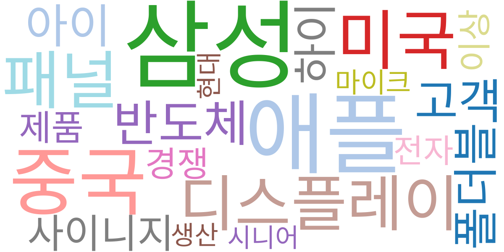

| Rank | Keyword | Score |
|---:|---|---:|
| 1 | 삼성 | 0.853 |
| 2 | 애플 | 0.708 |
| 3 | 중국 | 0.489 |
| 4 | 미국 | 0.366 |
| 5 | 패널 | 0.347 |
| 6 | 디스플레이 | 0.323 |
| 7 | 반도체 | 0.296 |
| 8 | 고객 | 0.277 |
| 9 | 아이 | 0.266 |
| 10 | 폴더블 | 0.262 |
| 11 | 하이 | 0.250 |
| 12 | 사이니지 | 0.243 |
| 13 | 제품 | 0.188 |
| 14 | 경쟁 | 0.182 |
| 15 | 이상 | 0.178 |

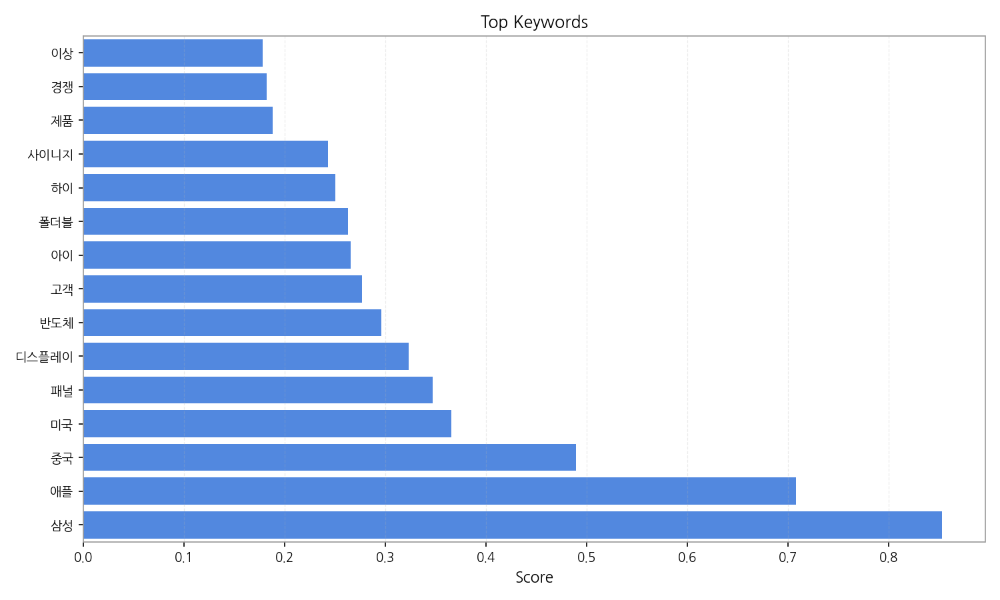

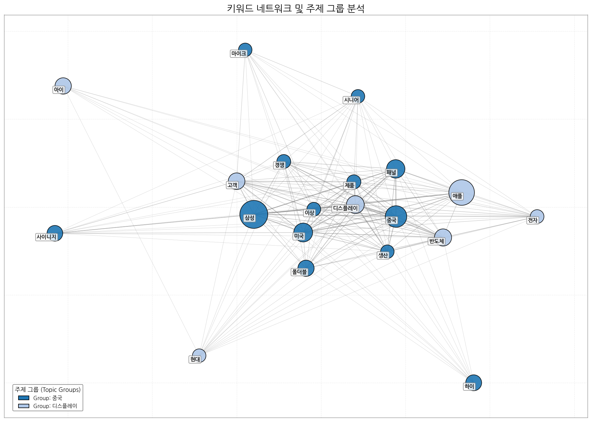

## Topics

- tv, 시니어, lg (#0)
  - 대표 단어: tv, 시니어, lg, 이지, lg 이지, lg전자는
- ai, 반도체, 기술 (#1)
  - 대표 단어: ai, 반도체, 기술, 핵심, 장비, 로봇
- 새로운, 가장, ai (#2)
  - 대표 단어: 새로운, 가장, ai, 체험, 공간, 주행
- 미국, 트럼프, 관세 (#3)
  - 대표 단어: 미국, 트럼프, 관세, 수출, 희토류, 중국
- 갤럭시, 디자인, 할인 (#4)
  - 대표 단어: 갤럭시, 디자인, 할인, 삼성전자, 히어로, 혜택을
- sns, 대한민국, 대한민국 sns (#5)
  - 대표 단어: sns, 대한민국, 대한민국 sns, 기술을, 사람, 기술
- oled, ai, 삼성 (#6)
  - 대표 단어: oled, ai, 삼성, 프로, 아이폰17, led
- oled, 중국, 디스플레이 (#7)
  - 대표 단어: oled, 중국, 디스플레이, 패널, tv, 기술
- rgb, 마이크로, ai (#8)
  - 대표 단어: rgb, 마이크로, ai, 마이크로 rgb, tv, 삼성전자
- 사이니지, 삼성전자는, 토요타 (#9)
  - 대표 단어: 사이니지, 삼성전자는, 토요타, 사이니지를, 자동차, 삼성

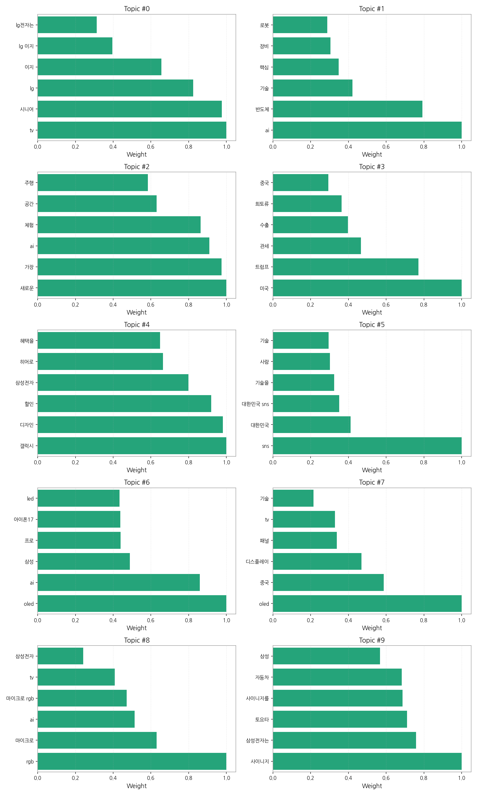

## 기업×토픽 집중도 매트릭스 (주간)

**핵심 요약:**

- **가장 경쟁이 치열한 토픽:** **oled, ai** (가장 많은 기업들이 주목)

- **가장 집중도가 높은 기업:** **삼성전자** (다양한 토픽에 걸쳐 높은 관련성)

- **주목할 만한 조합:** **삼성전자 @ topic_9** (가장 높은 단일 연관 점수 기록)

각 기업별 상위 8개 토픽의 연관 점수와 해당 토픽 내에서의 점유율(%)을 나타냅니다.

| org           | topic_0       | topic_1       | topic_2       | topic_3      | topic_4       | topic_5       | topic_6       | topic_7       | topic_8       | topic_9       |
|:--------------|:--------------|:--------------|:--------------|:-------------|:--------------|:--------------|:--------------|:--------------|:--------------|:--------------|
| AMD           | nan           | 120.20 (1%)   | 101.07 (2%)   | 228.07 (3%)  | nan           | 45.09 (1%)    | 70.01 (1%)    | 76.17 (1%)    | 45.13 (1%)    | 71.04 (1%)    |
| ASUS          | nan           | 64.29 (1%)    | 26.13 (0%)    | 15.30 (0%)   | nan           | 37.34 (1%)    | 49.21 (1%)    | 61.50 (1%)    | 12.90 (0%)    | 8.53 (0%)     |
| AUO           | 2.22 (0%)     | 6.99 (0%)     | nan           | nan          | 2.20 (0%)     | 3.52 (0%)     | 4.16 (0%)     | 9.78 (0%)     | 5.01 (0%)     | 2.13 (0%)     |
| Acer          | nan           | 62.19 (1%)    | 21.31 (0%)    | 13.84 (0%)   | nan           | 30.30 (1%)    | 42.28 (0%)    | 51.71 (0%)    | 10.03 (0%)    | 7.10 (0%)     |
| BMW           | 16.31 (0%)    | 57.30 (0%)    | 66.69 (1%)    | nan          | 18.37 (0%)    | 29.59 (1%)    | 60.30 (1%)    | 39.83 (0%)    | nan           | 34.81 (1%)    |
| BOE           | nan           | 448.64 (4%)   | 193.21 (3%)   | 338.10 (5%)  | nan           | 185.30 (3%)   | 373.61 (4%)   | 774.98 (6%)   | 144.71 (3%)   | 152.03 (3%)   |
| BYD           | nan           | 78.27 (1%)    | 53.63 (1%)    | 51.73 (1%)   | 20.58 (0%)    | 28.18 (0%)    | 49.91 (1%)    | 83.16 (1%)    | nan           | 31.26 (1%)    |
| Bosch         | 1.48 (0%)     | 0.70 (0%)     | 0.69 (0%)     | nan          | 1.47 (0%)     | nan           | 1.39 (0%)     | 0.70 (0%)     | 1.43 (0%)     | nan           |
| CES           | 68.20 (2%)    | 216.63 (2%)   | 69.45 (1%)    | nan          | nan           | 217.71 (4%)   | 121.30 (1%)   | 139.76 (1%)   | 71.64 (1%)    | 60.39 (1%)    |
| CSOT          | nan           | 239.69 (2%)   | 85.26 (1%)    | 190.18 (3%)  | 74.96 (2%)    | 124.71 (2%)   | 214.18 (2%)   | 505.24 (4%)   | 81.67 (2%)    | nan           |
| Corning       | 0.74 (0%)     | 3.49 (0%)     | nan           | nan          | 0.73 (0%)     | 1.41 (0%)     | 2.77 (0%)     | 2.10 (0%)     | 0.72 (0%)     | 0.71 (0%)     |
| Counterpoint  | 1.48 (0%)     | 1.40 (0%)     | 1.38 (0%)     | nan          | 1.47 (0%)     | nan           | 2.77 (0%)     | 1.40 (0%)     | 2.15 (0%)     | nan           |
| Dell          | nan           | 60.10 (1%)    | 22.69 (0%)    | 14.57 (0%)   | nan           | 31.00 (1%)    | 43.67 (1%)    | 53.81 (0%)    | 11.46 (0%)    | 7.10 (0%)     |
| ETRI          | 3.71 (0%)     | 35.64 (0%)    | 6.88 (0%)     | 5.10 (0%)    | nan           | 14.80 (0%)    | 18.71 (0%)    | 26.55 (0%)    | 5.73 (0%)     | nan           |
| HMI           | 2.22 (0%)     | 13.98 (0%)    | 4.81 (0%)     | nan          | 2.20 (0%)     | 4.23 (0%)     | 6.24 (0%)     | 7.69 (0%)     | nan           | 4.26 (0%)     |
| HP            | nan           | 115.30 (1%)   | 47.44 (1%)    | 27.69 (0%)   | nan           | 64.12 (1%)    | 94.96 (1%)    | 129.98 (1%)   | 23.64 (0%)    | 18.47 (0%)    |
| Harman        | nan           | 16.77 (0%)    | 10.31 (0%)    | nan          | 5.88 (0%)     | 6.34 (0%)     | 9.01 (0%)     | 11.18 (0%)    | 10.03 (0%)    | 5.68 (0%)     |
| IEC           | 10.38 (0%)    | 35.64 (0%)    | 18.56 (0%)    | nan          | nan           | 15.50 (0%)    | 27.03 (0%)    | 17.47 (0%)    | 20.78 (0%)    | 15.63 (0%)    |
| IEEE          | 2.22 (0%)     | 10.48 (0%)    | 5.50 (0%)     | nan          | nan           | 3.52 (0%)     | 6.24 (0%)     | 2.10 (0%)     | 2.87 (0%)     | 0.71 (0%)     |
| IMID          | 5.93 (0%)     | 50.31 (0%)    | 17.88 (0%)    | 9.47 (0%)    | nan           | 19.73 (0%)    | 42.28 (0%)    | 55.21 (0%)    | 12.18 (0%)    | nan           |
| ITU           | nan           | 25.16 (0%)    | 15.81 (0%)    | nan          | 14.70 (0%)    | 15.50 (0%)    | 24.95 (0%)    | 21.66 (0%)    | 40.84 (1%)    | 14.92 (0%)    |
| IoT           | 77.10 (2%)    | 227.11 (2%)   | 110.70 (2%)   | nan          | nan           | 100.75 (2%)   | 131.00 (2%)   | 99.23 (1%)    | 83.10 (2%)    | 68.20 (1%)    |
| JDI           | 4.45 (0%)     | 23.76 (0%)    | nan           | 8.02 (0%)    | 5.88 (0%)     | 15.50 (0%)    | 19.41 (0%)    | 30.75 (0%)    | 7.88 (0%)     | nan           |
| KAIST         | 5.93 (0%)     | 51.71 (0%)    | 19.25 (0%)    | nan          | nan           | 21.84 (0%)    | 24.95 (0%)    | 21.66 (0%)    | 9.31 (0%)     | 7.81 (0%)     |
| LG디스플레이       | nan           | 761.71 (7%)   | 252.34 (4%)   | 364.33 (5%)  | 185.94 (4%)   | 555.91 (10%)  | 588.48 (7%)   | 1146.05 (9%)  | 224.95 (4%)   | nan           |
| LG전자          | 1599.83 (37%) | 1085.96 (9%)  | 721.27 (11%)  | nan          | 773.16 (17%)  | 555.21 (10%)  | 920.50 (11%)  | 1187.98 (10%) | 817.42 (16%)  | nan           |
| LG화학          | 55.60 (1%)    | 162.12 (1%)   | 82.51 (1%)    | 87.44 (1%)   | nan           | 66.23 (1%)    | 83.18 (1%)    | 169.11 (1%)   | nan           | 70.33 (1%)    |
| MWC           | 2.22 (0%)     | 9.08 (0%)     | 4.81 (0%)     | 3.64 (0%)    | nan           | 4.93 (0%)     | 7.62 (0%)     | 8.39 (0%)     | nan           | 6.39 (0%)     |
| Merck         | nan           | 2.80 (0%)     | 0.69 (0%)     | nan          | nan           | 1.41 (0%)     | 4.16 (0%)     | 3.49 (0%)     | nan           | nan           |
| Metaverse     | nan           | 6.99 (0%)     | 5.50 (0%)     | 0.73 (0%)    | nan           | 4.23 (0%)     | 2.08 (0%)     | 1.40 (0%)     | 0.72 (0%)     | 0.71 (0%)     |
| Nitto         | nan           | nan           | 1.38 (0%)     | 0.73 (0%)    | nan           | nan           | nan           | nan           | nan           | 0.71 (0%)     |
| SID           | 4.45 (0%)     | 132.77 (1%)   | 12.38 (0%)    | 13.84 (0%)   | nan           | 188.12 (3%)   | 56.84 (1%)    | 98.53 (1%)    | 5.01 (0%)     | nan           |
| SK하이닉스        | nan           | 383.65 (3%)   | 151.95 (2%)   | 175.61 (2%)  | nan           | 112.73 (2%)   | 167.05 (2%)   | 215.93 (2%)   | 126.80 (2%)   | 168.37 (3%)   |
| Semiconductor | nan           | 27.25 (0%)    | 8.25 (0%)     | 8.02 (0%)    | nan           | 10.57 (0%)    | 12.48 (0%)    | 13.28 (0%)    | 7.16 (0%)     | 9.95 (0%)     |
| TCL           | 226.11 (5%)   | 256.46 (2%)   | 158.83 (2%)   | 217.87 (3%)  | 144.05 (3%)   | nan           | 227.35 (3%)   | 431.87 (4%)   | 197.73 (4%)   | nan           |
| TSMC          | nan           | 123.69 (1%)   | 67.38 (1%)    | 112.21 (2%)  | nan           | 35.93 (1%)    | 49.21 (1%)    | 52.41 (0%)    | 25.79 (0%)    | 44.76 (1%)    |
| Tianma        | 2.97 (0%)     | 18.87 (0%)    | nan           | 18.22 (0%)   | 3.67 (0%)     | 4.23 (0%)     | 16.64 (0%)    | 43.33 (0%)    | 2.87 (0%)     | nan           |
| Toray         | nan           | 4.89 (0%)     | 2.06 (0%)     | 5.83 (0%)    | 2.20 (0%)     | 2.11 (0%)     | 1.39 (0%)     | 4.19 (0%)     | nan           | 2.84 (0%)     |
| UDC           | nan           | 11.18 (0%)    | 4.13 (0%)     | 8.02 (0%)    | 4.41 (0%)     | 5.64 (0%)     | 11.09 (0%)    | 15.37 (0%)    | nan           | 7.10 (0%)     |
| UL            | 25.21 (1%)    | 51.01 (0%)    | 25.44 (0%)    | nan          | nan           | 26.07 (0%)    | 43.67 (1%)    | 48.22 (0%)    | 49.43 (1%)    | 26.29 (0%)    |
| V2X           | nan           | 23.76 (0%)    | 8.94 (0%)     | 14.57 (0%)   | nan           | 9.16 (0%)     | 7.62 (0%)     | 10.48 (0%)    | 6.45 (0%)     | 12.08 (0%)    |
| Visionox      | nan           | 55.21 (0%)    | 13.06 (0%)    | 21.86 (0%)   | 7.35 (0%)     | 17.61 (0%)    | 38.82 (0%)    | 71.98 (1%)    | 7.88 (0%)     | nan           |
| 구글            | nan           | 272.96 (2%)   | 235.00 (3%)   | 201.60 (3%)  | nan           | 113.91 (2%)   | 220.35 (2%)   | 159.22 (1%)   | 101.83 (2%)   | 136.44 (2%)   |
| 기아            | nan           | 170.33 (1%)   | 105.96 (2%)   | 70.08 (1%)   | 48.20 (1%)    | 64.69 (1%)    | 98.49 (1%)    | 91.66 (1%)    | nan           | 64.45 (1%)    |
| 기아차           | 0.74 (0%)     | nan           | 4.13 (0%)     | nan          | nan           | 0.70 (0%)     | 2.08 (0%)     | nan           | nan           | nan           |
| 네이버           | nan           | 109.01 (1%)   | 89.38 (1%)    | 58.29 (1%)   | nan           | 54.25 (1%)    | 91.50 (1%)    | 77.57 (1%)    | 46.57 (1%)    | 63.94 (1%)    |
| 니오            | nan           | 1.40 (0%)     | 1.38 (0%)     | nan          | nan           | 0.70 (0%)     | 2.08 (0%)     | 0.70 (0%)     | nan           | 0.71 (0%)     |
| 도우인시스         | nan           | 6.99 (0%)     | nan           | 2.91 (0%)    | 2.20 (0%)     | 3.52 (0%)     | 4.16 (0%)     | 5.59 (0%)     | 2.15 (0%)     | 3.55 (0%)     |
| 두산로보틱스        | nan           | 45.42 (0%)    | 22.00 (0%)    | 15.30 (0%)   | nan           | 12.68 (0%)    | 15.94 (0%)    | 13.98 (0%)    | 14.33 (0%)    | 18.47 (0%)    |
| 디지타임스         | nan           | 10.48 (0%)    | 3.44 (0%)     | 3.64 (0%)    | 0.73 (0%)     | 2.11 (0%)     | 6.24 (0%)     | 9.78 (0%)     | 0.72 (0%)     | nan           |
| 레노버           | nan           | 12.58 (0%)    | 13.75 (0%)    | 11.66 (0%)   | 5.88 (0%)     | 8.45 (0%)     | 13.86 (0%)    | 23.76 (0%)    | nan           | 7.10 (0%)     |
| 리벨리온          | nan           | 10.48 (0%)    | 8.25 (0%)     | nan          | 6.61 (0%)     | 4.23 (0%)     | 9.70 (0%)     | 9.08 (0%)     | 5.73 (0%)     | 9.24 (0%)     |
| 리오토           | nan           | 2.80 (0%)     | 2.06 (0%)     | 4.37 (0%)    | 1.47 (0%)     | nan           | 4.16 (0%)     | 7.69 (0%)     | 2.15 (0%)     | 2.13 (0%)     |
| 마이크로소프트       | nan           | 113.91 (1%)   | 96.26 (2%)    | 236.08 (3%)  | nan           | 45.80 (1%)    | 52.68 (1%)    | 69.88 (1%)    | 31.52 (1%)    | 60.39 (1%)    |
| 메타            | nan           | 187.28 (2%)   | 158.83 (2%)   | 435.01 (6%)  | nan           | 71.16 (1%)    | 92.19 (1%)    | 128.58 (1%)   | 62.33 (1%)    | 96.62 (2%)    |
| 미디어텍          | nan           | 22.36 (0%)    | 15.13 (0%)    | nan          | 12.49 (0%)    | 10.57 (0%)    | 20.10 (0%)    | 16.07 (0%)    | 14.33 (0%)    | 14.92 (0%)    |
| 바이두           | 0.74 (0%)     | 4.89 (0%)     | 1.38 (0%)     | 1.46 (0%)    | 0.73 (0%)     | 1.41 (0%)     | 2.08 (0%)     | 2.80 (0%)     | nan           | nan           |
| 벤츠            | nan           | 28.65 (0%)    | 51.57 (1%)    | 15.30 (0%)   | 55.12 (1%)    | 18.32 (0%)    | 62.38 (1%)    | 22.36 (0%)    | nan           | 23.44 (0%)    |
| 비보            | nan           | 44.72 (0%)    | 19.25 (0%)    | 25.50 (0%)   | 13.23 (0%)    | 21.14 (0%)    | 41.59 (0%)    | 57.30 (0%)    | nan           | 11.37 (0%)    |
| 삼성디스플레이       | nan           | 904.26 (8%)   | 332.79 (5%)   | 394.93 (5%)  | nan           | 495.32 (9%)   | 751.37 (9%)   | 1464.01 (12%) | 253.61 (5%)   | 279.20 (5%)   |
| 삼성전자          | nan           | 6590.68 (15%) | 3884.56 (16%) | nan          | 5427.40 (31%) | 3236.91 (15%) | 5171.37 (16%) | 5961.86 (13%) | 5486.33 (28%) | 6781.25 (32%) |
| 샤오미           | 79.61 (2%)    | 126.63 (1%)   | 84.60 (1%)    | 79.88 (1%)   | 64.95 (1%)    | nan           | 134.14 (1%)   | 209.49 (2%)   | 74.53 (1%)    | nan           |
| 샤오펑           | nan           | 10.48 (0%)    | 8.25 (0%)     | 8.02 (0%)    | nan           | 5.64 (0%)     | 9.01 (0%)     | 17.47 (0%)    | 5.73 (0%)     | 7.10 (0%)     |
| 샤프            | 9.64 (0%)     | 14.68 (0%)    | nan           | 13.84 (0%)   | 10.29 (0%)    | nan           | 14.56 (0%)    | 38.43 (0%)    | 12.18 (0%)    | 8.53 (0%)     |
| 선익시스템         | 5.93 (0%)     | 46.82 (0%)    | 6.88 (0%)     | 5.10 (0%)    | nan           | 15.50 (0%)    | 22.87 (0%)    | 43.33 (0%)    | 6.45 (0%)     | nan           |
| 세미파이브         | 0.74 (0%)     | 1.40 (0%)     | 1.38 (0%)     | 1.46 (0%)    | nan           | nan           | 2.08 (0%)     | 3.49 (0%)     | 1.43 (0%)     | 1.42 (0%)     |
| 소니            | 30.40 (1%)    | 41.93 (0%)    | 29.57 (0%)    | nan          | 24.25 (1%)    | nan           | 41.59 (0%)    | 60.80 (0%)    | 25.07 (0%)    | 23.44 (0%)    |
| 아마존           | nan           | 107.62 (1%)   | 98.32 (2%)    | 369.43 (5%)  | nan           | 31.71 (1%)    | 38.12 (0%)    | 71.98 (1%)    | 27.22 (1%)    | 61.81 (1%)    |
| 아이씨디          | 4.45 (0%)     | 46.82 (0%)    | 4.13 (0%)     | 3.64 (0%)    | nan           | 14.80 (0%)    | 13.86 (0%)    | 27.95 (0%)    | 2.87 (0%)     | nan           |
| 알파벳           | nan           | 19.57 (0%)    | 20.63 (0%)    | 75.05 (1%)   | nan           | 6.34 (0%)     | 5.55 (0%)     | 13.28 (0%)    | 5.73 (0%)     | 12.08 (0%)    |
| 애플            | nan           | 862.24 (6%)   | 591.42 (7%)   | 898.14 (10%) | nan           | 362.38 (5%)   | 876.32 (8%)   | 1174.73 (8%)  | 293.14 (4%)   | 416.69 (6%)   |
| 엔비디아          | nan           | 676.67 (2%)   | 511.90 (3%)   | 993.97 (6%)  | nan           | 225.76 (2%)   | 329.88 (2%)   | 449.47 (2%)   | 258.24 (2%)   | 333.08 (2%)   |
| 오포            | nan           | 44.72 (0%)    | 22.00 (0%)    | 24.05 (0%)   | 16.17 (0%)    | 19.02 (0%)    | 43.67 (1%)    | 55.91 (0%)    | nan           | 18.47 (0%)    |
| 원익IPS         | nan           | 88.05 (1%)    | 11.00 (0%)    | 11.66 (0%)   | nan           | 23.25 (0%)    | 27.03 (0%)    | 43.33 (0%)    | 13.61 (0%)    | 8.53 (0%)     |
| 인텔            | nan           | 391.00 (2%)   | 177.09 (2%)   | 213.55 (2%)  | nan           | 163.74 (2%)   | 257.53 (2%)   | 334.11 (2%)   | 114.53 (1%)   | 131.45 (2%)   |
| 카카오           | 49.67 (1%)    | 89.45 (1%)    | 57.76 (1%)    | nan          | 29.40 (1%)    | 40.87 (1%)    | 56.14 (1%)    | 51.01 (0%)    | 28.66 (1%)    | nan           |
| 퀄컴            | nan           | 178.87 (1%)   | 96.15 (1%)    | 97.35 (1%)   | 64.24 (1%)    | nan           | 134.15 (1%)   | 120.41 (1%)   | 68.88 (1%)    | 95.80 (1%)    |
| 텐센트           | nan           | 6.29 (0%)     | 2.75 (0%)     | 5.10 (0%)    | nan           | 1.41 (0%)     | 3.47 (0%)     | 4.19 (0%)     | 1.43 (0%)     | 1.42 (0%)     |
| 폭스바겐          | 19.28 (0%)    | 50.31 (0%)    | 38.50 (1%)    | nan          | 13.23 (0%)    | 23.96 (0%)    | 36.04 (0%)    | 25.86 (0%)    | nan           | 24.87 (0%)    |
| 하이센스          | 188.30 (4%)   | 150.24 (1%)   | nan           | 129.70 (2%)  | 112.45 (2%)   | nan           | 133.78 (2%)   | 262.05 (2%)   | 164.06 (3%)   | 91.65 (2%)    |
| 하이얼           | 25.21 (1%)    | 30.05 (0%)    | 17.88 (0%)    | 27.69 (0%)   | nan           | nan           | 22.87 (0%)    | 40.53 (0%)    | 21.49 (0%)    | 15.63 (0%)    |
| 한미반도체         | nan           | 123.62 (1%)   | 29.01 (0%)    | 26.77 (0%)   | nan           | 36.43 (0%)    | 35.84 (0%)    | 54.20 (0%)    | 36.07 (1%)    | 32.87 (0%)    |
| 한화            | nan           | 50.31 (0%)    | 39.19 (1%)    | 41.53 (1%)   | nan           | 23.96 (0%)    | 35.35 (0%)    | 51.01 (0%)    | 15.04 (0%)    | 22.73 (0%)    |
| 한화솔루션         | nan           | 11.18 (0%)    | 3.44 (0%)     | 5.83 (0%)    | nan           | 4.93 (0%)     | 4.85 (0%)     | 12.58 (0%)    | nan           | 2.84 (0%)     |
| 한화시스템         | nan           | 51.71 (0%)    | 16.50 (0%)    | nan          | 7.35 (0%)     | 11.27 (0%)    | 18.02 (0%)    | 13.98 (0%)    | 10.75 (0%)    | 13.50 (0%)    |
| 현대모비스         | 68.27 (1%)    | 256.00 (1%)   | 86.71 (1%)    | 84.60 (1%)   | nan           | 63.47 (1%)    | 116.55 (1%)   | 93.73 (0%)    | nan           | 75.37 (1%)    |
| 현대자동차         | nan           | 83.86 (1%)    | 61.19 (1%)    | nan          | 29.40 (1%)    | 32.41 (1%)    | 48.52 (1%)    | 40.53 (0%)    | 26.51 (1%)    | 37.65 (1%)    |
| 현대차           | nan           | 302.19 (2%)   | 191.54 (3%)   | 119.75 (1%)  | 85.67 (2%)    | 108.41 (2%)   | 214.10 (2%)   | 141.73 (1%)   | nan           | 161.48 (2%)   |
| 화웨이           | nan           | 73.38 (1%)    | 48.82 (1%)    | 53.92 (1%)   | 27.19 (1%)    | 31.71 (1%)    | 57.53 (1%)    | 91.54 (1%)    | nan           | 48.31 (1%)    |

**코멘트 및 액션 힌트:**

> 특정 토픽에서 높은 점유율을 보이는 기업은 해당 분야의 '주도자(Leader)'일 가능성이 높습니다. 반면, 특정 기업이 소수의 토픽에 높은 점수를 집중하고 있다면, 이는 해당 기업의 '핵심 전략 분야'를 시사합니다. 경쟁사 및 파트너사의 집중 분야를 파악하여 우리의 전략을 점검해볼 수 있습니다.

## 기업×토픽 시각적 분석

### 전체 시장 구도 (Heatmap)

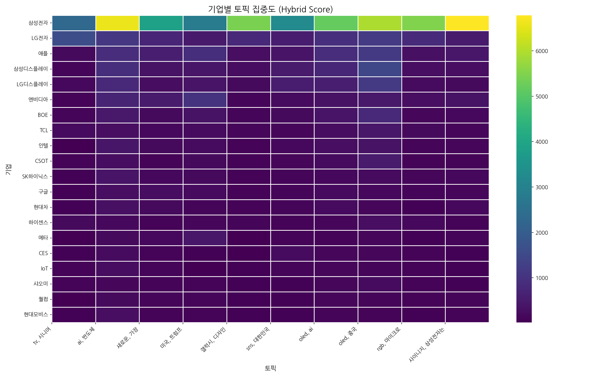

> 전체 기업과 토픽 간의 관계를 한눈에 보여줍니다. 색이 진할수록 연관성이 높습니다.

### 주요 토픽별 경쟁 구도 (Pie Charts)

> 가장 뜨거운 주제를 두고 어떤 기업들이 경쟁하는지 점유율을 보여줍니다.

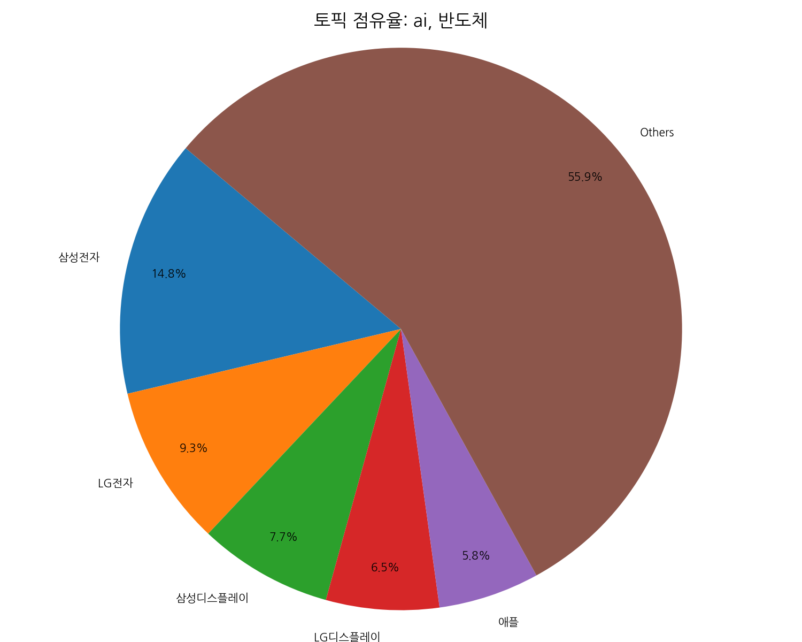
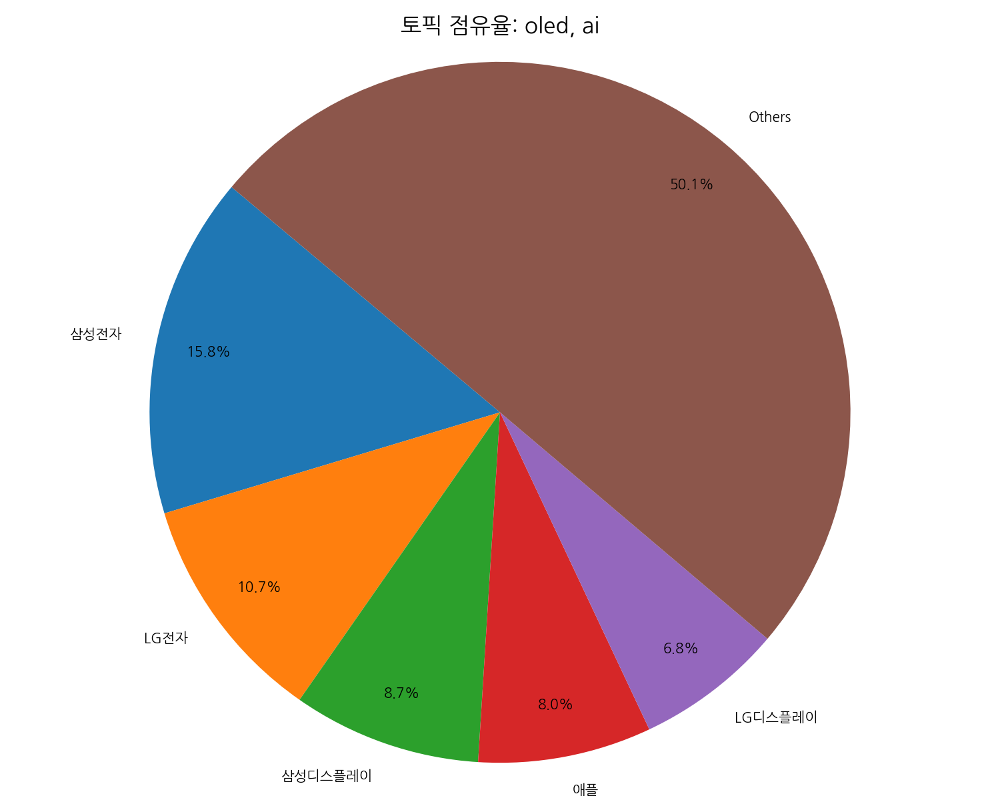
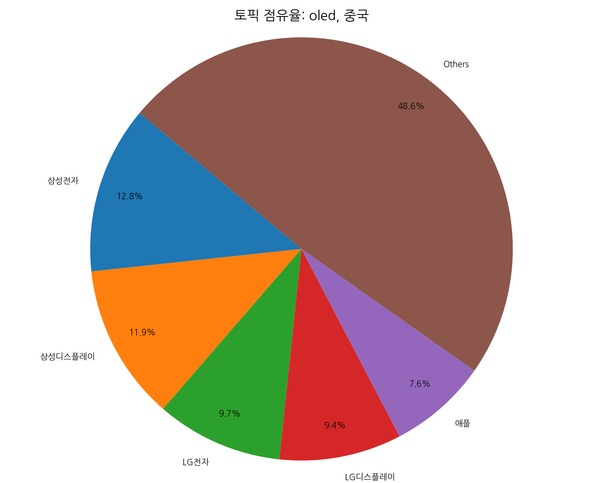

### 주요 기업별 전략 분석 (Bar Charts)

> 시장을 주도하는 주요 기업들이 어떤 토픽에 집중하고 있는지 보여줍니다.

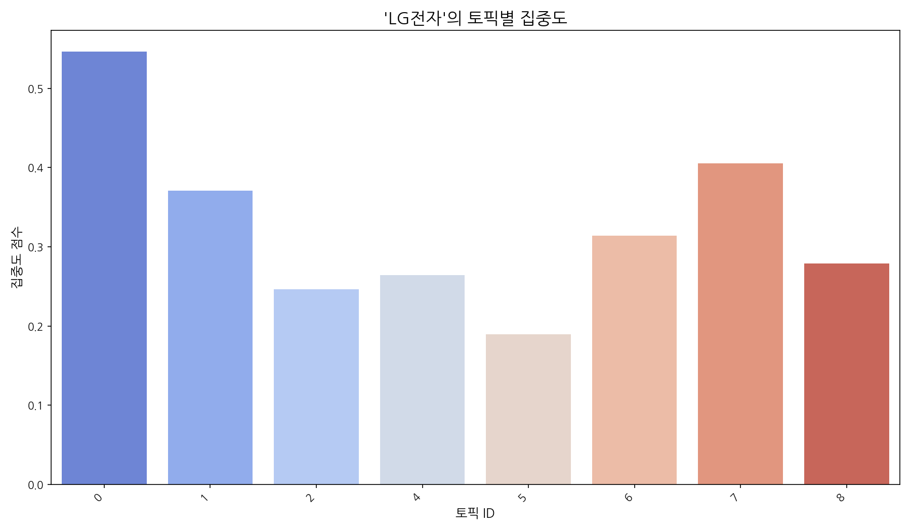
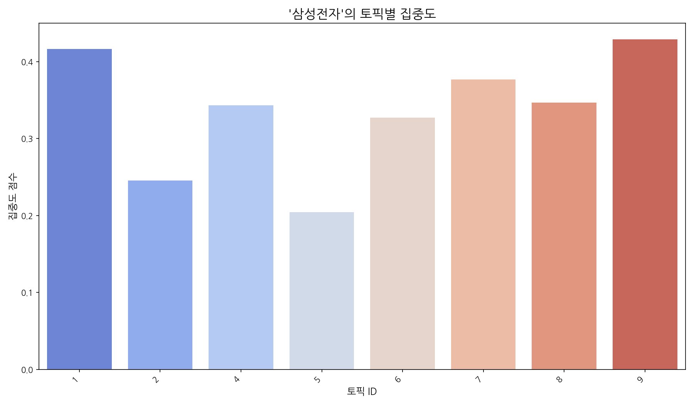
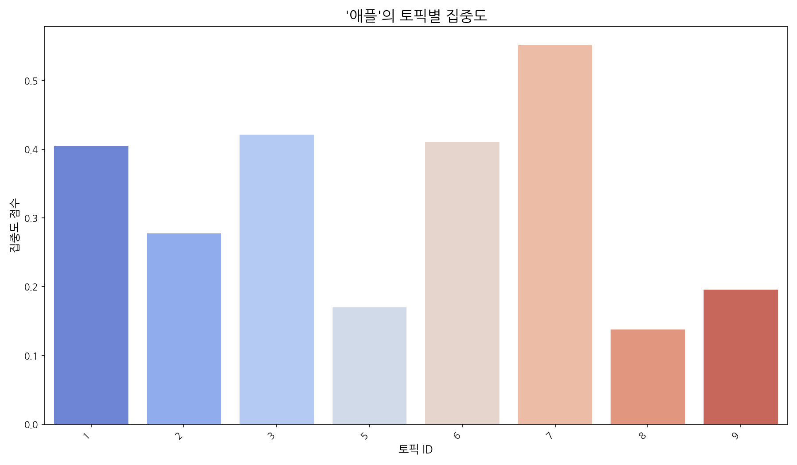

## 관계·경쟁 심화 분석

**핵심 요약**

- **관계망 규모:** 노드 47개 / 엣지 298개

- **가장 강한 관계:** 삼성전자 ↔ 애플 (가중치 231, 유형 rivalry)

- **허브 후보:** 삼성전자 (Degree 0.7826)

- **브로커 후보:** 삼성전자 (Betweenness 0.1589)

### 상위 관계쌍(Edge)

> 동일 문서/문장 내에서 함께 언급된 기업 쌍이며, 가중치는 동시출현 빈도입니다. 값이 높을수록 상호 관련성이 강하고, 유형은 키워드 규칙으로 경쟁/협력/중립을 추정합니다.

| Source   | Target   |   Weight | Type    |
|:---------|:---------|---------:|:--------|
| 삼성전자     | 애플       |      231 | rivalry |
| 삼성디스플레이  | 삼성전자     |      224 | rivalry |
| 삼성디스플레이  | 애플       |      194 | rivalry |
| LG전자     | 삼성전자     |      150 | rivalry |
| 애플       | 엔비디아     |      129 | neutral |
| 메타       | 애플       |      120 | rivalry |
| 구글       | 애플       |      115 | rivalry |
| 메타       | 엔비디아     |       99 | rivalry |
| 삼성전자     | 하이센스     |       98 | rivalry |
| 구글       | 메타       |       91 | rivalry |

### 중심성 상위(연결 허브)

> Degree 중심성은 한 노드가 연결된 상대 수의 비율로, 값이 높을수록 다수의 기업과 직접 연결된 허브 성격을 가집니다. 허브는 이슈 확산과 정보 접근성이 높습니다.

| Org     |   DegreeCentrality |
|:--------|-------------------:|
| 삼성전자    |             0.7826 |
| 애플      |             0.6957 |
| 삼성디스플레이 |             0.6304 |
| LG전자    |             0.587  |
| 구글      |             0.587  |
| 현대차     |             0.587  |
| 엔비디아    |             0.5435 |
| 기아      |             0.5217 |
| 마이크로소프트 |             0.5217 |
| 샤오미     |             0.5217 |

### 매개 중심성 상위(정보 브로커)

> Betweenness는 네트워크 경로의 ‘다리’ 역할 정도를 의미합니다. 값이 높을수록 서로 다른 집단을 연결하는 중개자(브로커)로 해석되며, 거래·협상력과 정보 흐름 장악력이 큽니다.

| Org     |   Betweenness |
|:--------|--------------:|
| 삼성전자    |        0.1589 |
| 애플      |        0.0891 |
| 삼성디스플레이 |        0.0696 |
| 샤오미     |        0.0559 |
| 마이크로소프트 |        0.05   |
| 현대차     |        0.048  |
| 현대자동차   |        0.0426 |
| 기아      |        0.0358 |
| 구글      |        0.0277 |
| LG전자    |        0.0272 |

### 커뮤니티(관계 클러스터)

> 모듈러리티 기반으로 자동 추출한 관계 집단입니다. 같은 집단 내 기업들은 유사 주제나 공급망 활동을 공유할 가능성이 높습니다.

- C0: LG전자, 도우인시스, 디지타임스, 레노버, 리벨리온, 미디어텍 | 해석: LG전자 중심의 연관 클러스터
- C1: 기아, 기아차, 네이버, 두산로보틱스, 리오토, 벤츠 | 해석: 기아 중심의 연관 클러스터
- C2: 구글, 마이크로소프트, 메타, 바이두, 아마존, 알파벳 | 해석: 구글 중심의 연관 클러스터
- C3: 선익시스템, 아이씨디 | 해석: 선익시스템 중심의 연관 클러스터
- C4: 니오 | 해석: 니오 중심의 연관 클러스터

### 네트워크 시각화

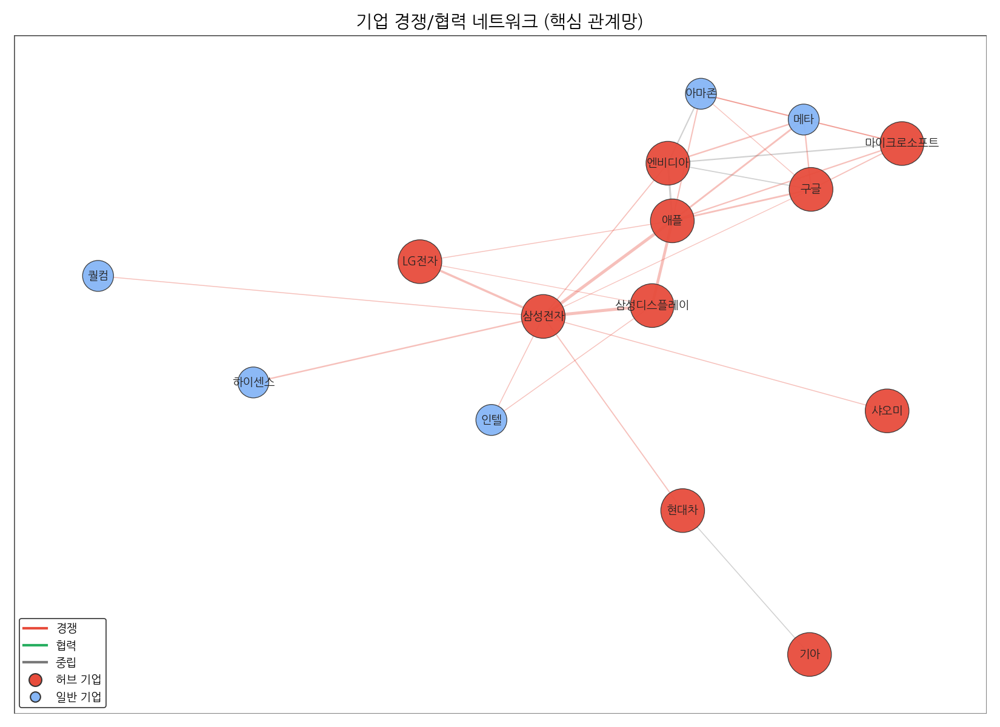

> 동시출현이 높은 쌍은 직접 경쟁 또는 공급망 핵심 협력 가능성을 시사하며, 허브/브로커는 시장 영향력 및 중개 포지션을 의미합니다. 커뮤니티는 전략·밸류체인 단위의 동조 클러스터일 수 있습니다.

## Trend

- 최근 기사 수 추세와 7일 이동평균선을 제공합니다.

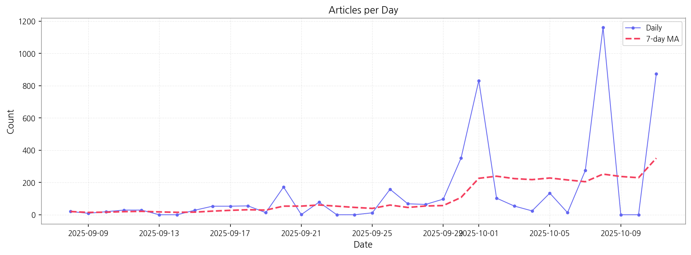

## Insights

## 데일리 인텔리전스 브리핑

**1. 핵심 맥락:**

*   **프리미엄 디스플레이 시장 경쟁 심화:** OLED 기술을 중심으로 삼성과 LG는 물론 중국 업체들까지 경쟁에 참여하며, AI 기술을 접목한 고화질, 고성능 디스플레이 개발이 가속화되고 있습니다. 특히, TV 시장에서 RGB 마이크로 LED 기술이 부상하며 차세대 디스플레이 기술 경쟁이 본격화될 것으로 예상됩니다.
*   **AI 반도체 기술 경쟁력 확보:** AI 반도체 기술은 디스플레이 산업 전반에 걸쳐 중요한 경쟁 요소로 부상하고 있습니다. AI 기술은 디스플레이 화질 개선, 전력 효율 증대, 사용자 맞춤형 기능 제공 등 다양한 분야에 적용될 수 있으며, AI 반도체 기술 경쟁력 확보는 디스플레이 산업의 미래를 좌우할 핵심 요소가 될 것입니다.
*   **미국 시장 공략 및 보호무역주의 대응:** 미국 시장은 여전히 중요한 시장이며, 트럼프 전 대통령의 관세 정책과 희토류 수출 제한 등 보호무역주의 움직임에 대한 지속적인 모니터링과 대응 전략 마련이 필요합니다. 특히, 사이니지 시장에서 삼성전자는 토요타 등 자동차 업계와의 협력을 통해 미국 시장 점유율을 확대하고 있습니다.

**2. 최근 변화/스파이크:**

*   **2025년 9월 20일, 9월 26일, 9월 30일, 10월 1일, 10월 8일, 10월 11일 기사 수 급증:** 이 기간 동안 기사 수가 급증한 것은 새로운 OLED 기술 발표, AI 반도체 기술 발전, 갤럭시 신제품 출시, 미국 시장 진출 전략 등 다양한 요인이 복합적으로 작용한 결과로 추정됩니다. 특히, 10월 8일의 급증은 특정 기술 발표나 시장 변화와 관련된 중요한 이벤트가 있었을 가능성이 높습니다.

**3. 실무 인사이트:**

*   **차세대 디스플레이 기술 개발 투자 확대:** RGB 마이크로 LED, QD-OLED 등 차세대 디스플레이 기술 개발에 대한 투자를 확대하고, AI 반도체 기술과의 융합을 통해 경쟁 우위를 확보해야 합니다.
*   **미국 시장 맞춤형 제품 및 마케팅 전략 강화:** 미국 시장의 특성을 고려한 제품 개발 및 마케팅 전략을 강화하고, 현지 파트너십 구축을 통해 시장 점유율을 확대해야 합니다.
*   **AI 기반 시니어 맞춤형 TV 개발:** 고령화 사회에 발맞춰 AI 기술을 활용한 시니어 맞춤형 TV 개발을 통해 새로운 시장 수요를 창출해야 합니다. LG전자의 "이지 TV" 사례를 참고하여 사용 편의성을 극대화하고, 건강 관리 기능 등 부가 가치를 제공하는 방안을 고려해야 합니다.

## 주요 시그널 분석 (Key Signal Analysis)

### 강한 신호 (Strong Signals)

> 최근 뉴스에서 가장 주목받은 상위 키워드들입니다.

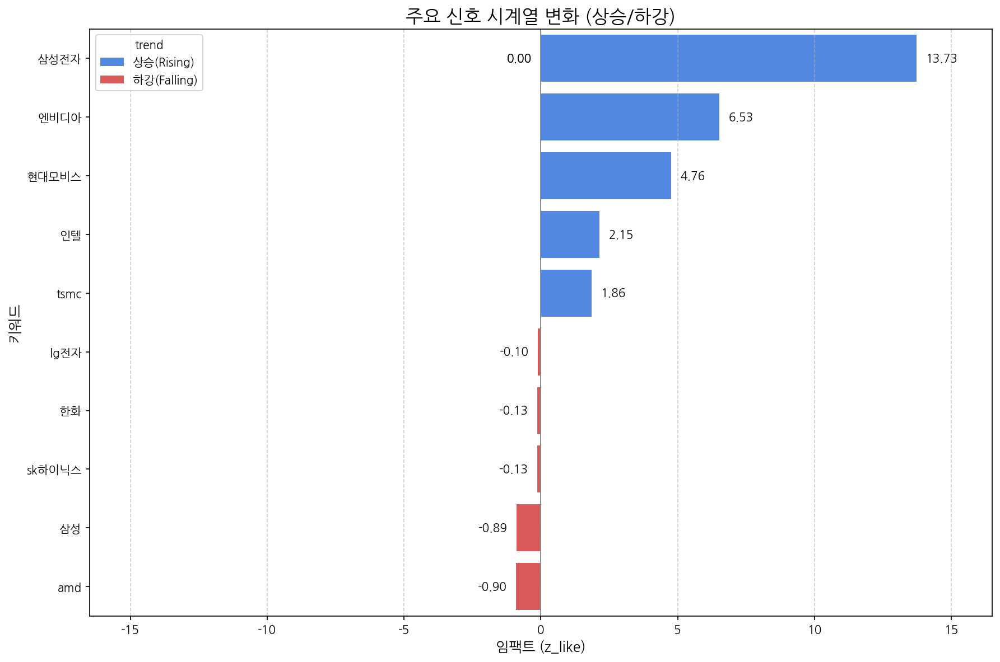

|   순위 | 강한 신호 (Term)   |   최근 언급량 (cur) |   임팩트 (z_like) |
|-----:|:---------------|---------------:|---------------:|
|    1 | 삼성전자           |             90 |         13.734 |
|    2 | 엔비디아           |             33 |          6.53  |
|    3 | 현대모비스          |             17 |          4.759 |
|    4 | 인텔             |              5 |          2.151 |
|    5 | tsmc           |              5 |          1.864 |
|    6 | 양산             |              3 |          1.554 |
|    7 | 한미반도체          |              3 |          1.554 |
|    8 | 애플             |             22 |          1.334 |
|    9 | 퀄컴             |              5 |          1.243 |
|   10 | 폴더블            |              4 |          0.828 |

### 약한 신호 (Weak Signals)

> 총 언급량은 적지만 최근 급부상하여 미래가 기대되는 '틈새 키워드'들입니다.

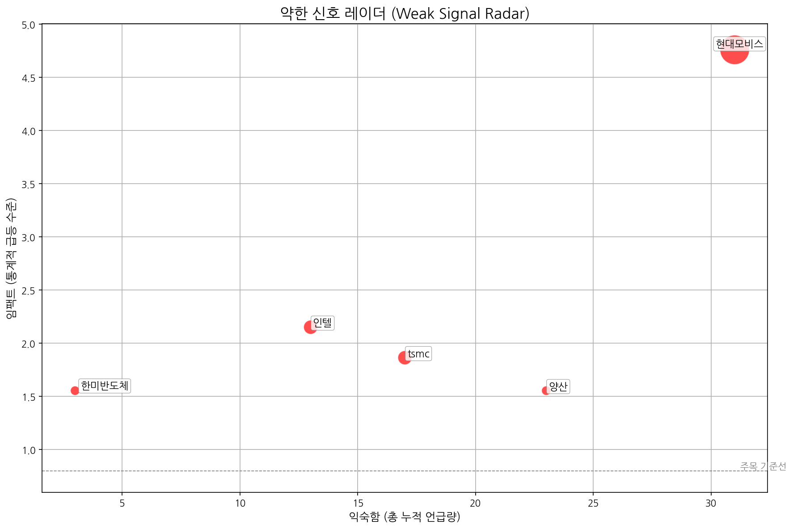

| 약한 신호 (Signal)   | 지표 (cur / z_like)   | LLM의 1줄 요약 (Interpretation)                                                                                                                     |
|:-----------------|:--------------------|:------------------------------------------------------------------------------------------------------------------------------------------------|
| 현대모비스            | 17 / 4.76           | 현대모비스는 차량용 반도체 부족 및 대외 의존 심화에 대응하여 민간 주도 차량용 반도체 협력 기구 'ASK'를 출범, 팹리스 역할 수행을 통해 차량용 반도체 국산화 및 공급망 안정화에 기여하며 미래 차량용 반도체 시장에서 성장 잠재력을 확보하려 한다.    |
| 인텔               | 5 / 2.15            | 인텔은 삼성전자 등 주요 고객사에 반도체 부품을 공급하고 차세대 반도체를 공동 개발하며, 2나노 양산 계획 발표 및 차세대 모바일 프로세서 공개를 통해 파운드리 경쟁 심화 및 모바일 시장 혁신을 주도할 잠재력을 지닌다.                      |
| tsmc             | 5 / 1.86            | 제공된 문장이 없어 TSMC(Taiwan Semiconductor Manufacturing Company)를 지칭하는 것으로 추론되며, 미래 기술 경쟁 심화 속에서 파운드리 기술 패권 및 공급망 안정화의 핵심 변수로 작용할 잠재력이 있다고 해석 가능합니다. |
| 한미반도체            | 3 / 1.55            | -                                                                                                                                               |
| 양산               | 3 / 1.55            | -                                                                                                                                               |

## 기술 성숙도 분석 (Technology Maturity Analysis)

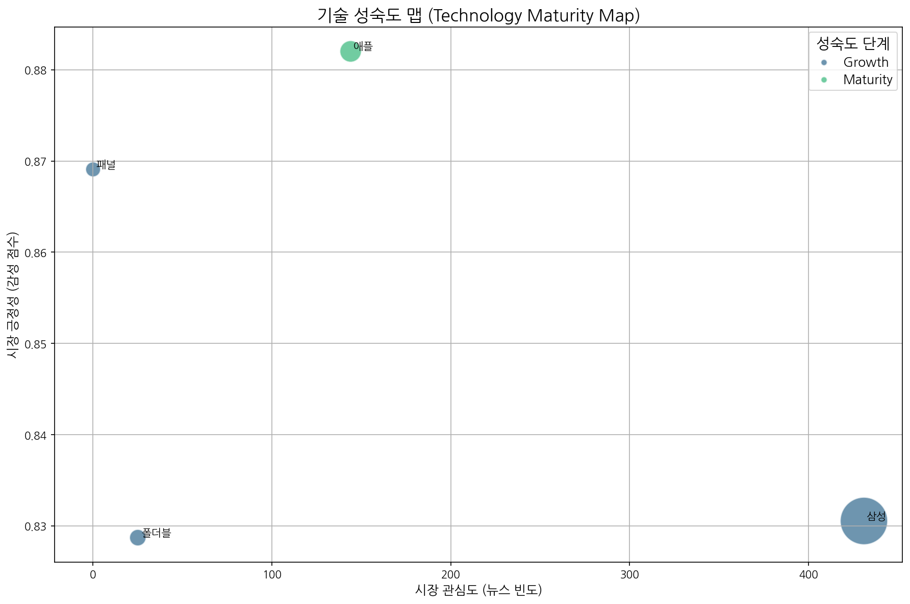

> 각 기술의 시장 내 위치(X축: 관심도, Y축: 긍정성)와 사업 활발도(버블 크기)를 보여줍니다.

| 기술 (Technology) | 성숙도 단계 (Stage) | 판단 근거 (Rationale) |
|:---|:---|:---|
| 폴더블 | **Growth** | 높은 시장 감성 점수와 활발한 제품 출시 및 투자 활동으로 보아 폴더블 기술은 성장기에 접어들었다고 판단됩니다. |
| 애플 | **Maturity** | 높은 시장 감성 점수와 꾸준한 출시 및 투자 이벤트 발생은 애플 기술이 성숙기에 접어들었음을 시사합니다. |
| 패널 | **Growth** | 뉴스 언급은 적지만 긍정적인 시장 감성과 출시 및 투자 이벤트가 활발한 것으로 보아 성장기에 진입한 기술로 판단됩니다. |
| 삼성 | **Growth** | 높은 뉴스 언급 빈도, 긍정적인 시장 감성, 그리고 특히 출시 이벤트의 높은 비율은 삼성 기술이 시장 성장기에 있음을 시사합니다. |

## 포착된 약한 신호 및 해석 (Emerging Signals & Interpretation)

- **현대모비스**
  - **해석:** 현대모비스는 차량용 반도체 부족 및 대외 의존 심화에 대응하여 민간 주도 차량용 반도체 협력 기구 'ASK'를 출범, 팹리스 역할 수행을 통해 차량용 반도체 국산화 및 공급망 안정화에 기여하며 미래 차량용 반도체 시장에서 성장 잠재력을 확보하려 한다.
- **인텔**
  - **해석:** 인텔은 삼성전자 등 주요 고객사에 반도체 부품을 공급하고 차세대 반도체를 공동 개발하며, 2나노 양산 계획 발표 및 차세대 모바일 프로세서 공개를 통해 파운드리 경쟁 심화 및 모바일 시장 혁신을 주도할 잠재력을 지닌다.
- **tsmc**
  - **해석:** 제공된 문장이 없어 TSMC(Taiwan Semiconductor Manufacturing Company)를 지칭하는 것으로 추론되며, 미래 기술 경쟁 심화 속에서 파운드리 기술 패권 및 공급망 안정화의 핵심 변수로 작용할 잠재력이 있다고 해석 가능합니다.

## Opportunities (Top 5)

| Idea | Target | Value Prop | Score (Market / Urgency / Feasibility / Risk) |
|---|---|---|---|
| AI 기반 스마트 팩토리 디스플레이 패널 불량 예측 시스템 | 자사 디스플레이 패널 생산 라인, 디스플레이 패널 제조 설비 업체 | 디스플레이 패널 불량률 20% 감소, 생산 비용 절감. 공정 최적화 및 생산 효율성 향상. 데이터 기반 의사 결정 시스템 구축. | 3.5 (0.45 / 0.3 / 0.5 / 0.15) |
| 초저전력 반사형 LCD 전자책 (e-Reader) 패널 | 글로벌 전자책 (e-Reader) 제조사 (Amazon, Barnes & Noble, Rakuten Kobo) | 기존 E-Ink 대비 3배 빠른 응답 속도 및 컬러 표현 지원. 배터리 수명 유지 및 사용자 경험 향상. 경쟁사 대비 차별화된 전자책 패널 기술력 과시. | 3.2 (0.38 / 0.3 / 0.5 / 0.15) |
| AI 기반 실시간 번인 보정 OLED 패널 (노트북/모니터) | 글로벌 노트북/모니터 제조사 (Dell, HP, Lenovo, LG전자) | AI 기반 실시간 번인 보정으로 OLED 패널 수명 2배 연장. 사용자 불편 최소화 및 제품 신뢰도 향상. 경쟁사 대비 차별화된 OLED 패널 기술력 과시. | 3.1 (0.4 / 0.3 / 0.5 / 0.21) |
| 차량용 HUD (Head-Up Display) 증강현실 (AR) MicroLED 패널 | 글로벌 완성차 OEM (프리미엄 브랜드, 자율주행 기술 선도 기업) | 기존 HUD 대비 5배 향상된 밝기 및 명암비, 넓은 시야각을 제공하여 몰입감 높은 AR 정보 제공. 운전자의 시선 이동 최소화 및 정보 인지 능력 향상으로 안전 운전 지원. 경쟁사 대비 차별화된 프리미엄 HUD 경험 제공. | 3.0 (0.42 / 0.3 / 0.45 / 0.21) |
| 수중 환경 맞춤형 고내구성 투명 OLED 사이니지 | 대형 아쿠아리움, 해양 테마파크, 해양 연구 기관 | 수중 환경에서 선명하고 몰입감 높은 정보 제공. 해양 생태계에 안전한 친환경 소재 사용. 기존 사이니지 대비 차별화된 고객 경험 제공. | 2.9 (0.35 / 0.3 / 0.5 / 0.21) |

### 📊 아이디어 점수 분포
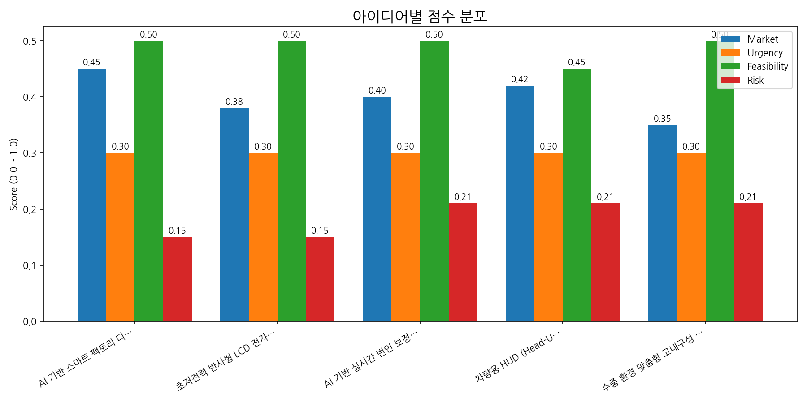

## Appendix

- 데이터: keywords.json, topics.json, trend_timeseries.json, trend_insights.json, biz_opportunities.json