## Intellegence Report (2025-10-13)

**핵심 요약**
- 기간: 2025-09-08 ~ 2025-10-12
- 기사 수: 3,851
- 토픽 수: 8 | 상위 키워드: 20

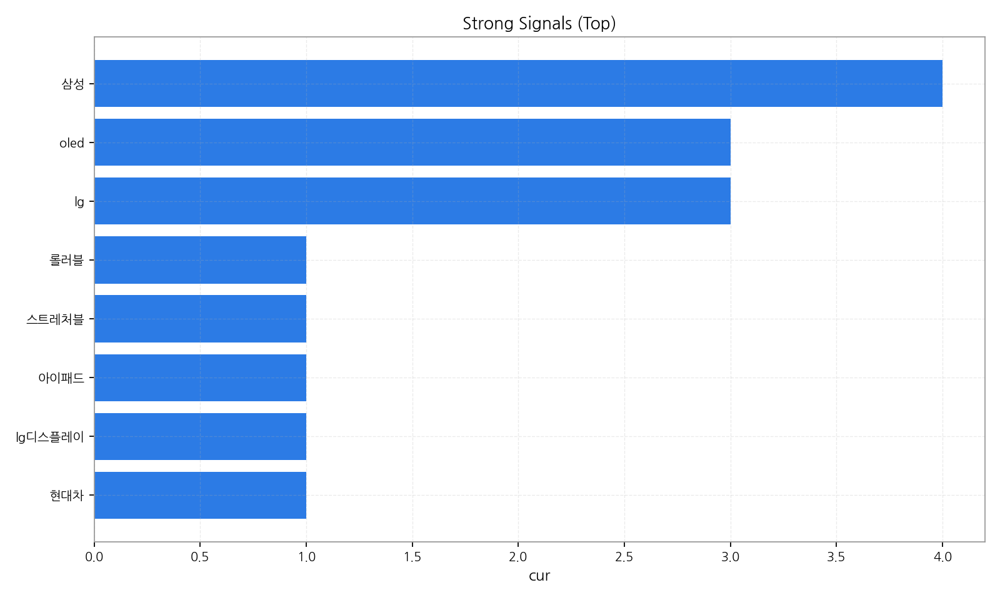

**이번 주 하이라이트**
- ## 데일리 인텔리전스 브리핑 (디스플레이 산업)
- **1. 핵심 맥락**
- *   **OLED 기술 경쟁 심화 및 중국의 영향력 확대:** OLED 디스플레이 시장은 AI, 반도체 기술을 활용한 기술 경쟁이 심화되고 있습니다. 특히 삼성의 AI TV 초격차 전략은 이러한 경쟁을 더욱 가속화하고 있습니다. 동시에 중국 업체들은 LCD 기술 발전과 공격적인 투자(아산 공장 건설)를 통해 시장 점유율을 확대하고 있으며, 이는 한국 디스플레이 기업들에게 위협 요인으로 작용합니다.
- *   **XR/메타버스 시장 성장과 기술 유출 리스크:** XR/메타버스 시장은 KAIST를 중심으로 AI, 광학, LED 기술 등이 융합되며 빠르게 성장하고 있습니다. 그러나 LG디스플레이의 XR 관련 기술이 중국으로 유출된 사건은 기술 경쟁력 약화는 물론, 갤럭시 출시에도 부정적인 영향을 미칠 수 있는 심각한 문제입니다.
- *   **프리미엄 디스플레이 시장 경쟁 심화:** 삼성은 AI TV를 통해 프리미엄 TV 시장에서 기술 초격차를 확보하려 하고, 제네시스는 미국 기술 기반의 새로운 LED 기술을 활용하여 대만 자동차 시장에 진출하는 등 프리미엄 디스플레이 시장 경쟁이 심화되고 있습니다. 이는 고성능, 고품질 디스플레이에 대한 수요 증가를 의미하며, 기술 혁신과 차별화된 가치 제공이 중요해지고 있습니다.
- **2. 인사이트**
- *   **기회:**
- *   **OLED 시장 성장:** 아이폰17과 애플의 수요 증가, 폴더블 디스플레이 시장 확대 등 OLED 시장은 지속적인 성장세를 보일 것으로 예상됩니다.
- *   **XR/메타버스 시장 개화:** XR/메타버스 시장은 새로운 성장 동력이며, AI, 광학, LED 등 다양한 기술과의 융합을 통해 혁신적인 디스플레이 솔루션 개발 기회를 제공합니다.
- *   **위험:**
- *   **중국의 기술 추격 및 시장 잠식:** 중국 업체들의 기술 발전과 공격적인 투자로 인해 한국 디스플레이 기업들의 경쟁 우위가 약화될 수 있습니다.
- *   **기술 유출 리스크:** 핵심 기술 유출은 기업의 경쟁력을 심각하게 훼손할 수 있으며, 특히 중국으로의 기술 유출은 더욱 심각한 문제입니다.
- *   **경쟁 구도:**
- *   **삼성 vs. LG vs. 중국:** 삼성은 AI 기술을 활용한 프리미엄 TV 시장에서 초격차를 확보하려 하고, LG는 XR 기술 개발에 집중하고 있습니다. 중국 업체들은 LCD 기술 발전과 공격적인 투자를 통해 시장 점유율을 확대하고 있습니다.
- **3. Action Items**
- *   **기술 경쟁력 강화 및 차별화:**
- *   **전략:** AI, XR, 폴더블 등 미래 성장 분야에 대한 R&D 투자를 확대하고, 핵심 기술 내재화 및 특허 확보에 집중합니다.
- *   **사업 개발:** 고부가 가치 제품 개발 및 프리미엄 시장 공략을 위한 차별화된 기술 및 솔루션 개발에 집중합니다.
- *   **기술 기획:** AI 기반 화질 개선, 저전력 OLED 기술, XR/메타버스용 디스플레이 기술 등 차세대 디스플레이 기술 로드맵을 수립하고, 기술 개발 우선순위를 설정합니다.
- *   **기술 유출 방지 시스템 강화:**
- *   **전략:** 기술 유출 방지 시스템을 강화하고, 임직원 보안 교육을 강화합니다.
- *   **사업 개발:** 기술 유출 발생 시 법적 대응 및 손해 배상 청구 등 적극적인 대응 방안을 마련합니다.
- *   **기술 기획:** 핵심 기술에 대한 보안 등급을 강화하고, 기술 유출 가능성이 높은 기술 개발 프로젝트에 대한 보안 감사를 강화합니다.
- *   **중국 시장 전략 재검토:**
- *   **전략:** 중국 시장 의존도를 줄이고, 동남아, 인도 등 신흥 시장으로의 시장 다변화를 추진합니다.
- *   **사업 개발:** 중국 시장 맞춤형 제품 개발 및 현지 파트너십 강화를 통해 경쟁력을 확보합니다.
- *   **기술 기획:** 중국 업체들의 기술 수준을 지속적으로 모니터링하고, 기술 격차를 유지하기 위한 기술 개발 전략을 수립합니다.

## 모니터링 스냅샷

### 기사 하이라이트(상위 5)
| 제목                                           | 링크                                                           |
|:---------------------------------------------|:-------------------------------------------------------------|
| 첨단 기술 또다시 中 유출 정황 포착...경찰, LG디스플레이 파주공장 압... | https://www.pointe.co.kr/news/articleView.html?idxno=58290   |
| LG디스플레이까지 번진 中 기술유출 의혹…삼성 이어 핵심 산업 '보안 경...  | https://www.abcn.kr/news/articleView.html?idxno=83469        |
| 정철동 LG디스플레이 사장,  OLED  초격차 전략 결실…흑자전환 목전     | https://news.mtn.co.kr/news-detail/2025101313085941947       |
| 그로쓰리서치 "AI 스마트글래스, 스마트폰 시대 대체 기대"            | https://www.cstimes.com/news/articleView.html?idxno=671517   |
| 주식고수 매수 2위 '미국 빅테크에 가스터빈 첫 수출 신고가 경신' 두산...  | https://www.widedaily.com/news/articleView.html?idxno=279937 |

## 핵심 지표 보드

| 기간                      |   총 기사 수 |   문서 수 |   상위 키워드 수 |   토픽 수 |   시계열 일수 |
|:------------------------|---------:|-------:|-----------:|-------:|---------:|
| 2025-09-08 ~ 2025-10-12 |     3851 |      0 |         20 |      8 |       35 |

> 해석 가이드: 전주 대비 증감률을 함께 보아야 변화를 정확히 해석할 수 있습니다.
> 그래서: 문서/기사 수가 급증하면 키워드/토픽 점유 구조가 바뀔 가능성이 큽니다.
> 다음 액션: 이상값이 보이면 타임라인 섹션의 변곡점 주석과 함께 원인을 추적하세요.

## 키워드 인텔리전스

**핵심 요약**
- 상위 키워드 분포와 클러스터를 통해 테마 맥락을 파악합니다.
- 점수 상승과 긍정 감성 결합은 유망 신호입니다.

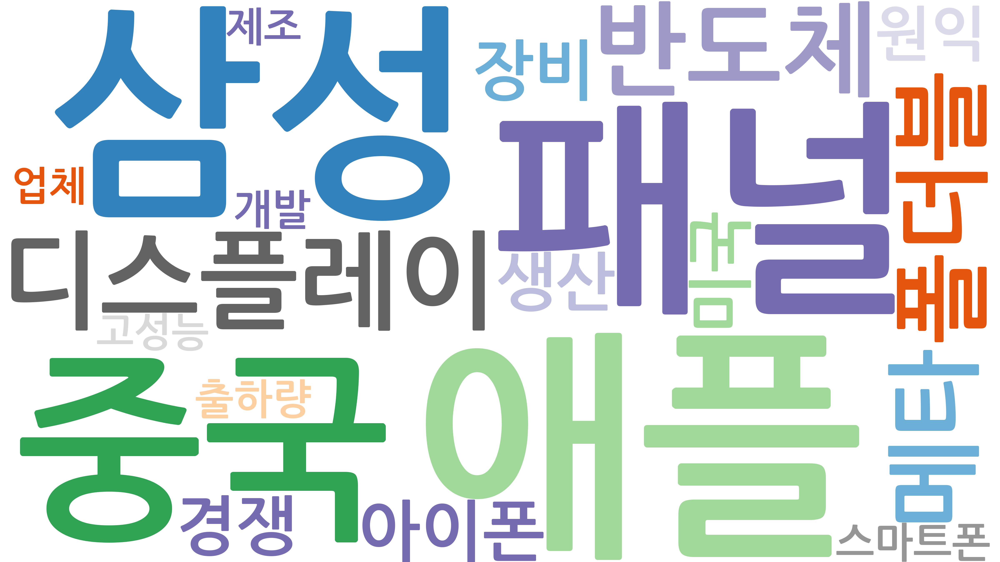
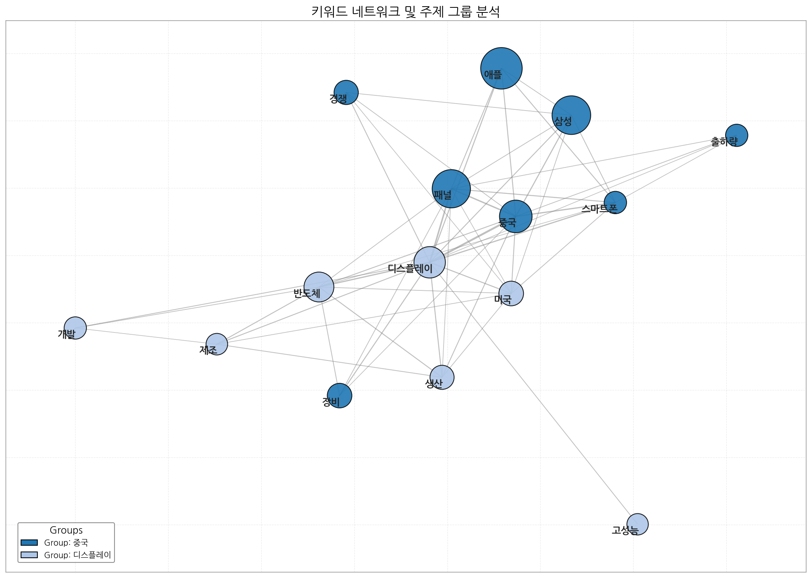
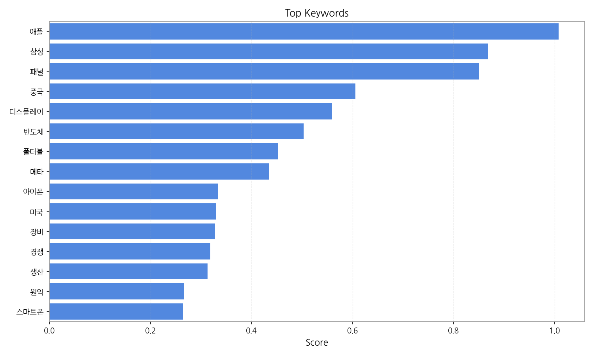

### 상위 키워드 Top 20
|   순위 | 키워드   |    점수 | 변화(참고)   |
|-----:|:------|------:|:---------|
|    1 | 애플    | 1.008 |          |
|    2 | 삼성    | 0.868 |          |
|    3 | 패널    | 0.85  |          |
|    4 | 중국    | 0.606 |          |
|    5 | 디스플레이 | 0.56  |          |
|    6 | 반도체   | 0.503 |          |
|    7 | 폴더블   | 0.452 |          |
|    8 | 메타    | 0.434 |          |
|    9 | 아이폰   | 0.334 |          |
|   10 | 미국    | 0.329 |          |
|   11 | 장비    | 0.328 |          |
|   12 | 경쟁    | 0.318 |          |
|   13 | 생산    | 0.313 |          |
|   14 | 원익    | 0.266 |          |
|   15 | 스마트폰  | 0.265 |          |
|   16 | 개발    | 0.262 |          |
|   17 | 출하량   | 0.262 |          |
|   18 | 제조    | 0.243 |          |
|   19 | 업체    | 0.242 |          |
|   20 | 고성능   | 0.239 |          |

> 해석 가이드: 클러스터는 규제/정책, 공급망, 수요/고객 등 테마로 해석하면 빠릅니다.
> 그래서: 상위 키워드가 네트워크 허브와 겹치면 시장 영향력이 높은 신호일 가능성이 큽니다.
> 다음 액션: 해당 키워드를 포함한 토픽과 기업 교차점(매트릭스 섹션)을 확인하세요.

## 토픽 레이더

**핵심 요약**
- 관심도(X), 긍정성(Y), 성장률(색상)로 토픽 지형을 한눈에 파악합니다.
- 상위 토픽의 미니 시계열로 모멘텀을 점검합니다.

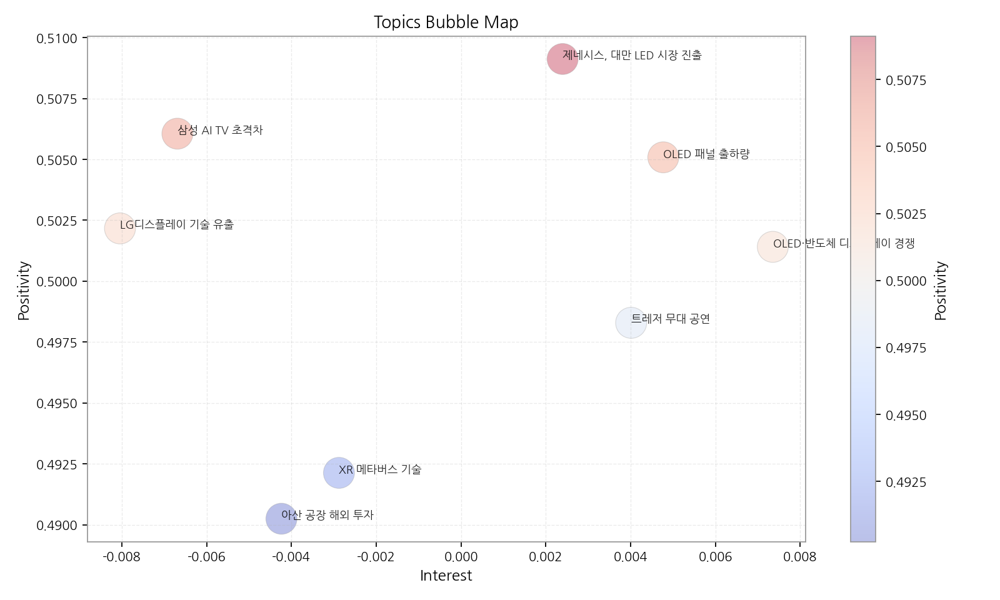
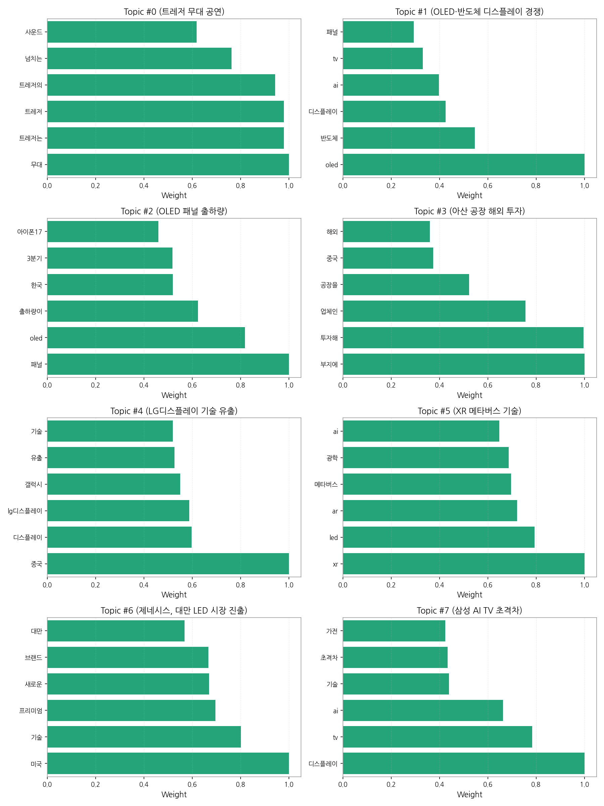

### 토픽 개요
|   topic_id | topic_summary                                                                                                   |
|-----------:|:----------------------------------------------------------------------------------------------------------------|
|          0 | 트레저의 공연과 무대, 넘치는 사운드 퍼포먼스 관련 뉴스. 애플워치, bona, 밴드 등의 요소가 공연과 연관되었을 가능성 존재.                                        |
|          1 | OLED 디스플레이 패널 시장에서 AI 기술, 반도체 장비를 활용한 기술 경쟁 심화 및 중국의 LCD 기술 발전과 시장 영향력 확대를 다룸. 특히 TV용 디스플레이 시장의 변화와 관련된 내용을 포함. |
|          2 | 3분기 한국 OLED 패널 출하량이 아이폰17과 애플의 수요에 힘입어 증가하고 있으며, 중국 업체들의 성장도 주목받고 있다는 내용입니다.                                    |
|          3 | 중국 업체가 아산 부지에 공장을 건설하며, 비트코인 관련 투자가 이루어지는 내용으로 추정. 해외 자본의 국내 유입 및 관련 산업 동향을 파악할 수 있음.                           |
|          4 | 중국으로 LG디스플레이의 XR 관련 기술이 유출되었으며, 갤럭시 출시에도 영향을 줄 수 있는 사안으로 보임.                                                    |
|          5 | KAIST를 중심으로 AI, 광학, LED 기술 등을 활용한 XR(AR 포함) 메타버스 관련 산업 동향 및 기술 개발 현황 분석.                                        |
|          6 | 미국 기술 기반 프리미엄 브랜드 제네시스가 새로운 LED 기술을 활용하여 대만 자동차 시장에서 주행 성능을 선보일 것으로 예상됨.                                        |
|          7 | 삼성전자가 AI 기술, OLED 디스플레이 등을 활용하여 프리미엄 TV 시장에서 기술 초격차를 확보하고, 가전 구독 서비스 등을 통해 시장을 선도하려는 전략을 다룬 뉴스입니다.              |

> 해석 가이드: 성장률이 높고 긍정성이 유지되는 토픽은 우선 탐색 대상입니다.
> 그래서: 토픽 성장과 기업 진입 변화가 동시에 보이면 시장 전환점일 가능성이 있습니다.
> 다음 액션: 상위 토픽을 기업×토픽 매트릭스에서 교차 확인하고, 기회/리스크로 분기하세요.

## 기업×토픽 매트릭스/히트맵

**핵심 요약**
- 가장 경쟁 치열 토픽: oled, 반도체
- 가장 집중도 높은 기업: LG디스플레이
- 최고 단일 조합: LG디스플레이 × oled, 반도체

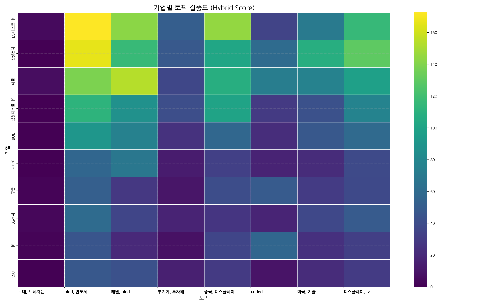
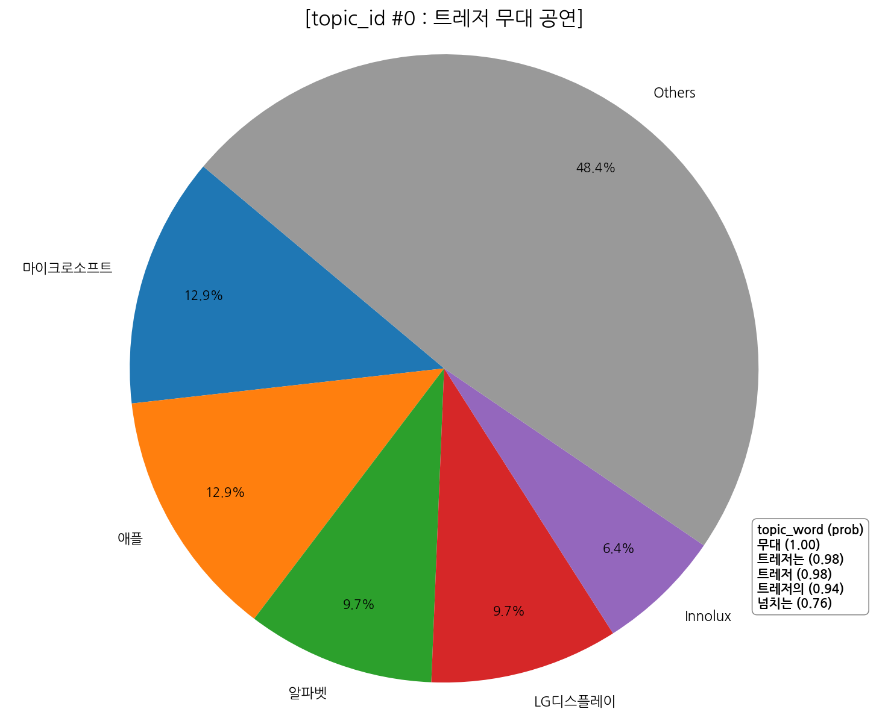
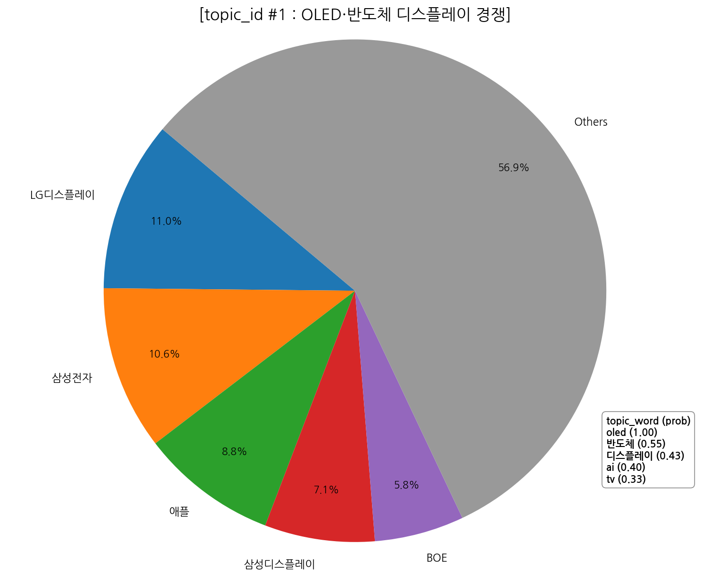
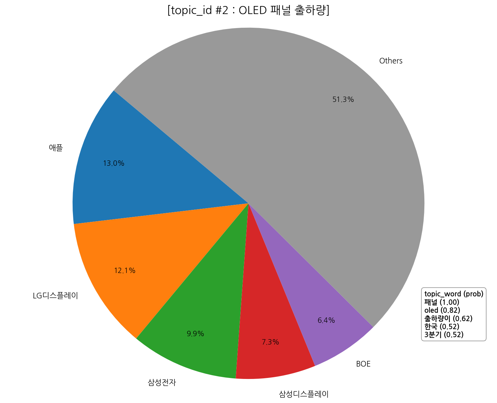
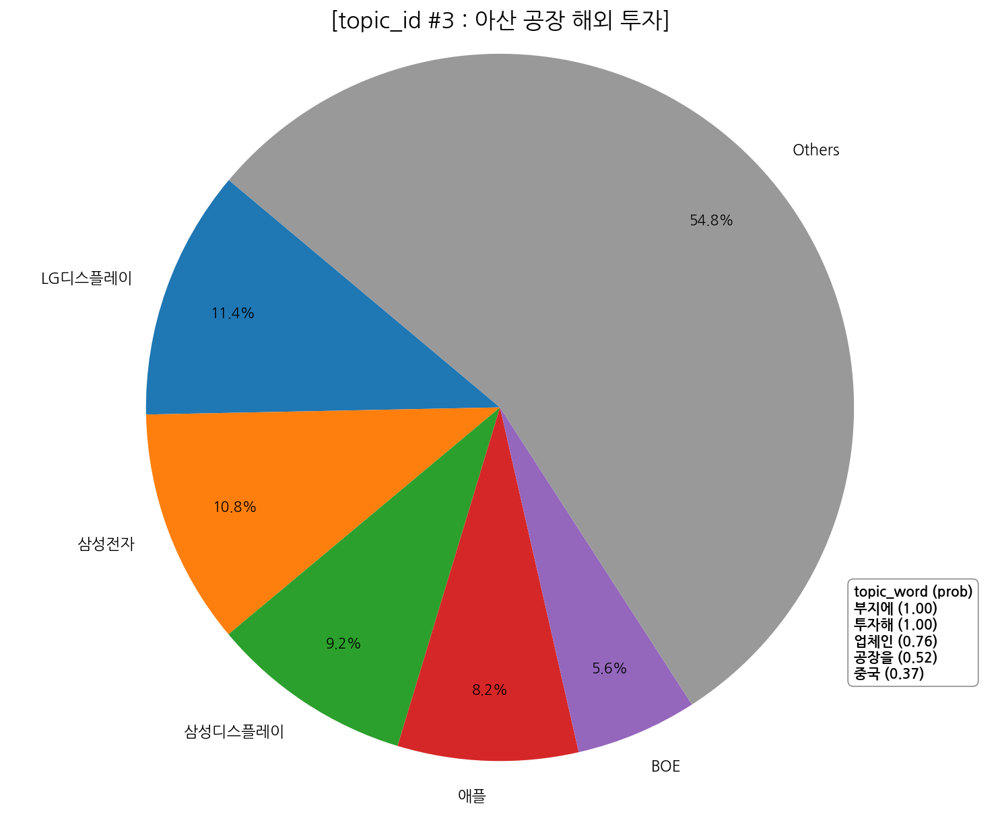
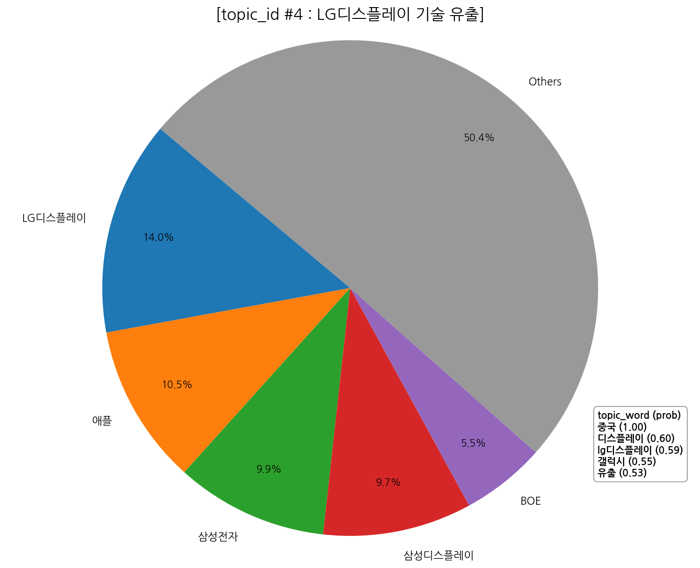
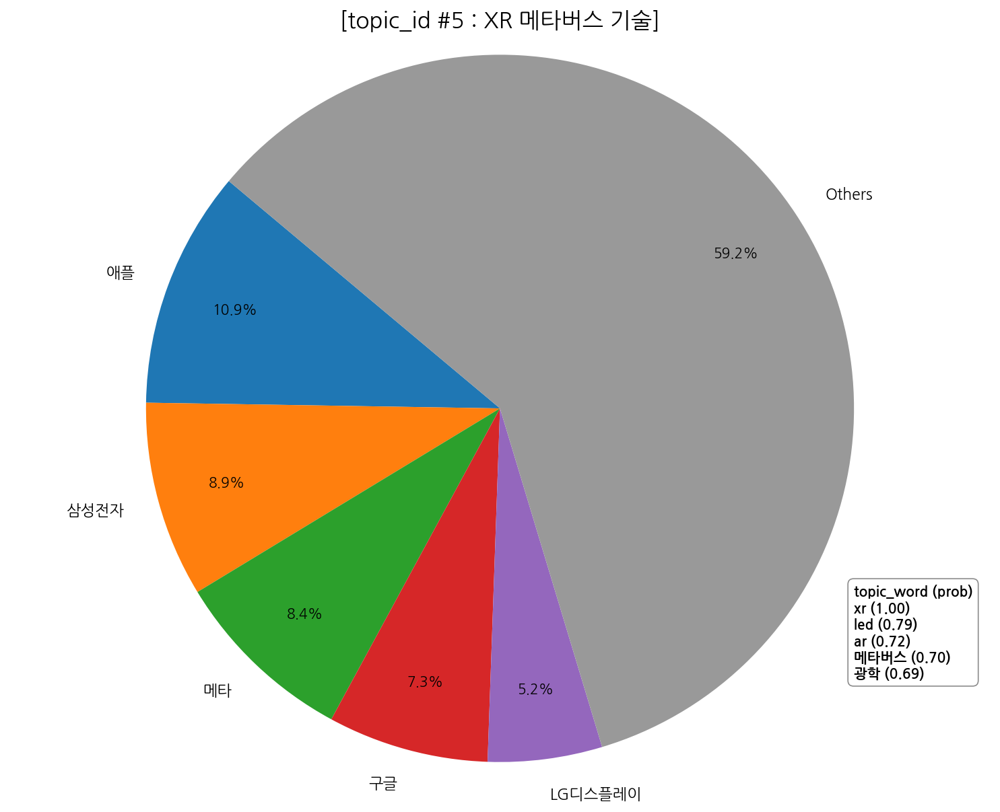
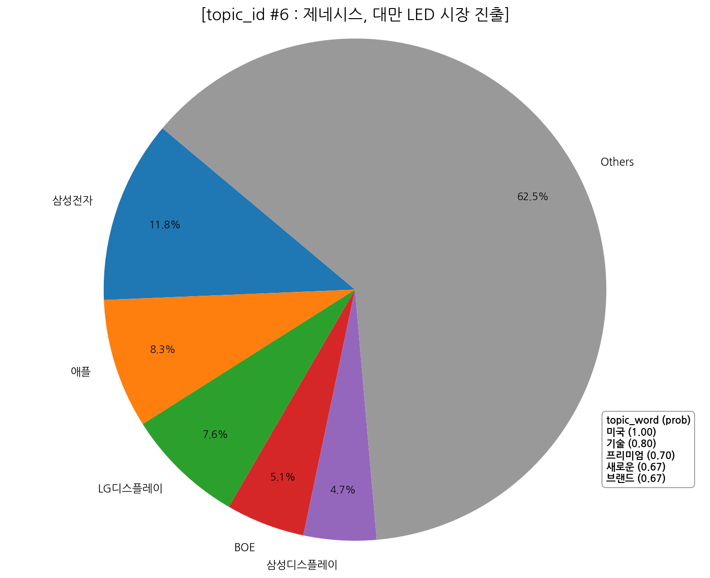
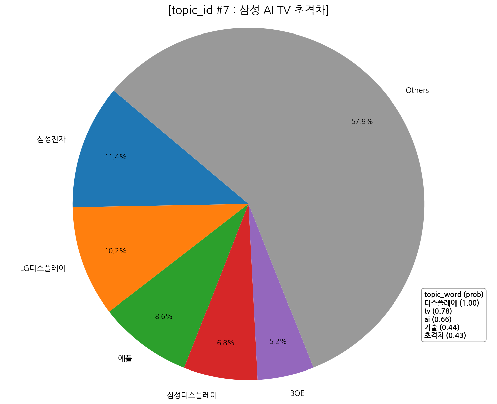
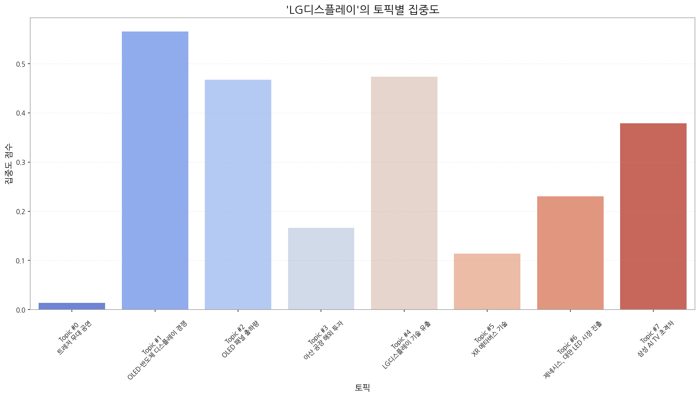
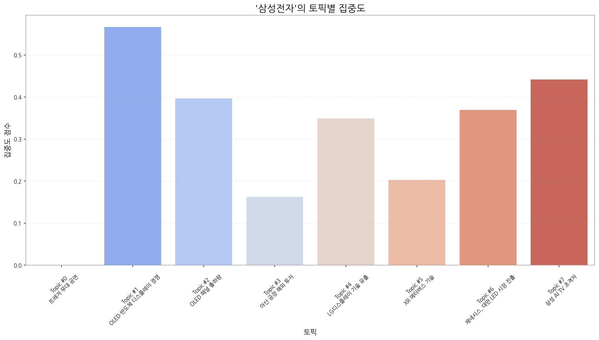
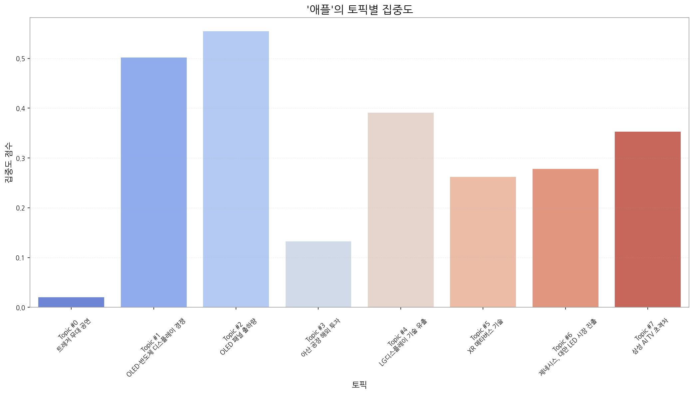

### 매트릭스 표(미리보기)
| org          | topic_0    | topic_1      | topic_2      | topic_3     | topic_4      | topic_5    | topic_6    | topic_7      |
|:-------------|:-----------|:-------------|:-------------|:------------|:-------------|:-----------|:-----------|:-------------|
| AMD          | nan        | 10.40 (1%)   | 4.26 (0%)    | 3.73 (1%)   | 4.91 (0%)    | 4.26 (1%)  | 12.21 (1%) | 12.62 (1%)   |
| AUO          | 1.41 (3%)  | 27.03 (2%)   | 10.65 (1%)   | 6.71 (2%)   | 17.53 (2%)   | 14.90 (2%) | 22.27 (2%) | 21.04 (2%)   |
| BMW          | nan        | 6.24 (0%)    | 2.13 (0%)    | 2.24 (1%)   | 4.21 (0%)    | 3.55 (1%)  | 19.39 (2%) | 9.12 (1%)    |
| BOE          | nan        | 90.80 (6%)   | 75.23 (6%)   | 24.60 (6%)  | 56.81 (6%)   | 22.00 (3%) | 46.69 (5%) | 58.91 (5%)   |
| BYD          | 1.41 (3%)  | 9.01 (1%)    | 5.68 (0%)    | 2.98 (1%)   | 4.21 (0%)    | 2.84 (0%)  | 3.59 (0%)  | 9.12 (1%)    |
| CES          | 1.41 (3%)  | 10.40 (1%)   | 2.84 (0%)    | 2.24 (1%)   | 9.82 (1%)    | 22.00 (3%) | 10.06 (1%) | 11.92 (1%)   |
| CSOT         | nan        | 47.13 (3%)   | 42.58 (4%)   | 14.91 (3%)  | 29.46 (3%)   | 9.23 (1%)  | 21.55 (2%) | 30.16 (3%)   |
| Counterpoint | nan        | 0.69 (0%)    | nan          | nan         | nan          | 1.42 (0%)  | nan        | 0.70 (0%)    |
| ETRI         | nan        | nan          | nan          | nan         | 1.40 (0%)    | 4.26 (1%)  | nan        | nan          |
| Harman       | nan        | 3.47 (0%)    | 1.42 (0%)    | 0.75 (0%)   | 0.70 (0%)    | 0.71 (0%)  | 0.72 (0%)  | 1.40 (0%)    |
| IEEE         | nan        | 4.16 (0%)    | 2.13 (0%)    | 1.49 (0%)   | 1.40 (0%)    | 2.84 (0%)  | 2.15 (0%)  | 2.81 (0%)    |
| Innolux      | 2.82 (6%)  | 27.03 (2%)   | 11.35 (1%)   | 6.71 (2%)   | 15.43 (1%)   | 12.77 (2%) | 31.60 (3%) | 21.74 (2%)   |
| IoT          | 1.41 (3%)  | 13.17 (1%)   | 5.68 (0%)    | 3.73 (1%)   | 8.42 (1%)    | 7.81 (1%)  | 16.52 (2%) | 16.83 (1%)   |
| JDI          | nan        | 14.56 (1%)   | 11.35 (1%)   | 3.73 (1%)   | 7.71 (1%)    | 2.84 (0%)  | 2.87 (0%)  | 8.42 (1%)    |
| KAIST        | 1.41 (3%)  | 10.40 (1%)   | 2.84 (0%)    | 2.24 (1%)   | 9.12 (1%)    | 22.00 (3%) | 7.18 (1%)  | 9.12 (1%)    |
| LG디스플레이      | 4.23 (10%) | 172.59 (11%) | 142.64 (12%) | 50.68 (11%) | 144.47 (14%) | 34.77 (5%) | 70.39 (8%) | 115.72 (10%) |
| LG전자         | 2.82 (6%)  | 59.61 (4%)   | 35.48 (3%)   | 16.40 (4%)  | 26.65 (3%)   | 17.03 (3%) | 37.35 (4%) | 49.09 (4%)   |
| LG화학         | nan        | 8.32 (1%)    | 2.13 (0%)    | 1.49 (0%)   | 5.61 (1%)    | 2.13 (0%)  | 2.87 (0%)  | 4.91 (0%)    |
| Nitto        | nan        | 1.39 (0%)    | nan          | nan         | nan          | nan        | nan        | nan          |
| SID          | nan        | 4.16 (0%)    | 3.55 (0%)    | 0.75 (0%)   | 4.21 (0%)    | 3.55 (1%)  | 3.59 (0%)  | 2.10 (0%)    |

> 해석 가이드: 히트맵에서 진한 교차지점은 전략 초점을 의미합니다. 점수는 소스 커버리지에 민감합니다.
> 그래서: 경쟁 치열 토픽에서의 점유율 변화는 공격/수비 전략 신호일 수 있습니다.
> 다음 액션: 상위 기업과 토픽 교차를 기회 섹션으로 연결하고, 파트너/경쟁사 움직임을 추적하세요.

## 관계·경쟁 네트워크

**핵심 요약**
- 관계망 규모: 노드 34개 / 엣지 87개
- 가장 강한 관계: 삼성전자 ↔ 애플 (가중치 35, 유형 rivalry)
- 허브 후보: 삼성전자 (Degree 0.6667)
- 브로커 후보: 삼성전자 (Betweenness 0.3559)

### 상위 관계쌍(Edge)
동일 문서/문장에서 함께 언급된 기업 쌍이며, 가중치는 동시출현 빈도입니다. 유형은 규칙 기반 추정입니다.

| Source   | Target   |   Weight | Type        |
|:---------|:---------|---------:|:------------|
| 삼성전자     | 애플       |       35 | rivalry     |
| 삼성디스플레이  | 삼성전자     |       27 | rivalry     |
| 삼성디스플레이  | 애플       |       23 | rivalry     |
| 구글       | 애플       |       21 | neutral     |
| 메타       | 애플       |       20 | partnership |
| 구글       | 메타       |       17 | partnership |
| 샤오미      | 애플       |       15 | rivalry     |
| 삼성전자     | 샤오미      |       10 | rivalry     |
| 삼성전자     | 퀄컴       |        9 | rivalry     |
| 마이크로소프트  | 메타       |        9 | partnership |

### 중심성 상위(연결 허브)
Degree 중심성은 연결된 상대 수의 비율입니다. 높을수록 허브 성격.

| Org     |   DegreeCentrality |
|:--------|-------------------:|
| 삼성전자    |             0.6667 |
| 애플      |             0.5455 |
| 샤오미     |             0.3939 |
| 삼성디스플레이 |             0.3333 |
| 메타      |             0.2727 |
| 엔비디아    |             0.2727 |
| 퀄컴      |             0.2727 |
| 구글      |             0.2424 |
| 화웨이     |             0.2121 |
| 비보      |             0.1818 |

### 매개 중심성 상위(정보 브로커)
Betweenness는 집단 간 ‘다리’ 역할 정도입니다. 높을수록 중개자 성격.

| Org     |   Betweenness |
|:--------|--------------:|
| 삼성전자    |        0.3559 |
| 애플      |        0.1403 |
| 현대차     |        0.0783 |
| 메타      |        0.0609 |
| 선익시스템   |        0.053  |
| 샤오미     |        0.052  |
| 퀄컴      |        0.0452 |
| 삼성디스플레이 |        0.027  |
| 현대자동차   |        0.0253 |
| 엔비디아    |        0.0227 |

### 커뮤니티(관계 클러스터)
> 모듈러리티 기반 자동 추출 집단. 같은 집단 내 기업은 유사 주제/밸류체인 공유 가능성.
- C0: 네이버, 디지타임스, 비보, 삼성디스플레이, 삼성전자, 샤오미 | 해석: 네이버 중심의 연관 클러스터
- C1: 구글, 마이크로소프트, 메타, 선익시스템, 아마존, 아이씨디 | 해석: 구글 중심의 연관 클러스터
- C2: 기아, 미디어텍, 벤츠, 퀄컴, 현대모비스, 현대자동차 | 해석: 기아 중심의 연관 클러스터
- C3: 기아자동차 | 해석: 기아자동차 중심의 연관 클러스터
- C4: 레노버 | 해석: 레노버 중심의 연관 클러스터

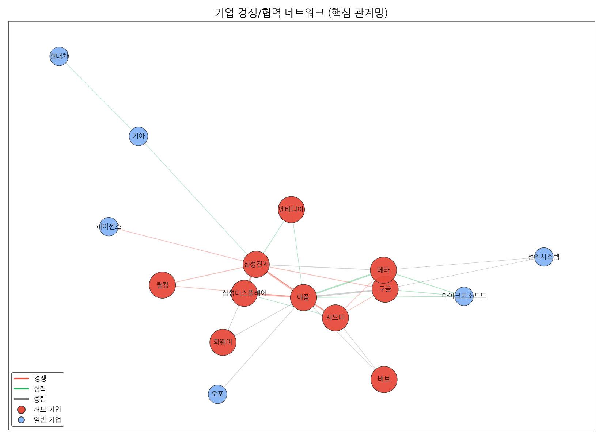

> 해석 가이드: 동시출현이 높은 쌍은 경쟁/협력 가능성을 시사합니다.
> 그래서: 허브/브로커 포지션은 영향력/협상력을 가리킵니다.
> 다음 액션: 커뮤니티별 주요 토픽/키워드와 교차하여 전략 단위를 정의하세요.

## 트렌드 타임라인

**핵심 요약**
- 기간: 2025-09-08 ~ 2025-10-12
- 총 기사 수: 3,851
- 일별 기사 수와 7일 이동평균, 변곡점을 주석으로 표시합니다.

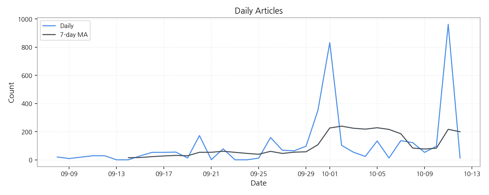

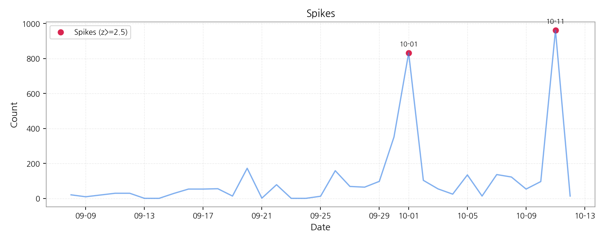

### 스파이크/이벤트 목록
| date       |   count |       z |
|:-----------|--------:|--------:|
| 2025-10-01 |     832 | 3.45345 |
| 2025-10-11 |     962 | 4.07529 |

> 해석 가이드: 단기 급등은 이벤트성 가능성이 있으니 2주 추세를 함께 보세요.
> 그래서: 스파이크 이후 토픽/신호 방향을 교차 확인하면 원인 파악이 빨라집니다.
> 다음 액션: 스파이크 날짜의 주요 기사와 키워드 변동을 키워드/토픽 섹션에서 재확인하세요.

## 시그널 보드(강한/약한 신호)

### 강한 신호(Strong Signals)

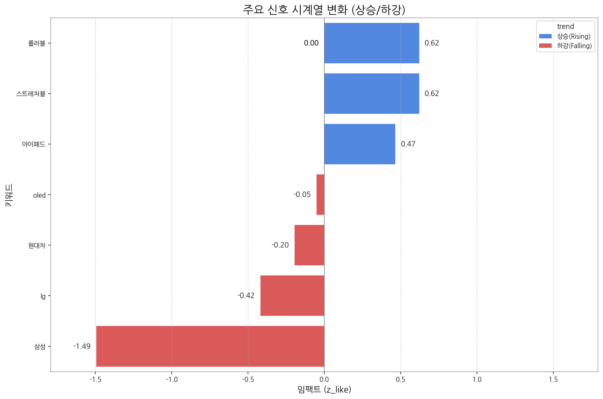

| term    |   cur |   z_like |   prev |   diff |    ma7 |   total |
|:--------|------:|---------:|-------:|-------:|-------:|--------:|
| 롤러블     |     1 |    0.622 |      0 |      1 |  0.143 |       5 |
| 스트레처블   |     1 |    0.622 |      0 |      1 |  0.143 |       3 |
| 아이패드    |     1 |    0.465 |      1 |      0 |  0.286 |       7 |
| lg디스플레이 |     1 |    0     |      0 |      1 |  1     |      69 |
| oled    |     3 |   -0.052 |      0 |      3 |  3.143 |     133 |
| 현대차     |     1 |   -0.195 |      5 |     -4 |  1.429 |      28 |
| lg      |     3 |   -0.419 |      8 |     -5 |  4.286 |     264 |
| 삼성      |     4 |   -1.494 |     25 |    -21 | 10.286 |     362 |

> 해석 가이드: 약한 신호는 가속도·이례성이 핵심이고, 강한 신호는 현재 주목도의 절대값입니다.
> 그래서: 약한→강한 신호로 전환하는 구간이 가장 좋은 기회가 됩니다.
> 다음 액션: 상위 신호 5개를 2주간 추적하고, 토픽/기업 매트릭스와 교차 검증하세요.

## 기술 성숙도 맵

**핵심 요약**
- 관심도(X), 긍정성(Y), 버블(사업 활발도)로 기술의 위치를 표현합니다.
- 단계: Seed/Early/Growth/Mature/Legacy

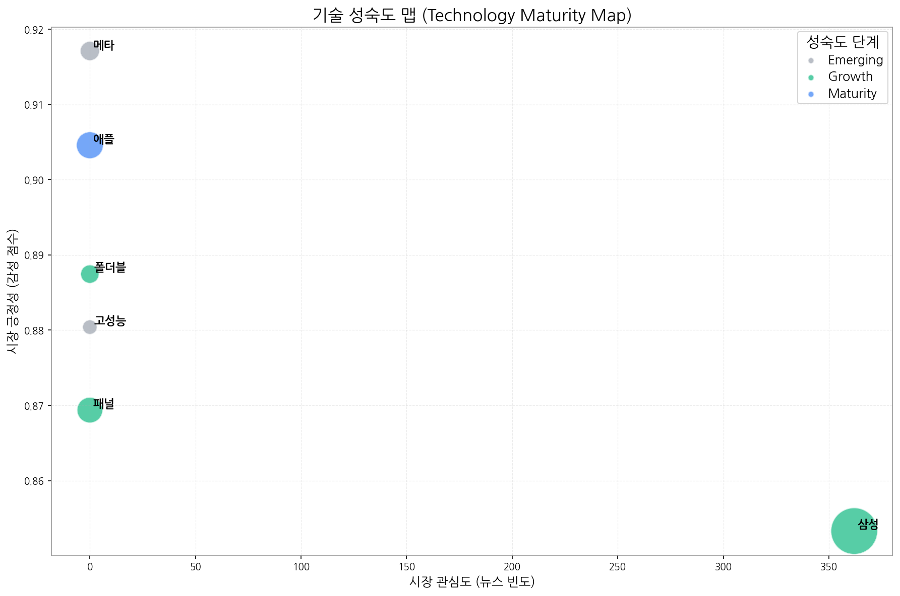

| 기술   | 단계       | 판단 근거                                                                                |
|:-----|:---------|:-------------------------------------------------------------------------------------|
| 메타   | Emerging | 뉴스 언급은 없지만 높은 시장 감성 점수와 투자 건수를 고려할 때, 시장의 관심은 높으나 아직 초기 단계로 판단됩니다.                   |
| 폴더블  | Growth   | 뉴스 언급은 없지만 긍정적인 시장 감성 점수와 출시 및 수주 이벤트가 발생한 것으로 보아 폴더블 기술은 성장기에 있다고 판단됩니다.            |
| 삼성   | Growth   | 높은 뉴스 언급 빈도, 긍정적인 시장 감성 점수, 그리고 투자 및 출시 이벤트의 빈번한 발생은 삼성 기술이 시장 성장기에 있음을 시사합니다.       |
| 패널   | Growth   | 뉴스 언급은 없지만, 긍정적인 시장 감성과 출시 이벤트가 다수 발생하여 성장 단계로 판단됩니다.                                |
| 고성능  | Emerging | 뉴스 언급은 없지만 시장 감성 점수가 높고 출시 이벤트가 한 건 발생한 것으로 보아 시장 관심은 존재하나 아직 초기 단계로 판단됩니다.          |
| 애플   | Maturity | 뉴스 언급 빈도가 낮고, 시장 감성 점수가 높은 반면, 출시 및 수주 이벤트 발생 빈도가 투자 이벤트 빈도보다 높아 성숙기에 접어든 것으로 판단됩니다. |

> 해석 가이드: Growth 구간이면서 강한 신호 결합 시 유망합니다.
> 그래서: Early라도 약한 신호가 누적되면 전환 후보입니다.
> 다음 액션: 상위 기술 3개를 기회 섹션과 연결하고 파일럿 과제를 정의하세요.

## 비즈니스 기회(Top 5)

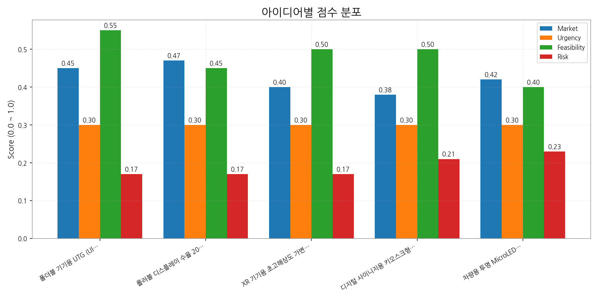

| 아이디어                                                    | 타깃                                  | 가치제안                                                                                               | 점수(시장/긴급/실행/리스크)         |
|:--------------------------------------------------------|:------------------------------------|:---------------------------------------------------------------------------------------------------|:-------------------------|
| 폴더블 기기용 UTG (Ultra-Thin Glass) 일체형 저반사 OLED 패널          | 글로벌 스마트폰 제조사 (삼성전자, 애플 등)           | UTG와 OLED 패널의 완벽한 결합으로 뛰어난 내구성과 얇은 두께 구현. 공기층 제거를 통한 반사율 최소화 및 선명한 화질 제공. 폴더블 기기의 디자인 자유도 향상.      | 3.5 (0.45/0.3/0.55/0.17) |
| 롤러블 디스플레이 수율 20% 향상을 위한 AI 공정 모니터링 서비스                  | 자사 디스플레이 패널 생산 라인                   | AI 기반 실시간 데이터 분석을 통한 불량 예측 및 공정 최적화. 롤러블 디스플레이 수율 20% 향상 및 생산 비용 절감. 불량 원인 분석 시간 단축 및 문제 해결 능력 향상. | 3.4 (0.47/0.3/0.45/0.17) |
| XR 기기용 초고해상도 가변 주사율 OLED on Silicon (OLEDoS) 마이크로 디스플레이 | 글로벌 XR 기기 제조사 (Meta, Apple, Sony 등) | 초고해상도, 고주사율, 넓은 색 영역을 제공하여 몰입감 극대화. OLED on Silicon 기술로 소형화 및 저전력화 달성. 가변 주사율 기술로 배터리 효율 향상.       | 3.3 (0.4/0.3/0.5/0.17)   |
| 디지털 사이니지용 키오스크형 투명 OLED                                 | 글로벌 리테일 기업 (백화점, 쇼핑몰, 브랜드 플래그십 스토어) | 제품 정보와 실제 제품을 동시에 보여주는 혁신적인 고객 경험 제공. 투명 디스플레이를 활용한 공간 효율성 극대화. 광고 효과 증대 및 브랜드 이미지 제고.             | 3.0 (0.38/0.3/0.5/0.21)  |
| 차량용 투명 MicroLED HUD (Head-Up Display)                   | 글로벌 완성차 OEM (Tier 1 부품사 협력)         | 기존 HUD 대비 넓은 시야각, 높은 투명도, 선명한 화질 제공. 운전자의 안전과 편의성을 극대화하는 몰입형 AR 경험 제공. 경쟁사 대비 낮은 전력 소비 및 소형화 가능.   | 2.9 (0.42/0.3/0.4/0.23)  |

> 해석 가이드: 점수는 내부 가중치 기반(예: Market 0.35, Urgency 0.25, Feasibility 0.25, Risk -0.15).
> 그래서: 상위안은 단기 임팩트/실행 가능성이 높은 편입니다.
> 다음 액션: 각 아이디어에 대해 2주 파일럿(가설·대상·KPI)을 정의하고 담당 오너를 배정하세요.

## 리스크/이슈 관측소

- (리스크/이슈 데이터 없음)

> 해석 가이드: 부정 감성 급등은 PR·컴플라이언스·조달과 연계가 필요합니다.
> 그래서: 공급망 키워드와 동반 급등 시 실제 운영 리스크로 이어질 수 있습니다.
> 다음 액션: 영향범위가 큰 이슈는 즉시 리스크 레지스터에 등록하고 완화 액션을 실행하세요.

## 결론: So What & Next Steps

### 다음 2주 실행안(템플릿)
| hypothesis          | target         | kpi               | owner   | due        |
|:--------------------|:---------------|:------------------|:--------|:-----------|
| 토픽 A 관심도↑는 고객 니즈 증가 | SMB 고객 20명 인터뷰 | 응답률 30%/신규 리드 10건 | 사업개발팀   | 2025-10-27 |

> 해석 가이드: 데이터-인사이트-액션의 연결을 표준 템플릿으로 기록하세요.
> 그래서: 우선순위 상위 안건부터 빠르게 실험해야 기회를 놓치지 않습니다.
> 다음 액션: 오너/기한/KPI가 명확한 항목부터 킥오프하세요.

## 부록(Appendix)

분석의 투명성을 확보하고, 다음 단계 분석을 위한 원천 자료를 제공합니다.

### 데이터 메타
| 파일                             | 수정시각                |   크기(bytes) |
|:-------------------------------|:--------------------|------------:|
| outputs/keywords.json          | 2025-10-13 06:20:49 |        1537 |
| outputs/topics.json            | 2025-10-13 06:21:07 |        9518 |
| outputs/trend_timeseries.json  | 2025-10-13 06:20:51 |        2087 |
| outputs/trend_insights.json    | 2025-10-13 06:21:15 |        7725 |
| outputs/biz_opportunities.json | 2025-10-13 06:22:24 |       27632 |
| outputs/tech_maturity.json     | 2025-10-13 06:22:02 |        3040 |
| outputs/company_network.json   | 2025-10-13 06:22:08 |       16891 |

> 해석 가이드: 재현성과 감사추적을 위해 생성일, 버전, 파라미터를 함께 보관하세요.
> 그래서: 데이터 출처와 가공 과정을 명확히 남기면 신뢰성이 높아집니다.
> 다음 액션: 주요 이미지/표 생성 실패 로그도 추적 테이블로 남겨두세요.
