## Intellegence Report (2025-10-14)

**핵심 요약**
- 기간: 2025-09-08 ~ 2025-10-13
- 기사 수: 4,038
- 토픽 수: 8 | 상위 키워드: 20

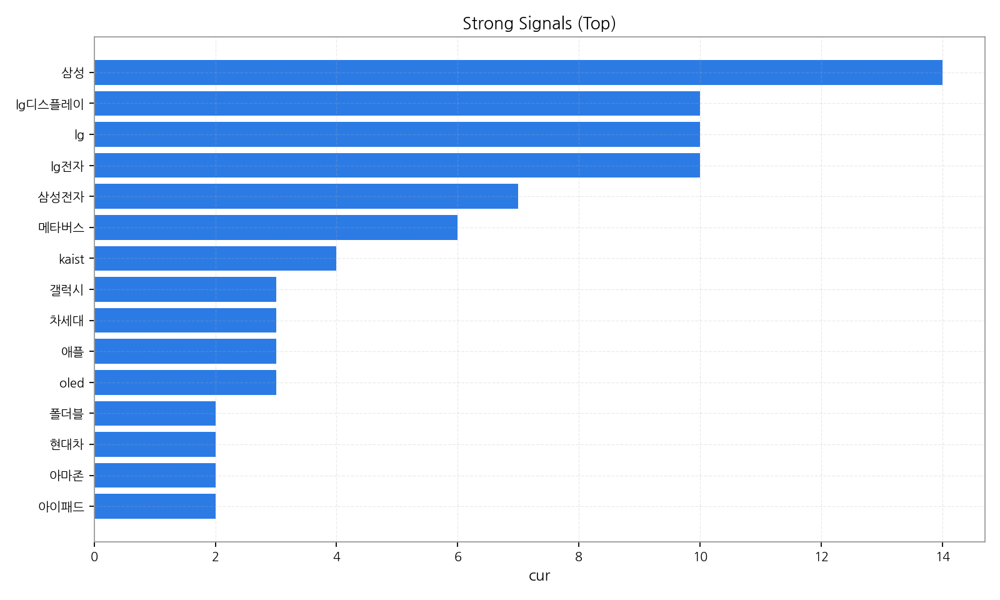

**이번 주 하이라이트**
- ## 데일리 인텔리전스 브리핑 (디스플레이 산업)
- **1. 핵심 맥락**
- *   **AI 디스플레이 기술 경쟁 심화 및 OLED 전환 가속화:** 한국과 중국이 차세대 AI 디스플레이 기술, 특히 핵심 소재 및 반도체 기술을 중심으로 경쟁하고 있습니다 (Topic 0). 동시에 삼성전자를 비롯한 기업들의 OLED TV 시장 투자가 심화되고 있으며, LCD에서 OLED로의 기술 전환이 가속화되고 있습니다 (Topic 4). 이는 AI 기술이 디스플레이 성능 향상에 필수적인 요소로 인식되면서, 기업들이 AI 기술 경쟁력을 확보하고 OLED 시장 선점을 통해 프리미엄 시장을 공략하려는 전략적 움직임으로 해석됩니다.
- *   **OLED 패널 시장 경쟁 심화 및 공급망 변화:** 3분기 아이폰 스마트폰에 사용되는 OLED 패널 출하량 분석 결과, 한국과 중국의 OLED 패널 시장 경쟁이 심화되고 있으며, LG디스플레이가 중요한 역할을 수행하고 있습니다 (Topic 6). 이는 애플을 비롯한 주요 스마트폰 제조사들이 OLED 패널 채택을 확대하면서, 패널 공급망 경쟁이 더욱 치열해지고 있음을 시사합니다. 특히 중국 패널 제조사들의 기술력 향상과 공격적인 투자 확대로 인해 한국 기업들의 경쟁 우위 유지가 중요한 과제가 되고 있습니다.
- *   **ESG 경영 압박 증가 및 친환경 기술 투자 필요성 증대:** 온실가스 배출 감축 노력이 강조되는 가운데, 디스플레이 장비 분야의 배출량 증가가 주목받고 있습니다 (Topic 3). 이는 디스플레이 산업 전반에 걸쳐 ESG 경영의 중요성이 더욱 부각되고 있으며, 친환경적인 생산 공정 및 기술 개발에 대한 투자가 필수적임을 의미합니다. 특히, 탄소 배출량 감축을 위한 기술 혁신은 기업의 지속가능성을 확보하는 데 중요한 요소로 작용할 것입니다.
- **2. 인사이트**
- *   **기회:** AI 기술과 OLED 기술의 융합은 새로운 시장 기회를 창출할 수 있습니다. 특히, 고성능, 저전력, 고화질을 요구하는 프리미엄 디스플레이 시장에서 경쟁 우위를 확보할 수 있습니다. 또한, 폴더블 디스플레이와 같은 혁신적인 폼팩터 개발은 새로운 수요를 창출하고 시장을 확대할 수 있는 기회를 제공합니다.
- *   **위험:** 중국 기업들의 기술력 향상과 공격적인 투자 확대로 인해 한국 기업들의 경쟁 우위가 약화될 수 있습니다. 특히, 정부 지원을 등에 업은 중국 기업들의 저가 공세는 시장 점유율 경쟁을 더욱 심화시킬 수 있습니다. 또한, 글로벌 경기 침체와 수요 감소는 디스플레이 시장의 성장 둔화를 야기할 수 있으며, 이는 기업들의 수익성 악화로 이어질 수 있습니다.
- *   **경쟁 구도:** 디스플레이 시장은 삼성, LG와 같은 한국 기업과 BOE, CSOT와 같은 중국 기업 간의 경쟁이 심화되는 양상입니다. 특히, OLED 시장에서는 기술력과 생산 능력을 바탕으로 시장을 선점하기 위한 경쟁이 치열하게 전개될 것으로 예상됩니다. 또한, 애플, 삼성전자와 같은 주요 스마트폰 제조사들은 패널 공급망 다변화를 통해 협상력을 강화하고 있으며, 이는 패널 제조사들의 수익성에 영향을 미칠 수 있습니다.
- **3. Action Items**
- *   **AI 기반 디스플레이 기술 개발 및 상용화:** AI 기반 화질 개선, 전력 효율 향상, 맞춤형 디스플레이 기술 개발에 집중 투자하고, 이를 OLED, 폴더블 디스플레이 등 차세대 디스플레이 제품에 적용하여 경쟁 우위를 확보해야 합니다.
- *   **OLED 패널 생산 능력 확대 및 공급망 다변화:** OLED 패널 생산 능력을 확대하고, 동시에 핵심 소재 및 부품 공급망을 다변화하여 안정적인 생산 기반을 확보해야 합니다. 특히, 중국 의존도를 낮추고, 한국, 일본, 미국 등 다양한 국가의 기업들과 협력하여 공급망 리스크를 최소화해야 합니다.
- *   **ESG 경영 강화 및 친환경 기술 투자 확대:** 탄소 배출량 감축을 위한 친환경 생산 공정 개발 및 에너지 효율 향상 기술 개발에 적극 투자하고, ESG 경영을 강화하여 기업의 지속가능성을 확보해야 합니다. 또한, 친환경 디스플레이 소재 개발 및 재활용 기술 개발을 통해 환경 규제에 선제적으로 대응해야 합니다.

## 모니터링 스냅샷

### 기사 하이라이트(상위 5)
| 제목                                            | 링크                                                               |
|:----------------------------------------------|:-----------------------------------------------------------------|
| ‘메모리 슈퍼사이클’ 올라탄 삼성전자…“가장 큰 수혜자 될 수도”          | https://www.hani.co.kr/arti/economy/economy_general/1223176.html |
| ‘어닝 서프’ 삼성전자, 3분기 영업이익 12.1조…3년3개월來 최대        | https://biz.heraldcorp.com/article/10592673?ref=naver            |
| 삼성전자, 3분기 영업이익 12조원 '깜짝 반등'···AI 수요 타고 반도체... | https://www.smartfn.co.kr/news/articleView.html?idxno=122453     |
| 삼성전자, 3분기 매출 86조원, 영업이익 12조원 깜짝 실적            | https://www.ziksir.com/news/articleView.html?idxno=107624        |
| 삼성전자, 영업익 '12조원'…반도체 호황에 깜짝 실적                | http://www.yonhapnewstv.co.kr/MYH20251014090810lcO               |

## 핵심 지표 보드

| 기간                      |   총 기사 수 |   문서 수 |   상위 키워드 수 |   토픽 수 |   시계열 일수 |
|:------------------------|---------:|-------:|-----------:|-------:|---------:|
| 2025-09-08 ~ 2025-10-13 |     4038 |      0 |         20 |      8 |       36 |

> 해석 가이드: 전주 대비 증감률을 함께 보아야 변화를 정확히 해석할 수 있습니다.
> 그래서: 문서/기사 수가 급증하면 키워드/토픽 점유 구조가 바뀔 가능성이 큽니다.
> 다음 액션: 이상값이 보이면 타임라인 섹션의 변곡점 주석과 함께 원인을 추적하세요.

## 키워드 인텔리전스

**핵심 요약**
- 상위 키워드 분포와 클러스터를 통해 테마 맥락을 파악합니다.
- 점수 상승과 긍정 감성 결합은 유망 신호입니다.

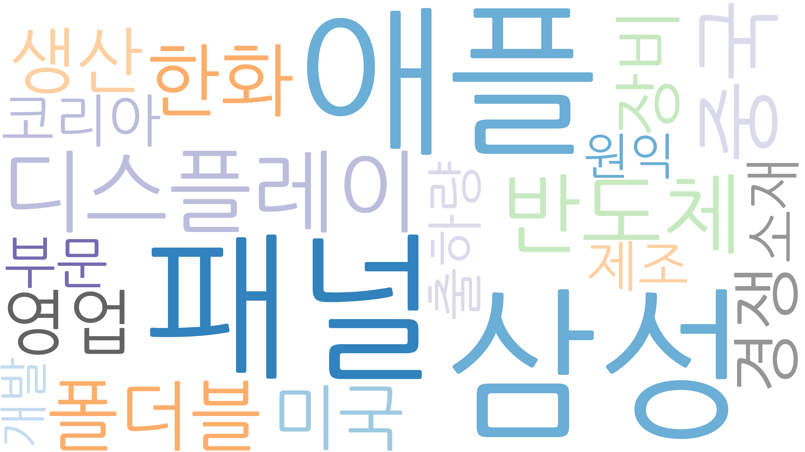
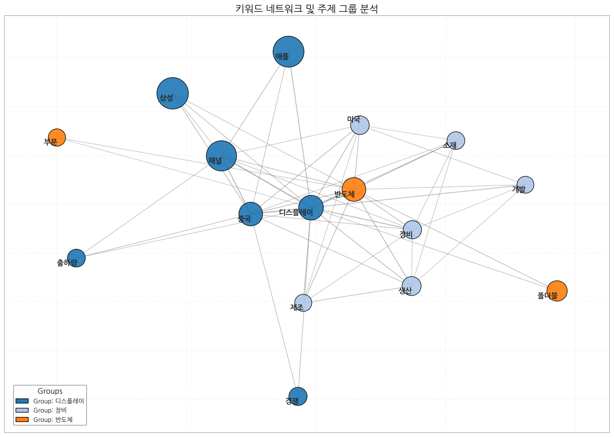
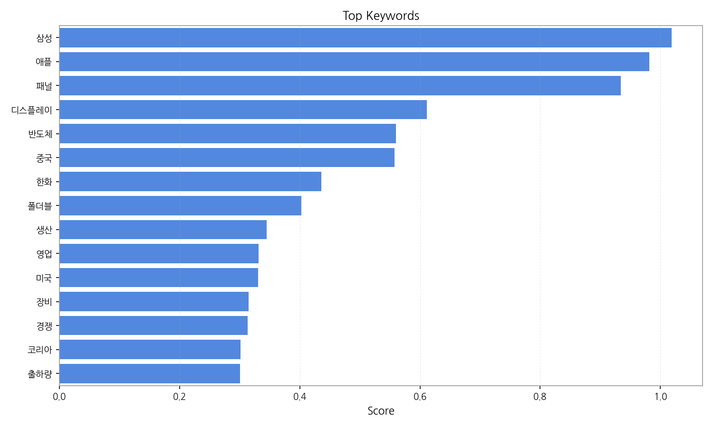

### 상위 키워드 Top 20
|   순위 | 키워드   |    점수 | 변화(참고)   |
|-----:|:------|------:|:---------|
|    1 | 삼성    | 1.019 |          |
|    2 | 애플    | 0.981 |          |
|    3 | 패널    | 0.934 |          |
|    4 | 디스플레이 | 0.611 |          |
|    5 | 반도체   | 0.56  |          |
|    6 | 중국    | 0.558 |          |
|    7 | 한화    | 0.436 |          |
|    8 | 폴더블   | 0.403 |          |
|    9 | 생산    | 0.345 |          |
|   10 | 영업    | 0.331 |          |
|   11 | 미국    | 0.33  |          |
|   12 | 장비    | 0.314 |          |
|   13 | 경쟁    | 0.313 |          |
|   14 | 코리아   | 0.301 |          |
|   15 | 출하량   | 0.3   |          |
|   16 | 소재    | 0.295 |          |
|   17 | 부문    | 0.282 |          |
|   18 | 제조    | 0.271 |          |
|   19 | 원익    | 0.266 |          |
|   20 | 개발    | 0.264 |          |

> 해석 가이드: 클러스터는 규제/정책, 공급망, 수요/고객 등 테마로 해석하면 빠릅니다.
> 그래서: 상위 키워드가 네트워크 허브와 겹치면 시장 영향력이 높은 신호일 가능성이 큽니다.
> 다음 액션: 해당 키워드를 포함한 토픽과 기업 교차점(매트릭스 섹션)을 확인하세요.

## 토픽 레이더

**핵심 요약**
- 관심도(X), 긍정성(Y), 성장률(색상)로 토픽 지형을 한눈에 파악합니다.
- 상위 토픽의 미니 시계열로 모멘텀을 점검합니다.

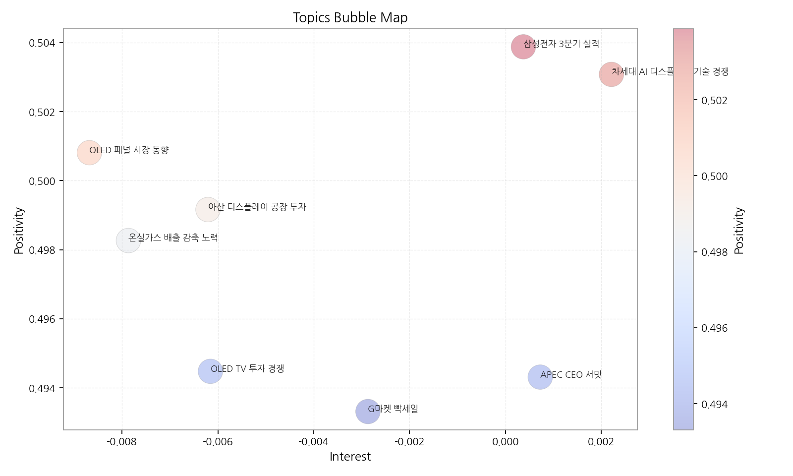
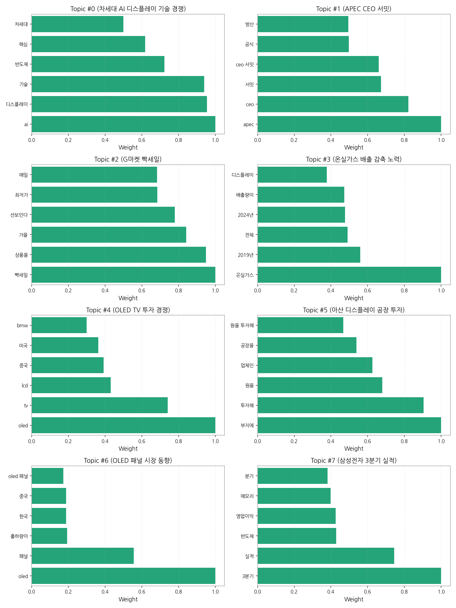

### 토픽 개요
|   topic_id | topic_summary                                                                                                        |
|-----------:|:---------------------------------------------------------------------------------------------------------------------|
|          0 | 한국과 중국이 차세대 AI 디스플레이 기술, 특히 핵심 소재 및 반도체 기술을 중심으로 치열한 경쟁을 벌이는 산업 동향을 다룬 내용입니다.                                        |
|          1 | APEC CEO 서밋을 중심으로 삼성의 AI 기술과 방산 관련 논의를 포함한 정상회의 관련 소식.                                                               |
|          2 | G마켓이 가을을 맞아 패션, 식품, 로봇청소기 등 다양한 상품을 최저가로 매일 선보이는 '빡세일' 행사 관련 뉴스.                                                     |
|          3 | 2019년부터 2024년까지 온실가스 배출량 변화 추이와 감축 노력을 다루며, 특히 디스플레이 장비 분야 배출량 증가에 주목하고 있습니다.                                        |
|          4 | 삼성전자를 비롯한 기업들의 OLED TV 시장 투자 경쟁 심화, 특히 중국과 미국 시장을 중심으로 2025년까지의 매출 성장 및 BMW 관련 투자 가능성을 시사. LCD에서 OLED로의 기술 전환 추세 반영. |
|          5 | 제조업체가 아산 부지에 디스플레이 공장을 건설하기 위해 투자하는 내용입니다.                                                                           |
|          6 | 3분기 아이폰 스마트폰에 사용되는 OLED 패널 출하량에 대한 분석으로, 한국과 중국의 OLED 패널 시장 경쟁 상황과 LG디스플레이의 역할 등을 다룸.                                |
|          7 | 삼성전자의 3분기 실적, 특히 반도체(메모리) 부문의 영업이익 및 매출 변화와 AI 관련 요소를 포함한 분석.                                                        |

> 해석 가이드: 성장률이 높고 긍정성이 유지되는 토픽은 우선 탐색 대상입니다.
> 그래서: 토픽 성장과 기업 진입 변화가 동시에 보이면 시장 전환점일 가능성이 있습니다.
> 다음 액션: 상위 토픽을 기업×토픽 매트릭스에서 교차 확인하고, 기회/리스크로 분기하세요.

## 기업×토픽 매트릭스/히트맵

**핵심 요약**
- 가장 경쟁 치열 토픽: ai, 디스플레이
- 가장 집중도 높은 기업: 삼성전자
- 최고 단일 조합: 삼성전자 × 3분기, 실적

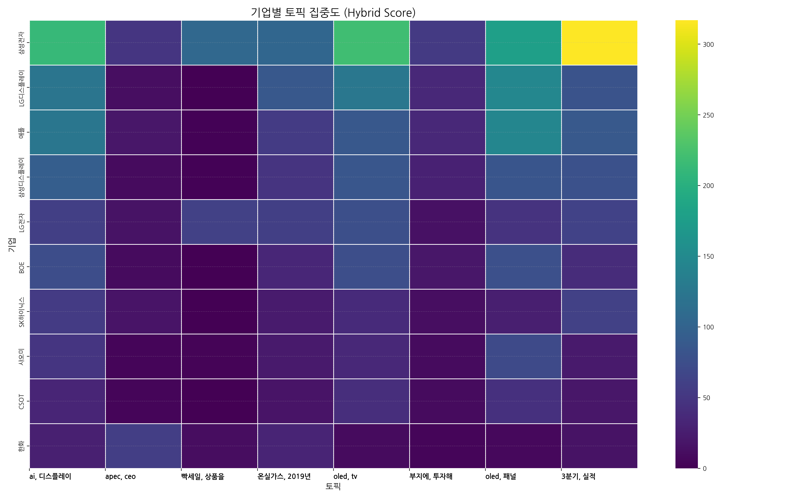
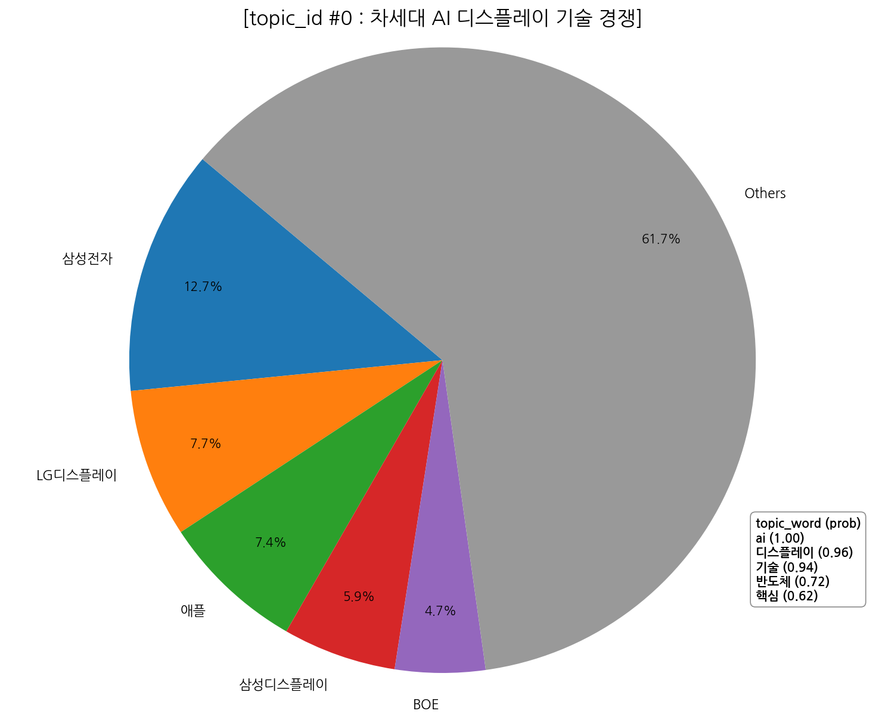
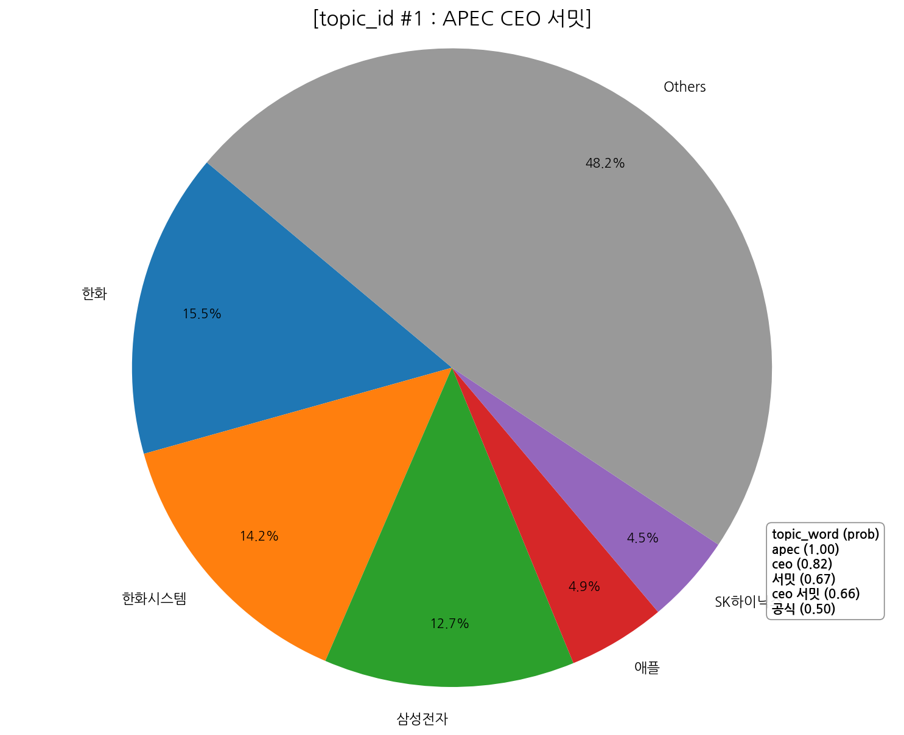
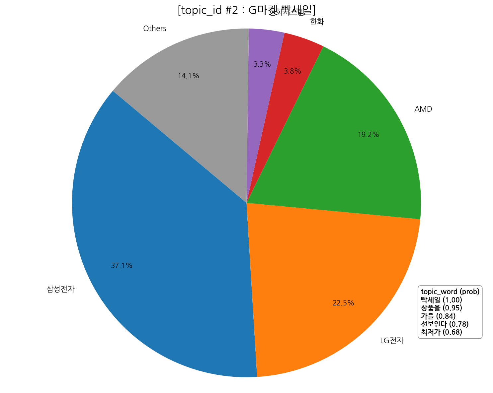
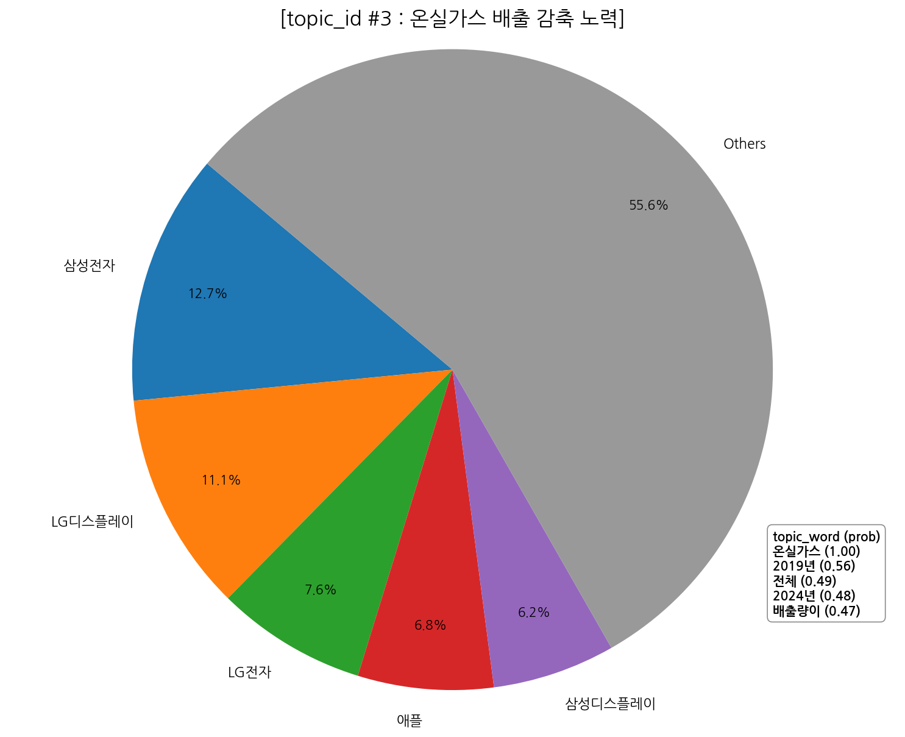
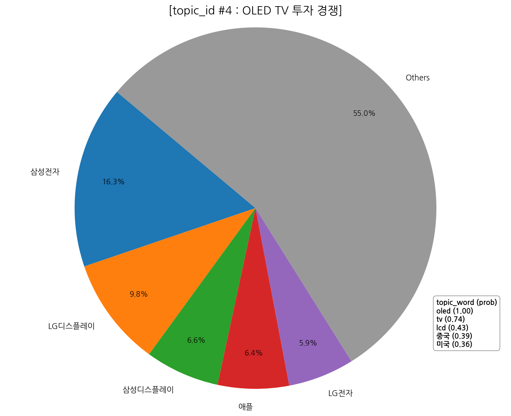
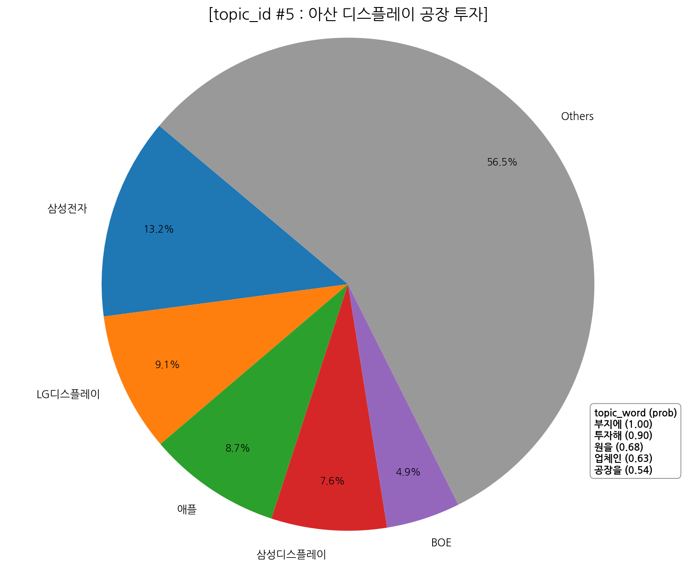
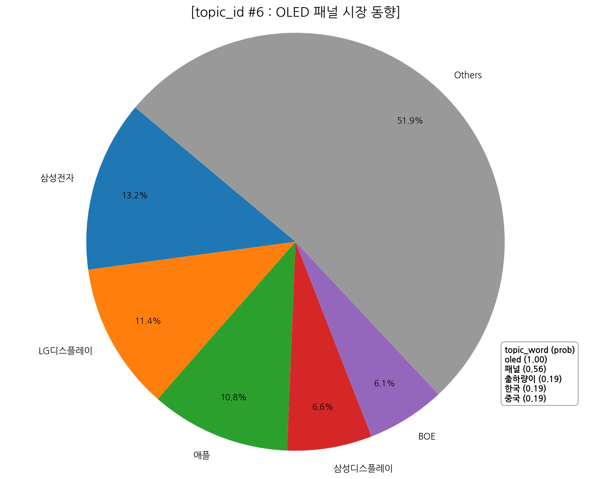
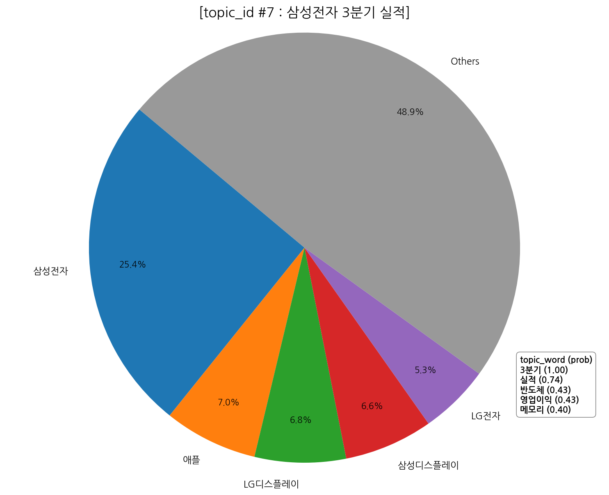
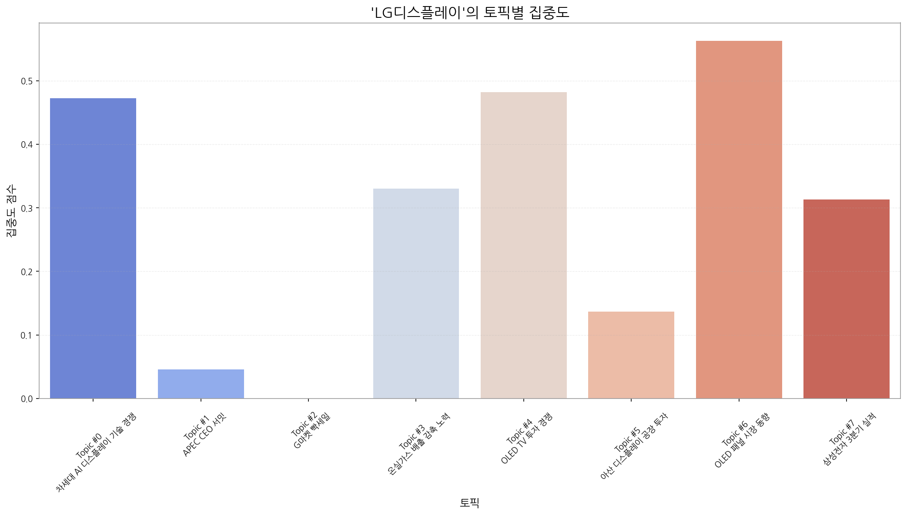
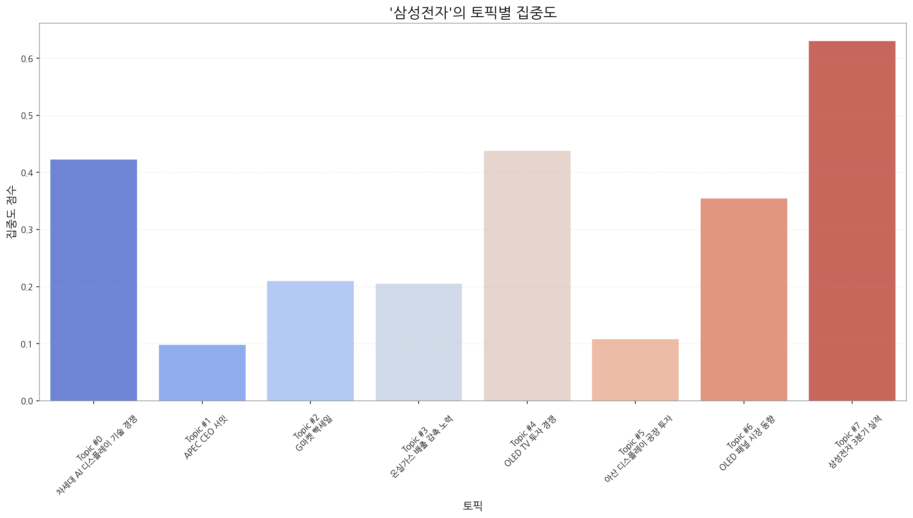
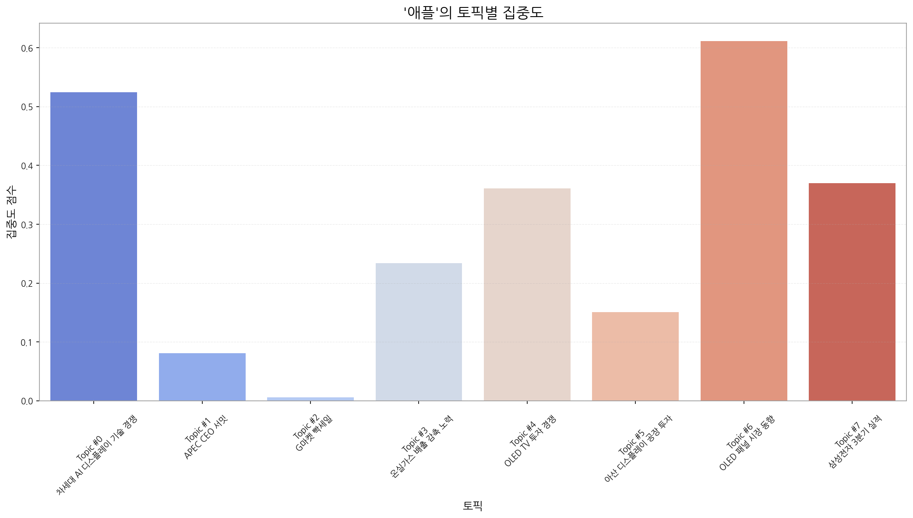

### 매트릭스 표(미리보기)
| org          | topic_0     | topic_1    | topic_2     | topic_3     | topic_4      | topic_5    | topic_6      | topic_7    |
|:-------------|:------------|:-----------|:------------|:------------|:-------------|:-----------|:-------------|:-----------|
| AMD          | 16.64 (1%)  | 7.93 (2%)  | 52.01 (19%) | 4.29 (1%)   | 16.46 (1%)   | 4.54 (1%)  | 13.17 (1%)   | 31.81 (3%) |
| AUO          | 28.42 (2%)  | 3.17 (1%)  | nan         | 8.59 (1%)   | 19.32 (2%)   | 9.84 (3%)  | 10.24 (1%)   | 11.83 (1%) |
| BMW          | 11.09 (1%)  | 1.59 (0%)  | nan         | 5.72 (1%)   | 10.02 (1%)   | 3.03 (1%)  | 2.19 (0%)    | 2.22 (0%)  |
| BOE          | 74.17 (5%)  | 9.52 (3%)  | nan         | 34.35 (4%)  | 75.14 (6%)   | 18.92 (5%) | 77.54 (6%)   | 39.20 (3%) |
| BYD          | 8.32 (1%)   | 2.38 (1%)  | 2.54 (1%)   | 3.58 (0%)   | 8.59 (1%)    | 2.27 (1%)  | 5.85 (0%)    | 2.22 (0%)  |
| CES          | nan         | nan        | 2.54 (1%)   | 0.72 (0%)   | nan          | nan        | nan          | 0.74 (0%)  |
| CSOT         | 32.58 (2%)  | 3.97 (1%)  | nan         | 17.17 (2%)  | 41.51 (3%)   | 9.08 (2%)  | 43.89 (3%)   | 19.23 (2%) |
| Counterpoint | 0.69 (0%)   | 2.38 (1%)  | nan         | nan         | nan          | nan        | nan          | 0.74 (0%)  |
| ETRI         | 1.39 (0%)   | nan        | nan         | nan         | nan          | nan        | nan          | nan        |
| HP           | 0.69 (0%)   | nan        | nan         | 0.72 (0%)   | 1.43 (0%)    | nan        | 1.46 (0%)    | 0.74 (0%)  |
| Harman       | 4.85 (0%)   | 1.59 (0%)  | nan         | 4.29 (1%)   | 4.29 (0%)    | 1.51 (0%)  | 4.39 (0%)    | 11.10 (1%) |
| IEEE         | 6.93 (0%)   | 1.59 (0%)  | nan         | 0.72 (0%)   | 2.86 (0%)    | nan        | 2.93 (0%)    | 1.48 (0%)  |
| Innolux      | 29.11 (2%)  | 3.17 (1%)  | 2.54 (1%)   | 15.74 (2%)  | 22.90 (2%)   | 12.11 (3%) | 12.43 (1%)   | 10.36 (1%) |
| IoT          | 13.17 (1%)  | 1.59 (0%)  | 1.27 (0%)   | 6.44 (1%)   | 11.45 (1%)   | 3.03 (1%)  | 4.39 (0%)    | 3.70 (0%)  |
| JDI          | 13.17 (1%)  | 0.79 (0%)  | nan         | 2.86 (0%)   | 10.73 (1%)   | 3.78 (1%)  | 13.90 (1%)   | 9.62 (1%)  |
| LG디스플레이      | 122.69 (8%) | 11.90 (3%) | nan         | 85.87 (11%) | 125.23 (10%) | 35.56 (9%) | 146.29 (11%) | 81.36 (7%) |
| LG전자         | 58.22 (4%)  | 15.86 (4%) | 60.89 (23%) | 58.68 (8%)  | 75.86 (6%)   | 14.38 (4%) | 46.08 (4%)   | 62.87 (5%) |
| LG화학         | 24.26 (2%)  | 0.79 (0%)  | nan         | 10.02 (1%)  | 5.72 (0%)    | 5.30 (1%)  | 4.39 (0%)    | 7.40 (1%)  |
| Nitto        | 0.69 (0%)   | nan        | nan         | 0.72 (0%)   | 1.43 (0%)    | 0.76 (0%)  | nan          | 1.48 (0%)  |
| SID          | 3.47 (0%)   | nan        | 1.27 (0%)   | 1.43 (0%)   | 0.72 (0%)    | 0.76 (0%)  | 0.73 (0%)    | 0.74 (0%)  |

> 해석 가이드: 히트맵에서 진한 교차지점은 전략 초점을 의미합니다. 점수는 소스 커버리지에 민감합니다.
> 그래서: 경쟁 치열 토픽에서의 점유율 변화는 공격/수비 전략 신호일 수 있습니다.
> 다음 액션: 상위 기업과 토픽 교차를 기회 섹션으로 연결하고, 파트너/경쟁사 움직임을 추적하세요.

## 관계·경쟁 네트워크

**핵심 요약**
- 관계망 규모: 노드 39개 / 엣지 86개
- 가장 강한 관계: 삼성전자 ↔ 애플 (가중치 36, 유형 rivalry)
- 허브 후보: 삼성전자 (Degree 0.6053)
- 브로커 후보: 삼성전자 (Betweenness 0.3185)

### 상위 관계쌍(Edge)
동일 문서/문장에서 함께 언급된 기업 쌍이며, 가중치는 동시출현 빈도입니다. 유형은 규칙 기반 추정입니다.

| Source   | Target   |   Weight | Type        |
|:---------|:---------|---------:|:------------|
| 삼성전자     | 애플       |       36 | rivalry     |
| 삼성디스플레이  | 삼성전자     |       26 | rivalry     |
| 삼성디스플레이  | 애플       |       22 | rivalry     |
| 샤오미      | 애플       |       13 | partnership |
| 한화       | 한화시스템    |       10 | rivalry     |
| 삼성전자     | 엔비디아     |       10 | partnership |
| 삼성전자     | 샤오미      |       10 | neutral     |
| 메타       | 애플       |       10 | rivalry     |
| 마이크로소프트  | 한화시스템    |       10 | rivalry     |
| 마이크로소프트  | 한화       |       10 | rivalry     |

### 중심성 상위(연결 허브)
Degree 중심성은 연결된 상대 수의 비율입니다. 높을수록 허브 성격.

| Org     |   DegreeCentrality |
|:--------|-------------------:|
| 삼성전자    |             0.6053 |
| 애플      |             0.4211 |
| 샤오미     |             0.3421 |
| 구글      |             0.2632 |
| 메타      |             0.2368 |
| 삼성디스플레이 |             0.2368 |
| 마이크로소프트 |             0.2105 |
| 엔비디아    |             0.2105 |
| 퀄컴      |             0.1842 |
| 비보      |             0.1579 |

### 매개 중심성 상위(정보 브로커)
Betweenness는 집단 간 ‘다리’ 역할 정도입니다. 높을수록 중개자 성격.

| Org     |   Betweenness |
|:--------|--------------:|
| 삼성전자    |        0.3185 |
| 애플      |        0.1159 |
| 마이크로소프트 |        0.0916 |
| 샤오미     |        0.0491 |
| 메타      |        0.0484 |
| 선익시스템   |        0.0427 |
| 구글      |        0.0336 |
| 퀄컴      |        0.0333 |
| 엔비디아    |        0.0221 |
| 현대자동차   |        0.0217 |

### 커뮤니티(관계 클러스터)
> 모듈러리티 기반 자동 추출 집단. 같은 집단 내 기업은 유사 주제/밸류체인 공유 가능성.
- C0: 기아자동차, 네이버, 디지타임스, 미디어텍, 비보, 삼성디스플레이 | 해석: 기아자동차 중심의 연관 클러스터
- C1: 구글, 메타, 샤오미, 샤오펑, 선익시스템, 소니 | 해석: 구글 중심의 연관 클러스터
- C2: 기아, 퀄컴, 현대모비스, 현대자동차, 현대차 | 해석: 기아 중심의 연관 클러스터
- C3: 마이크로소프트, 알파벳, 한화, 한화시스템 | 해석: 마이크로소프트 중심의 연관 클러스터
- C4: 아마존, 엔비디아, 인텔 | 해석: 아마존 중심의 연관 클러스터

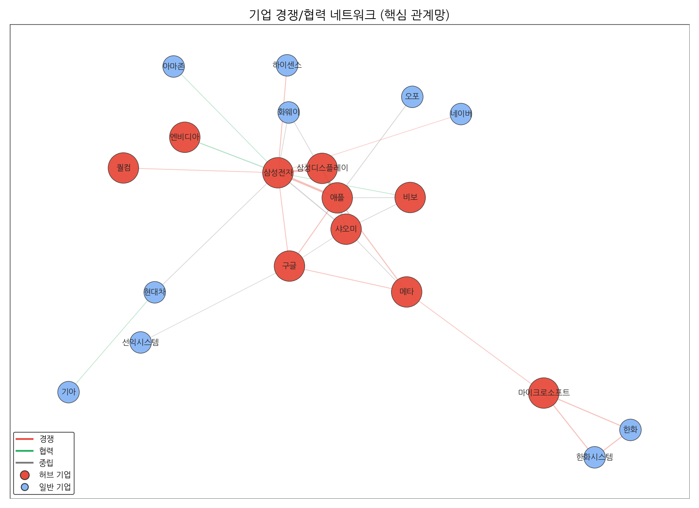

> 해석 가이드: 동시출현이 높은 쌍은 경쟁/협력 가능성을 시사합니다.
> 그래서: 허브/브로커 포지션은 영향력/협상력을 가리킵니다.
> 다음 액션: 커뮤니티별 주요 토픽/키워드와 교차하여 전략 단위를 정의하세요.

## 트렌드 타임라인

**핵심 요약**
- 기간: 2025-09-08 ~ 2025-10-13
- 총 기사 수: 4,038
- 일별 기사 수와 7일 이동평균, 변곡점을 주석으로 표시합니다.

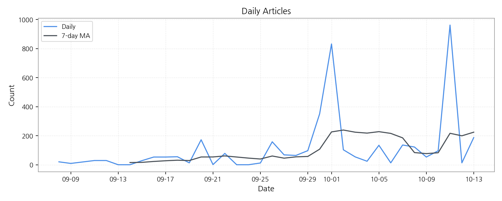

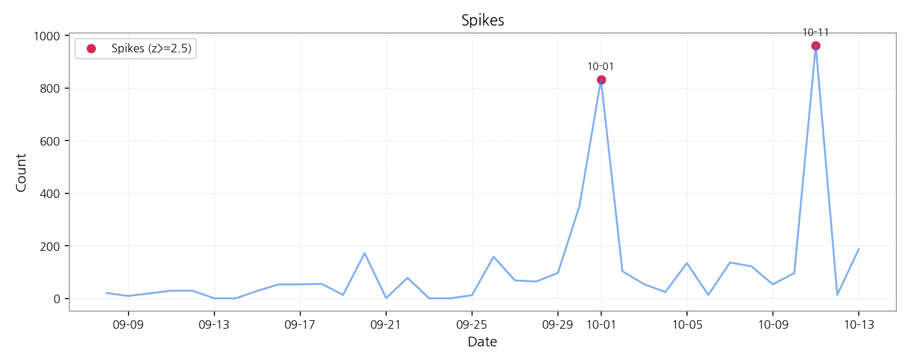

### 스파이크/이벤트 목록
| date       |   count |       z |
|:-----------|--------:|--------:|
| 2025-10-01 |     832 | 3.48674 |
| 2025-10-11 |     962 | 4.11644 |

> 해석 가이드: 단기 급등은 이벤트성 가능성이 있으니 2주 추세를 함께 보세요.
> 그래서: 스파이크 이후 토픽/신호 방향을 교차 확인하면 원인 파악이 빨라집니다.
> 다음 액션: 스파이크 날짜의 주요 기사와 키워드 변동을 키워드/토픽 섹션에서 재확인하세요.

## 시그널 보드(강한/약한 신호)

### 강한 신호(Strong Signals)

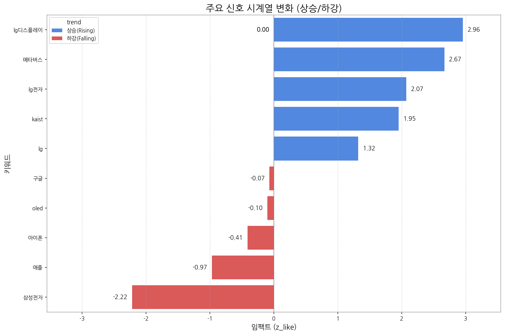

| term    |   cur |   z_like |   prev |   diff |    ma7 |   total |
|:--------|------:|---------:|-------:|-------:|-------:|--------:|
| lg디스플레이 |    10 |    2.959 |      1 |      9 |  2.429 |      79 |
| 메타버스    |     6 |    2.67  |      0 |      6 |  0.857 |       8 |
| lg전자    |    10 |    2.073 |      0 |     10 |  3.857 |      48 |
| kaist   |     4 |    1.953 |      0 |      4 |  0.571 |       4 |
| lg      |    10 |    1.318 |      3 |      7 |  5.571 |     274 |
| 아마존     |     2 |    1.117 |      0 |      2 |  0.286 |       5 |
| 차세대     |     3 |    1.113 |      0 |      3 |  0.857 |      42 |
| 비전프로    |     2 |    0.95  |      0 |      2 |  0.429 |       5 |
| 맥북      |     2 |    0.814 |      0 |      2 |  0.571 |      11 |
| 아이패드    |     2 |    0.814 |      1 |      1 |  0.571 |       9 |
| tcl     |     1 |    0.622 |      0 |      1 |  0.143 |       1 |
| 갤럭시     |     3 |    0.557 |      0 |      3 |  1.714 |      31 |
| 삼성      |    14 |    0.448 |      4 |     10 | 12     |     376 |
| 공급망     |     1 |    0.345 |      0 |      1 |  0.429 |       7 |
| 현대차     |     2 |    0.124 |      1 |      1 |  1.714 |      30 |
| 폴더블     |     2 |    0.06  |      0 |      2 |  1.857 |      29 |
| tsmc    |     1 |   -0.069 |      0 |      1 |  1.143 |      18 |
| 구글      |     1 |   -0.069 |      0 |      1 |  1.143 |      17 |
| oled    |     3 |   -0.102 |      3 |      0 |  3.286 |     136 |
| 아이폰     |     1 |   -0.414 |      0 |      1 |  2     |      29 |

### 약한 신호(Weak/Emerging Signals)
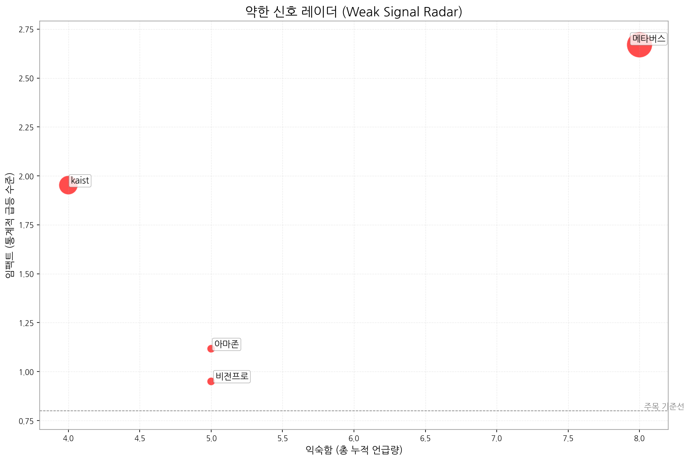

| 약한 신호   | 지표(cur / z_like)   | 해석(1줄)                                                                                                                         |
|:--------|:-------------------|:-------------------------------------------------------------------------------------------------------------------------------|
| 메타버스    | 6 / 2.67           | 메타버스는 전자부품 수요처 확장, 스마트 기술 융합, XR 시장의 실용적 재부상 등 다양한 산업 분야에서 AI, 스마트 기기, 디지털 소비와 함께 거론되며 미래 기술 및 산업 전반에 걸쳐 잠재력을 지닌 새로운 기술 트렌드이다. |
| kaist   | 4 / 1.953          | KAIST(한국과학기술원) 관련 기술, 연구, 인력 등이 미래 기술 혁신의 약한 신호로 포착되었으며, 특히 AI, 반도체, 바이오 등 첨단 분야에서 두각을 나타내며 미래 기술 경쟁력 강화에 기여할 잠재력을 지닌다.        |
| 아마존     | 2 / 1.117          | 아마존은 자체 AI 칩 개발 및 AI 투자 확대를 통해 AI 반도체 시장에서 삼성전자의 주요 고객사이자 엔비디아의 잠재적 경쟁자로 부상하고 있으며, 제프 베이조스의 발언처럼 AI 투자에 대한 긍정적 전망을 내비치고 있다.    |
| 비전프로    | 2 / 0.95           | -                                                                                                                              |

> 해석 가이드: 약한 신호는 가속도·이례성이 핵심이고, 강한 신호는 현재 주목도의 절대값입니다.
> 그래서: 약한→강한 신호로 전환하는 구간이 가장 좋은 기회가 됩니다.
> 다음 액션: 상위 신호 5개를 2주간 추적하고, 토픽/기업 매트릭스와 교차 검증하세요.

## 기술 성숙도 맵

**핵심 요약**
- 관심도(X), 긍정성(Y), 버블(사업 활발도)로 기술의 위치를 표현합니다.
- 단계: Seed/Early/Growth/Mature/Legacy

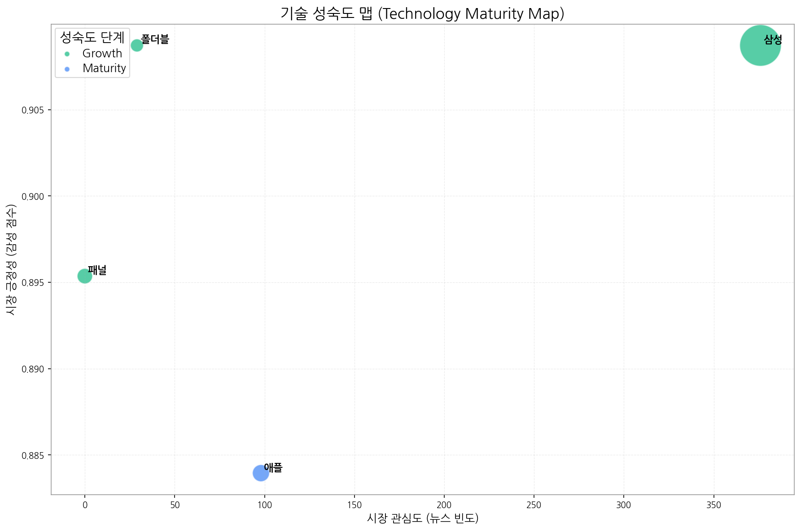

| 기술   | 단계       | 판단 근거                                                                   |
|:-----|:---------|:------------------------------------------------------------------------|
| 패널   | Growth   | 뉴스 언급은 없지만 긍정적 시장 감성과 출시 및 투자가 활발하게 이루어지는 것으로 보아 성장기에 진입한 기술로 판단됩니다.    |
| 애플   | Maturity | 높은 뉴스 언급 빈도와 긍정적인 시장 감성, 꾸준한 출시 이벤트 발생은 애플 기술이 성숙기에 진입했음을 시사합니다.        |
| 삼성   | Growth   | 높은 시장 감성 점수와 활발한 투자, 출시, 수주 이벤트 발생 비율을 고려할 때 삼성 기술은 성장기에 있다고 판단됩니다.     |
| 폴더블  | Growth   | 높은 시장 감성 점수와 꾸준한 출시, 투자, 수주 이벤트 발생은 폴더블 기술이 초기 단계를 지나 성장기에 진입했음을 시사합니다. |

> 해석 가이드: Growth 구간이면서 강한 신호 결합 시 유망합니다.
> 그래서: Early라도 약한 신호가 누적되면 전환 후보입니다.
> 다음 액션: 상위 기술 3개를 기회 섹션과 연결하고 파일럿 과제를 정의하세요.

## 비즈니스 기회(Top 5)

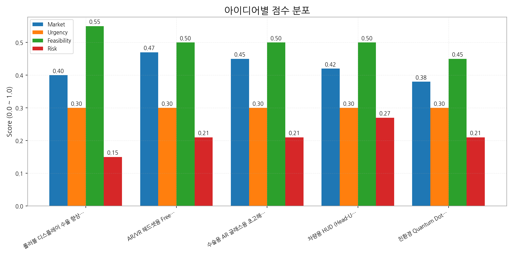

| 아이디어                                            | 타깃                          | 가치제안                                                                                                                                                                            | 점수(시장/긴급/실행/리스크)         |
|:------------------------------------------------|:----------------------------|:--------------------------------------------------------------------------------------------------------------------------------------------------------------------------------|:-------------------------|
| 롤러블 디스플레이 수율 향상을 위한 AI 기반 공정 이상 감지 시스템          | 자사 롤러블 디스플레이 생산 라인          | AI 기반 공정 이상 감지 시스템은 실시간으로 공정 데이터를 분석하여 미세한 결함을 조기에 감지하고, 공정 변수를 자동 조정하여 수율을 20% 향상시킵니다. 불량 발생 원인을 신속하게 파악하여 문제 해결 시간을 단축하고, 생산 비용을 절감합니다. 데이터 기반 의사 결정을 통해 공정 효율성을 극대화합니다.      | 3.4 (0.4/0.3/0.55/0.15)  |
| AR/VR 헤드셋용 Freeform OLED on Silicon (OLEDoS) 패널 | 북미 빅테크 기업 (AR/VR 헤드셋 개발사)   | Freeform OLEDoS 패널은 기존 디스플레이 대비 50% 가벼우며, 4K 해상도와 120도 시야각을 제공하여 몰입감 있는 AR/VR 경험을 제공합니다. 자유로운 디자인으로 헤드셋 디자인 자유도를 높이며, 낮은 소비 전력으로 배터리 사용 시간을 연장합니다. 초고속 응답 속도로 모션 블러 현상을 최소화합니다. | 3.3 (0.47/0.3/0.5/0.21)  |
| 수술용 AR 글래스용 초고해상도 Micro-OLED 패널                 | 글로벌 의료기기 제조사 (AR 글래스 개발사)   | 10,000 PPI 초고해상도 Micro-OLED 패널로, AR 이미지의 선명도를 극대화하고 몰입감 있는 수술 환경을 제공합니다. 낮은 소비 전력으로 장시간 사용이 가능하며, 콤팩트한 사이즈로 AR 글래스 디자인 자유도를 높입니다. 기존 대비 30% 향상된 색재현율로 더욱 정확한 색상 정보를 제공합니다.      | 3.3 (0.45/0.3/0.5/0.21)  |
| 차량용 HUD (Head-Up Display) 투명 MicroLED 패널        | 글로벌 완성차 OEM (Tier 1 부품사 포함) | 90% 투명도, 10,000nit 휘도, 넓은 시야각을 제공하는 MicroLED HUD 패널로, 운전자의 안전과 편의성을 극대화하고 AR HUD 구현을 가능하게 합니다. 기존 LCD 대비 50% 낮은 전력 소비로 차량 배터리 부담을 줄이며, 10만 시간 이상의 수명으로 내구성을 보장합니다.              | 2.9 (0.42/0.3/0.5/0.27)  |
| 친환경 Quantum Dot Color Filter (QDCF) 개발 및 공정 적용  | 글로벌 TV 제조사, 모니터 제조사         | 카드뮴 프리 Quantum Dot 소재를 사용하여 제작된 QDCF는 기존 컬러 필터 대비 30% 높은 색재현율을 제공하며, 유해 물질 배출량을 50% 감소시킵니다. 기존 LCD 생산 라인에 적용 가능하며, 공정 변경 비용을 최소화합니다. 에너지 효율 향상으로 디스플레이 소비 전력을 절감합니다.            | 2.9 (0.38/0.3/0.45/0.21) |

> 해석 가이드: 점수는 내부 가중치 기반(예: Market 0.35, Urgency 0.25, Feasibility 0.25, Risk -0.15).
> 그래서: 상위안은 단기 임팩트/실행 가능성이 높은 편입니다.
> 다음 액션: 각 아이디어에 대해 2주 파일럿(가설·대상·KPI)을 정의하고 담당 오너를 배정하세요.

## 리스크/이슈 관측소

- (리스크/이슈 데이터 없음)

> 해석 가이드: 부정 감성 급등은 PR·컴플라이언스·조달과 연계가 필요합니다.
> 그래서: 공급망 키워드와 동반 급등 시 실제 운영 리스크로 이어질 수 있습니다.
> 다음 액션: 영향범위가 큰 이슈는 즉시 리스크 레지스터에 등록하고 완화 액션을 실행하세요.

## 결론: So What & Next Steps

### 다음 2주 실행안(템플릿)
| hypothesis          | target         | kpi               | owner   | due        |
|:--------------------|:---------------|:------------------|:--------|:-----------|
| 토픽 A 관심도↑는 고객 니즈 증가 | SMB 고객 20명 인터뷰 | 응답률 30%/신규 리드 10건 | 사업개발팀   | 2025-10-28 |

> 해석 가이드: 데이터-인사이트-액션의 연결을 표준 템플릿으로 기록하세요.
> 그래서: 우선순위 상위 안건부터 빠르게 실험해야 기회를 놓치지 않습니다.
> 다음 액션: 오너/기한/KPI가 명확한 항목부터 킥오프하세요.

## 부록(Appendix)

분석의 투명성을 확보하고, 다음 단계 분석을 위한 원천 자료를 제공합니다.

### 데이터 메타
| 파일                             | 수정시각                |   크기(bytes) |
|:-------------------------------|:--------------------|------------:|
| outputs/keywords.json          | 2025-10-14 00:57:07 |        1526 |
| outputs/topics.json            | 2025-10-14 00:57:25 |        9408 |
| outputs/trend_timeseries.json  | 2025-10-14 00:57:09 |        2147 |
| outputs/trend_insights.json    | 2025-10-14 00:57:34 |        7816 |
| outputs/biz_opportunities.json | 2025-10-14 00:58:35 |       27795 |
| outputs/tech_maturity.json     | 2025-10-14 00:58:08 |        2121 |
| outputs/company_network.json   | 2025-10-14 00:58:17 |       17799 |

> 해석 가이드: 재현성과 감사추적을 위해 생성일, 버전, 파라미터를 함께 보관하세요.
> 그래서: 데이터 출처와 가공 과정을 명확히 남기면 신뢰성이 높아집니다.
> 다음 액션: 주요 이미지/표 생성 실패 로그도 추적 테이블로 남겨두세요.
