## Intellegence Report (2025-10-14)

**핵심 요약**
- 기간: 2025-09-08 ~ 2025-10-13
- 기사 수: 3,112
- 토픽 수: 4 | 상위 키워드: 20

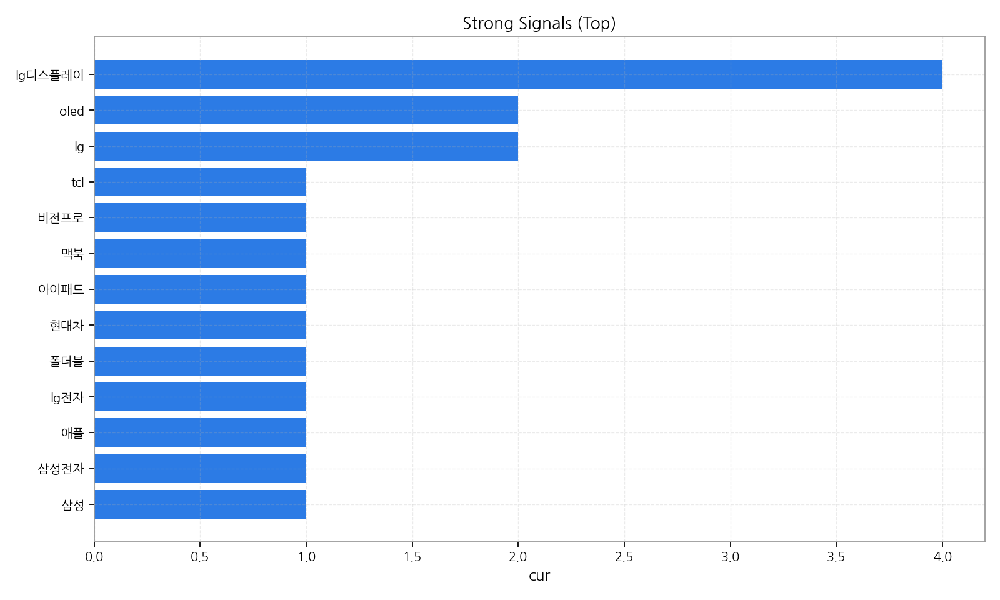

**이번 주 하이라이트**
- ## 데일리 인텔리전스 브리핑 (디스플레이 산업)
- **1. 핵심 맥락**
- *   **맥락 1: ICT 수출 호조와 디스플레이 산업의 기회:** 반도체 수출 증가를 포함한 ICT 전반의 수출 호조는 디스플레이 산업에 긍정적인 신호입니다. 특히, 스마트폰, 컴퓨터 등 ICT 제품의 수요 증가는 고화질 디스플레이 패널에 대한 수요 증가로 이어질 수 있습니다. 애플, 삼성 등 주요 스마트폰 제조사의 신제품 출시와 맞물려 프리미엄 디스플레이 시장의 성장이 기대됩니다.
- *   **맥락 2: OLED AI 반도체 경쟁 심화와 기술 혁신의 필요성:** 한국 OLED 디스플레이와 AI 반도체 기술을 중심으로 중국과의 경쟁이 심화되고 있습니다. 이는 TV 패널 시장의 핵심 이슈로 부상하고 있으며, 기술 우위 확보를 위한 투자가 더욱 중요해지고 있습니다. 특히, AI 반도체 기술은 디스플레이 성능 향상뿐 아니라 새로운 기능 및 사용자 경험 제공에 필수적이므로 경쟁력 강화가 시급합니다.
- *   **맥락 3: 4K 방송용 카메라 출시와 고화질 디스플레이 시장 확대:** 4K 방송용 카메라의 출시와 세로형 영상 촬영 지원은 고화질 콘텐츠 제작 및 소비 증가를 촉진할 것입니다. 이는 고화질 디스플레이에 대한 수요를 증가시키고, 특히 전문가용 디스플레이 시장의 성장을 견인할 수 있습니다.
- **2. 인사이트**
- *   **기회:** ICT 수출 호조와 프리미엄 스마트폰 시장의 성장은 고부가 가치 디스플레이 패널 시장 확대의 기회를 제공합니다. 특히, 폴더블, 롤러블 등 혁신적인 폼팩터 디스플레이 기술 개발을 통해 시장 경쟁력을 강화할 수 있습니다.
- *   **위험:** 중국의 OLED 기술 추격과 AI 반도체 기술 경쟁 심화는 한국 디스플레이 산업의 장기적인 경쟁력에 위협 요인으로 작용합니다. 특허 분쟁 가능성 또한 간과할 수 없는 위험 요소입니다.
- *   **경쟁 구도:** 삼성, LG 등 기존 디스플레이 강자 외에 중국 기업들의 시장 점유율 확대 시도가 거세질 것으로 예상됩니다. AI 반도체 기술 경쟁력 확보 여부가 디스플레이 시장의 판도를 바꿀 수 있는 핵심 변수가 될 것입니다.
- **3. Action Items**
- *   **전략:**
- *   **프리미엄 시장 집중 및 차별화 전략 강화:** 폴더블, 롤러블 등 혁신적인 폼팩터 디스플레이 기술 개발 및 상용화에 집중 투자하여 프리미엄 시장에서 경쟁 우위를 확보합니다.
- *   **사업 개발:**
- *   **AI 반도체 기술 협력 및 투자 확대:** AI 반도체 스타트업과의 협력 또는 지분 투자를 통해 디스플레이 성능 향상 및 새로운 기능 구현을 위한 기술 경쟁력을 강화합니다.
- *   **기술 기획:**
- *   **차세대 디스플레이 기술 로드맵 수립:** 마이크로 LED, 양자점(QD) 디스플레이 등 차세대 디스플레이 기술 개발 로드맵을 수립하고, 핵심 기술 확보를 위한 연구 개발 투자를 확대합니다.

## 모니터링 스냅샷

### 기사 하이라이트(상위 5)
| 제목                                           | 링크                                                                  |
|:---------------------------------------------|:--------------------------------------------------------------------|
| 삼성전자의 부활… 역대 최대 분기 매출로 영업익 12조원 돌파           | https://www.greenpostkorea.co.kr/news/articleView.html?idxno=304363 |
| LGD·에코프로비엠·호텔신라…3분기 실적 개선 기대株 뜬다             | https://www.hankyung.com/article/2025101481961                      |
| 9월 ICT 수출, 반도체 호조세에 역대 최대 실적 달성···14.0%↑     | http://www.todaykorea.co.kr/news/articleView.html?idxno=335341      |
| 삼성전자는 '깜짝실적'·LG전자는 '주춤'…희비 엇갈린 3분기 실적        | https://it.chosun.com/news/articleView.html?idxno=2023092148850     |
| 9월 ICT 수출, 254억달러 '사상 최대'···반도체 2개월 연속 역대 실적 | http://www.enewstoday.co.kr/news/articleView.html?idxno=2339751     |

## 핵심 지표 보드

| 기간                      |   총 기사 수 |   문서 수 |   상위 키워드 수 |   토픽 수 |   시계열 일수 |
|:------------------------|---------:|-------:|-----------:|-------:|---------:|
| 2025-09-08 ~ 2025-10-13 |     3112 |      0 |         20 |      4 |       36 |

> 해석 가이드: 전주 대비 증감률을 함께 보아야 변화를 정확히 해석할 수 있습니다.
> 그래서: 문서/기사 수가 급증하면 키워드/토픽 점유 구조가 바뀔 가능성이 큽니다.
> 다음 액션: 이상값이 보이면 타임라인 섹션의 변곡점 주석과 함께 원인을 추적하세요.

## 키워드 인텔리전스

**핵심 요약**
- 상위 키워드 분포와 클러스터를 통해 테마 맥락을 파악합니다.
- 점수 상승과 긍정 감성 결합은 유망 신호입니다.

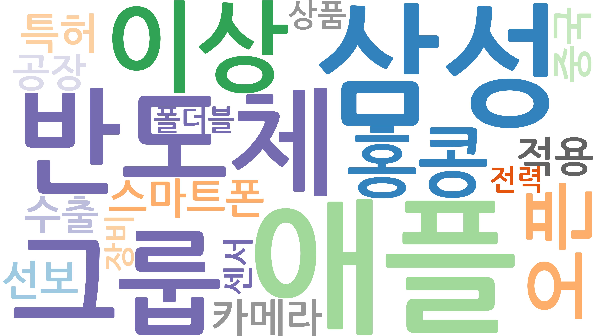
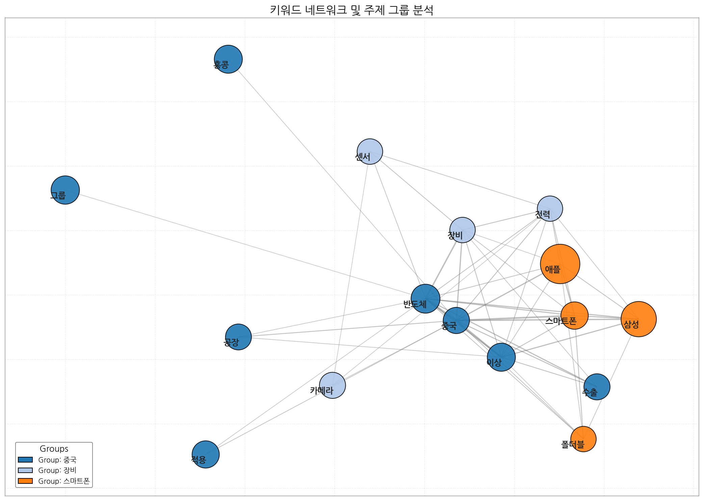
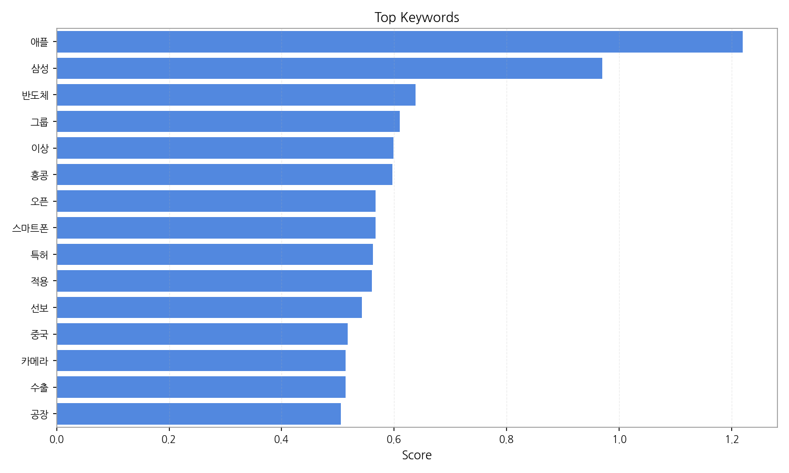

### 상위 키워드 Top 20
|   순위 | 키워드   |    점수 | 변화(참고)   |
|-----:|:------|------:|:---------|
|    1 | 애플    | 1.22  |          |
|    2 | 삼성    | 0.97  |          |
|    3 | 반도체   | 0.638 |          |
|    4 | 그룹    | 0.61  |          |
|    5 | 이상    | 0.599 |          |
|    6 | 홍콩    | 0.597 |          |
|    7 | 오픈    | 0.567 |          |
|    8 | 스마트폰  | 0.567 |          |
|    9 | 특허    | 0.562 |          |
|   10 | 적용    | 0.561 |          |
|   11 | 선보    | 0.542 |          |
|   12 | 중국    | 0.518 |          |
|   13 | 카메라   | 0.514 |          |
|   14 | 수출    | 0.513 |          |
|   15 | 공장    | 0.505 |          |
|   16 | 상품    | 0.492 |          |
|   17 | 센서    | 0.491 |          |
|   18 | 장비    | 0.487 |          |
|   19 | 폴더블   | 0.486 |          |
|   20 | 전력    | 0.482 |          |

> 해석 가이드: 클러스터는 규제/정책, 공급망, 수요/고객 등 테마로 해석하면 빠릅니다.
> 그래서: 상위 키워드가 네트워크 허브와 겹치면 시장 영향력이 높은 신호일 가능성이 큽니다.
> 다음 액션: 해당 키워드를 포함한 토픽과 기업 교차점(매트릭스 섹션)을 확인하세요.

## 토픽 레이더

**핵심 요약**
- 관심도(X), 긍정성(Y), 성장률(색상)로 토픽 지형을 한눈에 파악합니다.
- 상위 토픽의 미니 시계열로 모멘텀을 점검합니다.

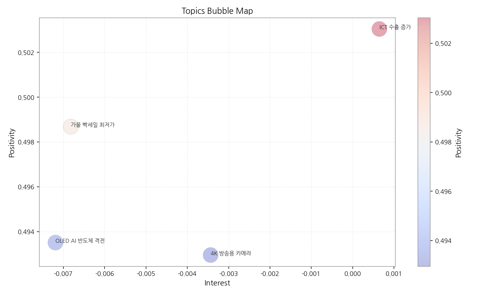
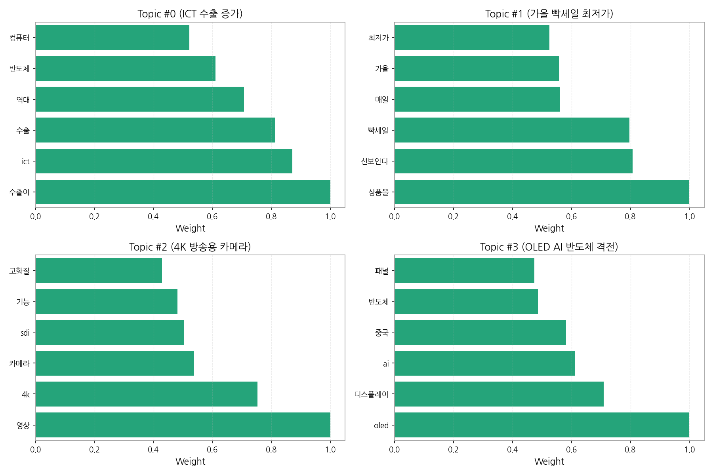

### 토픽 개요
|   topic_id | topic_summary                                                  |
|-----------:|:---------------------------------------------------------------|
|          0 | 반도체, 컴퓨터, 휴대폰 등 ICT 품목 수출이 역대 최고 달러를 기록하며 크게 증가했음을 나타냅니다.      |
|          1 | 가을을 맞아 인기 브랜드 상품을 최저가로 매일 선보이는 '빡세일' 행사 관련 소식.                 |
|          2 | 당사에서 출시한 고화질 4K 방송용 카메라가 세로형 영상 촬영을 지원하며 SDI 등 다양한 기능을 제공함.    |
|          3 | 한국 OLED 디스플레이, AI 반도체 기술을 중심으로 중국과의 경쟁 심화, TV 패널 시장 3분기 핵심 이슈. |

> 해석 가이드: 성장률이 높고 긍정성이 유지되는 토픽은 우선 탐색 대상입니다.
> 그래서: 토픽 성장과 기업 진입 변화가 동시에 보이면 시장 전환점일 가능성이 있습니다.
> 다음 액션: 상위 토픽을 기업×토픽 매트릭스에서 교차 확인하고, 기회/리스크로 분기하세요.

## 기업×토픽 매트릭스/히트맵

**핵심 요약**
- 가장 경쟁 치열 토픽: oled, 디스플레이
- 가장 집중도 높은 기업: 삼성전자
- 최고 단일 조합: 삼성전자 × oled, 디스플레이

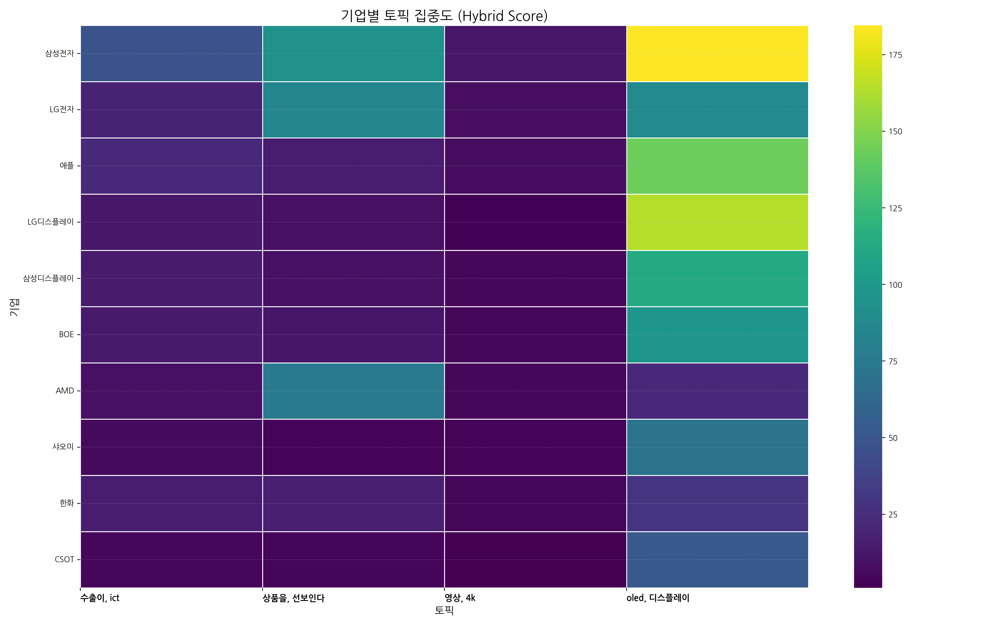
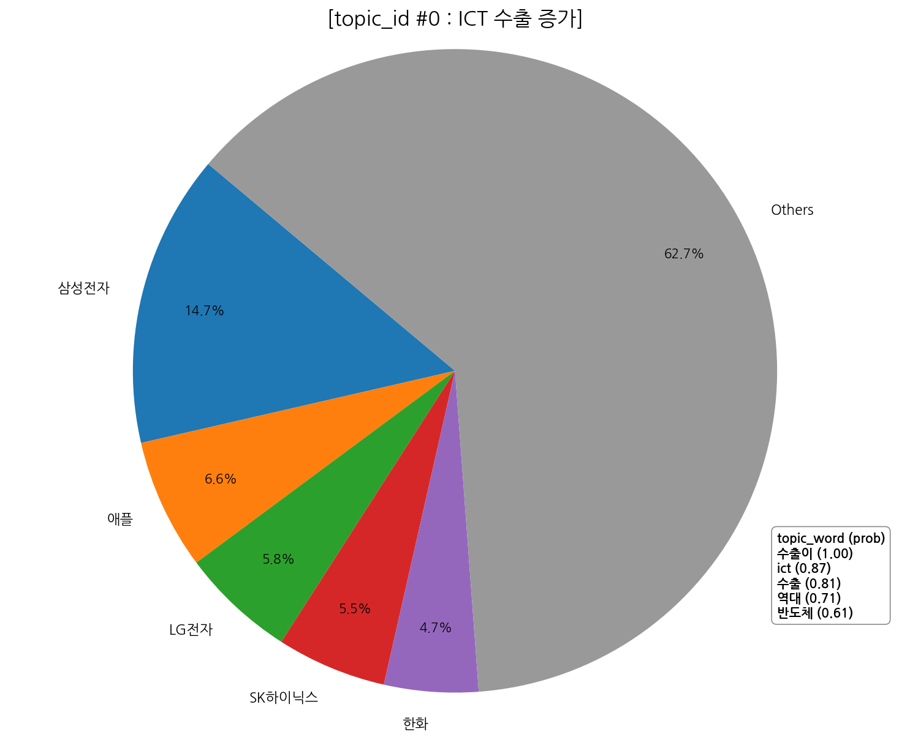
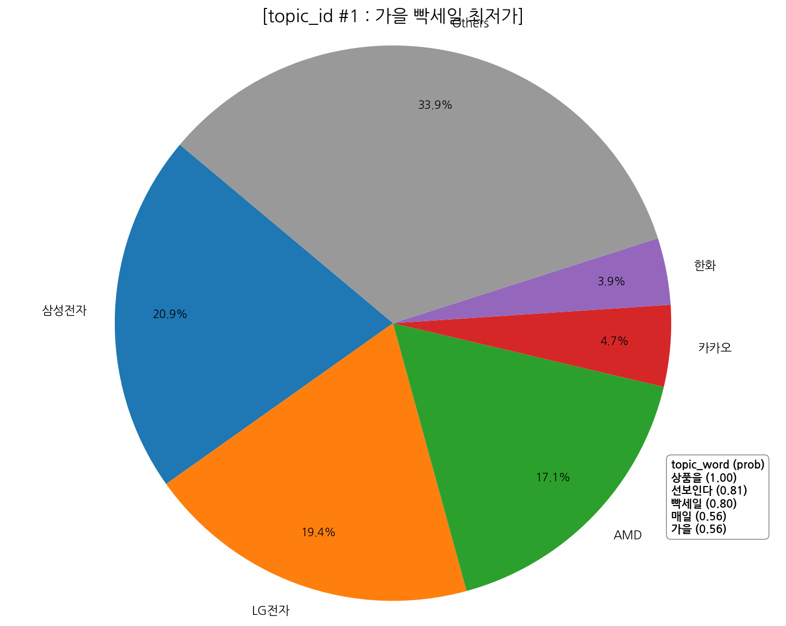
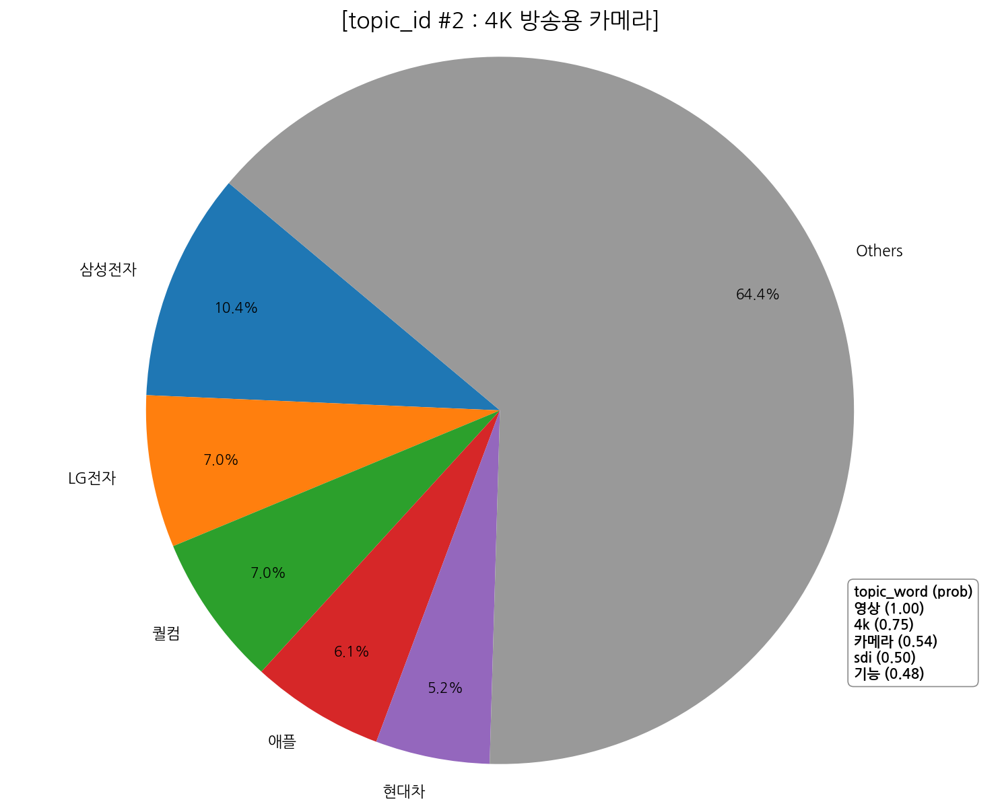
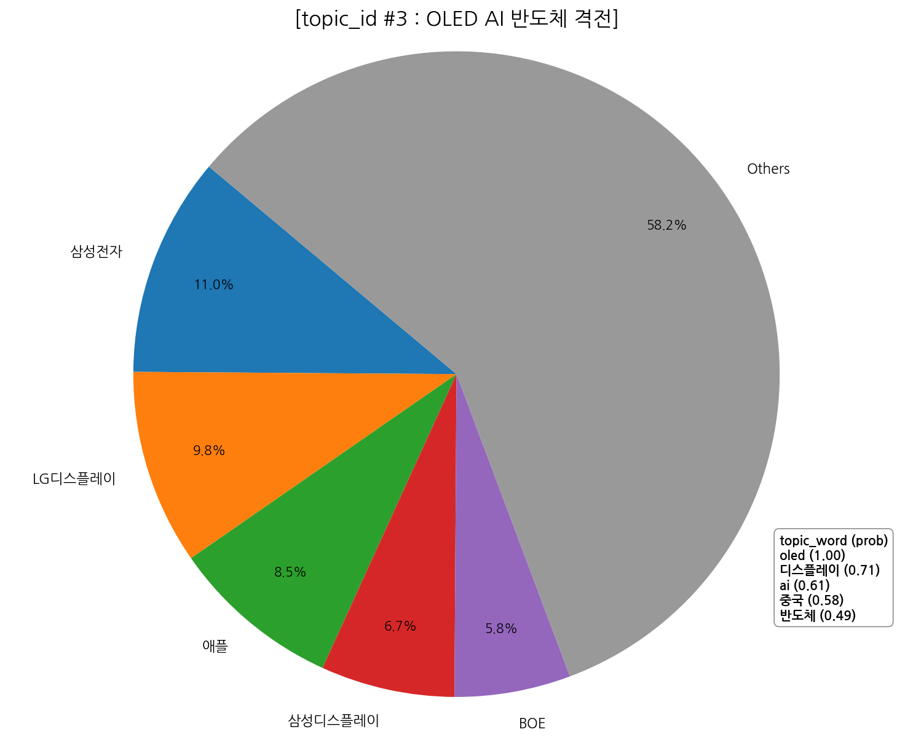
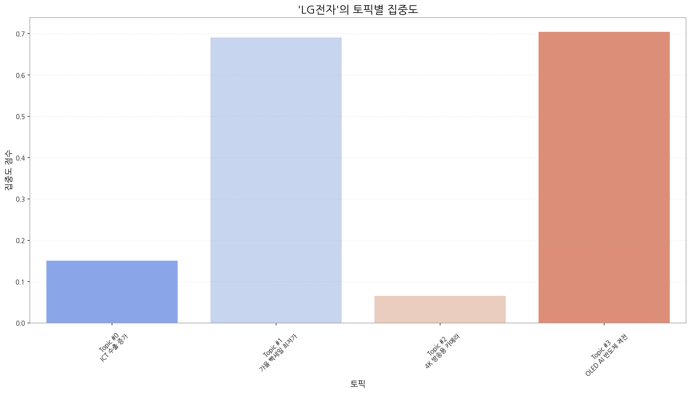
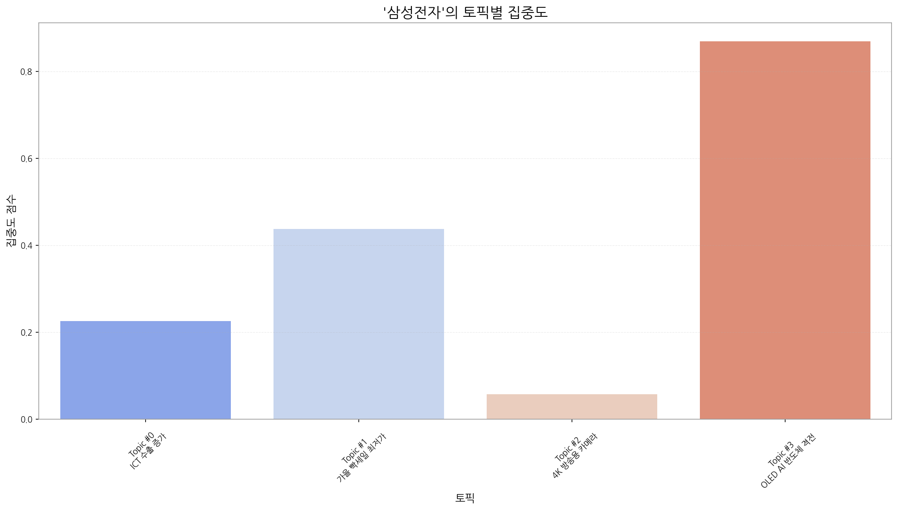
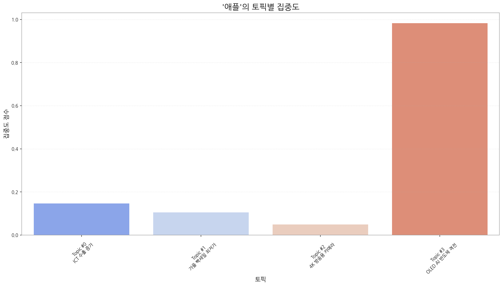

### 매트릭스 표(미리보기)
| org          | topic_0    | topic_1     | topic_2   | topic_3      |
|:-------------|:-----------|:------------|:----------|:-------------|
| AMD          | 8.56 (3%)  | 75.63 (17%) | 4.07 (3%) | 21.27 (1%)   |
| AUO          | 5.99 (2%)  | 4.79 (1%)   | 2.04 (2%) | 25.38 (2%)   |
| BMW          | 1.71 (1%)  | 5.74 (1%)   | 1.02 (1%) | 6.17 (0%)    |
| BOE          | 13.69 (4%) | 11.49 (3%)  | 4.07 (3%) | 97.41 (6%)   |
| BYD          | 2.57 (1%)  | 0.96 (0%)   | nan       | 8.92 (1%)    |
| CES          | nan        | 0.96 (0%)   | nan       | 2.74 (0%)    |
| CSOT         | 4.28 (1%)  | 3.83 (1%)   | 1.02 (1%) | 51.45 (3%)   |
| Counterpoint | nan        | nan         | nan       | 0.69 (0%)    |
| ETRI         | nan        | nan         | nan       | 0.69 (0%)    |
| HP           | nan        | nan         | 3.06 (3%) | 0.69 (0%)    |
| IEC          | nan        | nan         | nan       | 6.17 (0%)    |
| IEEE         | 0.86 (0%)  | nan         | nan       | 4.12 (0%)    |
| ITU          | nan        | nan         | nan       | 6.17 (0%)    |
| Innolux      | 9.41 (3%)  | 5.74 (1%)   | 4.07 (3%) | 27.44 (2%)   |
| IoT          | 2.57 (1%)  | 2.87 (1%)   | 2.04 (2%) | 14.41 (1%)   |
| JDI          | 3.42 (1%)  | nan         | nan       | 16.46 (1%)   |
| KAIST        | nan        | nan         | nan       | 6.17 (0%)    |
| LG디스플레이      | 11.98 (4%) | 8.62 (2%)   | 2.04 (2%) | 163.95 (10%) |
| LG전자         | 18.82 (6%) | 86.16 (19%) | 8.15 (7%) | 87.81 (5%)   |
| LG화학         | 5.13 (2%)  | nan         | 1.02 (1%) | 11.66 (1%)   |

> 해석 가이드: 히트맵에서 진한 교차지점은 전략 초점을 의미합니다. 점수는 소스 커버리지에 민감합니다.
> 그래서: 경쟁 치열 토픽에서의 점유율 변화는 공격/수비 전략 신호일 수 있습니다.
> 다음 액션: 상위 기업과 토픽 교차를 기회 섹션으로 연결하고, 파트너/경쟁사 움직임을 추적하세요.

## 관계·경쟁 네트워크

**핵심 요약**
- 관계망 규모: 노드 38개 / 엣지 82개
- 가장 강한 관계: 삼성전자 ↔ 애플 (가중치 35, 유형 neutral)
- 허브 후보: 삼성전자 (Degree 0.6216)
- 브로커 후보: 삼성전자 (Betweenness 0.3069)

### 상위 관계쌍(Edge)
동일 문서/문장에서 함께 언급된 기업 쌍이며, 가중치는 동시출현 빈도입니다. 유형은 규칙 기반 추정입니다.

| Source   | Target   |   Weight | Type        |
|:---------|:---------|---------:|:------------|
| 삼성전자     | 애플       |       35 | neutral     |
| 삼성디스플레이  | 삼성전자     |       25 | rivalry     |
| 삼성디스플레이  | 애플       |       21 | rivalry     |
| 구글       | 애플       |       17 | neutral     |
| 샤오미      | 애플       |       13 | partnership |
| 삼성전자     | 샤오미      |       12 | rivalry     |
| 한화       | 한화시스템    |       10 | partnership |
| 마이크로소프트  | 한화시스템    |       10 | partnership |
| 마이크로소프트  | 한화       |       10 | partnership |
| 삼성전자     | 하이센스     |        9 | neutral     |

### 중심성 상위(연결 허브)
Degree 중심성은 연결된 상대 수의 비율입니다. 높을수록 허브 성격.

| Org     |   DegreeCentrality |
|:--------|-------------------:|
| 삼성전자    |             0.6216 |
| 애플      |             0.4595 |
| 샤오미     |             0.3514 |
| 삼성디스플레이 |             0.2703 |
| 메타      |             0.2432 |
| 구글      |             0.2162 |
| 엔비디아    |             0.1892 |
| 마이크로소프트 |             0.1622 |
| 오포      |             0.1622 |
| 퀄컴      |             0.1622 |

### 매개 중심성 상위(정보 브로커)
Betweenness는 집단 간 ‘다리’ 역할 정도입니다. 높을수록 중개자 성격.

| Org     |   Betweenness |
|:--------|--------------:|
| 삼성전자    |        0.3069 |
| 애플      |        0.1    |
| 엔비디아    |        0.0557 |
| 메타      |        0.05   |
| 샤오미     |        0.0403 |
| 한화      |        0.0353 |
| 삼성디스플레이 |        0.0211 |
| 마이크로소프트 |        0.0189 |
| 구글      |        0.0186 |
| 퀄컴      |        0.0093 |

### 커뮤니티(관계 클러스터)
> 모듈러리티 기반 자동 추출 집단. 같은 집단 내 기업은 유사 주제/밸류체인 공유 가능성.
- C0: 기아자동차, 네이버, 디지타임스, 미디어텍, 비보, 삼성디스플레이 | 해석: 기아자동차 중심의 연관 클러스터
- C1: 마이크로소프트, 아마존, 알파벳, 엔비디아, 인텔, 한화 | 해석: 마이크로소프트 중심의 연관 클러스터
- C2: 구글, 메타, 샤오미, 샤오펑, 선익시스템 | 해석: 구글 중심의 연관 클러스터
- C3: 기아, 퀄컴, 현대자동차, 현대차 | 해석: 기아 중심의 연관 클러스터
- C4: 레노버 | 해석: 레노버 중심의 연관 클러스터

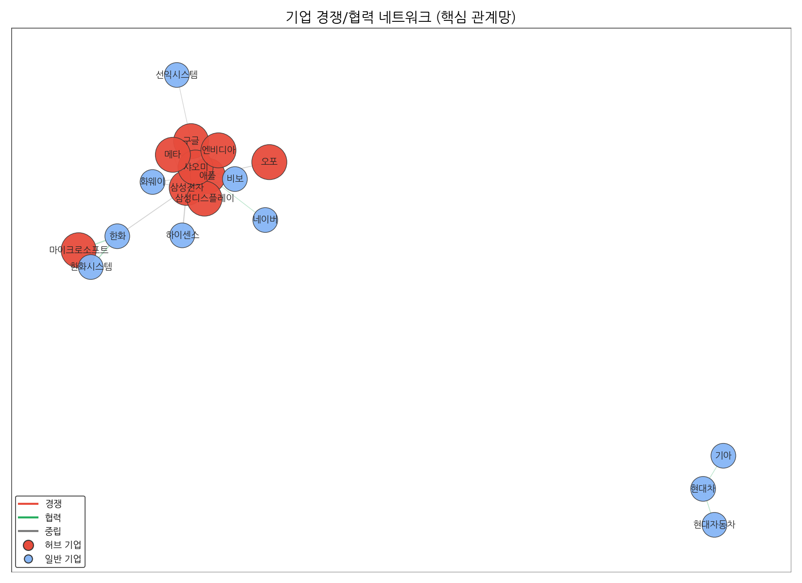

> 해석 가이드: 동시출현이 높은 쌍은 경쟁/협력 가능성을 시사합니다.
> 그래서: 허브/브로커 포지션은 영향력/협상력을 가리킵니다.
> 다음 액션: 커뮤니티별 주요 토픽/키워드와 교차하여 전략 단위를 정의하세요.

## 트렌드 타임라인

**핵심 요약**
- 기간: 2025-09-08 ~ 2025-10-13
- 총 기사 수: 3,112
- 일별 기사 수와 7일 이동평균, 변곡점을 주석으로 표시합니다.

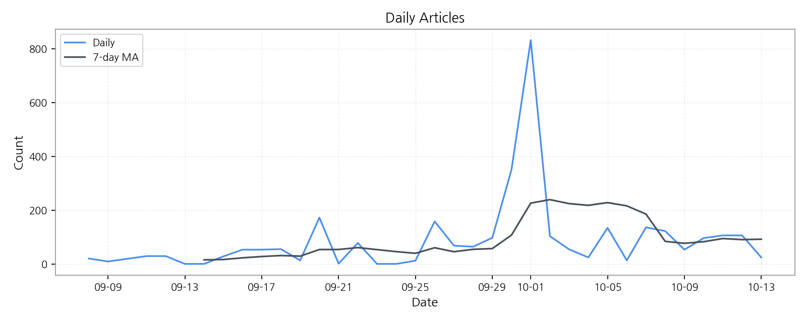

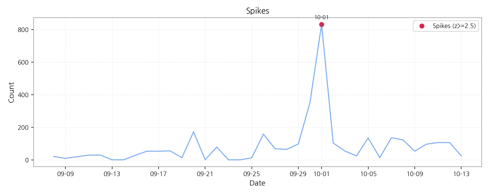

### 스파이크/이벤트 목록
| date       |   count |       z |
|:-----------|--------:|--------:|
| 2025-10-01 |     832 | 5.13395 |

> 해석 가이드: 단기 급등은 이벤트성 가능성이 있으니 2주 추세를 함께 보세요.
> 그래서: 스파이크 이후 토픽/신호 방향을 교차 확인하면 원인 파악이 빨라집니다.
> 다음 액션: 스파이크 날짜의 주요 기사와 키워드 변동을 키워드/토픽 섹션에서 재확인하세요.

## 시그널 보드(강한/약한 신호)

### 강한 신호(Strong Signals)

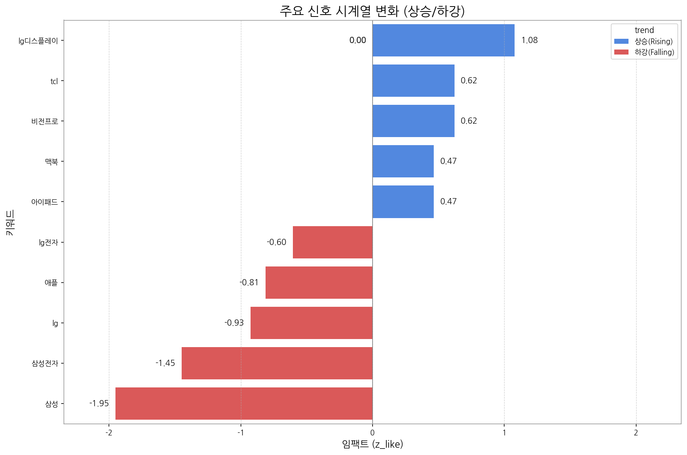

| term    |   cur |   z_like |   prev |   diff |   ma7 |   total |
|:--------|------:|---------:|-------:|-------:|------:|--------:|
| lg디스플레이 |     4 |    1.078 |      1 |      3 | 1.571 |      73 |
| tcl     |     1 |    0.622 |      0 |      1 | 0.143 |       1 |
| 비전프로    |     1 |    0.622 |      0 |      1 | 0.143 |       3 |
| 맥북      |     1 |    0.465 |      0 |      1 | 0.286 |       9 |
| 아이패드    |     1 |    0.465 |      1 |      0 | 0.286 |       7 |
| 현대차     |     1 |    0     |      1 |      0 | 1     |      25 |
| 폴더블     |     1 |   -0.195 |      0 |      1 | 1.429 |      26 |
| oled    |     2 |   -0.412 |      3 |     -1 | 3.143 |     135 |
| lg전자    |     1 |   -0.604 |      3 |     -2 | 2.571 |      39 |
| 애플      |     1 |   -0.813 |      2 |     -1 | 3.286 |      76 |
| lg      |     2 |   -0.927 |     15 |    -13 | 5     |     270 |
| 삼성전자    |     1 |   -1.449 |      5 |     -4 | 6     |      97 |
| 삼성      |     1 |   -1.952 |     10 |     -9 | 8.714 |     353 |

> 해석 가이드: 약한 신호는 가속도·이례성이 핵심이고, 강한 신호는 현재 주목도의 절대값입니다.
> 그래서: 약한→강한 신호로 전환하는 구간이 가장 좋은 기회가 됩니다.
> 다음 액션: 상위 신호 5개를 2주간 추적하고, 토픽/기업 매트릭스와 교차 검증하세요.

## 기술 성숙도 맵

**핵심 요약**
- 관심도(X), 긍정성(Y), 버블(사업 활발도)로 기술의 위치를 표현합니다.
- 단계: Seed/Early/Growth/Mature/Legacy

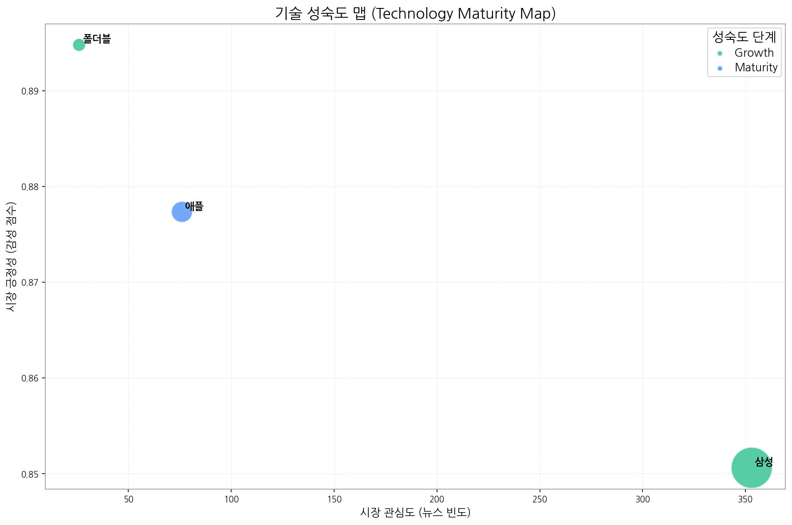

| 기술   | 단계       | 판단 근거                                                                                |
|:-----|:---------|:-------------------------------------------------------------------------------------|
| 삼성   | Growth   | 높은 뉴스 언급 빈도와 긍정적인 시장 감성 점수, 그리고 활발한 투자 및 출시 이벤트 발생 비율을 고려할 때, 삼성 기술은 성장기에 있다고 판단됩니다. |
| 애플   | Maturity | 애플은 높은 시장 감성 점수와 지속적인 출시를 보이지만, 투자 및 수주 이벤트 비율이 상대적으로 낮아 성장 단계보다는 성숙 단계에 있다고 판단됩니다.  |
| 폴더블  | Growth   | 높은 시장 감성 점수와 꾸준한 출시 및 수주 이벤트 발생은 폴더블 기술이 성장 단계에 진입했음을 시사합니다.                         |

> 해석 가이드: Growth 구간이면서 강한 신호 결합 시 유망합니다.
> 그래서: Early라도 약한 신호가 누적되면 전환 후보입니다.
> 다음 액션: 상위 기술 3개를 기회 섹션과 연결하고 파일럿 과제를 정의하세요.

## 비즈니스 기회(Top 5)

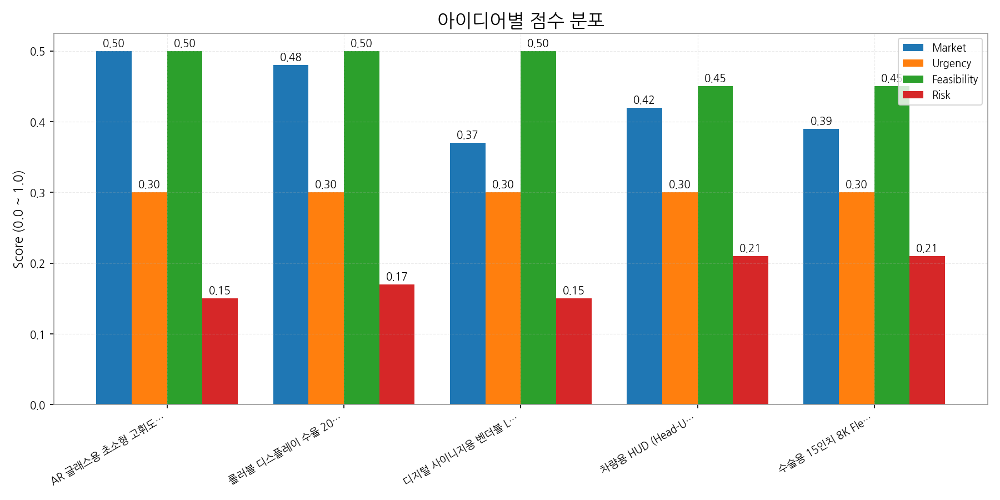

| 아이디어                                     | 타깃                           | 가치제안                                                                                                               | 점수(시장/긴급/실행/리스크)         |
|:-----------------------------------------|:-----------------------------|:-------------------------------------------------------------------------------------------------------------------|:-------------------------|
| AR 글래스용 초소형 고휘도 Micro-OLED               | 북미 빅테크 기업 (AR/VR 디바이스 제조사)   | 기존 LCD 대비 10배 높은 휘도, 초고해상도 구현. 초소형 사이즈로 AR 글래스 디자인 자유도 향상. 낮은 전력 소비로 AR 글래스 사용 시간 증대.                              | 3.7 (0.5/0.3/0.5/0.15)   |
| 롤러블 디스플레이 수율 20% 향상을 위한 AI 공정 모니터링 서비스   | 자사 디스플레이 패널 생산 라인            | AI 기반 실시간 공정 데이터 분석 및 이상 감지. 불량 예측 및 원인 분석을 통한 수율 향상 (20% 목표). 공정 조건 최적화를 통한 생산 비용 절감. 데이터 기반 의사 결정을 통한 생산 효율성 증대. | 3.5 (0.48/0.3/0.5/0.17)  |
| 디지털 사이니지용 벤더블 LCD                        | 글로벌 광고 대행사, 리테일 기업           | 곡면 디자인으로 시각적 주목도 향상 및 브랜드 이미지 제고. 다양한 설치 환경에 유연하게 적용 가능. 기존 LCD 대비 낮은 생산 비용으로 가격 경쟁력 확보.                           | 3.2 (0.37/0.3/0.5/0.15)  |
| 차량용 HUD (Head-Up Display) 투명 MicroLED 패널 | 글로벌 완성차 OEM (Tier 1 부품사 협력)  | 기존 LCD HUD 대비 5배 높은 밝기 및 투명도, 넓은 시야각 제공. AR 정보 시인성 극대화 및 운전 안전성 향상. MicroLED의 긴 수명과 낮은 전력 소비로 차량 내구성과 효율성 증대.      | 3.1 (0.42/0.3/0.45/0.21) |
| 수술용 15인치 8K Flexible OLED 디스플레이          | 글로벌 의료기기 제조사 (수술 로봇, 내시경 장비) | 기존 FHD 대비 16배 높은 해상도로 미세 혈관, 신경 조직 식별 용이. 곡면 디자인으로 수술 시야각 극대화 및 피로도 감소. 얇고 가벼운 디자인으로 수술 로봇, 내시경 장비 통합 용이.          | 3.0 (0.39/0.3/0.45/0.21) |

> 해석 가이드: 점수는 내부 가중치 기반(예: Market 0.35, Urgency 0.25, Feasibility 0.25, Risk -0.15).
> 그래서: 상위안은 단기 임팩트/실행 가능성이 높은 편입니다.
> 다음 액션: 각 아이디어에 대해 2주 파일럿(가설·대상·KPI)을 정의하고 담당 오너를 배정하세요.

## 리스크/이슈 관측소

- (리스크/이슈 데이터 없음)

> 해석 가이드: 부정 감성 급등은 PR·컴플라이언스·조달과 연계가 필요합니다.
> 그래서: 공급망 키워드와 동반 급등 시 실제 운영 리스크로 이어질 수 있습니다.
> 다음 액션: 영향범위가 큰 이슈는 즉시 리스크 레지스터에 등록하고 완화 액션을 실행하세요.

## 결론: So What & Next Steps

### 다음 2주 실행안(템플릿)
| hypothesis          | target         | kpi               | owner   | due        |
|:--------------------|:---------------|:------------------|:--------|:-----------|
| 토픽 A 관심도↑는 고객 니즈 증가 | SMB 고객 20명 인터뷰 | 응답률 30%/신규 리드 10건 | 사업개발팀   | 2025-10-28 |

> 해석 가이드: 데이터-인사이트-액션의 연결을 표준 템플릿으로 기록하세요.
> 그래서: 우선순위 상위 안건부터 빠르게 실험해야 기회를 놓치지 않습니다.
> 다음 액션: 오너/기한/KPI가 명확한 항목부터 킥오프하세요.

## 부록(Appendix)

분석의 투명성을 확보하고, 다음 단계 분석을 위한 원천 자료를 제공합니다.

### 데이터 메타
| 파일                             | 수정시각                |   크기(bytes) |
|:-------------------------------|:--------------------|------------:|
| outputs/keywords.json          | 2025-10-14 10:02:03 |        1516 |
| outputs/topics.json            | 2025-10-14 10:03:11 |        4511 |
| outputs/trend_timeseries.json  | 2025-10-14 10:02:05 |        2147 |
| outputs/trend_insights.json    | 2025-10-14 10:03:18 |        4676 |
| outputs/biz_opportunities.json | 2025-10-14 10:04:08 |       23793 |
| outputs/tech_maturity.json     | 2025-10-14 10:03:46 |        1657 |
| outputs/company_network.json   | 2025-10-14 10:03:52 |       17202 |

> 해석 가이드: 재현성과 감사추적을 위해 생성일, 버전, 파라미터를 함께 보관하세요.
> 그래서: 데이터 출처와 가공 과정을 명확히 남기면 신뢰성이 높아집니다.
> 다음 액션: 주요 이미지/표 생성 실패 로그도 추적 테이블로 남겨두세요.
