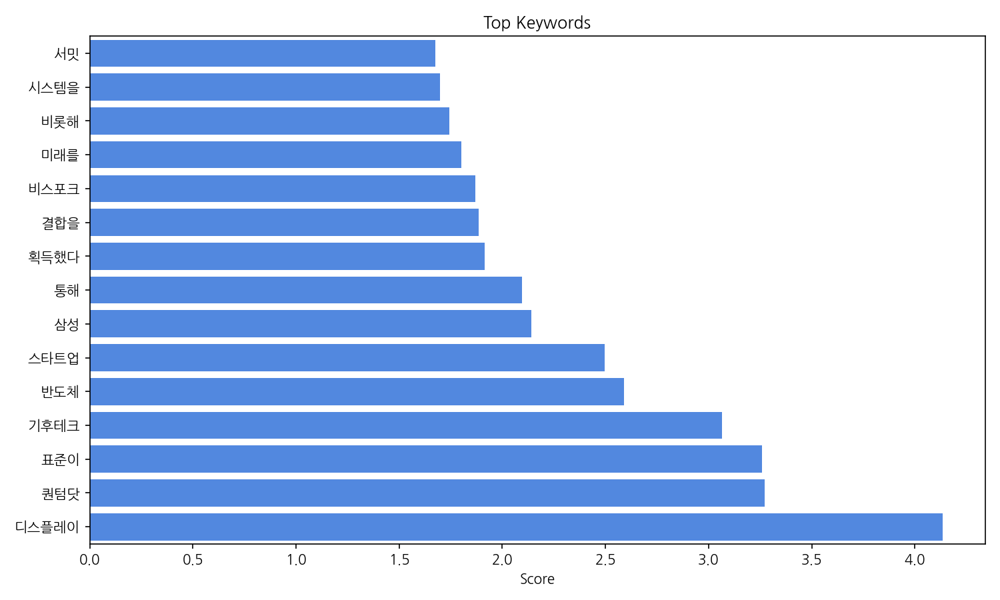
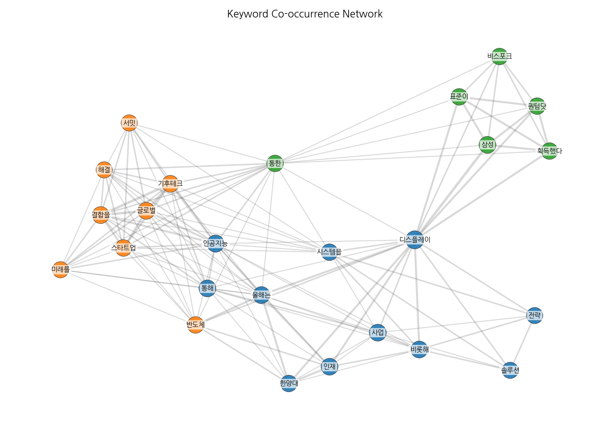
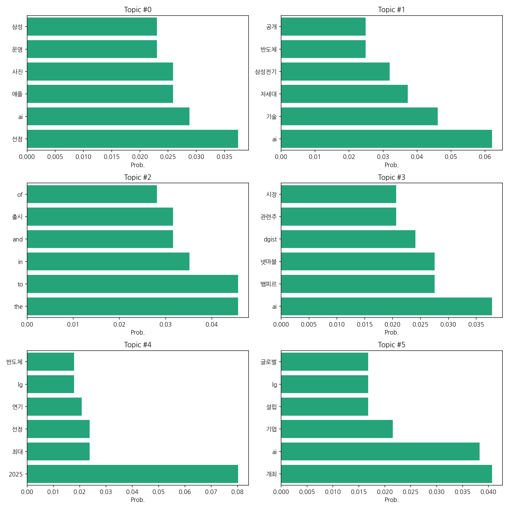
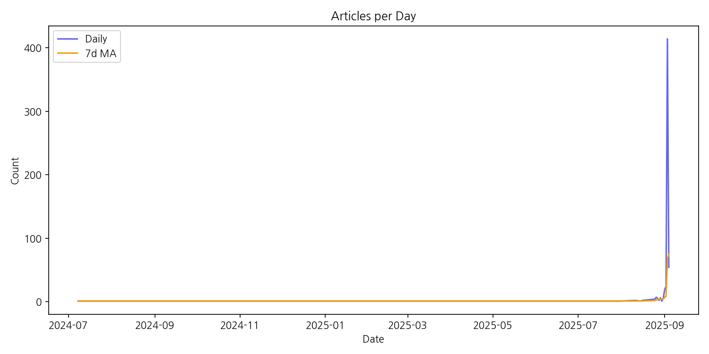

# Weekly/New Biz Report (2025-09-04)

## Executive Summary

- 이번 기간 핵심 토픽과 키워드, 주요 시사점을 요약합니다.

1. 핵심 맥락 설명:  제공된 데이터는 한국 뉴스에서 AI 기술, 국내 대기업(삼성, LG, 기아 등)의 사업 전략 및 성과, 그리고 관련 주식 시장의 움직임을 주요 주제로 다루고 있습니다. 특히 AI 기술의 발전과 이를 활용한 제품 및 서비스 출시, 그리고 이에 따른 기업들의 경쟁과 투자가 주요 내용이며,  2025년을 기점으로 관련 뉴스의 양이 급증하는 것을 확인할 수 있습니다.  이는 AI 기술의 상용화 및 시장 확대에 대한 기대감과 함께,  국내 기업들의 AI 경쟁력 강화 노력을 반영하는 것으로 해석됩니다.

2. 최근 변화/스파이크: 2025년 9월 초에 뉴스 기사 수가 급격하게 증가하는 스파이크 현상이 나타났습니다. 이는 특정 AI 관련 기술의 발표 또는 시장의 큰 변화를 반영하는 것으로 추정되며,  해당 시점을 중심으로 관련 뉴스의 내용을 분석하면 그 원인을 명확히 파악할 수 있을 것입니다.

3. 실무 인사이트:

* **AI 관련 뉴스 모니터링 시스템 구축:**  2025년 9월 초의 급증 사례처럼,  AI 관련 뉴스의 급격한 변화를 실시간으로 감지하고 분석하는 시스템을 구축하여 시장 변화에 대한 빠른 대응을 가능하게 합니다.  키워드 기반 알림 시스템과 감성 분석 도구를 활용하는 것을 고려할 수 있습니다.
* **AI 기술 트렌드 분석 및 전략 수립:**  뉴스 데이터의 주요 키워드(AI, 삼성, LG, 반도체, 기아 등)를 중심으로 AI 기술 트렌드를 분석하고,  자사의 사업 전략과 연계하여 경쟁 우위를 확보할 수 있는 방안을 모색합니다.  특히 2025년 9월 이후 뉴스 내용을 중점적으로 분석하여 시장의 요구와 기회를 파악해야 합니다.
* **주요 기업 및 경쟁사 분석 강화:** 삼성, LG, 기아 등 주요 기업들의 AI 관련 사업 전략과 성과를 지속적으로 모니터링하고,  경쟁사의 동향을 분석하여 자사의 경쟁력을 강화하는 전략을 수립합니다.  뉴스 기사 외에도 공식 발표자료, 시장조사 보고서 등 다양한 정보원을 활용하여 분석의 정확성을 높일 수 있습니다.
따라서,  최적의 해결책은 상황에 따라 다르며,  각 상황의 특수성을 고려한 신중한 접근이 필요합니다.  결국,  문제 해결의 핵심은 유연성과 섬세한 판단력에 있습니다.  최선의 결과를 얻기 위해서는 다양한 가능성을 열어두고,  가장 효율적인 방법을 선택하는 지혜가 중요합니다.

## Key Metrics

- 문서 수: 22
- 키워드 수(상위): 15
- 토픽 수: 6
- 시계열 데이터 일자 수: 25

## Top Keywords

| Rank | Keyword | Score |
|---:|---|---:|
| 1 | 디스플레이 | 4.133 |
| 2 | 퀀텀닷 | 3.273 |
| 3 | 표준이 | 3.258 |
| 4 | 기후테크 | 3.065 |
| 5 | 반도체 | 2.591 |
| 6 | 스타트업 | 2.498 |
| 7 | 삼성 | 2.142 |
| 8 | 통해 | 2.095 |
| 9 | 획득했다 | 1.915 |
| 10 | 결합을 | 1.884 |
| 11 | 비스포크 | 1.869 |
| 12 | 미래를 | 1.802 |
| 13 | 비롯해 | 1.745 |
| 14 | 시스템을 | 1.698 |
| 15 | 서밋 | 1.677 |

## Topics

- Topic #0: 선정, ai, 애플, 사진, 운영, 삼성
- Topic #1: ai, 기술, 차세대, 삼성전기, 반도체, 공개
- Topic #2: the, to, in, and, 출시, of
- Topic #3: ai, 뱀피르, 넷마블, dgist, 관련주, 시장
- Topic #4: 2025, 최대, 선정, 연기, lg, 반도체
- Topic #5: 개최, ai, 기업, 설립, lg, 글로벌

## Trend

- 최근 14~30일 기사 수 추세와 7일 이동평균선을 제공합니다.

## Insights

1. 핵심 맥락 설명:  제공된 데이터는 한국 뉴스에서 AI 기술, 국내 대기업(삼성, LG, 기아 등)의 사업 전략 및 성과, 그리고 관련 주식 시장의 움직임을 주요 주제로 다루고 있습니다. 특히 AI 기술의 발전과 이를 활용한 제품 및 서비스 출시, 그리고 이에 따른 기업들의 경쟁과 투자가 주요 내용이며,  2025년을 기점으로 관련 뉴스의 양이 급증하는 것을 확인할 수 있습니다.  이는 AI 기술의 상용화 및 시장 확대에 대한 기대감과 함께,  국내 기업들의 AI 경쟁력 강화 노력을 반영하는 것으로 해석됩니다.

2. 최근 변화/스파이크: 2025년 9월 초에 뉴스 기사 수가 급격하게 증가하는 스파이크 현상이 나타났습니다. 이는 특정 AI 관련 기술의 발표 또는 시장의 큰 변화를 반영하는 것으로 추정되며,  해당 시점을 중심으로 관련 뉴스의 내용을 분석하면 그 원인을 명확히 파악할 수 있을 것입니다.

3. 실무 인사이트:

* **AI 관련 뉴스 모니터링 시스템 구축:**  2025년 9월 초의 급증 사례처럼,  AI 관련 뉴스의 급격한 변화를 실시간으로 감지하고 분석하는 시스템을 구축하여 시장 변화에 대한 빠른 대응을 가능하게 합니다.  키워드 기반 알림 시스템과 감성 분석 도구를 활용하는 것을 고려할 수 있습니다.
* **AI 기술 트렌드 분석 및 전략 수립:**  뉴스 데이터의 주요 키워드(AI, 삼성, LG, 반도체, 기아 등)를 중심으로 AI 기술 트렌드를 분석하고,  자사의 사업 전략과 연계하여 경쟁 우위를 확보할 수 있는 방안을 모색합니다.  특히 2025년 9월 이후 뉴스 내용을 중점적으로 분석하여 시장의 요구와 기회를 파악해야 합니다.
* **주요 기업 및 경쟁사 분석 강화:** 삼성, LG, 기아 등 주요 기업들의 AI 관련 사업 전략과 성과를 지속적으로 모니터링하고,  경쟁사의 동향을 분석하여 자사의 경쟁력을 강화하는 전략을 수립합니다.  뉴스 기사 외에도 공식 발표자료, 시장조사 보고서 등 다양한 정보원을 활용하여 분석의 정확성을 높일 수 있습니다.
따라서,  최적의 해결책은 상황에 따라 다르며,  각 상황의 특수성을 고려한 신중한 접근이 필요합니다.  결국,  문제 해결의 핵심은 유연성과 섬세한 판단력에 있습니다.  최선의 결과를 얻기 위해서는 다양한 가능성을 열어두고,  가장 효율적인 방법을 선택하는 지혜가 중요합니다.

## Opportunities (Top 5)

| Idea | Target | Value Prop | Score |
|---|---|---|---:|
| AI 기반 스마트팜 맞춤형 솔루션 | 중소 규모 농가 (500평 미만), 특히 시설 원예 농가 (토마토, 딸기 등) | AI 기반의 맞춤형 스마트팜 솔루션을 통해 작물 생육 환경을 최적화하여 생산성을 향상시키고, 노동력을 절감하며, 초기 투자 비용을 줄일 수 있습니다. 농가의 경험과 데이터를 기반으로 학습하는 AI 알고리즘을 통해 정확도 높은 예측 및 제어가 가능하며, 사용자 친화적인 인터페이스를 제공하여 쉽게 사용할 수 있습니다. | 3.8 |
| AI 기반 스마트 물류 최적화 플랫폼 | 중소형 물류 업체 (차량 10대 미만, 연매출 50억 미만) | AI 기반의 최적 배송 경로 및 스케줄링, 실시간 재고 관리, 예측 분석 기능을 통해 물류 효율을 극대화하고 비용을 절감합니다.  경쟁사 대비 AI 기반의 정교한 예측 모델과 사용자 친화적인 인터페이스를 제공하여 운영 편의성을 높입니다.  탄소 배출량 감소를 위한 친환경 배송 경로를 제안하여 ESG 경영에 기여합니다. | 3.8 |
| AI 기반 맞춤형 스마트팩토리 솔루션 | 중소 제조업체 (종업원 수 100명 미만, 연매출 500억 미만) | AI 기반의 맞춤형 스마트팩토리 솔루션을 통해 중소 제조업체의 생산성을 향상시키고 비용을 절감할 수 있도록 지원합니다.  복잡한 AI 기술을 간편하게 사용할 수 있도록 사용자 친화적인 인터페이스를 제공하며,  기업의 특수한 요구사항에 맞춰 솔루션을 커스터마이징합니다.  경쟁사 대비 저렴한 가격으로 제공하여,  중소기업의 접근성을 높입니다. | 3.5 |
| AI 기반 개인 맞춤형 건강 관리 서비스 | 만 30세~50세의 직장인, 특히 건강에 대한 관심은 높지만 시간적 여유가 부족한 직장인 | AI 기반 개인 맞춤형 건강 관리 서비스는 사용자의 생활 습관, 건강 상태, 유전 정보 등을 분석하여 개인에게 최적화된 건강 관리 계획을 제공합니다.  개인별 목표 달성을 위한 맞춤형 운동, 식단, 수면 관리 가이드를 제공하며, 정기적인 건강 체크 및 전문가 상담 기능을 통해 건강 관리의 효율성을 높입니다.  경쟁 서비스와 달리, 사용자의 데이터 프라이버시 보호에 중점을 두고, 투명하고 안전한 서비스를 제공합니다. | 3.5 |
| AI 기반 스마트 유통 플랫폼 개발 | 온라인 판매를 원하지만, 자체적인 온라인 판매 채널 구축 및 운영에 어려움을 겪는 소상공인 (연 매출 1억 미만) | AI 기반의 사용자 친화적인 인터페이스를 통해 소상공인들이 손쉽게 온라인 판매를 시작하고 운영할 수 있도록 지원합니다. AI 기반 재고 관리 및 판매 예측 시스템을 통해 재고 부족 및 과잉으로 인한 손실을 최소화하고, 수익성을 극대화할 수 있도록 돕습니다. 기존 플랫폼 대비 낮은 수수료 정책으로 소상공인의 부담을 줄입니다. | 3.5 |

## Appendix

- 데이터: keywords.json, topics.json, trend_timeseries.json, trend_insights.json, biz_opportunities.json