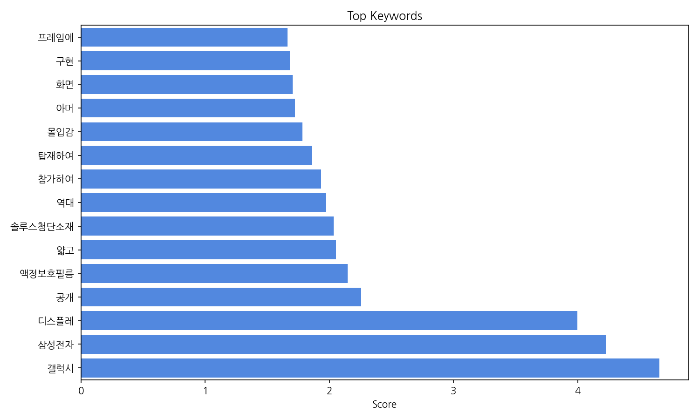
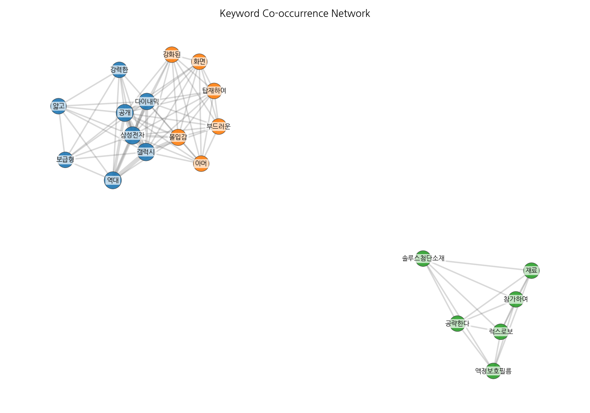
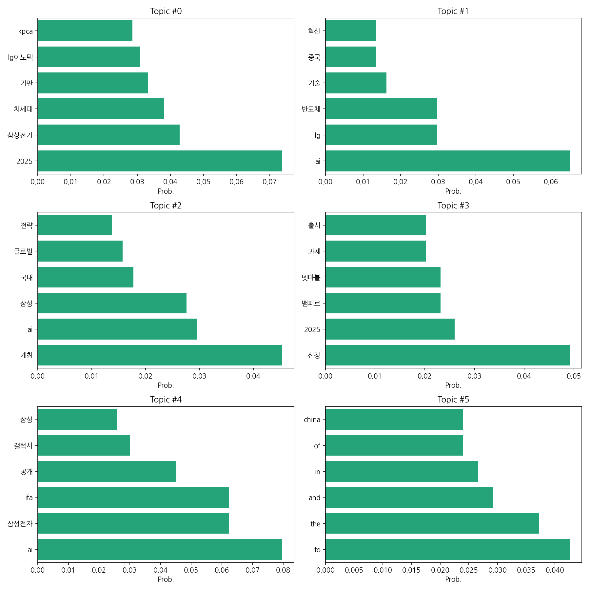
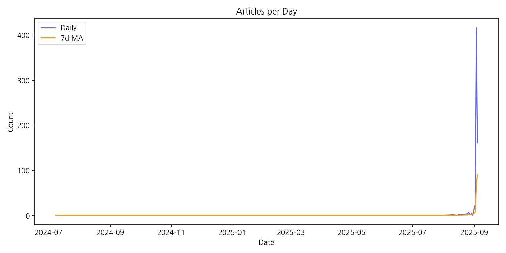

# Weekly/New Biz Report (2025-09-04)

## Executive Summary

- 이번 기간 핵심 토픽과 키워드, 주요 시사점을 요약합니다.

1. 핵심 맥락 설명:  제공된 데이터는 한국 뉴스에서 2024년 7월부터 2025년 9월까지의 기사를 분석한 결과로, 주요 토픽은 AI 기술, 차세대 반도체 및 기판 기술, 그리고 삼성과 LG 등 대기업의 기술 전략 및 시장 경쟁에 집중되어 있습니다.  특히 2025년을 기점으로 차세대 기술 관련 기사가 급증하고 있으며, 이는 관련 산업의 기술 개발 및 시장 경쟁 심화를 반영합니다.  게임 출시 관련 뉴스도 일부 포함되어 있으나, 주된 흐름은 AI와 반도체 산업에 집중되어 있습니다.

2. 최근 변화/스파이크: 2025년 9월 초에 AI, 반도체, 삼성, LG 관련 뉴스 기사 수가 급격하게 증가하는 스파이크 현상이 나타났습니다. 이는 특정 기술 발표나 시장 상황 변화, 혹은 주요 행사 개최 등의 외부 요인에 의한 것으로 추정됩니다.

3. 실무 인사이트:

* **AI 및 반도체 산업 동향 모니터링 강화:**  2025년 9월 초의 기사 급증을 계기로 AI와 반도체 분야의 뉴스를 지속적으로 모니터링하고, 특히 삼성, LG 등 주요 기업의 기술 개발 및 사업 전략 변화에 대한 정보 수집을 강화해야 합니다.  경쟁사의 움직임을 파악하고 시장 변화에 대한 예측력을 높이는 것이 중요합니다.
* **차세대 기술 관련 시장 조사 및 분석:**  2025년을 중심으로 차세대 반도체 및 기판 기술에 대한 시장 조사를 실시하고,  기술 트렌드 및 시장 전망을 분석하여 미래 사업 전략 수립에 활용해야 합니다.  특히, 2025년 9월의 뉴스 급증 원인 분석을 통해 시장의 핵심 이슈를 파악하는 것이 중요합니다.
* **관련 기업 및 전문가 네트워크 구축:**  AI 및 반도체 분야의 주요 기업, 연구 기관, 그리고 전문가들과의 네트워크를 구축하여 정보 교류를 활성화하고,  시장 트렌드에 대한 인사이트를 확보해야 합니다.  2025년 9월의 기사 분석을 통해 주요 관계자들을 파악하고,  그들과의 소통 채널을 확보하는 것이 효과적일 것입니다.

## Key Metrics

- 문서 수: 20
- 키워드 수(상위): 15
- 토픽 수: 6
- 시계열 데이터 일자 수: 25

## Top Keywords

| Rank | Keyword | Score |
|---:|---|---:|
| 1 | 갤럭시 | 4.659 |
| 2 | 삼성전자 | 4.228 |
| 3 | 디스플레 | 3.997 |
| 4 | 공개 | 2.256 |
| 5 | 액정보호필름 | 2.149 |
| 6 | 얇고 | 2.055 |
| 7 | 솔루스첨단소재 | 2.037 |
| 8 | 역대 | 1.974 |
| 9 | 참가하여 | 1.933 |
| 10 | 탑재하여 | 1.858 |
| 11 | 몰입감 | 1.785 |
| 12 | 아머 | 1.725 |
| 13 | 화면 | 1.707 |
| 14 | 구현 | 1.682 |
| 15 | 프레임에 | 1.663 |

## Topics

- Topic #0: 2025, 삼성전기, 차세대, 기판, lg이노텍, kpca
- Topic #1: ai, lg, 반도체, 기술, 중국, 혁신
- Topic #2: 개최, ai, 삼성, 국내, 글로벌, 전략
- Topic #3: 선정, 2025, 뱀피르, 넷마블, 과제, 출시
- Topic #4: ai, 삼성전자, ifa, 공개, 갤럭시, 삼성
- Topic #5: to, the, and, in, of, china

## Trend

- 최근 14~30일 기사 수 추세와 7일 이동평균선을 제공합니다.

## Insights

1. 핵심 맥락 설명:  제공된 데이터는 한국 뉴스에서 2024년 7월부터 2025년 9월까지의 기사를 분석한 결과로, 주요 토픽은 AI 기술, 차세대 반도체 및 기판 기술, 그리고 삼성과 LG 등 대기업의 기술 전략 및 시장 경쟁에 집중되어 있습니다.  특히 2025년을 기점으로 차세대 기술 관련 기사가 급증하고 있으며, 이는 관련 산업의 기술 개발 및 시장 경쟁 심화를 반영합니다.  게임 출시 관련 뉴스도 일부 포함되어 있으나, 주된 흐름은 AI와 반도체 산업에 집중되어 있습니다.

2. 최근 변화/스파이크: 2025년 9월 초에 AI, 반도체, 삼성, LG 관련 뉴스 기사 수가 급격하게 증가하는 스파이크 현상이 나타났습니다. 이는 특정 기술 발표나 시장 상황 변화, 혹은 주요 행사 개최 등의 외부 요인에 의한 것으로 추정됩니다.

3. 실무 인사이트:

* **AI 및 반도체 산업 동향 모니터링 강화:**  2025년 9월 초의 기사 급증을 계기로 AI와 반도체 분야의 뉴스를 지속적으로 모니터링하고, 특히 삼성, LG 등 주요 기업의 기술 개발 및 사업 전략 변화에 대한 정보 수집을 강화해야 합니다.  경쟁사의 움직임을 파악하고 시장 변화에 대한 예측력을 높이는 것이 중요합니다.
* **차세대 기술 관련 시장 조사 및 분석:**  2025년을 중심으로 차세대 반도체 및 기판 기술에 대한 시장 조사를 실시하고,  기술 트렌드 및 시장 전망을 분석하여 미래 사업 전략 수립에 활용해야 합니다.  특히, 2025년 9월의 뉴스 급증 원인 분석을 통해 시장의 핵심 이슈를 파악하는 것이 중요합니다.
* **관련 기업 및 전문가 네트워크 구축:**  AI 및 반도체 분야의 주요 기업, 연구 기관, 그리고 전문가들과의 네트워크를 구축하여 정보 교류를 활성화하고,  시장 트렌드에 대한 인사이트를 확보해야 합니다.  2025년 9월의 기사 분석을 통해 주요 관계자들을 파악하고,  그들과의 소통 채널을 확보하는 것이 효과적일 것입니다.

## Opportunities (Top 5)

| Idea | Target | Value Prop | Score |
|---|---|---|---:|
| AI 기반 개인 맞춤형 스마트폰 액세서리 추천 서비스 | 20-40대 스마트폰 사용자 (월 소비액 5만원 이상의 액세서리 구매자) | AI 기반 개인화된 추천 알고리즘을 통해 소비자의 스마트폰 기종, 사용 습관, 스타일 선호도 등을 분석하여 최적의 액세서리를 추천합니다.  경쟁 서비스와 달리, 실시간 사용 후기 및 제품 리뷰 데이터를 활용하여 정확도를 높이고,  소비자의 피드백을 지속적으로 반영하여 추천 시스템을 개선합니다.  다양한 가격대와 브랜드의 제품을 비교 분석하여 소비자의 선택 폭을 넓히고, 합리적인 소비를 돕습니다. | 3.8 |
| AI 기반 반도체 소재 부품 시장 분석 및 예측 플랫폼 | 삼성전기, LG이노텍 등 국내 주요 반도체 소재 부품 기업의 전략 기획 부서 및 연구개발 부서 | AI 기반의 정교한 시장 분석 및 예측 모델을 통해, 국내 반도체 소재 부품 시장의 미래를 정확하게 예측하고, 기업의 전략적 의사결정을 지원합니다. 경쟁사 대비 시장 점유율 및 기술 경쟁력 분석을 제공하여, 기업의 경쟁력 강화에 기여합니다.  다양한 데이터 소스를 통합 분석하여, 종합적인 시장 정보를 제공합니다. | 3.8 |
| AI 기반 반도체 패키징 공정 최적화 솔루션 | 삼성전자, SK하이닉스 등 국내 주요 반도체 기업의 패키징 공정 담당 부서 (직원 수 500명 이상) | AI 기반 머신러닝 알고리즘을 활용하여 실시간 공정 데이터 분석 및 예측을 통해 최적의 공정 파라미터를 자동으로 제어합니다.  수율 향상, 생산 비용 절감, 공정 안정성 증대를 통해 경쟁력을 확보할 수 있습니다. 기존 시스템과의 손쉬운 연동을 지원하며, 전문가가 아닌 일반 작업자도 쉽게 사용할 수 있도록 직관적인 UI/UX를 제공합니다. | 3.8 |
| AI 기반 반도체 설계 검증 플랫폼 | 삼성전자, SK하이닉스, LG이노텍 등 국내 주요 반도체 기업의 설계팀 및 검증팀 | AI 기반 자동화된 검증 시스템을 통해 반도체 설계 오류 검출 시간을 단축하고, 검증 비용을 절감하며, 전문 인력 부족 문제를 해결합니다. 경쟁사 대비 높은 정확도와 속도를 제공하며, 사용자 친화적인 인터페이스를 통해 전문 지식이 부족한 엔지니어도 쉽게 사용할 수 있습니다.  클라우드 기반 플랫폼으로 확장성과 접근성을 높입니다. | 3.5 |
| AI 기반 스마트 팩토리 솔루션: 제조 공정 최적화 | 중소/중견 제조업체 생산관리 부서 (직원 수 100-1000명) | 본 솔루션은 AI 기반의 머신러닝 알고리즘을 활용하여 실시간으로 생산 데이터를 분석하고, 공정 최적화를 위한 예측 및 제어 기능을 제공합니다.  클라우드 기반 서비스로 초기 투자 비용을 절감하고, 사용자 친화적인 인터페이스로 전문 인력 없이도 쉽게 운영할 수 있습니다. 경쟁 솔루션 대비,  더욱 정확한 예측과 효율적인 제어 기능을 제공하여 생산성 향상과 불량률 감소에 기여합니다. | 3.5 |

## Appendix

- 데이터: keywords.json, topics.json, trend_timeseries.json, trend_insights.json, biz_opportunities.json