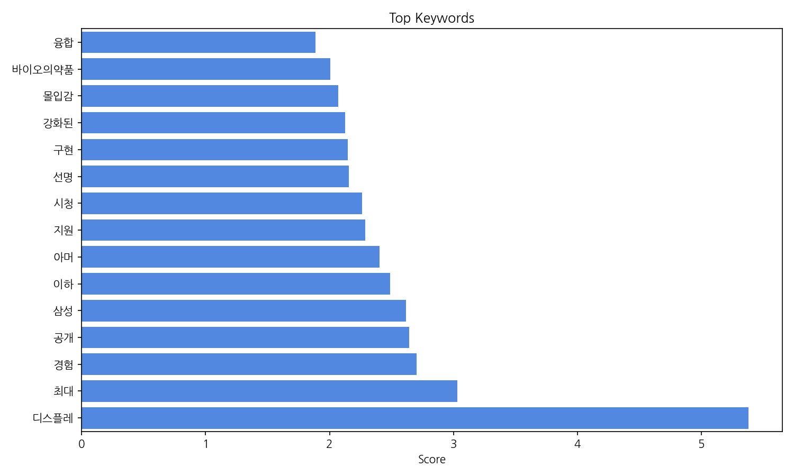
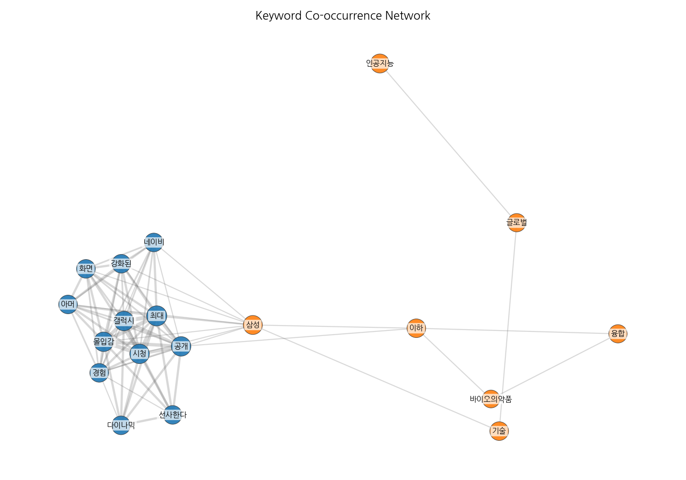
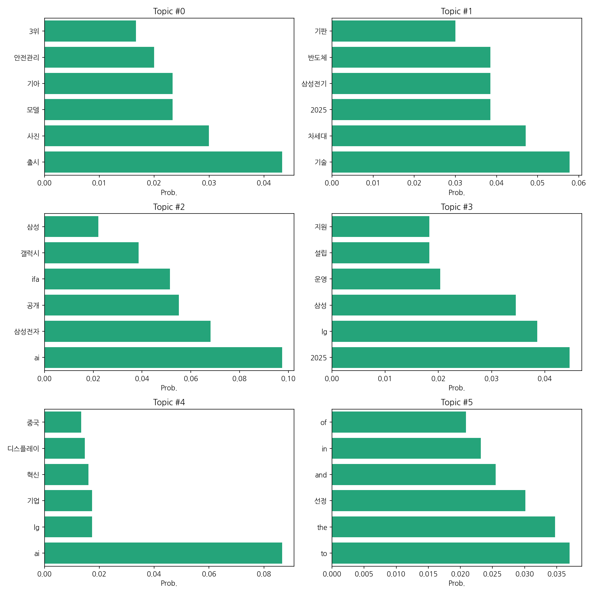
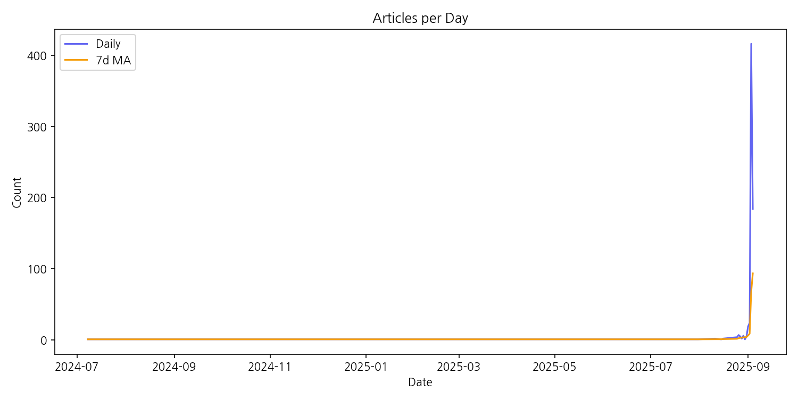

# Weekly/New Biz Report (2025-09-04)

## Executive Summary

- 이번 기간 핵심 토픽과 키워드, 주요 시사점을 요약합니다.

1. 핵심 맥락 설명:  데이터는 크게 자동차, 반도체, AI, 그리고 삼성과 LG의 사업 전략 및 경쟁 구도를 보여줍니다.  자동차 분야는 기아의 EV5 출시와 관련된 소식이 주를 이루고 있으며, 반도체는 삼성전기와 LG이노텍을 중심으로 차세대 기술 경쟁이 뜨겁습니다.  AI는 삼성전자와 LG전자의 AI 기술 개발 및 적용과 관련된 뉴스가 많으며,  마지막으로 삼성과 LG는 2025년을 목표로 한 유럽 시장 진출 및 사업 확장 전략에 대한 기사가 다수 포함되어 있습니다. 이러한 주제들은 한국 주요 기업들의 미래 성장 동력과 관련된 내용을 담고 있습니다.

2. 최근 변화/스파이크: 2025년 9월 3일을 기점으로 기사 수가 급격하게 증가하는 스파이크 현상이 나타났습니다. 이는 특정 이벤트 또는 뉴스 발표로 인해 해당 시점에 관련 기사들이 집중적으로 보도되었음을 시사합니다.

3. 실무 인사이트:

* **긴급 상황 대응 매뉴얼 준비:** 2025년 9월 초의 급격한 기사 증가는 예측 불가능한 이벤트 발생 가능성을 보여줍니다.  이에 대비하여 긴급 상황 발생 시 신속하게 대응할 수 있는 매뉴얼을 준비하고 관련 부서 간 소통 채널을 강화해야 합니다.  특히, 언론 보도 모니터링 시스템을 강화하여 이벤트 발생을 조기에 감지하고 대응할 수 있도록 해야 합니다.
* **주요 이벤트 예측 및 분석 강화:**  9월 초 기사 급증의 원인을 분석하여 향후 유사한 이벤트 발생 가능성을 예측하고,  미리 대응 전략을 수립해야 합니다.  주요 기업들의 사업 전략 및 경쟁 동향을 면밀히 분석하고,  잠재적 위험 요소와 기회 요소를 파악하여 선제적으로 대응하는 전략을 마련해야 합니다.
* **데이터 기반 의사결정 시스템 구축:**  뉴스 기사 데이터를 분석하여 시장 트렌드와 여론 변화를 파악하고, 이를 기반으로 효율적인 의사결정을 내릴 수 있는 시스템을 구축해야 합니다.  기사 분석 결과를 활용하여 마케팅 전략을 개선하고,  투자 결정에 대한 근거를 마련해야 합니다.

## Key Metrics

- 문서 수: 27
- 키워드 수(상위): 15
- 토픽 수: 6
- 시계열 데이터 일자 수: 25

## Top Keywords

| Rank | Keyword | Score |
|---:|---|---:|
| 1 | 디스플레 | 5.381 |
| 2 | 최대 | 3.029 |
| 3 | 경험 | 2.702 |
| 4 | 공개 | 2.643 |
| 5 | 삼성 | 2.617 |
| 6 | 이하 | 2.487 |
| 7 | 아머 | 2.402 |
| 8 | 지원 | 2.289 |
| 9 | 시청 | 2.264 |
| 10 | 선명 | 2.154 |
| 11 | 구현 | 2.149 |
| 12 | 강화된 | 2.125 |
| 13 | 몰입감 | 2.071 |
| 14 | 바이오의약품 | 2.005 |
| 15 | 융합 | 1.887 |

## Topics

- Topic #0: 출시, 사진, 모델, 기아, 안전관리, 3위
- Topic #1: 기술, 차세대, 2025, 삼성전기, 반도체, 기판
- Topic #2: ai, 삼성전자, 공개, ifa, 갤럭시, 삼성
- Topic #3: 2025, lg, 삼성, 운영, 설립, 지원
- Topic #4: ai, lg, 기업, 혁신, 디스플레이, 중국
- Topic #5: to, the, 선정, and, in, of

## Trend

- 최근 14~30일 기사 수 추세와 7일 이동평균선을 제공합니다.

## Insights

1. 핵심 맥락 설명:  데이터는 크게 자동차, 반도체, AI, 그리고 삼성과 LG의 사업 전략 및 경쟁 구도를 보여줍니다.  자동차 분야는 기아의 EV5 출시와 관련된 소식이 주를 이루고 있으며, 반도체는 삼성전기와 LG이노텍을 중심으로 차세대 기술 경쟁이 뜨겁습니다.  AI는 삼성전자와 LG전자의 AI 기술 개발 및 적용과 관련된 뉴스가 많으며,  마지막으로 삼성과 LG는 2025년을 목표로 한 유럽 시장 진출 및 사업 확장 전략에 대한 기사가 다수 포함되어 있습니다. 이러한 주제들은 한국 주요 기업들의 미래 성장 동력과 관련된 내용을 담고 있습니다.

2. 최근 변화/스파이크: 2025년 9월 3일을 기점으로 기사 수가 급격하게 증가하는 스파이크 현상이 나타났습니다. 이는 특정 이벤트 또는 뉴스 발표로 인해 해당 시점에 관련 기사들이 집중적으로 보도되었음을 시사합니다.

3. 실무 인사이트:

* **긴급 상황 대응 매뉴얼 준비:** 2025년 9월 초의 급격한 기사 증가는 예측 불가능한 이벤트 발생 가능성을 보여줍니다.  이에 대비하여 긴급 상황 발생 시 신속하게 대응할 수 있는 매뉴얼을 준비하고 관련 부서 간 소통 채널을 강화해야 합니다.  특히, 언론 보도 모니터링 시스템을 강화하여 이벤트 발생을 조기에 감지하고 대응할 수 있도록 해야 합니다.
* **주요 이벤트 예측 및 분석 강화:**  9월 초 기사 급증의 원인을 분석하여 향후 유사한 이벤트 발생 가능성을 예측하고,  미리 대응 전략을 수립해야 합니다.  주요 기업들의 사업 전략 및 경쟁 동향을 면밀히 분석하고,  잠재적 위험 요소와 기회 요소를 파악하여 선제적으로 대응하는 전략을 마련해야 합니다.
* **데이터 기반 의사결정 시스템 구축:**  뉴스 기사 데이터를 분석하여 시장 트렌드와 여론 변화를 파악하고, 이를 기반으로 효율적인 의사결정을 내릴 수 있는 시스템을 구축해야 합니다.  기사 분석 결과를 활용하여 마케팅 전략을 개선하고,  투자 결정에 대한 근거를 마련해야 합니다.

## Opportunities (Top 5)

| Idea | Target | Value Prop | Score |
|---|---|---|---:|
| AI 기반 맞춤형 유럽 시장 진출 전략 컨설팅 | 유럽 시장 진출을 계획 중인 한국 중소/중견기업 (특히, IT, 소비재 분야) | AI 기반 데이터 분석을 통해 기업별 맞춤형 시장 진출 전략을 제시합니다. 경쟁사 분석, 시장 트렌드 예측, 현지화 전략 수립,  리스크 관리 등을 지원하여 성공적인 유럽 시장 진출을 돕습니다.  기존 컨설팅보다 빠르고 효율적인 서비스 제공을 통해 비용 절감 효과를 제공합니다. | 3.8 |
| AI 기반 맞춤형 디스플레이 광고 플랫폼 | 대형 야외 디스플레이를 운영하는 기업 (쇼핑몰, 지하철역, 공항 등) 및 광고 대행사 | AI 기반 실시간 데이터 분석을 통해 타겟 고객에게 최적화된 광고를 제공하여 광고 효율을 극대화합니다.  야외 환경에 최적화된 고해상도 이미지 및 영상 광고를 지원하며,  실시간 광고 성과 측정 및 분석 기능을 제공하여 광고 효과를 명확하게 확인할 수 있습니다. 경쟁사 대비 AI 기반의 정교한 타겟팅과 실시간 데이터 반영으로 높은 광고 전환율을 보장합니다. | 3.8 |
| AI 기반 맞춤형 스마트팩토리 솔루션 | 중소 제조기업 (특히, 전자부품, 자동차 부품 제조업체) | AI 기반의 저렴하고 사용하기 쉬운 스마트팩토리 솔루션을 제공하여 생산성 향상, 불량률 감소, 유지보수 비용 절감을 지원합니다.  클라우드 기반의 SaaS 모델로 초기 투자 비용을 낮추고, 사용자 친화적인 인터페이스로 쉽게 도입 및 운영할 수 있습니다.  실시간 데이터 분석 및 예측 기능을 통해 생산 계획 및 관리의 효율성을 극대화합니다. | 3.8 |
| AI 기반 맞춤형 스마트팜 솔루션 | 중소 규모 스마트팜 운영 농가 (특히, 채소, 과일 재배 농가) | AI 기반의 정밀 환경 제어 및 예측 시스템을 통해 작물 생육 최적화 및 생산성 향상을 지원합니다.  농가의 노동력 감소 및 관리 효율 증대를 통해 수익성을 높이고, 데이터 기반의 의사결정을 지원하여 위험 관리를 강화합니다. 경쟁 솔루션 대비 저렴한 초기 투자 비용과 사용 편의성을 제공합니다. | 3.8 |
| AI 기반 맞춤형 스마트 헬스케어 솔루션 | 만성 질환자(고혈압, 당뇨병 등)를 보유한 50대 이상 중장년층 개인 및 가족 | AI 기반 개인 맞춤형 건강 관리 솔루션을 통해 사용자의 건강 데이터를 분석하고, 개인별 맞춤형 건강 관리 계획을 제공합니다.  웨어러블 기기와의 연동을 통해 실시간 건강 상태를 모니터링하고, 이상 징후 발생 시 즉각적인 알림을 제공하여 의료 서비스 접근성을 높입니다.  비대면 상담 및 건강 교육 서비스를 제공하여 편리하고 효율적인 건강 관리를 지원합니다.  경쟁 솔루션 대비 AI 기반의 정확한 예측 및 개인 맞춤형 관리로 차별화를 제공합니다. | 3.8 |

## Appendix

- 데이터: keywords.json, topics.json, trend_timeseries.json, trend_insights.json, biz_opportunities.json