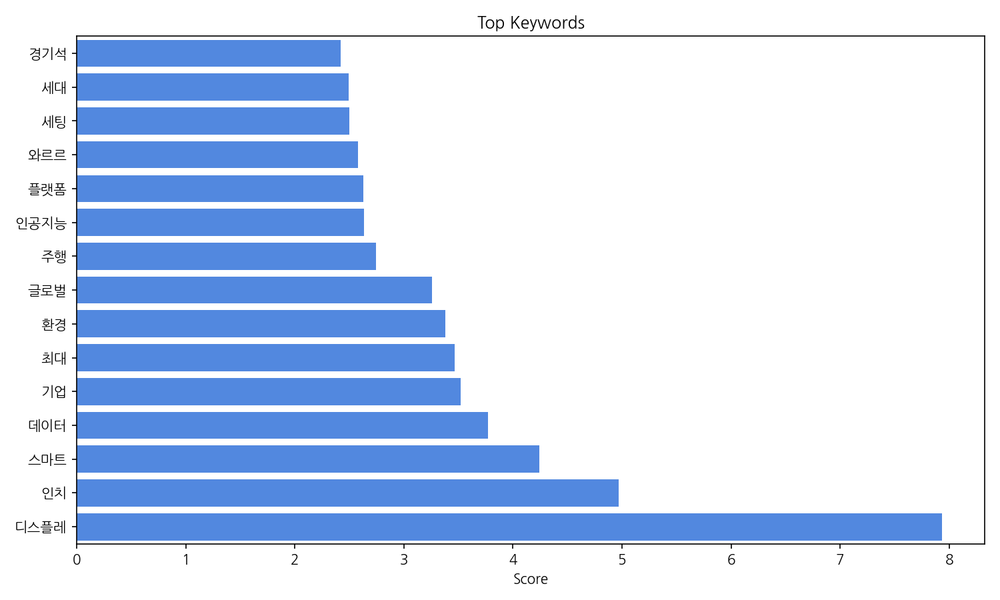
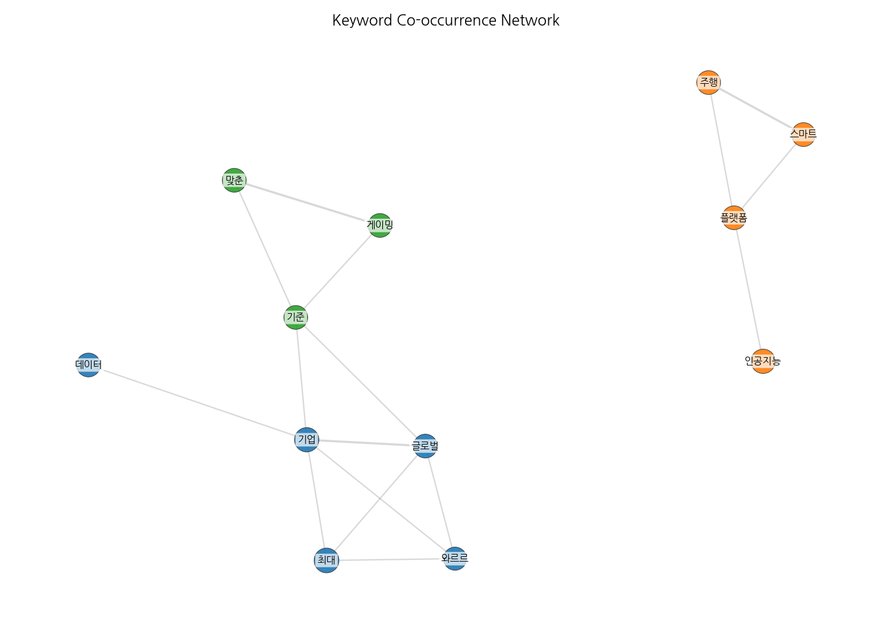
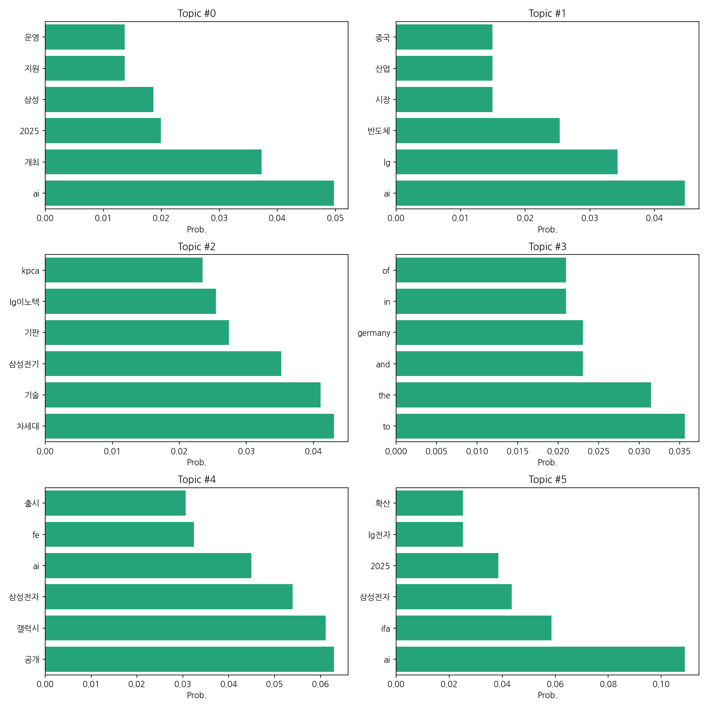
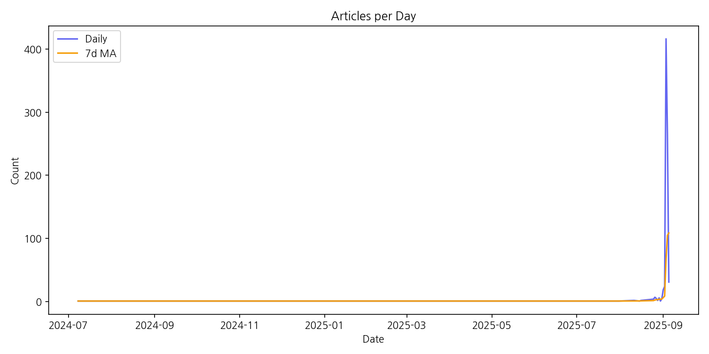

# Weekly/New Biz Report (2025-09-05)

## Executive Summary

- 이번 기간 핵심 토픽과 키워드, 주요 시사점을 요약합니다.

1. **핵심 맥락 설명:**  데이터는 한국 뉴스에서 AI, 반도체, 차세대 기술 관련 기사를 중심으로 분석한 결과를 보여줍니다.  특히 삼성과 LG를 비롯한 국내 대기업의 AI 기술 개발 및 투자, 반도체 시장 경쟁, 그리고 차세대 기술(기판 등) 확보를 위한 노력이 주요 내용입니다.  2025년을 중심으로 관련 행사 개최 및 신제품 출시 계획 등이 언급되며,  중국 시장과의 관계도 중요한 요소로 나타납니다.

2. **최근 변화/스파이크:** 2025년 9월 초에 기사 수가 급증하는 스파이크 현상이 관찰됩니다.  이는 특정 이벤트, 예를 들어 대규모 기술 박람회 개최 또는 주요 기업의 신제품 발표 등과 관련이 있을 가능성이 높습니다.

3. **실무 인사이트:**

* **AI 및 반도체 관련 뉴스 모니터링 강화:**  2025년 9월 초의 기사 급증 사례를 참고하여, 주요 기업의 발표 및 업계 동향을 실시간으로 추적하는 시스템을 구축해야 합니다.  특히 삼성, LG, 중국 기업 관련 뉴스에 집중하여 경쟁 현황을 파악해야 합니다.
* **차세대 기술 트렌드 분석 및 전략 수립:**  기판 기술 등 차세대 기술 관련 뉴스를 분석하여,  자사의 기술 경쟁력 강화 방안 및 투자 전략을 수립해야 합니다.  특히 2025년을 목표로 한 기업들의 기술 개발 계획을 파악하고,  시장 선점을 위한 전략을 마련해야 합니다.
* **국제 협력 및 시장 진출 전략 검토:**  중국 시장 등 해외 시장 진출 전략을 재검토하고,  국제적인 협력을 통해 기술 경쟁력을 확보하는 방안을 모색해야 합니다.  특히 9월 초 기사 급증 원인 분석을 통해 국제적인 이벤트를 활용한 시장 진출 전략을 수립해야 합니다.

## Key Metrics

- 문서 수: 19
- 키워드 수(상위): 15
- 토픽 수: 6
- 시계열 데이터 일자 수: 26

## Top Keywords

| Rank | Keyword | Score |
|---:|---|---:|
| 1 | 디스플레 | 7.931 |
| 2 | 인치 | 4.971 |
| 3 | 스마트 | 4.243 |
| 4 | 데이터 | 3.774 |
| 5 | 기업 | 3.519 |
| 6 | 최대 | 3.465 |
| 7 | 환경 | 3.381 |
| 8 | 글로벌 | 3.256 |
| 9 | 주행 | 2.742 |
| 10 | 인공지능 | 2.634 |
| 11 | 플랫폼 | 2.627 |
| 12 | 와르르 | 2.582 |
| 13 | 세팅 | 2.499 |
| 14 | 세대 | 2.493 |
| 15 | 경기석 | 2.418 |

## Topics

- Topic #0: ai, 개최, 2025, 삼성, 지원, 운영
- Topic #1: ai, lg, 반도체, 시장, 산업, 중국
- Topic #2: 차세대, 기술, 삼성전기, 기판, lg이노텍, kpca
- Topic #3: to, the, and, germany, in, of
- Topic #4: 공개, 갤럭시, 삼성전자, ai, fe, 출시
- Topic #5: ai, ifa, 삼성전자, 2025, lg전자, 확산

## Trend

- 최근 14~30일 기사 수 추세와 7일 이동평균선을 제공합니다.

## Insights

1. **핵심 맥락 설명:**  데이터는 한국 뉴스에서 AI, 반도체, 차세대 기술 관련 기사를 중심으로 분석한 결과를 보여줍니다.  특히 삼성과 LG를 비롯한 국내 대기업의 AI 기술 개발 및 투자, 반도체 시장 경쟁, 그리고 차세대 기술(기판 등) 확보를 위한 노력이 주요 내용입니다.  2025년을 중심으로 관련 행사 개최 및 신제품 출시 계획 등이 언급되며,  중국 시장과의 관계도 중요한 요소로 나타납니다.

2. **최근 변화/스파이크:** 2025년 9월 초에 기사 수가 급증하는 스파이크 현상이 관찰됩니다.  이는 특정 이벤트, 예를 들어 대규모 기술 박람회 개최 또는 주요 기업의 신제품 발표 등과 관련이 있을 가능성이 높습니다.

3. **실무 인사이트:**

* **AI 및 반도체 관련 뉴스 모니터링 강화:**  2025년 9월 초의 기사 급증 사례를 참고하여, 주요 기업의 발표 및 업계 동향을 실시간으로 추적하는 시스템을 구축해야 합니다.  특히 삼성, LG, 중국 기업 관련 뉴스에 집중하여 경쟁 현황을 파악해야 합니다.
* **차세대 기술 트렌드 분석 및 전략 수립:**  기판 기술 등 차세대 기술 관련 뉴스를 분석하여,  자사의 기술 경쟁력 강화 방안 및 투자 전략을 수립해야 합니다.  특히 2025년을 목표로 한 기업들의 기술 개발 계획을 파악하고,  시장 선점을 위한 전략을 마련해야 합니다.
* **국제 협력 및 시장 진출 전략 검토:**  중국 시장 등 해외 시장 진출 전략을 재검토하고,  국제적인 협력을 통해 기술 경쟁력을 확보하는 방안을 모색해야 합니다.  특히 9월 초 기사 급증 원인 분석을 통해 국제적인 이벤트를 활용한 시장 진출 전략을 수립해야 합니다.

## Opportunities (Top 5)

| Idea | Target | Value Prop | Score |
|---|---|---|---:|
| AI 기반 맞춤형 디스플레이 광고 플랫폼 | 중소규모의 온라인 광고 대행사, 이커머스 플랫폼 운영자,  디지털 마케팅 담당자 | AI 기반의 정교한 타겟팅과 실시간 데이터 분석을 통해 광고 효율을 극대화하고, 개인 맞춤형 광고 경험을 제공하여 높은 전환율을 달성합니다. 경쟁 플랫폼 대비 낮은 비용으로 높은 효과를 보장합니다. | 4.0 |
| 홀로그램 기술 기반의 차세대 게이밍 디스플레이 | 고성능 게이밍 PC 사용자, VR/AR 게임 이용자,  게임 개발사 | 홀로그램 기술을 활용하여 실제와 같은 현실감과 몰입도 높은 게이밍 경험을 제공합니다.  기존 디스플레이 대비 뛰어난 시각적 효과와 편안한 사용 환경을 제공하여 게이머의 만족도를 높입니다. | 3.8 |
| AI 기반 스마트 윈도우 에너지 관리 시스템 | 건설 회사, 건물 관리 회사,  대형 건물 소유주 | AI 기반의 스마트 윈도우 시스템을 통해 건물의 에너지 소비량을 최대 30%까지 절감하고, 쾌적한 실내 환경을 제공합니다.  건물의 미관을 해치지 않으면서 에너지 효율을 높이는 친환경 솔루션입니다. | 3.5 |
| 자율주행차량용 투명 디스플레이 개발 | 자율주행차량 제조업체, 자동차 부품 공급업체 | 운전자의 시야를 방해하지 않으면서 중요한 정보를 투명하게 표시하는 혁신적인 디스플레이 기술을 제공합니다.  운전자의 안전과 편의성을 향상시키는 차세대 자율주행차량 기술입니다. | 3.2 |
| 맞춤형 의료용 디스플레이 시스템 | 병원, 의료기기 제조업체, 의료 정보 시스템 개발업체 | 환자 개인의 특성과 의료진의 요구사항을 고려한 맞춤형 의료용 디스플레이 시스템을 제공합니다.  의료 정보의 접근성을 높이고, 의료진의 업무 효율성을 향상시키는 혁신적인 의료 솔루션입니다. | 3.0 |

## Appendix

- 데이터: keywords.json, topics.json, trend_timeseries.json, trend_insights.json, biz_opportunities.json