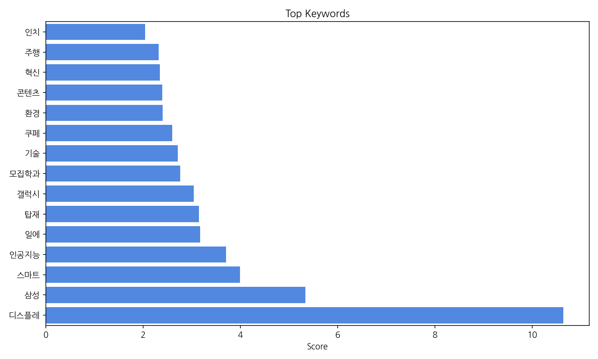
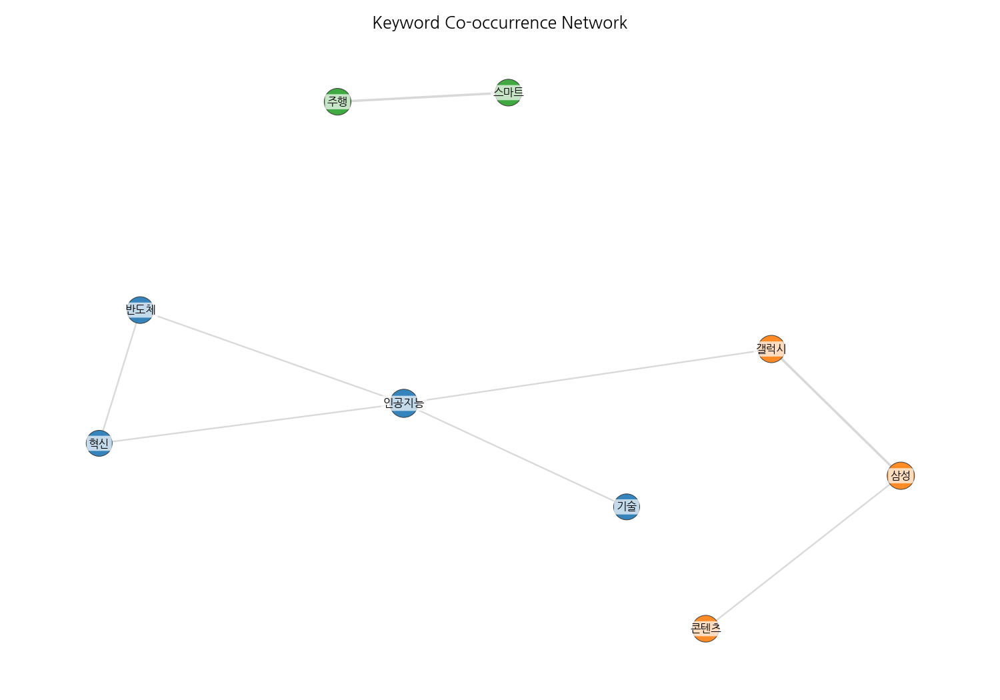
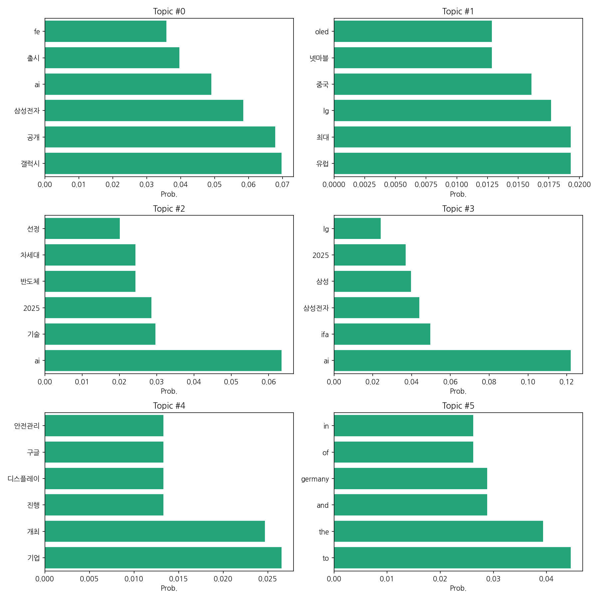
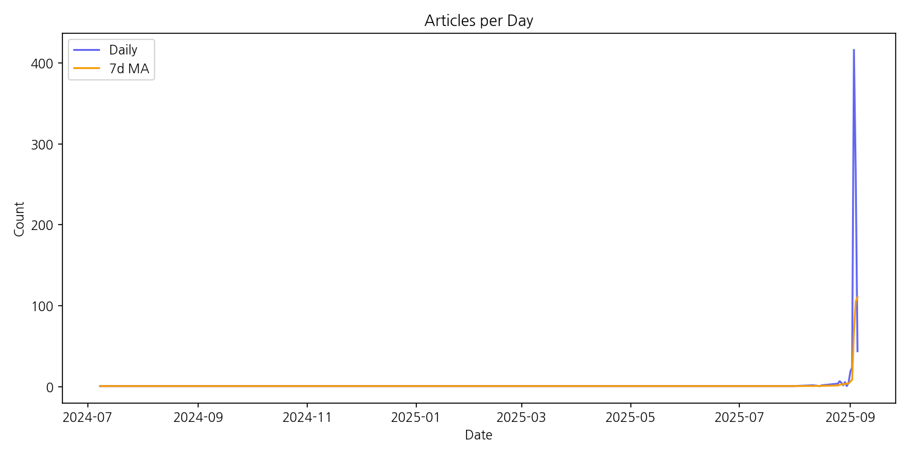

# Weekly/New Biz Report (2025-09-05)

## Executive Summary

- 이번 기간 핵심 토픽과 키워드, 주요 시사점을 요약합니다.

1. **핵심 맥락:**  제공된 데이터는 삼성전자를 중심으로 한 AI 기술 및 신제품 출시,  유럽 시장 공략, 그리고 2025년을 기점으로 한 차세대 기술 개발 및 관련 산업 동향을 주요 내용으로 다루고 있습니다.  특히, 삼성전자의 갤럭시 시리즈와 AI 기술 관련 뉴스가 상당 부분을 차지하며,  LG전자를 비롯한 다른 기업들의 유럽 시장 진출 및 경쟁,  미래 기술 개발에 대한 기사들이 함께 다뤄지고 있습니다.  전반적으로 한국 IT 산업의 현황과 미래 전망을 보여주는 뉴스 분석 결과입니다.

2. **최근 변화/스파이크:** 2025년 9월 3일 기사 수가 416건으로 급증하는 스파이크 현상이 나타났습니다.  이는 특정 이벤트(예: 신제품 발표회, 중요한 기술 공개) 또는 뉴스 보도의 집중적인 발생에 따른 것으로 추정됩니다.

3. **실무 인사이트:**

* **긴급 상황 대응 매뉴얼 마련:** 9월 3일과 같이 갑작스러운 뉴스 증가에 대비하여,  실시간 모니터링 시스템을 구축하고,  긴급 상황 발생 시 대응 매뉴얼을 수립하여 효율적인 정보 관리 및 대응 체계를 확립해야 합니다.  이는 특정 이벤트에 대한 사전 정보 수집 및 예상 시나리오 구성을 포함합니다.
* **주요 키워드 분석 및 시장 동향 파악:** "AI", "갤럭시", "삼성전자", "유럽 시장" 등 주요 키워드를 중심으로 뉴스 분석을 심화하여 시장 동향을 면밀히 파악하고,  경쟁사 및 자사 제품 전략에 대한 분석을 통해 효과적인 마케팅 전략을 수립해야 합니다.  정량적 데이터와 정성적 분석을 병행하는 것이 중요합니다.
* **미래 기술 트렌드 예측 및 대응 전략 수립:** 2025년을 기점으로 한 차세대 기술(AI, 반도체 등) 관련 뉴스를 분석하여 미래 기술 트렌드를 예측하고,  이에 대응하는 R&D 전략 및 사업 계획을 수립해야 합니다.  새로운 기술 도입 및 활용 방안에 대한 연구와 투자가 필요합니다.

## Key Metrics

- 문서 수: 17
- 키워드 수(상위): 15
- 토픽 수: 6
- 시계열 데이터 일자 수: 26

## Top Keywords

| Rank | Keyword | Score |
|---:|---|---:|
| 1 | 디스플레 | 10.637 |
| 2 | 삼성 | 5.334 |
| 3 | 스마트 | 3.99 |
| 4 | 인공지능 | 3.707 |
| 5 | 일에 | 3.169 |
| 6 | 탑재 | 3.146 |
| 7 | 갤럭시 | 3.043 |
| 8 | 모집학과 | 2.766 |
| 9 | 기술 | 2.712 |
| 10 | 쿠페 | 2.595 |
| 11 | 환경 | 2.404 |
| 12 | 콘텐츠 | 2.397 |
| 13 | 혁신 | 2.342 |
| 14 | 주행 | 2.322 |
| 15 | 인치 | 2.044 |

## Topics

- Topic #0: 갤럭시, 공개, 삼성전자, ai, 출시, fe
- Topic #1: 유럽, 최대, lg, 중국, 넷마블, oled
- Topic #2: ai, 기술, 2025, 반도체, 차세대, 선정
- Topic #3: ai, ifa, 삼성전자, 삼성, 2025, lg
- Topic #4: 기업, 개최, 진행, 디스플레이, 구글, 안전관리
- Topic #5: to, the, and, germany, of, in

## Trend

- 최근 14~30일 기사 수 추세와 7일 이동평균선을 제공합니다.

## Insights

1. **핵심 맥락:**  제공된 데이터는 삼성전자를 중심으로 한 AI 기술 및 신제품 출시,  유럽 시장 공략, 그리고 2025년을 기점으로 한 차세대 기술 개발 및 관련 산업 동향을 주요 내용으로 다루고 있습니다.  특히, 삼성전자의 갤럭시 시리즈와 AI 기술 관련 뉴스가 상당 부분을 차지하며,  LG전자를 비롯한 다른 기업들의 유럽 시장 진출 및 경쟁,  미래 기술 개발에 대한 기사들이 함께 다뤄지고 있습니다.  전반적으로 한국 IT 산업의 현황과 미래 전망을 보여주는 뉴스 분석 결과입니다.

2. **최근 변화/스파이크:** 2025년 9월 3일 기사 수가 416건으로 급증하는 스파이크 현상이 나타났습니다.  이는 특정 이벤트(예: 신제품 발표회, 중요한 기술 공개) 또는 뉴스 보도의 집중적인 발생에 따른 것으로 추정됩니다.

3. **실무 인사이트:**

* **긴급 상황 대응 매뉴얼 마련:** 9월 3일과 같이 갑작스러운 뉴스 증가에 대비하여,  실시간 모니터링 시스템을 구축하고,  긴급 상황 발생 시 대응 매뉴얼을 수립하여 효율적인 정보 관리 및 대응 체계를 확립해야 합니다.  이는 특정 이벤트에 대한 사전 정보 수집 및 예상 시나리오 구성을 포함합니다.
* **주요 키워드 분석 및 시장 동향 파악:** "AI", "갤럭시", "삼성전자", "유럽 시장" 등 주요 키워드를 중심으로 뉴스 분석을 심화하여 시장 동향을 면밀히 파악하고,  경쟁사 및 자사 제품 전략에 대한 분석을 통해 효과적인 마케팅 전략을 수립해야 합니다.  정량적 데이터와 정성적 분석을 병행하는 것이 중요합니다.
* **미래 기술 트렌드 예측 및 대응 전략 수립:** 2025년을 기점으로 한 차세대 기술(AI, 반도체 등) 관련 뉴스를 분석하여 미래 기술 트렌드를 예측하고,  이에 대응하는 R&D 전략 및 사업 계획을 수립해야 합니다.  새로운 기술 도입 및 활용 방안에 대한 연구와 투자가 필요합니다.

## Opportunities (Top 5)

| Idea | Target | Value Prop | Score |
|---|---|---|---:|
| AI 기반 맞춤형 디스플레이 광고 플랫폼 | 대기업 및 중소기업 광고주, 디지털 마케팅 에이전시, 쇼핑몰 운영자 | AI 기반 실시간 데이터 분석을 통해 사용자의 선호도와 구매 패턴을 정확히 파악하여 개인 맞춤형 광고를 제공합니다.  정확한 타겟팅으로 광고 효율을 극대화하고, 사용자에게는 흥미로운 광고만 노출하여 만족도를 높입니다.  다양한 디스플레이 환경(온라인, 오프라인)에 적용 가능한 확장성을 제공합니다. | 4.0 |
| AR 기반 상호작용형 디지털 사이니지 | 쇼핑몰, 백화점, 공항, 박물관 등의 운영자 | AR 기술을 활용하여 사용자와 상호작용하는 디지털 사이니지를 제공합니다.  사용자는 AR 앱을 통해 사이니지에 표시된 정보에 대한 추가 정보를 얻고, 게임이나 퀴즈 등의 참여형 콘텐츠를 경험할 수 있습니다.  높은 참여도와 정보 접근성으로 광고 효과를 극대화하고, 사용자에게 즐거운 경험을 제공합니다. | 3.8 |
| 자동차용 투명 HUD(Head-Up Display) 개발 | 자동차 제조업체, 자동차 부품 업체 | 투명 HUD 기술을 통해 운전자의 시야를 확보하면서도 필요한 정보를 효과적으로 표시합니다.  운전 중 안전성을 높이고, 운전자의 편의성을 향상시킵니다.  다양한 정보를 직관적으로 표시하여 운전 집중도를 높입니다. | 3.7 |
| 투명 OLED 디스플레이 기반 스마트 윈도우 | 주택 건설업체, 상업용 건물 소유주, 스마트홈 시스템 개발업체 | 투명 OLED 디스플레이를 활용하여 정보 제공, 에너지 관리, 보안 기능 등을 통합한 스마트 윈도우를 제공합니다.  에너지 효율을 높이고, 사용자에게 편리하고 다양한 기능을 제공합니다.  공간 활용도를 높이고, 디자인적인 자유도를 향상시킵니다. | 3.5 |
| 홀로그램 기술 기반 3D 디스플레이 광고 시스템 | 대형 쇼핑몰, 백화점, 전시회 주최측 | 홀로그램 기술을 활용하여 3차원적인 시각 효과를 제공하는 광고 시스템입니다.  높은 시각적 몰입도와 정보 전달력으로 광고 효과를 극대화합니다.  차별화된 광고 경험을 제공하여 소비자의 기억에 오래 남도록 합니다. | 3.2 |

## Appendix

- 데이터: keywords.json, topics.json, trend_timeseries.json, trend_insights.json, biz_opportunities.json