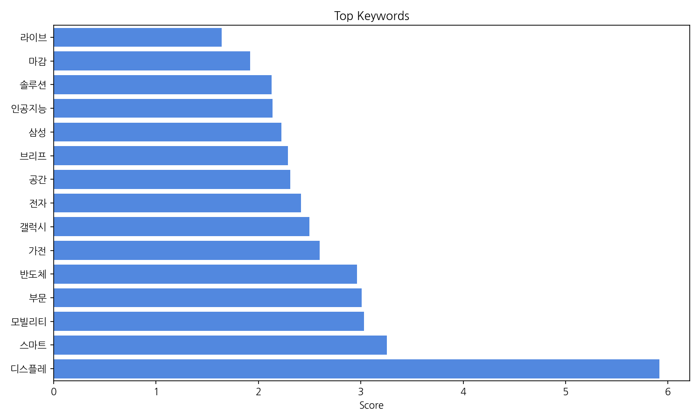
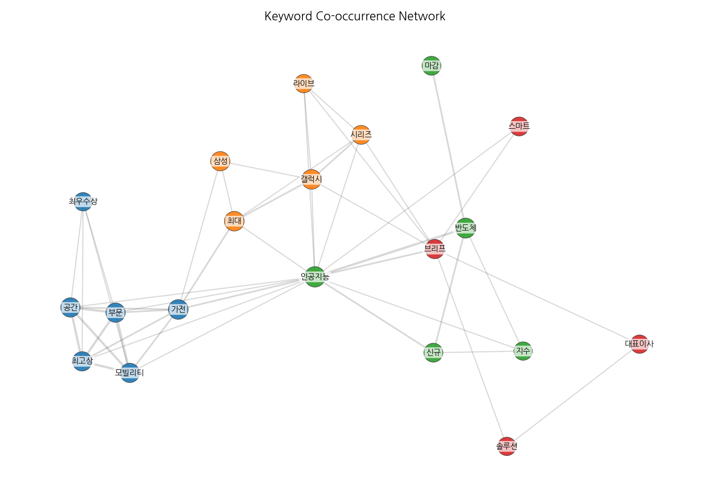
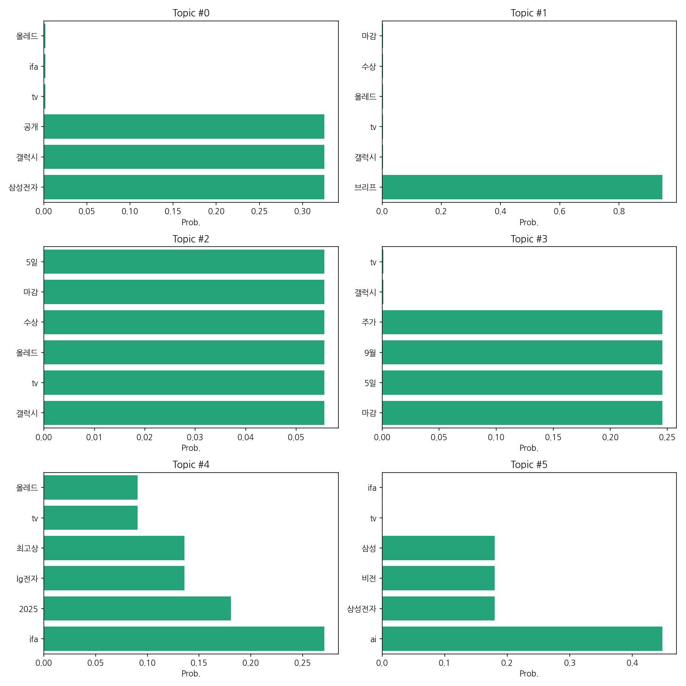
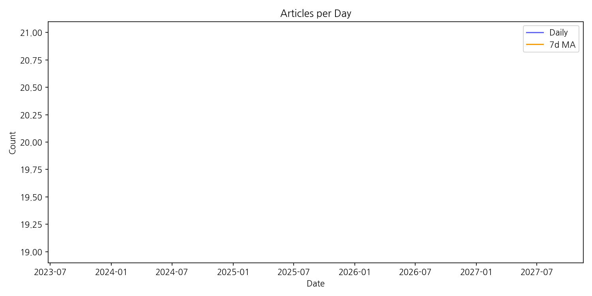

# Weekly/New Biz Report (2025-09-05)

## Executive Summary

- 이번 기간 핵심 토픽과 키워드, 주요 시사점을 요약합니다.

1) 상위 토픽들을 묶어 핵심 맥락을 설명하면,  2025년 9월 5일 IFA에서 삼성전자와 LG전자의 TV, 특히 올레드 TV 수상 및 관련 주가 변동에 대한 뉴스가 집중적으로 보도되었음을 알 수 있습니다.  삼성전자의 갤럭시 관련 소식과 IFA 2025 행사 소식이 주요 내용을 이루며,  주요 키워드인 '갤럭시', 'TV', '올레드', '수상', 'IFA', '주가'를 중심으로 다양한 각도에서 보도가 이루어졌습니다.  이는 IFA 행사의 중요성과 삼성전자와 LG전자의 경쟁 구도, 그리고 이에 따른 시장 영향을 보여줍니다.

2) 최근 변화/스파이크는 2025년 9월 5일 단 하루에 20건의 관련 기사가 쏟아진 점입니다. 이는 IFA 2025 행사에서 삼성전자와 LG전자의 올레드 TV 수상 결과 발표 직후 급증한 기사량으로 해석되며,  관련 업계의 높은 관심과 시장의 즉각적인 반응을 보여줍니다.

3) 실무 인사이트 3가지:

* **IFA 2025 관련 뉴스 모니터링 강화:**  행사 전후로 관련 키워드(삼성전자, LG전자, 올레드 TV, IFA 2025, 갤럭시 등)를 활용하여 실시간 뉴스 트렌드를 파악하고, 경쟁사 동향 및 시장 반응을 신속하게 분석하는 시스템을 구축합니다.
* **주가 변동 예측 및 대응 전략 수립:**  IFA 행사와 같은 주요 이벤트를 전후하여 주가 변동에 대한 예측 모델을 개발하고,  긍정적/부정적 시나리오에 따른 대응 전략을 미리 준비하여 리스크를 최소화합니다.
* **소셜 미디어 분석을 통한 여론 및 소비자 반응 파악:**  온라인 커뮤니티, 소셜 미디어 등을 통해 소비자들의 제품 반응, 브랜드 이미지 변화 등을 실시간으로 모니터링하고,  이를 바탕으로 마케팅 전략을 수정 및 보완합니다.

## Key Metrics

- 문서 수: 20
- 키워드 수(상위): 15
- 토픽 수: 6
- 시계열 데이터 일자 수: 1

## Top Keywords

| Rank | Keyword | Score |
|---:|---|---:|
| 1 | 디스플레 | 5.915 |
| 2 | 스마트 | 3.254 |
| 3 | 모빌리티 | 3.029 |
| 4 | 부문 | 3.009 |
| 5 | 반도체 | 2.963 |
| 6 | 가전 | 2.599 |
| 7 | 갤럭시 | 2.496 |
| 8 | 전자 | 2.416 |
| 9 | 공간 | 2.31 |
| 10 | 브리프 | 2.289 |
| 11 | 삼성 | 2.226 |
| 12 | 인공지능 | 2.136 |
| 13 | 솔루션 | 2.128 |
| 14 | 마감 | 1.92 |
| 15 | 라이브 | 1.64 |

## Topics

- Topic #0: 삼성전자, 갤럭시, 공개, tv, ifa, 올레드
- Topic #1: 브리프, 갤럭시, tv, 올레드, 수상, 마감
- Topic #2: 갤럭시, tv, 올레드, 수상, 마감, 5일
- Topic #3: 마감, 5일, 9월, 주가, 갤럭시, tv
- Topic #4: ifa, 2025, lg전자, 최고상, tv, 올레드
- Topic #5: ai, 삼성전자, 비전, 삼성, tv, ifa

## Trend

- 최근 14~30일 기사 수 추세와 7일 이동평균선을 제공합니다.

## Insights

1) 상위 토픽들을 묶어 핵심 맥락을 설명하면,  2025년 9월 5일 IFA에서 삼성전자와 LG전자의 TV, 특히 올레드 TV 수상 및 관련 주가 변동에 대한 뉴스가 집중적으로 보도되었음을 알 수 있습니다.  삼성전자의 갤럭시 관련 소식과 IFA 2025 행사 소식이 주요 내용을 이루며,  주요 키워드인 '갤럭시', 'TV', '올레드', '수상', 'IFA', '주가'를 중심으로 다양한 각도에서 보도가 이루어졌습니다.  이는 IFA 행사의 중요성과 삼성전자와 LG전자의 경쟁 구도, 그리고 이에 따른 시장 영향을 보여줍니다.

2) 최근 변화/스파이크는 2025년 9월 5일 단 하루에 20건의 관련 기사가 쏟아진 점입니다. 이는 IFA 2025 행사에서 삼성전자와 LG전자의 올레드 TV 수상 결과 발표 직후 급증한 기사량으로 해석되며,  관련 업계의 높은 관심과 시장의 즉각적인 반응을 보여줍니다.

3) 실무 인사이트 3가지:

* **IFA 2025 관련 뉴스 모니터링 강화:**  행사 전후로 관련 키워드(삼성전자, LG전자, 올레드 TV, IFA 2025, 갤럭시 등)를 활용하여 실시간 뉴스 트렌드를 파악하고, 경쟁사 동향 및 시장 반응을 신속하게 분석하는 시스템을 구축합니다.
* **주가 변동 예측 및 대응 전략 수립:**  IFA 행사와 같은 주요 이벤트를 전후하여 주가 변동에 대한 예측 모델을 개발하고,  긍정적/부정적 시나리오에 따른 대응 전략을 미리 준비하여 리스크를 최소화합니다.
* **소셜 미디어 분석을 통한 여론 및 소비자 반응 파악:**  온라인 커뮤니티, 소셜 미디어 등을 통해 소비자들의 제품 반응, 브랜드 이미지 변화 등을 실시간으로 모니터링하고,  이를 바탕으로 마케팅 전략을 수정 및 보완합니다.

## Opportunities (Top 5)

| Idea | Target | Value Prop | Score |
|---|---|---|---:|
| 투명 OLED 디스플레이를 활용한 스마트 윈도우 | 스마트 오피스, 고급 주거 공간 건설사, 건축 설계 회사, 부동산 개발 업체 (중견 이상) | 투명 OLED 디스플레이를 활용하여 창문 자체가 정보 디스플레이 및 에너지 관리 시스템으로 활용 가능합니다. 실시간 정보 제공, 개인 맞춤형 설정, 에너지 효율 향상을 통해 사용자 편의성과 건물 가치를 높입니다. 기존 건축 자재와의 호환성을 높여 시공의 편의성을 제공합니다. | 4.0 |
| AR 글래스 기반의 산업 현장용 실시간 정보 시스템 | 제조업체, 건설업체, 물류업체 등 산업 현장 작업자 (대기업 및 중견기업) | AR 글래스를 통해 작업자에게 필요한 정보를 실시간으로 제공하여 작업 효율을 높이고 안전사고를 예방합니다. 작업 지시, 설비 정보, 안전 수칙 등을 시각적으로 제공하여 작업의 정확성과 안전성을 향상시킵니다. | 3.8 |
| 차량용 OLED 디스플레이를 활용한 증강현실 내비게이션 시스템 | 자동차 제조업체, 자동차 부품 업체, 자동차 애프터마켓 (대기업) | 차량용 OLED 디스플레이를 활용하여 운전자의 시야를 방해하지 않으면서 중요한 정보를 투영하여 안전하고 편리한 운전 환경을 제공합니다. 증강현실 기술을 통해 실제 도로 정보와 내비게이션 정보를 결합하여 직관적인 길 안내를 제공합니다. | 3.5 |
| 맞춤형 디스플레이 광고 솔루션 | 소상공인, 중소기업, 프랜차이즈 본사 (중소기업) | 고객의 특성과 매장 위치에 맞춰 최적화된 디지털 광고를 제공합니다. AI 기반의 타겟팅 기술과 실시간 효과 측정 시스템을 통해 광고 효율을 극대화하고, 합리적인 가격으로 광고 서비스를 제공합니다. | 3.2 |
| 웨어러블 디스플레이 기반의 스마트 의류 | 패션 업체, 스포츠 용품 업체, 의료기기 업체 (중견 이상) | 웨어러블 디스플레이를 활용하여 다양한 기능을 제공하는 편안하고 스타일리쉬한 스마트 의류를 개발합니다. 심박수, 체온 등의 건강 정보를 실시간으로 모니터링하고, 사용자의 활동량에 맞춰 기능을 조절합니다. 세련된 디자인과 편안한 착용감을 제공하여 일상생활에서 자연스럽게 사용할 수 있습니다. | 3.0 |

## Appendix

- 데이터: keywords.json, topics.json, trend_timeseries.json, trend_insights.json, biz_opportunities.json