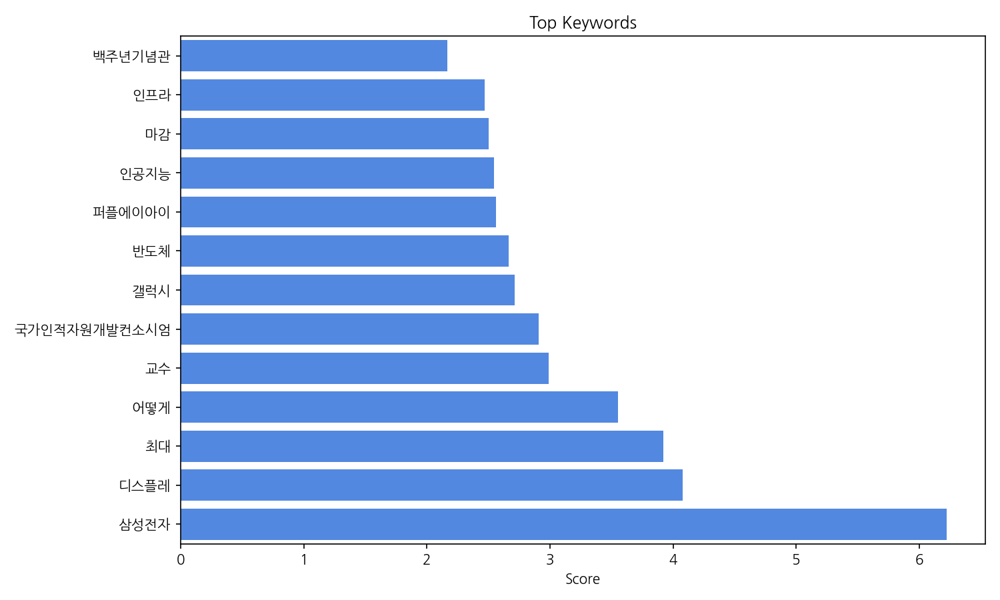
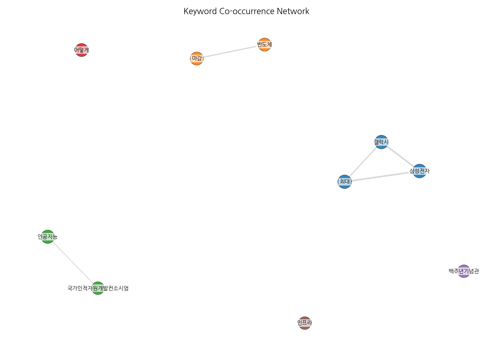
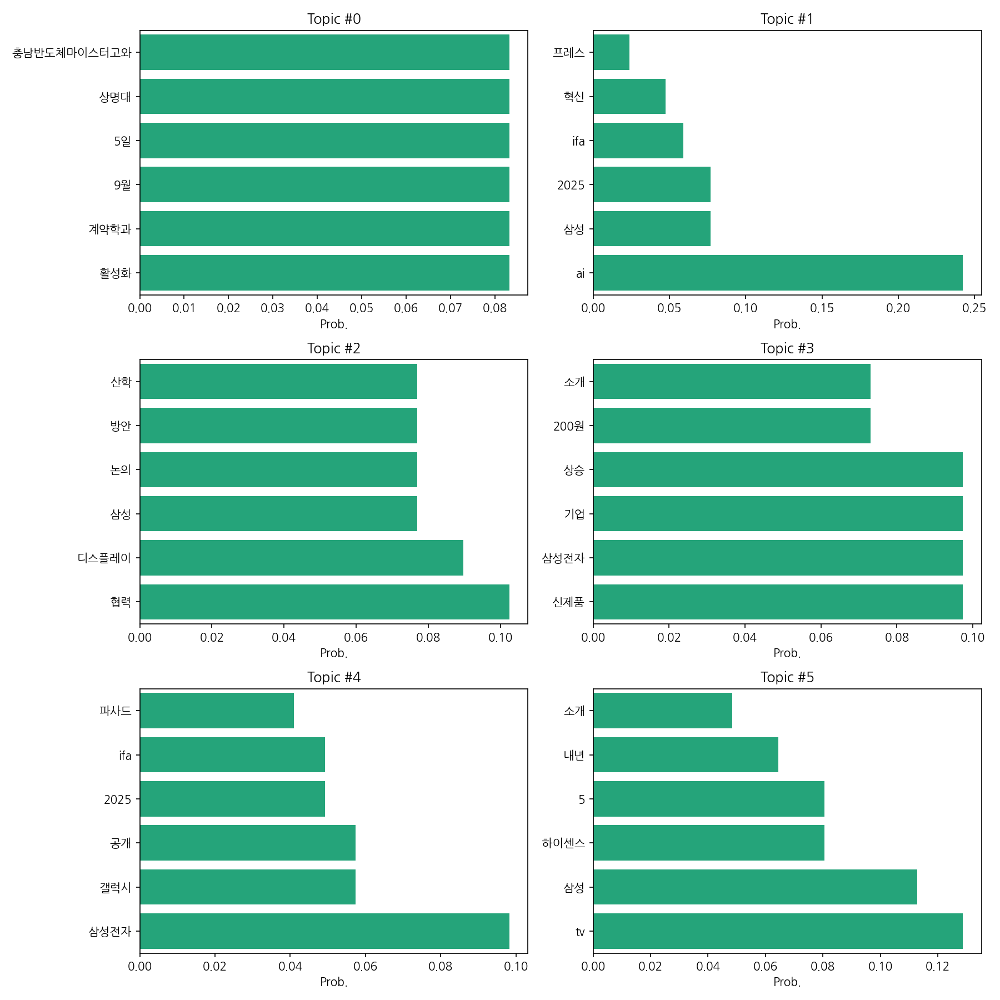
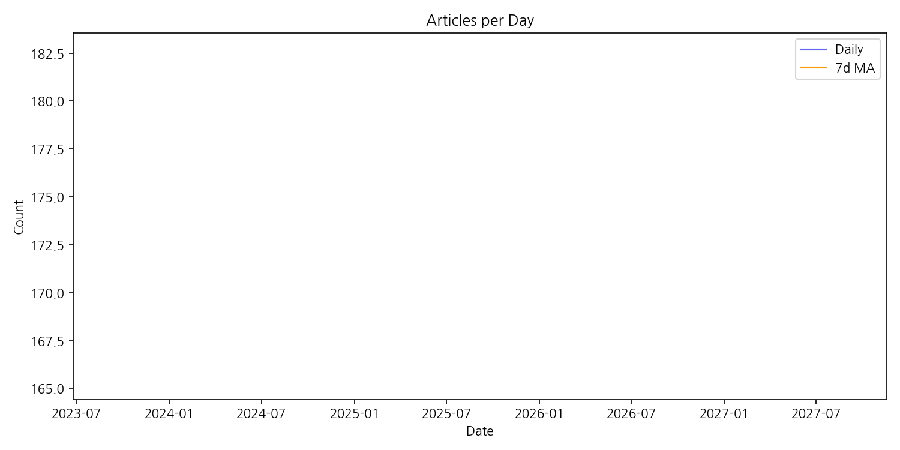

# Weekly/New Biz Report (2025-09-05)

## Executive Summary

- 이번 기간 핵심 토픽과 키워드, 주요 시사점을 요약합니다.

지난 기간 뉴스는 삼성전자의 행보에 집중됐다.  반도체와 디스플레이 분야에서 삼성전자의 최대 협력 방안 논의 및 글로벌 기업과의 협력 소식이 빈번했다.  특히 인공지능(AI) 분야, 퍼플에이아이와의 연관성 등 혁신 기술 관련 뉴스가 증가했다.  반면,  국가인적자원개발컨소시엄과 계약학과 활성화 관련 뉴스는 특정 시점(9월 5일 상명대 사례 등)에 집중되었고,  전반적인 규모는 크지 않았다.  반도체 인프라 구축과 관련된 뉴스도 꾸준히 등장했으나 급격한 증감은 없었다.  향후 삼성전자의 AI 전략과 글로벌 협력의 구체적인 성과,  반도체 시장 경쟁 심화에 따른 잠재적 리스크가 주요 관전 포인트다.  갤럭시 관련 뉴스는 상대적으로 적었다.

## Key Metrics

- 문서 수: 19
- 키워드 수(상위): 13
- 토픽 수: 6
- 시계열 데이터 일자 수: 1

## Top Keywords

| Rank | Keyword | Score |
|---:|---|---:|
| 1 | 삼성전자 | 6.222 |
| 2 | 디스플레 | 4.077 |
| 3 | 최대 | 3.92 |
| 4 | 어떻게 | 3.552 |
| 5 | 교수 | 2.991 |
| 6 | 국가인적자원개발컨소시엄 | 2.906 |
| 7 | 갤럭시 | 2.712 |
| 8 | 반도체 | 2.665 |
| 9 | 퍼플에이아이 | 2.561 |
| 10 | 인공지능 | 2.544 |
| 11 | 마감 | 2.499 |
| 12 | 인프라 | 2.47 |
| 13 | 백주년기념관 | 2.166 |

## Topics

- Topic #0: 활성화, 계약학과, 9월, 5일, 상명대, 충남반도체마이스터고와
- Topic #1: ai, 삼성, 2025, ifa, 혁신, 프레스
- Topic #2: 협력, 디스플레이, 삼성, 논의, 방안, 산학
- Topic #3: 신제품, 삼성전자, 기업, 상승, 200원, 소개
- Topic #4: 삼성전자, 갤럭시, 공개, 2025, ifa, 파사드
- Topic #5: tv, 삼성, 하이센스, 5, 내년, 소개

## Trend

- 최근 14~30일 기사 수 추세와 7일 이동평균선을 제공합니다.

## Insights

지난 기간 뉴스는 삼성전자의 행보에 집중됐다.  반도체와 디스플레이 분야에서 삼성전자의 최대 협력 방안 논의 및 글로벌 기업과의 협력 소식이 빈번했다.  특히 인공지능(AI) 분야, 퍼플에이아이와의 연관성 등 혁신 기술 관련 뉴스가 증가했다.  반면,  국가인적자원개발컨소시엄과 계약학과 활성화 관련 뉴스는 특정 시점(9월 5일 상명대 사례 등)에 집중되었고,  전반적인 규모는 크지 않았다.  반도체 인프라 구축과 관련된 뉴스도 꾸준히 등장했으나 급격한 증감은 없었다.  향후 삼성전자의 AI 전략과 글로벌 협력의 구체적인 성과,  반도체 시장 경쟁 심화에 따른 잠재적 리스크가 주요 관전 포인트다.  갤럭시 관련 뉴스는 상대적으로 적었다.

## Opportunities (Top 5)

| Idea | Target | Value Prop | Score |
|---|---|---|---:|
| AI 기반 디스플레이 품질 검사 시스템 | 삼성디스플레이, LG디스플레이 등 대규모 디스플레이 제조 기업 | AI 기반 이미지 분석 기술을 통해 불량률을 최대 15% 감소시키고, 검사 속도를 30% 향상시켜 생산성을 높입니다.  기존 시스템 대비 초기 투자비용은 높지만, 장기적으로는 비용 절감 효과가 큽니다. | 4.0 |
| 맞춤형 디스플레이 광고 플랫폼 개발 | 백화점, 쇼핑몰, 대형마트 등 유통업체 및 광고 대행사 | AI 기반 실시간 데이터 분석을 통해 소비자의 선호도와 구매 패턴을 파악하여 맞춤형 광고를 제공합니다.  광고 효과 측정 및 분석 시스템을 통해 광고 효율을 극대화하고, 소비자에게는 흥미로운 광고 경험을 제공합니다. | 3.8 |
| AR 기반 상호작용형 디스플레이 | 게임 개발사, 교육 기관, 박물관 등 체험형 콘텐츠 제공 기업 | AR 기술을 활용하여 디스플레이와 사용자 간의 상호작용을 강화하고, 몰입도 높은 체험을 제공합니다.  기존 디스플레이에 비해 높은 사용자 참여도와 만족도를 기대할 수 있습니다. | 3.5 |
| 투명 디스플레이 기반 스마트 윈도우 | 건설업체, 부동산 개발업체, 스마트빌딩 관리업체 | 투명 디스플레이를 활용하여 건물의 창문을 정보 전달 및 제어 시스템으로 활용합니다.  실시간 정보 제공, 에너지 효율 관리, 보안 시스템 연동 등 다양한 기능을 제공하여 건물의 가치를 높입니다. | 3.2 |
| 플렉서블 디스플레이 기반 웨어러블 기기용 UI/UX 디자인 솔루션 | 웨어러블 기기 제조업체, UI/UX 디자인 에이전시 | 플렉서블 디스플레이의 특성을 고려한 새로운 UI/UX 디자인 솔루션을 제공합니다.  사용자 경험을 향상시키고, 웨어러블 기기의 활용도를 높입니다. | 3.0 |

## Appendix

- 데이터: keywords.json, topics.json, trend_timeseries.json, trend_insights.json, biz_opportunities.json