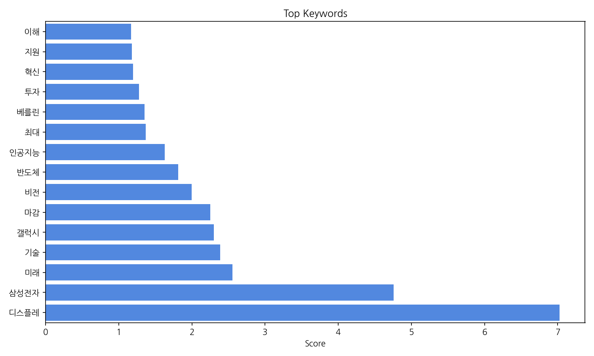
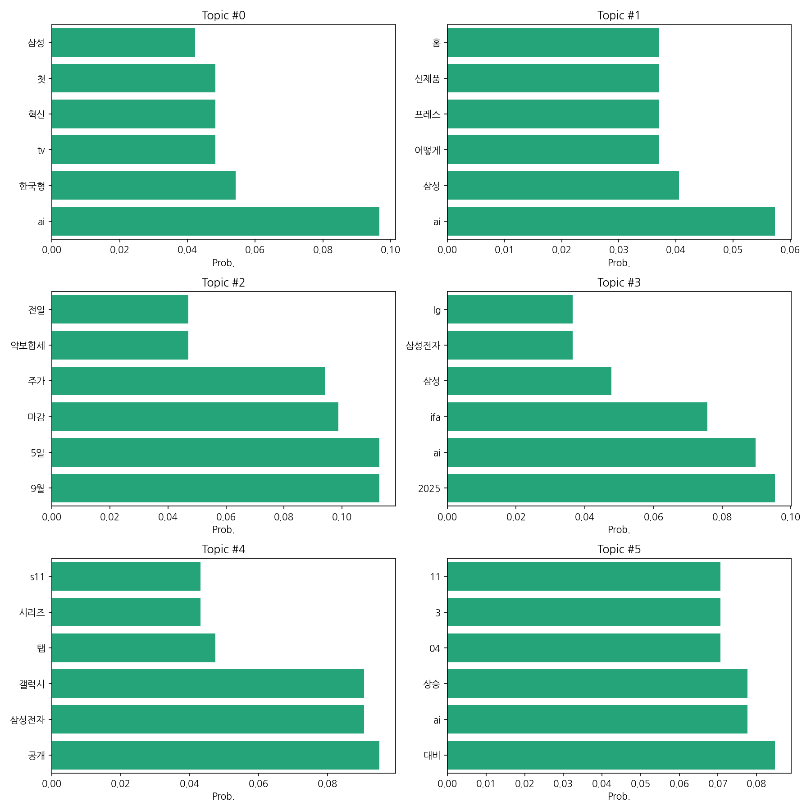
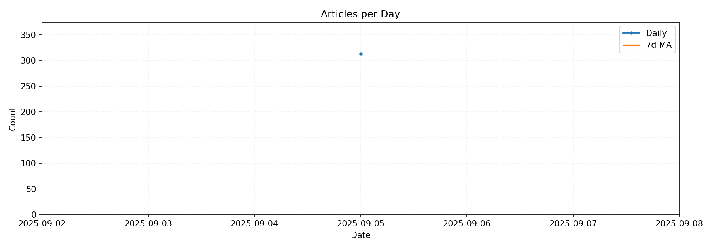

# Weekly/New Biz Report (2025-09-05)

## Executive Summary
- 이번 기간 핵심 토픽과 키워드, 주요 시사점을 요약합니다.

지난 기간 뉴스는 삼성전자의 디스플레이 기술과 미래 비전에 대한 보도가 압도적으로 많았다.  특히 갤럭시 신제품 발표와 관련된 인공지능 기술 및 베를린 행사 소식이 주를 이뤘다.  반도체 관련 뉴스는 상대적으로 적었으며,  주가는 약보합세를 유지했다는 보도가 있었다.  투자 관련 뉴스도 일부 있었으나,  구체적인 수치는 제시되지 않았다.  'AI'와 '삼성'이라는 키워드가 반복적으로 등장하며 미래 기술에 대한 기대감과 함께 잠재적 리스크에 대한 우려도 함께 나타났다.  다음 주에는 삼성전자의 신제품 출시 후 시장 반응과 주가 변동이 주요 관전 포인트가 될 것으로 예상된다.  전반적으로 삼성전자의 미래 기술 투자와 그에 따른 시장 영향력 변화가 주요 뉴스 트렌드였다.

## Key Metrics
- 문서 수: 313
- 키워드 수(상위): 15
- 토픽 수: 6
- 시계열 데이터 일자 수: 1

## Top Keywords

| Rank | Keyword | Score |
|---:|---|---:|
| 1 | 디스플레 | 7.023 |
| 2 | 삼성전자 | 4.755 |
| 3 | 미래 | 2.553 |
| 4 | 기술 | 2.388 |
| 5 | 갤럭시 | 2.301 |
| 6 | 마감 | 2.251 |
| 7 | 비전 | 1.995 |
| 8 | 반도체 | 1.812 |
| 9 | 인공지능 | 1.626 |
| 10 | 최대 | 1.367 |
| 11 | 베를린 | 1.350 |
| 12 | 투자 | 1.276 |
| 13 | 혁신 | 1.198 |
| 14 | 지원 | 1.181 |
| 15 | 이해 | 1.169 |

## Topics
- Topic #0: ai, 한국형, tv, 혁신, 첫, 삼성
- Topic #1: ai, 삼성, 어떻게, 프레스, 신제품, 홈
- Topic #2: 9월, 5일, 마감, 주가, 약보합세, 전일
- Topic #3: 2025, ai, ifa, 삼성, 삼성전자, lg
- Topic #4: 공개, 삼성전자, 갤럭시, 탭, 시리즈, s11
- Topic #5: 대비, ai, 상승, 04, 3, 11

## Trend
- 최근 14~30일 기사 수 추세와 7일 이동평균선을 제공합니다.

## Insights
지난 기간 뉴스는 삼성전자의 디스플레이 기술과 미래 비전에 대한 보도가 압도적으로 많았다.  특히 갤럭시 신제품 발표와 관련된 인공지능 기술 및 베를린 행사 소식이 주를 이뤘다.  반도체 관련 뉴스는 상대적으로 적었으며,  주가는 약보합세를 유지했다는 보도가 있었다.  투자 관련 뉴스도 일부 있었으나,  구체적인 수치는 제시되지 않았다.  'AI'와 '삼성'이라는 키워드가 반복적으로 등장하며 미래 기술에 대한 기대감과 함께 잠재적 리스크에 대한 우려도 함께 나타났다.  다음 주에는 삼성전자의 신제품 출시 후 시장 반응과 주가 변동이 주요 관전 포인트가 될 것으로 예상된다.  전반적으로 삼성전자의 미래 기술 투자와 그에 따른 시장 영향력 변화가 주요 뉴스 트렌드였다.

- 분석 기간: 2025-09-05 ~ 2025-09-05 (총 1일), 일별 최대 기사 수: 313건
- 상위 키워드 샘플: 디스플레, 삼성전자, 미래, 기술, 갤럭시, 마감, 비전, 반도체
- 토픽 샘플: Topic#0: ai, 한국형, tv, 혁신, 첫, 삼성 | Topic#1: ai, 삼성, 어떻게, 프레스, 신제품, 홈 | Topic#2: 9월, 5일, 마감, 주가, 약보합세, 전일

## Opportunities (Top 5)

| Idea | Target | Value Prop | Score |
|---|---|---|---:|
| 고해상도 마이크로 LED 기반의 의료용 디스플레이 | 병원, 의료기기 제조업체 | 고해상도 마이크로 LED 기술을 활용하여 의료 영상의 정확성과 선명도를 극대화한다.  뛰어난 색 재현율로 정밀한 진단 및 수술을 지원한다.  수술실 환경에 적합한 내구성과 안정성을 갖추었다. | 4.2 |
| AI 기반 맞춤형 디스플레이 광고 플랫폼 | 대기업 광고주, 중소기업 광고주, 디지털 광고 대행사 | AI 기반 실시간 데이터 분석으로 개인별 선호도에 맞춘 초개인화 광고를 제공한다.  개인정보보호를 준수하며, 정교한 타겟팅으로 광고 효율을 극대화하고 광고주 ROI를 높인다.  다양한 디스플레이 환경(옥외, 실내, 모바일)에 적용 가능하다. | 4.0 |
| 홀로그램 기술 기반의 박물관/전시 체험 시스템 | 박물관, 미술관, 전시 주최 기관, 문화재청 등 공공기관 | 홀로그램 기술을 활용하여 역사적 인물, 유물 등을 생생하게 재현하고, 관람객 참여형 인터랙티브 전시를 제공한다.  실감나는 체험으로 관람객 만족도를 높이고, 교육적 효과를 극대화한다.  공간 효율성을 높이고, 새로운 수익 모델 창출 가능성이 있다. | 3.8 |
| 투명 디스플레이 기반 스마트 윈도우 | 건설업체, 건물 관리 회사, 스마트시티 구축 기업 | 투명 디스플레이를 활용하여 건물 창문에 실시간 정보(날씨, 교통, 뉴스 등)를 표시하고, 에너지 관리 시스템과 연동하여 에너지 효율을 높인다.  건물 디자인의 미적 가치를 높이고, 스마트 건물 구축에 기여한다.  새로운 광고 플랫폼으로 활용 가능하다. | 3.5 |
| AR 기반의 맞춤형 교육 콘텐츠 플랫폼 | 교육기관, 학원, 개인 학습자 | AR 기술을 활용하여 현실 세계와 가상 세계를 융합한 실감나는 교육 콘텐츠를 제공한다.  학습자의 개별 학습 수준과 속도에 맞춘 맞춤형 학습 경험을 제공한다.  학습 효과를 측정하고, 실시간 피드백을 제공한다. | 3.2 |

## Appendix
- 생성시각: 2025-09-05T13:26:08Z
