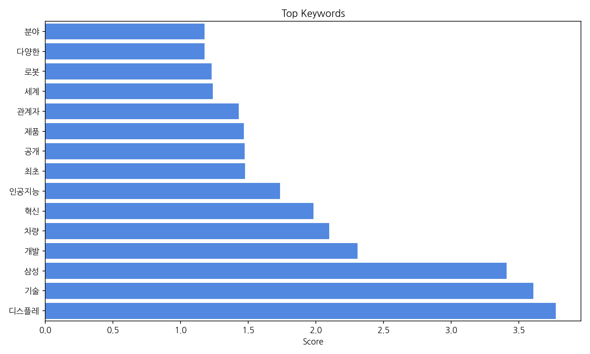
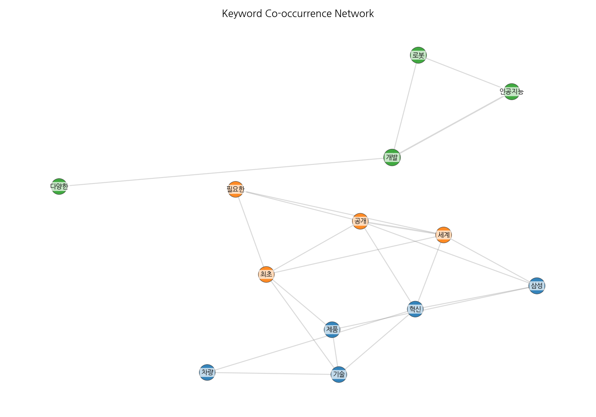
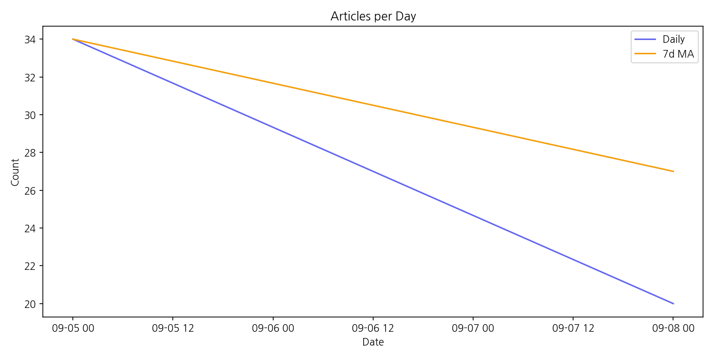

# Weekly/New Biz Report (2025-09-08)

## Executive Summary

- 이번 기간 핵심 토픽과 키워드, 주요 시사점을 요약합니다.

1) 상위 토픽을 3개 주제로 묶어 핵심 맥락을 설명하면 다음과 같습니다.  첫째, AI 기술과 관련된 삼성전자와 LG전자의 IFA 2025 참가 및 미래 비전 제시가 주요 뉴스를 차지했습니다.  둘째, 쿠팡의 브리프 발표 및 주가 변동과 같은 기업 관련 뉴스가 다수를 차지했습니다.  셋째,  9월 주가 동향 및 2025년 전망 등 시장 상황에 대한 보도가 상당 부분을 차지하며, 특히 AI 기술과 관련된 기업들의 성과와 미래 전망에 대한 관심이 높았습니다.

2) 최근 변화/스파이크를 살펴보면, 9월 5일 기사 수가 34건으로 9월 8일 20건 대비 14건 증가했습니다.  이는 IFA 2025 행사 개최 및 관련 기업들의 성과 발표가 집중된 시점으로 보이며, 이후 기사 수가 감소한 것으로 보입니다.

3) 실무 인사이트 3가지:

* **AI 기술 동향 모니터링 강화:** 삼성전자, LG전자 등 주요 기업의 AI 관련 발표 및 기술 개발 현황을 지속적으로 모니터링하고, 경쟁사 분석을 통해 시장 경쟁력 확보 전략을 수립해야 합니다.  특히 IFA와 같은 주요 전시회를 통해 얻을 수 있는 정보를 적극적으로 활용해야 합니다.
* **주요 기업 주가 및 시장 동향 분석:** 쿠팡과 같은 주요 기업의 주가 변동 및 시장 상황을 면밀히 분석하여 투자 전략 및 사업 전략 수립에 활용해야 합니다.  주가 변동의 원인을 다각적으로 분석하고, 미래 전망을 예측하는 모델을 구축하는 것이 중요합니다.
* **2025년 미래 전략 수립:** 2025년을 목표로 한 기업들의 미래 비전 및 전략을 분석하여, 자사의 사업 전략과 연계하여 시너지를 창출할 수 있는 방안을 모색해야 합니다.  특히 AI 기술을 활용한 미래 전략 수립에 대한 고려가 필요합니다.

## Key Metrics

- 문서 수: 20
- 키워드 수(상위): 15
- 토픽 수: 6
- 시계열 데이터 일자 수: 2

## Top Keywords

| Rank | Keyword | Score |
|---:|---|---:|
| 1 | 디스플레 | 3.771 |
| 2 | 기술 | 3.606 |
| 3 | 삼성 | 3.41 |
| 4 | 개발 | 2.307 |
| 5 | 차량 | 2.099 |
| 6 | 혁신 | 1.983 |
| 7 | 인공지능 | 1.735 |
| 8 | 최초 | 1.477 |
| 9 | 공개 | 1.473 |
| 10 | 제품 | 1.468 |
| 11 | 관계자 | 1.431 |
| 12 | 세계 | 1.239 |
| 13 | 로봇 | 1.229 |
| 14 | 다양한 | 1.178 |
| 15 | 분야 | 1.178 |

## Topics

- Topic #0: ai, 2025, 비전, 삼성, ifa, 삼성전자
- Topic #1: 위한, 개최, 브리프, 쿠팡, 최대, 5일
- Topic #2: 9월, 주가, 5일, ai, 마감, 대비
- Topic #3: ifa, lg전자, 최고상, tv, 수상, 올레드
- Topic #4: 미래, 갤럭시, 주가, 5일, 마감, 대비
- Topic #5: 공개, iaa, 갤럭시, 삼성전자, suv, 전기

## Trend

- 최근 14~30일 기사 수 추세와 7일 이동평균선을 제공합니다.

## Insights

1) 상위 토픽을 3개 주제로 묶어 핵심 맥락을 설명하면 다음과 같습니다.  첫째, AI 기술과 관련된 삼성전자와 LG전자의 IFA 2025 참가 및 미래 비전 제시가 주요 뉴스를 차지했습니다.  둘째, 쿠팡의 브리프 발표 및 주가 변동과 같은 기업 관련 뉴스가 다수를 차지했습니다.  셋째,  9월 주가 동향 및 2025년 전망 등 시장 상황에 대한 보도가 상당 부분을 차지하며, 특히 AI 기술과 관련된 기업들의 성과와 미래 전망에 대한 관심이 높았습니다.

2) 최근 변화/스파이크를 살펴보면, 9월 5일 기사 수가 34건으로 9월 8일 20건 대비 14건 증가했습니다.  이는 IFA 2025 행사 개최 및 관련 기업들의 성과 발표가 집중된 시점으로 보이며, 이후 기사 수가 감소한 것으로 보입니다.

3) 실무 인사이트 3가지:

* **AI 기술 동향 모니터링 강화:** 삼성전자, LG전자 등 주요 기업의 AI 관련 발표 및 기술 개발 현황을 지속적으로 모니터링하고, 경쟁사 분석을 통해 시장 경쟁력 확보 전략을 수립해야 합니다.  특히 IFA와 같은 주요 전시회를 통해 얻을 수 있는 정보를 적극적으로 활용해야 합니다.
* **주요 기업 주가 및 시장 동향 분석:** 쿠팡과 같은 주요 기업의 주가 변동 및 시장 상황을 면밀히 분석하여 투자 전략 및 사업 전략 수립에 활용해야 합니다.  주가 변동의 원인을 다각적으로 분석하고, 미래 전망을 예측하는 모델을 구축하는 것이 중요합니다.
* **2025년 미래 전략 수립:** 2025년을 목표로 한 기업들의 미래 비전 및 전략을 분석하여, 자사의 사업 전략과 연계하여 시너지를 창출할 수 있는 방안을 모색해야 합니다.  특히 AI 기술을 활용한 미래 전략 수립에 대한 고려가 필요합니다.

## Opportunities (Top 5)

| Idea | Target | Value Prop | Score |
|---|---|---|---:|
| 자율주행차량용 투명 OLED 디스플레이 | 자율주행차량 제조업체, 자동차 부품 공급업체 (연구개발 부서, 100명 이상) | 투명 OLED를 활용하여 운전자의 시야를 확보하면서 필요한 정보를 투영하는 혁신적인 디스플레이 시스템입니다. 기존 HUD보다 넓은 시야각과 높은 해상도를 제공하며, 야간 주행 시에도 우수한 시인성을 보장합니다. | 4.0 |
| 맞춤형 의료 정보 제공을 위한 병원용 투명 OLED 디스플레이 | 대형 병원, 의료기기 공급업체 (IT 부서, 50-100명) | 투명 OLED 디스플레이를 활용하여 환자의 병상에 필요한 의료 정보를 투영하여 제공합니다.  환자의 불안감을 해소하고 의료진의 업무 효율을 높입니다.  개인 맞춤형 정보 제공으로 환자 만족도를 향상시킵니다. | 3.9 |
| AI 기반 맞춤형 디스플레이 광고 플랫폼 | 백화점, 쇼핑몰, 대형마트 등 유통업체 마케팅 부서 (50명 이상) | AI 기반의 실시간 데이터 분석을 통해 소비자의 선호도와 구매 패턴을 파악하여 맞춤형 광고를 제공합니다.  정확한 타겟팅과 효과 측정으로 광고 효율을 극대화하고, 소비자에게는 흥미로운 광고 경험을 제공합니다. | 3.8 |
| AR 글래스용 초소형 마이크로 LED 디스플레이 | AR 글래스 제조업체,  소비자 가전 제조업체 (연구개발 부서, 50-100명) | 초소형 마이크로 LED 기술을 활용하여 기존 AR 글래스보다 훨씬 가볍고 작으면서도 높은 해상도와 넓은 시야각을 제공합니다.  착용감을 개선하고 사용자 경험을 향상시킵니다. | 3.5 |
| 홀로그램 디스플레이 기반의 스마트 미러 | 가구 제조업체,  건설업체,  호텔 등 숙박업체 (구매 담당자, 100명 이상) | 홀로그램 디스플레이 기술을 활용하여 3차원적인 정보를 표현하고, 사용자와의 상호작용을 향상시킨 스마트 미러입니다.  다양한 정보를 직관적으로 제공하고, 사용자 맞춤형 기능을 제공합니다. | 3.2 |

## Appendix

- 데이터: keywords.json, topics.json, trend_timeseries.json, trend_insights.json, biz_opportunities.json