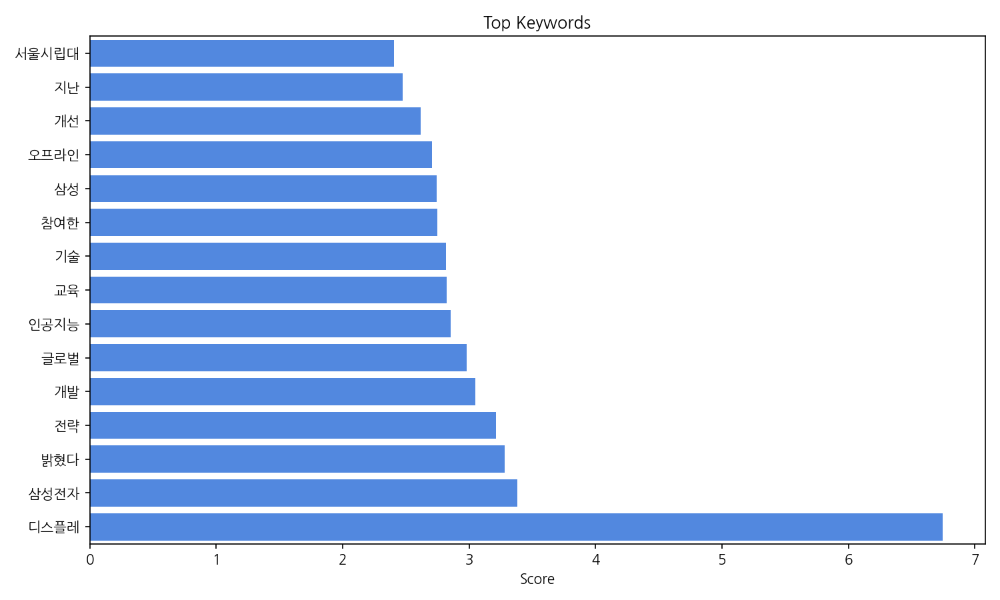
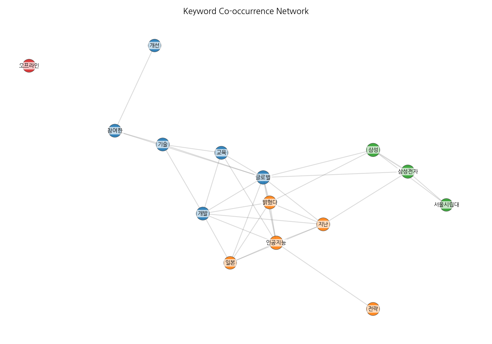
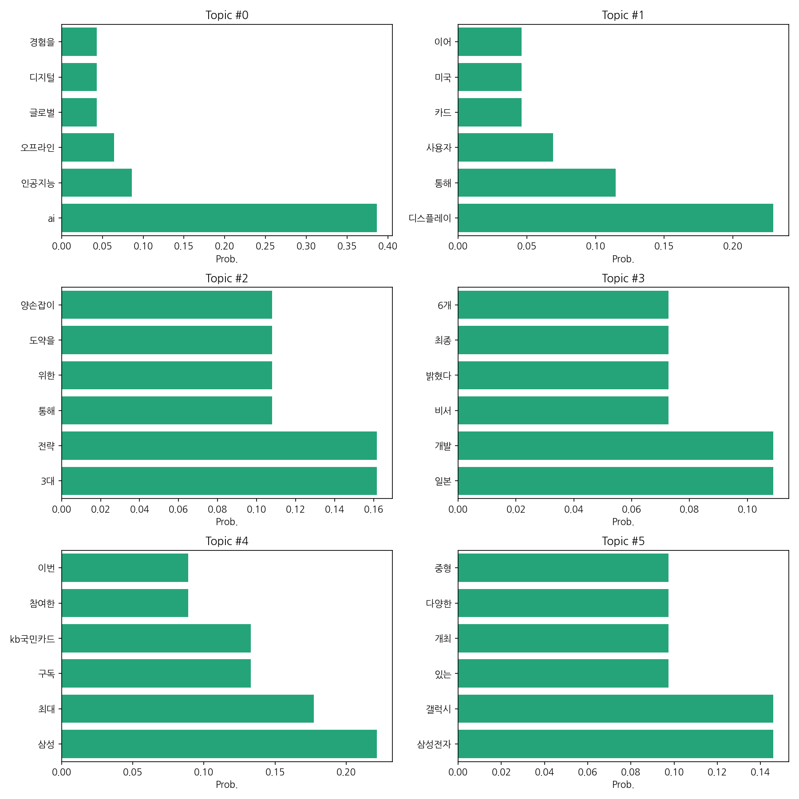
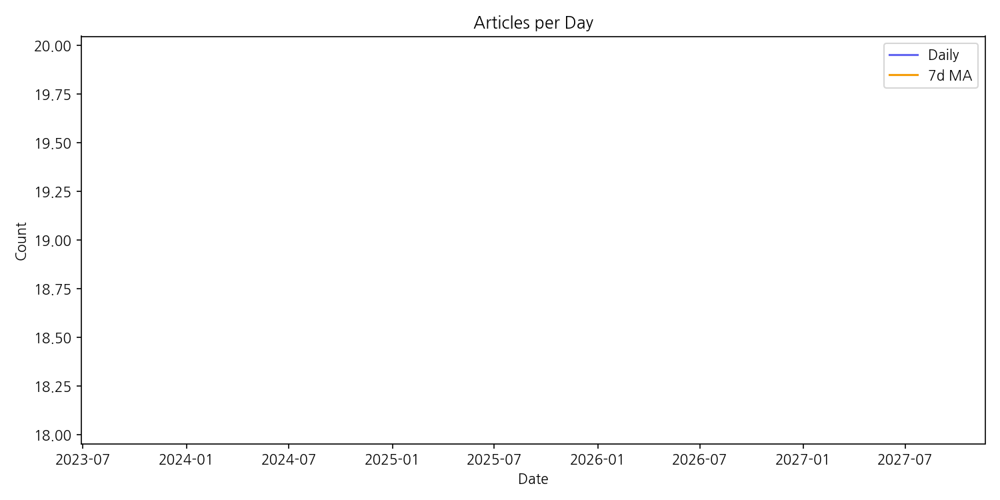

# Weekly/New Biz Report (2025-09-08)

## Executive Summary

- 이번 기간 핵심 토픽과 키워드, 주요 시사점을 요약합니다.

1) 상위 토픽을 3개 주제로 묶어 핵심 맥락을 설명하면 다음과 같습니다. 첫째, AI와 디지털 전환 관련 뉴스가 주를 이룹니다.  인공지능 기술의 발전과 이를 활용한 다양한 서비스 및 오프라인 경험과의 접목에 대한 기사들이 많았습니다. 둘째, 삼성전자를 중심으로 한 국내 기업들의 사업 전략 및 성과 관련 뉴스가 다수를 차지합니다.  삼성전자의 갤럭시 시리즈 출시 및 마케팅 전략,  그리고 국민카드와의 협업 등이 주요 내용입니다. 셋째, 일본과 관련된 기술 개발 및 경제 뉴스가 일부 포함되어 있습니다.  일본 기업의 기술 개발 소식과 한국 기업과의 경쟁 구도 등이 언급된 것으로 보입니다.

2) 최근 변화/스파이크는 2025년 9월 8일에 19건의 기사가 집중적으로 발생한 점입니다. 이는 특정 이벤트 또는 뉴스 발표에 따른 단기적인 집중 현상으로 추정되며,  장기적인 추세를 파악하기 위해서는 더 많은 데이터가 필요합니다.

3) 실무 인사이트 3가지:

* **AI 및 디지털 전환 트렌드 모니터링 강화:**  AI, 디지털 경험, 글로벌 시장 동향 등을 지속적으로 모니터링하여  회사의 전략적 대응 방안을 수립하고,  새로운 사업 기회를 발굴해야 합니다.  구체적으로는 관련 업계 보고서 분석,  경쟁사 동향 조사,  전문가 네트워크 구축 등을 통해 정보 수집 및 분석 체계를 구축해야 합니다.
* **삼성전자 및 주요 기업 전략 분석:** 삼성전자의 사업 전략,  신제품 출시 계획,  마케팅 활동 등을 면밀히 분석하여  시장 경쟁력 강화 방안을 모색해야 합니다.  특히,  삼성전자와의 협업 가능성 및  시너지 효과 창출 방안을  탐색하는 것이 중요합니다.
* **일본 기업 기술 동향 파악 및 경쟁력 확보:** 일본 기업의 기술 개발 동향을 지속적으로 파악하고,  국내 기업의 경쟁력 강화를 위한 전략을 수립해야 합니다.  기술 격차 분석,  R&D 투자 전략 재검토,  인재 확보 및 양성 등을 통해  장기적인 경쟁력을 확보해야 합니다.

## Key Metrics

- 문서 수: 19
- 키워드 수(상위): 15
- 토픽 수: 6
- 시계열 데이터 일자 수: 1

## Top Keywords

| Rank | Keyword | Score |
|---:|---|---:|
| 1 | 디스플레 | 6.742 |
| 2 | 삼성전자 | 3.379 |
| 3 | 밝혔다 | 3.283 |
| 4 | 전략 | 3.215 |
| 5 | 개발 | 3.05 |
| 6 | 글로벌 | 2.978 |
| 7 | 인공지능 | 2.854 |
| 8 | 교육 | 2.823 |
| 9 | 기술 | 2.815 |
| 10 | 참여한 | 2.746 |
| 11 | 삼성 | 2.742 |
| 12 | 오프라인 | 2.708 |
| 13 | 개선 | 2.614 |
| 14 | 지난 | 2.475 |
| 15 | 서울시립대 | 2.403 |

## Topics

- Topic #0: ai, 인공지능, 오프라인, 글로벌, 디지털, 경험을
- Topic #1: 디스플레이, 통해, 사용자, 카드, 미국, 이어
- Topic #2: 3대, 전략, 통해, 위한, 도약을, 양손잡이
- Topic #3: 일본, 개발, 비서, 밝혔다, 최종, 6개
- Topic #4: 삼성, 최대, 구독, kb국민카드, 참여한, 이번
- Topic #5: 삼성전자, 갤럭시, 있는, 개최, 다양한, 중형

## Trend

- 최근 14~30일 기사 수 추세와 7일 이동평균선을 제공합니다.

## Insights

1) 상위 토픽을 3개 주제로 묶어 핵심 맥락을 설명하면 다음과 같습니다. 첫째, AI와 디지털 전환 관련 뉴스가 주를 이룹니다.  인공지능 기술의 발전과 이를 활용한 다양한 서비스 및 오프라인 경험과의 접목에 대한 기사들이 많았습니다. 둘째, 삼성전자를 중심으로 한 국내 기업들의 사업 전략 및 성과 관련 뉴스가 다수를 차지합니다.  삼성전자의 갤럭시 시리즈 출시 및 마케팅 전략,  그리고 국민카드와의 협업 등이 주요 내용입니다. 셋째, 일본과 관련된 기술 개발 및 경제 뉴스가 일부 포함되어 있습니다.  일본 기업의 기술 개발 소식과 한국 기업과의 경쟁 구도 등이 언급된 것으로 보입니다.

2) 최근 변화/스파이크는 2025년 9월 8일에 19건의 기사가 집중적으로 발생한 점입니다. 이는 특정 이벤트 또는 뉴스 발표에 따른 단기적인 집중 현상으로 추정되며,  장기적인 추세를 파악하기 위해서는 더 많은 데이터가 필요합니다.

3) 실무 인사이트 3가지:

* **AI 및 디지털 전환 트렌드 모니터링 강화:**  AI, 디지털 경험, 글로벌 시장 동향 등을 지속적으로 모니터링하여  회사의 전략적 대응 방안을 수립하고,  새로운 사업 기회를 발굴해야 합니다.  구체적으로는 관련 업계 보고서 분석,  경쟁사 동향 조사,  전문가 네트워크 구축 등을 통해 정보 수집 및 분석 체계를 구축해야 합니다.
* **삼성전자 및 주요 기업 전략 분석:** 삼성전자의 사업 전략,  신제품 출시 계획,  마케팅 활동 등을 면밀히 분석하여  시장 경쟁력 강화 방안을 모색해야 합니다.  특히,  삼성전자와의 협업 가능성 및  시너지 효과 창출 방안을  탐색하는 것이 중요합니다.
* **일본 기업 기술 동향 파악 및 경쟁력 확보:** 일본 기업의 기술 개발 동향을 지속적으로 파악하고,  국내 기업의 경쟁력 강화를 위한 전략을 수립해야 합니다.  기술 격차 분석,  R&D 투자 전략 재검토,  인재 확보 및 양성 등을 통해  장기적인 경쟁력을 확보해야 합니다.

## Opportunities (Top 5)

| Idea | Target | Value Prop | Score |
|---|---|---|---:|
| AI 기반 디스플레이 맞춤형 광고 플랫폼 | 디스플레이 광고주(대기업, 중소기업), 디지털 광고 대행사,  온라인/오프라인 매장 운영자 | AI 기반 실시간 데이터 분석을 통해 개인 맞춤형 광고를 제공하여 광고 효율을 극대화합니다.  정교한 타겟팅과 효과 측정으로 광고비용 절감 및 ROI 향상을 지원합니다.  다양한 디스플레이 환경(온라인, 오프라인)에 적용 가능합니다. | 4.5 |
| 삼성전자 협업 기반 스마트홈 에너지 관리 서비스 | 삼성전자 스마트 기기 사용자,  스마트홈 구축 가구,  에너지 절약에 관심 있는 개인 및 가정 | 삼성전자 스마트 기기와 연동하여 에너지 사용량을 실시간으로 모니터링하고, AI 기반 분석을 통해 에너지 절약 방안을 제시합니다.  에너지 비용 절감 및 탄소 배출 감소에 기여하며, 사용자 편의성을 높입니다.  삼성전자와의 협업을 통해 신뢰도를 확보합니다. | 4.0 |
| 일본 기술 기반 디스플레이 교육 플랫폼 | 디스플레이 관련 학과 대학생,  디스플레이 업계 종사자,  디스플레이 기술 교육기관 | 일본의 최신 디스플레이 기술을 기반으로 한 실무 중심 교육 콘텐츠를 제공합니다.  온라인/오프라인 교육 프로그램을 통해 학습 효과를 극대화하고,  취업 연계 프로그램을 통해 실질적인 경쟁력을 강화합니다.  일본 전문가와의 협력을 통해 교육의 질을 높입니다. | 3.5 |
| AI 기반 글로벌 시장 동향 분석 및 예측 서비스 | 글로벌 사업을 추진하는 대기업,  중소기업,  시장조사 기관,  투자 기관 | AI 기반 빅데이터 분석을 통해 글로벌 시장 동향을 실시간으로 모니터링하고,  정확한 시장 예측을 제공합니다.  다양한 산업 분야에 대한 맞춤형 분석 보고서를 제공하고,  시장 진출 전략 수립을 지원합니다.  경쟁사 분석 및 리스크 관리 기능을 제공합니다. | 3.0 |
| AI 기반 삼성 갤럭시 사용자 맞춤형 교육 콘텐츠 플랫폼 | 삼성 갤럭시 스마트폰 사용자,  삼성전자 | AI 기반 사용자 맞춤형 교육 콘텐츠를 제공하여 삼성 갤럭시 기능 활용도를 높입니다.  사용자의 사용 패턴 및 선호도를 분석하여 개인화된 학습 경로를 제시하고,  실습 위주의 교육 콘텐츠를 제공합니다.  삼성전자와의 협업을 통해 신뢰도를 확보합니다. | 2.5 |

## Appendix

- 데이터: keywords.json, topics.json, trend_timeseries.json, trend_insights.json, biz_opportunities.json