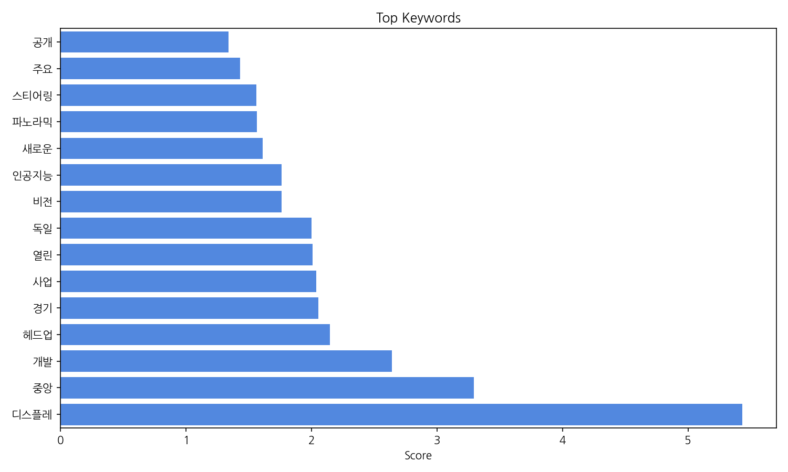
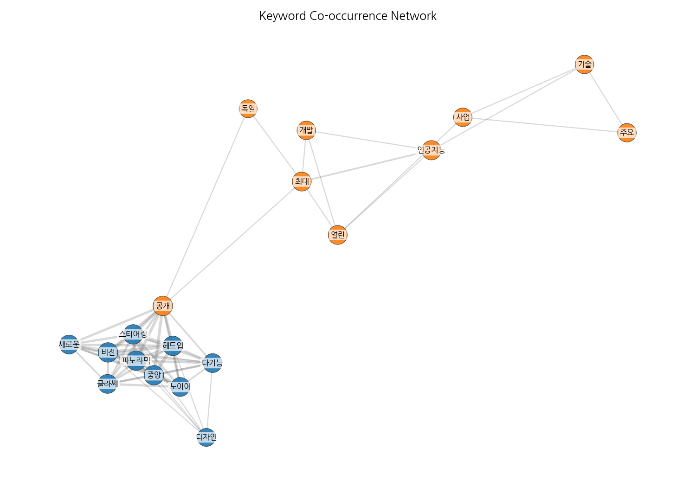
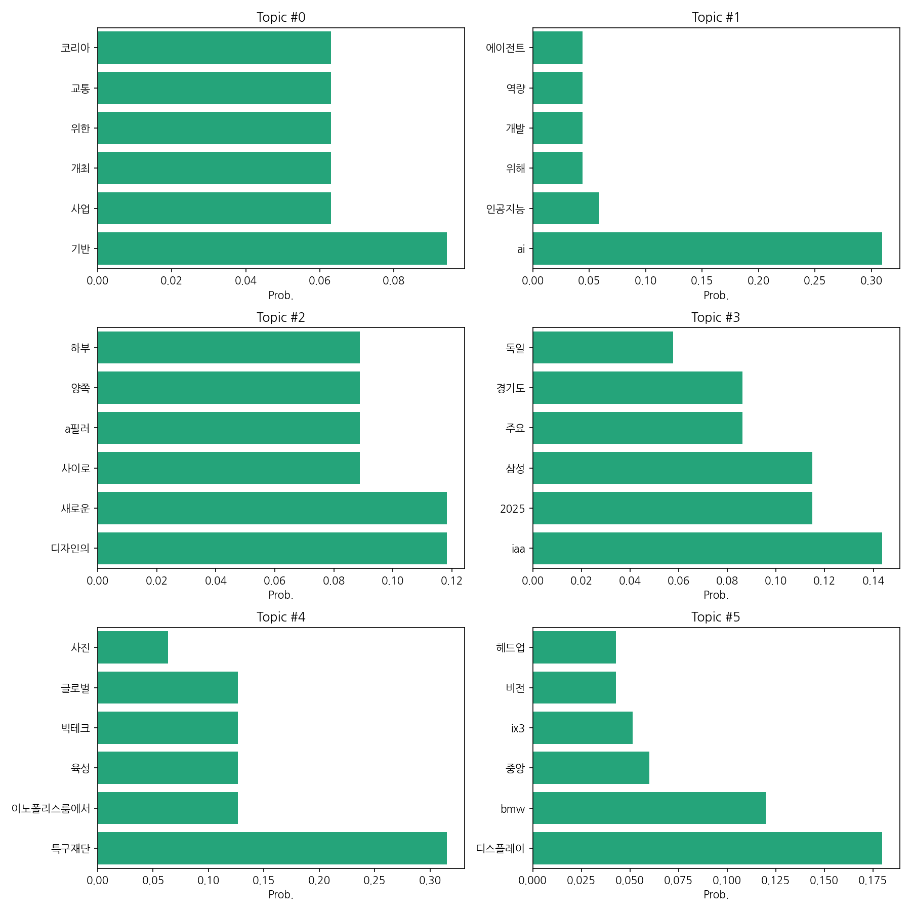

# Weekly/New Biz Report (2025-09-08)

## Executive Summary

- 이번 기간 핵심 토픽과 키워드, 주요 시사점을 요약합니다.

주어진 데이터를 바탕으로 한국어 뉴스 기사의 핵심 맥락을 분석하면 다음과 같습니다.

1. **핵심 맥락:**  데이터는 크게 자동차 산업, 인공지능 기술, 그리고 관련 전시회 및 행사에 집중되어 있습니다.  자동차 산업은 새로운 디자인과 기술(디스플레이, AI 기반 기능)을 중심으로,  IAA 2025와 같은 국제 모터쇼를 통해  새로운 기술과 제품을 선보이는 모습을 보여줍니다.  인공지능 기술은 개발 및 활용 측면에서 다뤄지고 있으며, 특구재단과 같은 기관의 지원을 받는 빅테크 기업들의 활동도 주목받고 있습니다.

2. **최근 변화/스파이크:** 2025년 9월 8일 기사 수가 20건으로 집계되어,  해당 시점에 IAA 2025와 같은 주요 자동차 관련 행사 개최 또는 관련 뉴스 보도가 집중적으로 이루어졌음을 시사합니다. 이는 자동차 산업의 기술 동향과 시장 경쟁을 반영하는 것으로 보입니다.

3. **실무 인사이트:**

* **IAA 2025 및 주요 자동차 전시회 분석:**  IAA 2025에서 공개된 신기술 및 디자인 트렌드를 면밀히 분석하여 자사 제품 개발 및 마케팅 전략에 반영해야 합니다.  경쟁사의 기술 동향 파악 및 차별화 전략 수립이 중요합니다.
* **AI 기술 도입 전략 수립:**  자동차 산업에서 AI 기술의 활용 가능성을 탐색하고,  자율주행, 스마트카 등의 분야에 AI 기술을 적용할 수 있는 구체적인 전략을 수립해야 합니다.  AI 개발 및 인재 확보 방안도 함께 고려해야 합니다.
* **특구재단 및 관련 기관과의 협력 강화:**  정부 지원 사업 및 관련 기관과의 협력을 통해 기술 개발 및 사업화를 위한 자원 확보 및 네트워킹을 강화해야 합니다.  특히 빅테크 기업들과의 협력을 통해 시너지 효과를 창출할 수 있는 방안을 모색해야 합니다.

## Key Metrics

- 문서 수: 20
- 키워드 수(상위): 15
- 토픽 수: 6
- 시계열 데이터 일자 수: 1

## Top Keywords

| Rank | Keyword | Score |
|---:|---|---:|
| 1 | 디스플레 | 5.431 |
| 2 | 중앙 | 3.295 |
| 3 | 개발 | 2.643 |
| 4 | 헤드업 | 2.148 |
| 5 | 경기 | 2.055 |
| 6 | 사업 | 2.037 |
| 7 | 열린 | 2.01 |
| 8 | 독일 | 2.0 |
| 9 | 비전 | 1.764 |
| 10 | 인공지능 | 1.762 |
| 11 | 새로운 | 1.609 |
| 12 | 파노라믹 | 1.564 |
| 13 | 스티어링 | 1.561 |
| 14 | 주요 | 1.431 |
| 15 | 공개 | 1.339 |

## Topics

- Topic #0: 기반, 사업, 개최, 위한, 교통, 코리아
- Topic #1: ai, 인공지능, 위해, 개발, 역량, 에이전트
- Topic #2: 디자인의, 새로운, 사이로, a필러, 양쪽, 하부
- Topic #3: iaa, 2025, 삼성, 주요, 경기도, 독일
- Topic #4: 특구재단, 이노폴리스룸에서, 육성, 빅테크, 글로벌, 사진
- Topic #5: 디스플레이, bmw, 중앙, ix3, 비전, 헤드업

## Trend

- 최근 14~30일 기사 수 추세와 7일 이동평균선을 제공합니다.

## Insights

주어진 데이터를 바탕으로 한국어 뉴스 기사의 핵심 맥락을 분석하면 다음과 같습니다.

1. **핵심 맥락:**  데이터는 크게 자동차 산업, 인공지능 기술, 그리고 관련 전시회 및 행사에 집중되어 있습니다.  자동차 산업은 새로운 디자인과 기술(디스플레이, AI 기반 기능)을 중심으로,  IAA 2025와 같은 국제 모터쇼를 통해  새로운 기술과 제품을 선보이는 모습을 보여줍니다.  인공지능 기술은 개발 및 활용 측면에서 다뤄지고 있으며, 특구재단과 같은 기관의 지원을 받는 빅테크 기업들의 활동도 주목받고 있습니다.

2. **최근 변화/스파이크:** 2025년 9월 8일 기사 수가 20건으로 집계되어,  해당 시점에 IAA 2025와 같은 주요 자동차 관련 행사 개최 또는 관련 뉴스 보도가 집중적으로 이루어졌음을 시사합니다. 이는 자동차 산업의 기술 동향과 시장 경쟁을 반영하는 것으로 보입니다.

3. **실무 인사이트:**

* **IAA 2025 및 주요 자동차 전시회 분석:**  IAA 2025에서 공개된 신기술 및 디자인 트렌드를 면밀히 분석하여 자사 제품 개발 및 마케팅 전략에 반영해야 합니다.  경쟁사의 기술 동향 파악 및 차별화 전략 수립이 중요합니다.
* **AI 기술 도입 전략 수립:**  자동차 산업에서 AI 기술의 활용 가능성을 탐색하고,  자율주행, 스마트카 등의 분야에 AI 기술을 적용할 수 있는 구체적인 전략을 수립해야 합니다.  AI 개발 및 인재 확보 방안도 함께 고려해야 합니다.
* **특구재단 및 관련 기관과의 협력 강화:**  정부 지원 사업 및 관련 기관과의 협력을 통해 기술 개발 및 사업화를 위한 자원 확보 및 네트워킹을 강화해야 합니다.  특히 빅테크 기업들과의 협력을 통해 시너지 효과를 창출할 수 있는 방안을 모색해야 합니다.

## Opportunities (Top 5)

| Idea | Target | Value Prop | Score |
|---|---|---|---:|
| IAA 2025 기술 트렌드 분석 및 전략 컨설팅 | 국내 자동차 부품 제조사, 완성차 업체 (중견/대기업) | IAA 2025 전시회 참관 및 데이터 분석을 통해 도출된 기술 트렌드 보고서와 경쟁사 분석, 맞춤형 전략 컨설팅을 제공합니다.  경쟁사 대비 차별화된 기술 및 전략 수립을 지원하여 시장 경쟁력 강화에 기여합니다.  신속하고 정확한 정보 제공으로 의사결정 시간 단축 및 리스크 감소 효과를 제공합니다. | 4.5 |
| 자동차 AI 기술 도입 지원 플랫폼 | 자동차 부품 및 소프트웨어 개발 기업 (중소/중견기업) | AI 기술 도입을 위한 원스톱 솔루션 플랫폼을 제공합니다.  AI 기술 선정부터 개발, 구축, 운영까지 전 과정을 지원하며, 전문가 컨설팅 및 교육 프로그램을 통해 기술 역량 강화를 지원합니다.  다양한 AI 기술 파트너와의 협력을 통해 최적의 솔루션을 제공합니다. | 4.0 |
| 자동차 산업 특화 AI 데이터 분석 서비스 | 자동차 업계 연구소, 마케팅 부서 (대기업) | 자동차 산업 특화 AI 기반 데이터 분석 서비스를 제공합니다.  방대한 데이터를 분석하여 시장 트렌드, 소비자 선호도, 경쟁사 분석 등의 인사이트를 제공합니다.  자동차 산업 전문가와 AI 전문가의 협업을 통해 정확하고 신뢰할 수 있는 분석 결과를 제공합니다. | 3.8 |
| 자율주행차 시뮬레이션 플랫폼 개발 | 자율주행 기술 개발 기업 (스타트업/중소기업) | 실제 도로와 유사한 가상 환경을 제공하는 자율주행차 시뮬레이션 플랫폼을 개발하여, 다양한 주행 상황을 안전하고 효율적으로 테스트할 수 있도록 지원합니다.  비용 절감 및 개발 시간 단축을 통해 자율주행 기술 개발을 가속화합니다. | 3.5 |
| AI 기반 자동차 디자인 컨셉 생성 플랫폼 | 자동차 디자인 전문 회사, 완성차 업체 디자인팀 (대기업) | AI 기반 자동차 디자인 컨셉 생성 플랫폼을 통해 다양한 디자인 컨셉을 빠르고 효율적으로 생성하고 평가할 수 있도록 지원합니다.  시장 트렌드 및 소비자 선호도 데이터를 활용하여 객관적인 디자인 평가 및 최적의 디자인 컨셉 도출을 지원합니다. | 3.2 |

## Appendix

- 데이터: keywords.json, topics.json, trend_timeseries.json, trend_insights.json, biz_opportunities.json