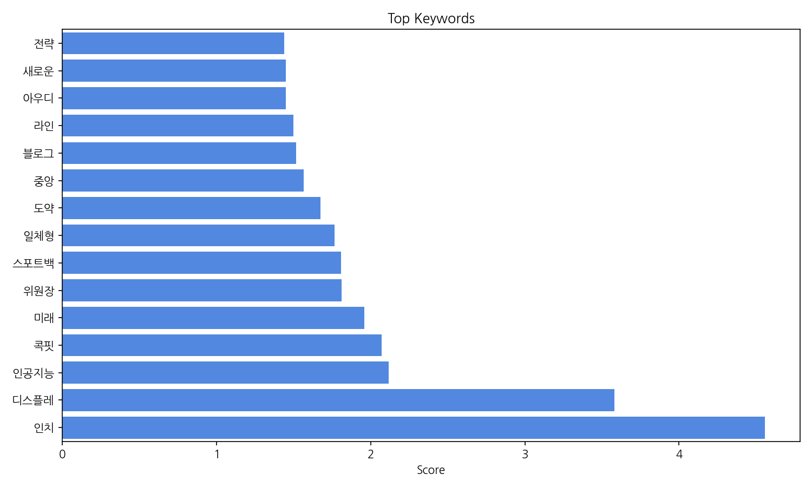
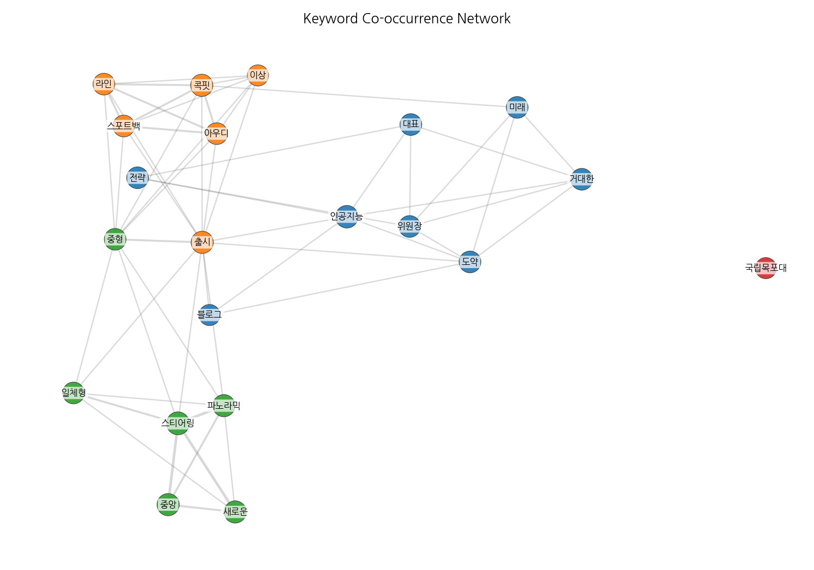
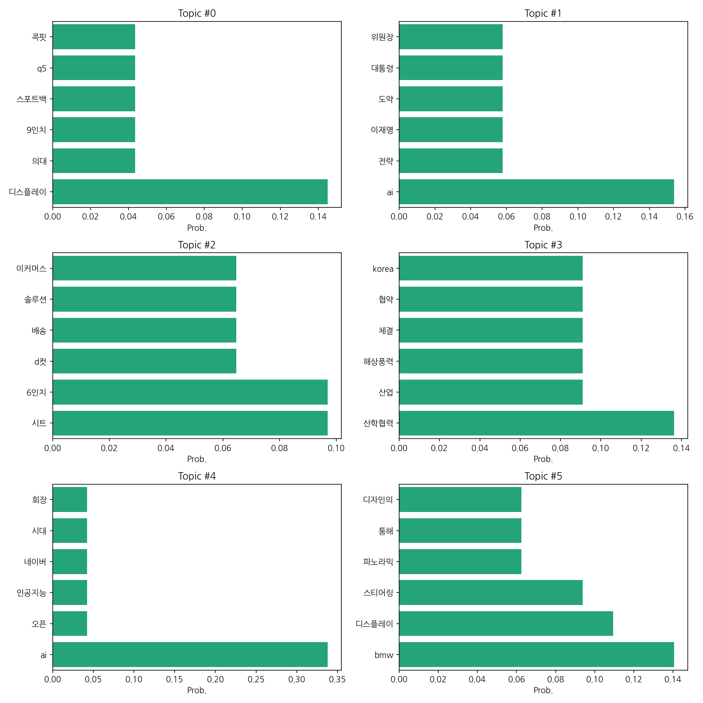
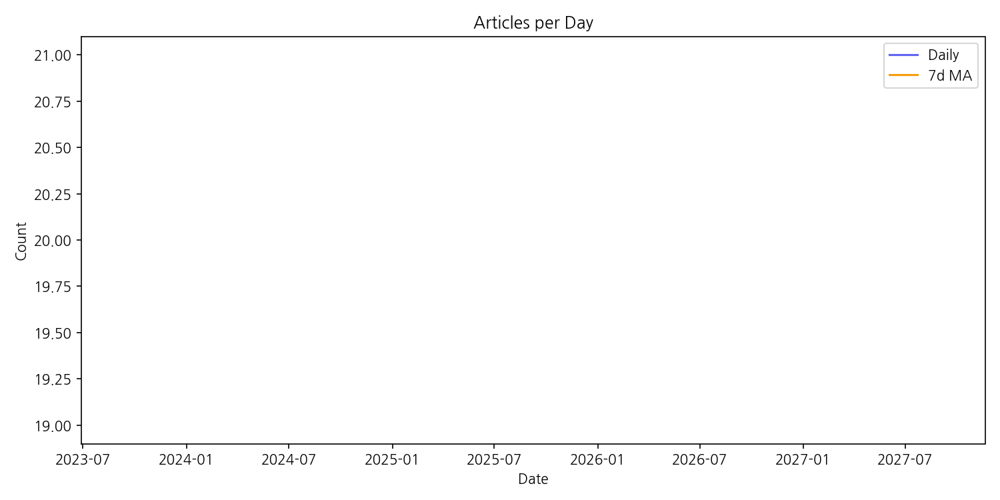

# Weekly/New Biz Report (2025-09-08)

## Executive Summary

- 이번 기간 핵심 토픽과 키워드, 주요 시사점을 요약합니다.

1. **핵심 맥락 설명:**  제공된 데이터는 자동차 산업(BMW 신차 출시 및 디스플레이 기술, SUV), 인공지능(AI 전략 및 플랫폼, 네이버 등), 그리고 에너지 산업(해상풍력 산학협력) 관련 뉴스를 주로 다루고 있습니다.  특히 자동차 분야에서는 새로운 디스플레이 기술과 고급 SUV 모델 출시에 대한 보도가 많았으며, AI 분야는  국내 기업의 AI 전략과 플랫폼 구축에 대한 뉴스가 주를 이룹니다.  해상풍력 산업은 산학협력을 통한 기술 개발 및 사업 확장에 대한 기사가 많았습니다.

2. **최근 변화/스파이크:**  데이터는 2025년 9월 8일 하루에만 20건의 기사가 집계되어 있습니다. 이는 특정 이벤트 또는 뉴스 발표로 인한 단기적인 스파이크로 보이며,  장기적인 추세를 파악하기 위해서는 더 많은 기간의 데이터가 필요합니다.

3. **실무 인사이트:**

* **AI 기술 동향 모니터링 강화:**  네이버 등 국내 기업의 AI 전략 및 플랫폼 구축 현황을 지속적으로 모니터링하고,  자사 사업과의 연관성을 분석하여 AI 기술 도입 전략을 수립해야 합니다.  특히,  AI 관련 뉴스를 실시간으로 추적하여 경쟁사의 움직임을 파악하고,  자사의 경쟁력을 강화하는 방안을 모색해야 합니다.
* **자동차 산업 트렌드 분석 및 대응:**  BMW 신차 출시 및 디스플레이 기술 발전 동향을 면밀히 분석하여,  자사 제품 개발 및 마케팅 전략에 반영해야 합니다.  특히,  소비자 선호도 변화를 예측하고,  시장 경쟁력을 유지하기 위한 전략을 수립해야 합니다.  새로운 디스플레이 기술과 고급 SUV 시장의 경쟁 심화에 대한 대비가 필요합니다.
* **해상풍력 산업 협력 기회 발굴:**  해상풍력 산업의 산학협력 및 기술 개발 동향을 파악하여,  자사 사업과의 시너지 효과를 창출할 수 있는 협력 기회를 적극적으로 발굴해야 합니다.  관련 기업 및 연구기관과의 네트워킹을 강화하고,  공동 연구 및 사업 개발을 추진해야 합니다.

## Key Metrics

- 문서 수: 20
- 키워드 수(상위): 15
- 토픽 수: 6
- 시계열 데이터 일자 수: 1

## Top Keywords

| Rank | Keyword | Score |
|---:|---|---:|
| 1 | 인치 | 4.555 |
| 2 | 디스플레 | 3.582 |
| 3 | 인공지능 | 2.117 |
| 4 | 콕핏 | 2.07 |
| 5 | 미래 | 1.959 |
| 6 | 위원장 | 1.81 |
| 7 | 스포트백 | 1.808 |
| 8 | 일체형 | 1.764 |
| 9 | 도약 | 1.675 |
| 10 | 중앙 | 1.564 |
| 11 | 블로그 | 1.515 |
| 12 | 라인 | 1.5 |
| 13 | 아우디 | 1.451 |
| 14 | 새로운 | 1.449 |
| 15 | 전략 | 1.44 |

## Topics

- Topic #0: 디스플레이, 의대, 9인치, 스포트백, q5, 콕핏
- Topic #1: ai, 전략, 이재명, 도약, 대통령, 위원장
- Topic #2: 시트, 6인치, d컷, 배송, 솔루션, 이커머스
- Topic #3: 산학협력, 산업, 해상풍력, 체결, 협약, korea
- Topic #4: ai, 오픈, 인공지능, 네이버, 시대, 회장
- Topic #5: bmw, 디스플레이, 스티어링, 파노라믹, 통해, 디자인의

## Trend

- 최근 14~30일 기사 수 추세와 7일 이동평균선을 제공합니다.

## Insights

1. **핵심 맥락 설명:**  제공된 데이터는 자동차 산업(BMW 신차 출시 및 디스플레이 기술, SUV), 인공지능(AI 전략 및 플랫폼, 네이버 등), 그리고 에너지 산업(해상풍력 산학협력) 관련 뉴스를 주로 다루고 있습니다.  특히 자동차 분야에서는 새로운 디스플레이 기술과 고급 SUV 모델 출시에 대한 보도가 많았으며, AI 분야는  국내 기업의 AI 전략과 플랫폼 구축에 대한 뉴스가 주를 이룹니다.  해상풍력 산업은 산학협력을 통한 기술 개발 및 사업 확장에 대한 기사가 많았습니다.

2. **최근 변화/스파이크:**  데이터는 2025년 9월 8일 하루에만 20건의 기사가 집계되어 있습니다. 이는 특정 이벤트 또는 뉴스 발표로 인한 단기적인 스파이크로 보이며,  장기적인 추세를 파악하기 위해서는 더 많은 기간의 데이터가 필요합니다.

3. **실무 인사이트:**

* **AI 기술 동향 모니터링 강화:**  네이버 등 국내 기업의 AI 전략 및 플랫폼 구축 현황을 지속적으로 모니터링하고,  자사 사업과의 연관성을 분석하여 AI 기술 도입 전략을 수립해야 합니다.  특히,  AI 관련 뉴스를 실시간으로 추적하여 경쟁사의 움직임을 파악하고,  자사의 경쟁력을 강화하는 방안을 모색해야 합니다.
* **자동차 산업 트렌드 분석 및 대응:**  BMW 신차 출시 및 디스플레이 기술 발전 동향을 면밀히 분석하여,  자사 제품 개발 및 마케팅 전략에 반영해야 합니다.  특히,  소비자 선호도 변화를 예측하고,  시장 경쟁력을 유지하기 위한 전략을 수립해야 합니다.  새로운 디스플레이 기술과 고급 SUV 시장의 경쟁 심화에 대한 대비가 필요합니다.
* **해상풍력 산업 협력 기회 발굴:**  해상풍력 산업의 산학협력 및 기술 개발 동향을 파악하여,  자사 사업과의 시너지 효과를 창출할 수 있는 협력 기회를 적극적으로 발굴해야 합니다.  관련 기업 및 연구기관과의 네트워킹을 강화하고,  공동 연구 및 사업 개발을 추진해야 합니다.

## Opportunities (Top 5)

| Idea | Target | Value Prop | Score |
|---|---|---|---:|
| 해상풍력 발전소 AI 기반 예측 정비 시스템 | 해상풍력 발전소 운영 회사, 풍력 터빈 제조사 | AI 기반 예측 정비 시스템을 통해 고장을 미리 예측하고,  정비 시기를 최적화하여 발전소 가동률을 높입니다.  정비 비용을 절감하고,  안전사고를 예방합니다.  실시간 데이터 모니터링 및 분석을 통해 효율적인 정비 계획을 수립합니다. | 4.5 |
| 자동차용 AI 기반 주행 안전 분석 및 예측 시스템 | 자동차 제조사, 보험회사, 교통안전 관련 기관 | AI 기반으로 운전자의 주행 패턴을 분석하여 졸음운전, 부주의 운전 등 위험 상황을 예측하고,  사고를 미리 방지합니다.  사고 원인 분석 및 예방을 위한 데이터를 제공하여 교통 안전 개선에 기여합니다.  운전자의 안전 운전 습관 개선을 위한 피드백을 제공합니다. | 4.2 |
| AI 기반 자동차 디스플레이 맞춤형 광고 플랫폼 | 자동차 제조사, 자동차 광고 대행사, 디지털 광고 플랫폼 기업 | AI 기반으로 운전자의 선호도와 상황을 분석하여 맞춤형 광고를 제공합니다.  운전 중 안전을 고려한 광고 노출 방식을 통해 효과적인 광고와 안전성을 동시에 확보합니다.  정확한 광고 효과 측정 및 분석 데이터를 제공하여 광고 효율을 극대화합니다. | 4.0 |
| 스마트폰 연동 차량용 AI 비서 서비스 | 자동차 운전자, 스마트폰 사용자 | 스마트폰과 연동하여 음성 명령으로 차량 제어 및 다양한 정보를 제공하는 AI 비서 서비스입니다.  운전 중 안전하고 편리하게 스마트폰 기능을 이용할 수 있습니다.  개인 맞춤형 설정 및 기능 제공으로 사용자 편의성을 높입니다. | 3.8 |
| AI 기반 자동차 내부 공간 맞춤형 디자인 플랫폼 | 자동차 제조사, 자동차 디자인 회사, 개인 소비자 | AI 기반으로 개인의 취향과 라이프스타일을 분석하여 자동차 내부 공간을 맞춤형으로 디자인합니다.  3D 시뮬레이션을 통해 디자인 결과를 미리 확인하고,  간편하게 디자인 변경을 요청할 수 있습니다.  합리적인 가격으로 고품질의 맞춤형 디자인 서비스를 제공합니다. | 3.5 |

## Appendix

- 데이터: keywords.json, topics.json, trend_timeseries.json, trend_insights.json, biz_opportunities.json