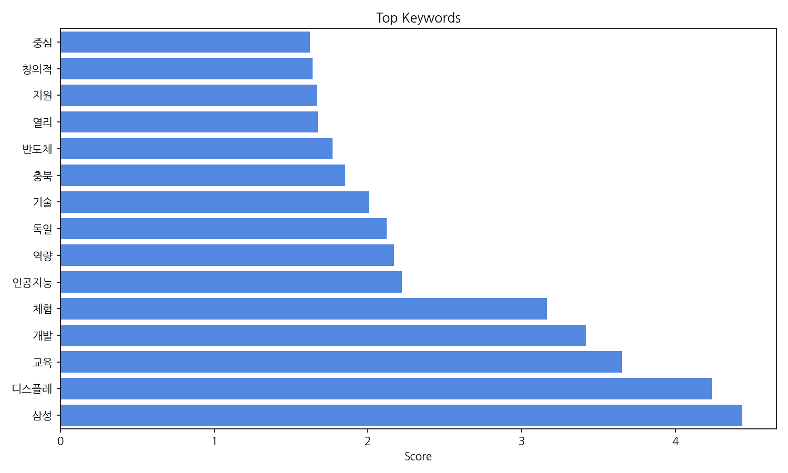
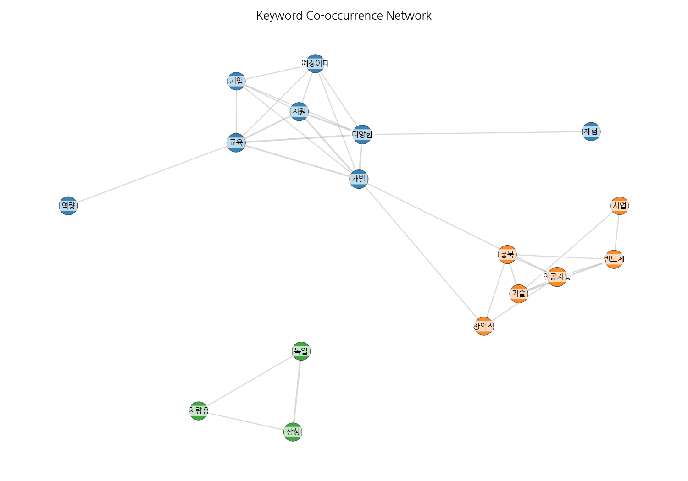
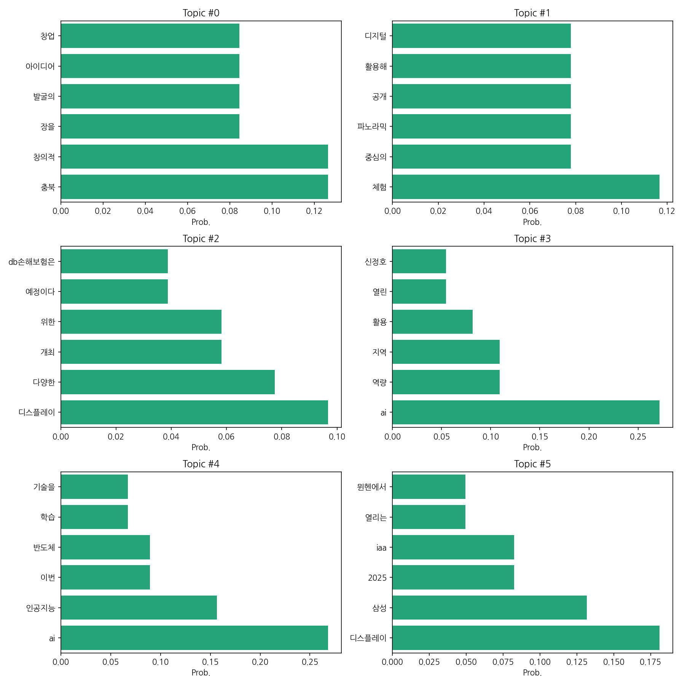

# Weekly/New Biz Report (2025-09-08)

## Executive Summary

- 이번 기간 핵심 토픽과 키워드, 주요 시사점을 요약합니다.

충북 지역의 창업 활성화, 디스플레이 산업 동향, 그리고 AI 및 인공지능 기술 활용이라는 세 가지 주요 맥락으로 뉴스 기사를 요약할 수 있습니다. 충북 지역에서는 창의적인 아이디어를 기반으로 한 창업 활성화를 위한 자원 결합 및 발굴 노력이 집중되고 있습니다.  디스플레이 산업과 관련해서는 삼성을 비롯한 주요 기업들의 신기술 발표 및 전시회 개최 소식이 주를 이루며, 특히 차세대 디스플레이 기술에 대한 관심이 높습니다. 마지막으로 AI와 인공지능 기술은 지역 발전과 교육, 그리고 다양한 산업 분야에서의 활용 가능성을 보여주는 기사들이 다수를 차지하고 있습니다.

최근 데이터는 2025년 9월 8일의 기사 수만을 보여주고 있어 장기적인 추세를 파악하기 어렵습니다.  하지만 단일 날짜에 20건의 기사가 집중된 점으로 미루어 볼 때, 특정 이벤트 또는 뉴스 발표가 기사 수 증가에 영향을 미쳤을 가능성이 높습니다.

실무 인사이트:

* **충북 지역 창업 지원 정책 분석 및 활용:** 충북 지역의 창업 지원 정책을 자세히 분석하여, 기업의 성장 전략에 적용 가능한 부분을 찾고, 관련 지원 사업에 적극 참여합니다.
* **디스플레이 산업 기술 동향 모니터링 및 전략 수립:**  주요 기업들의 기술 발표 및 전시회 정보를 지속적으로 모니터링하여, 시장 경쟁력 강화를 위한 기술 개발 전략을 수립하고, 관련 기술 도입을 검토합니다.
* **AI 기술 활용 방안 및 교육 프로그램 개발:**  AI 기술을 활용하여 업무 효율성을 높일 수 있는 방안을 모색하고, 직원들의 AI 관련 역량 강화를 위한 교육 프로그램을 개발 및 운영합니다.

## Key Metrics

- 문서 수: 20
- 키워드 수(상위): 15
- 토픽 수: 6
- 시계열 데이터 일자 수: 1

## Top Keywords

| Rank | Keyword | Score |
|---:|---|---:|
| 1 | 삼성 | 4.433 |
| 2 | 디스플레 | 4.237 |
| 3 | 교육 | 3.652 |
| 4 | 개발 | 3.416 |
| 5 | 체험 | 3.163 |
| 6 | 인공지능 | 2.22 |
| 7 | 역량 | 2.17 |
| 8 | 독일 | 2.121 |
| 9 | 기술 | 2.006 |
| 10 | 충북 | 1.85 |
| 11 | 반도체 | 1.768 |
| 12 | 열리 | 1.673 |
| 13 | 지원 | 1.668 |
| 14 | 창의적 | 1.64 |
| 15 | 중심 | 1.623 |

## Topics

- Topic #0: 충북, 창의적, 장을, 발굴의, 아이디어, 창업
- Topic #1: 체험, 중심의, 파노라믹, 공개, 활용해, 디지털
- Topic #2: 디스플레이, 다양한, 개최, 위한, 예정이다, db손해보험은
- Topic #3: ai, 역량, 지역, 활용, 열린, 신정호
- Topic #4: ai, 인공지능, 이번, 반도체, 학습, 기술을
- Topic #5: 디스플레이, 삼성, 2025, iaa, 열리는, 뮌헨에서

## Trend

- 최근 14~30일 기사 수 추세와 7일 이동평균선을 제공합니다.

## Insights

충북 지역의 창업 활성화, 디스플레이 산업 동향, 그리고 AI 및 인공지능 기술 활용이라는 세 가지 주요 맥락으로 뉴스 기사를 요약할 수 있습니다. 충북 지역에서는 창의적인 아이디어를 기반으로 한 창업 활성화를 위한 자원 결합 및 발굴 노력이 집중되고 있습니다.  디스플레이 산업과 관련해서는 삼성을 비롯한 주요 기업들의 신기술 발표 및 전시회 개최 소식이 주를 이루며, 특히 차세대 디스플레이 기술에 대한 관심이 높습니다. 마지막으로 AI와 인공지능 기술은 지역 발전과 교육, 그리고 다양한 산업 분야에서의 활용 가능성을 보여주는 기사들이 다수를 차지하고 있습니다.

최근 데이터는 2025년 9월 8일의 기사 수만을 보여주고 있어 장기적인 추세를 파악하기 어렵습니다.  하지만 단일 날짜에 20건의 기사가 집중된 점으로 미루어 볼 때, 특정 이벤트 또는 뉴스 발표가 기사 수 증가에 영향을 미쳤을 가능성이 높습니다.

실무 인사이트:

* **충북 지역 창업 지원 정책 분석 및 활용:** 충북 지역의 창업 지원 정책을 자세히 분석하여, 기업의 성장 전략에 적용 가능한 부분을 찾고, 관련 지원 사업에 적극 참여합니다.
* **디스플레이 산업 기술 동향 모니터링 및 전략 수립:**  주요 기업들의 기술 발표 및 전시회 정보를 지속적으로 모니터링하여, 시장 경쟁력 강화를 위한 기술 개발 전략을 수립하고, 관련 기술 도입을 검토합니다.
* **AI 기술 활용 방안 및 교육 프로그램 개발:**  AI 기술을 활용하여 업무 효율성을 높일 수 있는 방안을 모색하고, 직원들의 AI 관련 역량 강화를 위한 교육 프로그램을 개발 및 운영합니다.

## Opportunities (Top 5)

| Idea | Target | Value Prop | Score |
|---|---|---|---:|
| AI 기반 디스플레이 기술 교육 플랫폼 | 충북 지역 디스플레이 산업 관련 중소/중견기업, 삼성디스플레이 등 대기업의 직원, 충북 지역 대학교 디스플레이 공학과 학생 | AI 기반 디스플레이 기술 교육 플랫폼을 통해 실무 중심의 교육을 제공하여, AI 기술 활용 역량을 향상시키고, 디스플레이 산업 경쟁력 강화에 기여.  온라인/오프라인 교육 및 실습 환경 제공으로 접근성 및 효율성 증대.  맞춤형 커리큘럼 제공으로 학습 효과 극대화. | 4.5 |
| 충북 창업 지원 AI 챗봇 | 충북 지역 예비 창업자, 초기 창업 기업 (10인 미만), 충북 지역 창업 지원 기관 | AI 기반 챗봇을 통해 24시간 언제든지 창업 관련 정보 및 지원 정책에 대한 안내를 제공.  개인 맞춤형 정보 제공 및 상담 지원으로 창업 성공률 제고.  창업 지원 기관의 업무 효율 증대 및 운영 비용 절감. | 4.0 |
| 디스플레이 산업 AI 기반 기술 예측 플랫폼 | 충북 지역 디스플레이 산업 관련 중소/중견기업, 삼성디스플레이 등 대기업의 연구개발 부서 | AI 기반 기술 예측 플랫폼을 통해 디스플레이 산업의 미래 기술 동향을 예측하고, 기술 개발 전략 수립 지원.  데이터 기반의 객관적인 분석 결과 제공으로 투자 위험 감소 및 시장 경쟁력 강화.  경쟁사 기술 동향 분석 및 시장 트렌드 파악 지원. | 3.8 |
| AI 기반 디스플레이 제품 품질 검사 시스템 | 충북 지역 디스플레이 제품 생산 기업 (대기업, 중소/중견기업) | AI 기반 자동화된 품질 검사 시스템을 통해 생산성 향상 및 불량률 감소.  인력 투입 감소 및 비용 절감.  정확하고 효율적인 품질 검사를 통해 제품 품질 향상 및 고객 만족도 증대. | 3.5 |
| 충북 지역 디스플레이 산업 클러스터 구축 지원 플랫폼 | 충북 지역 디스플레이 산업 관련 기업 (대기업, 중소/중견기업), 충북 지역 관련 연구기관, 충청북도청 등 지자체 | 온라인 플랫폼을 통해 기업 간 네트워킹 및 정보 공유 활성화.  기술 개발 및 사업화 협력 지원.  지역 내 디스플레이 산업 클러스터 구축 및 경쟁력 강화.  지자체의 산업 육성 정책 지원 효율 증대. | 3.2 |

## Appendix

- 데이터: keywords.json, topics.json, trend_timeseries.json, trend_insights.json, biz_opportunities.json